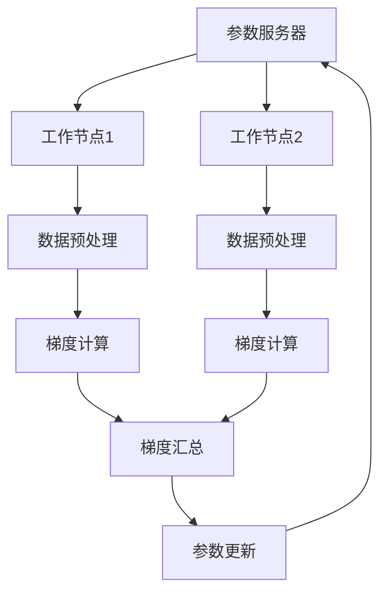

                 


# 分布式训练：加速大规模AI Agent的开发

---

## 关键词：
分布式训练, AI Agent, 并行计算, 参数服务器, 梯度下降, 网络通信

---

## 摘要：
随着人工智能技术的快速发展，AI Agent 的开发需求日益增长。然而，大规模数据和复杂模型的训练对计算资源提出了更高的要求。分布式训练作为一种高效的解决方案，通过并行计算和网络通信优化，显著提升了训练效率。本文从分布式训练的核心概念、算法原理、系统架构设计到实际项目实现，全面解析如何通过分布式训练加速大规模AI Agent的开发。文章还提供了详细的代码实现、数学公式和实际案例分析，帮助读者深入理解分布式训练的原理和应用。

---

# 第一部分: 分布式训练基础

## 第1章: 分布式训练概述

### 1.1 分布式训练的背景与意义

#### 1.1.1 人工智能发展的现状与挑战
人工智能（AI）技术近年来取得了显著进展，尤其是在深度学习领域。然而，随着模型复杂度的增加和数据规模的扩大，单机训练已经难以满足需求。分布式训练作为一种高效解决方案，通过利用多台机器的计算能力，显著提升了训练效率。

#### 1.1.2 分布式训练的定义与特点
分布式训练是指在多台机器或多个计算核心上并行执行训练任务的过程。其特点包括：
1. **并行计算**：通过并行处理任务，缩短训练时间。
2. **资源利用**：充分利用计算资源，提升训练效率。
3. **扩展性**：支持大规模数据和复杂模型的训练。

#### 1.1.3 分布式训练在AI Agent开发中的重要性
AI Agent 的开发需要处理海量数据和复杂模型，分布式训练能够显著提升训练速度和效率，降低计算成本。

---

### 1.2 分布式训练的核心概念

#### 1.2.1 并行计算的基本原理
并行计算通过将任务分解为多个子任务，分别在不同的计算单元上执行，最终将结果汇总。常见的并行策略包括数据并行和模型并行。

#### 1.2.2 分布式训练中的通信机制
通信机制是分布式训练的核心，主要包括：
1. **参数同步**：将各计算节点的参数汇总并更新。
2. **梯度交换**：在计算节点之间交换梯度信息。

#### 1.2.3 数据并行与模型并行的对比分析
- **数据并行**：将数据集分成多个部分，每个部分在不同的计算节点上独立训练。
- **模型并行**：将模型参数分散到不同的计算节点上，每个节点负责一部分参数的更新。

---

### 1.3 分布式训练的常见策略

#### 1.3.1 数据分片与模型同步
数据分片即将数据集分成多个子集，每个子集在不同的计算节点上训练。

#### 1.3.2 参数服务器架构
参数服务器架构是一种常见的分布式训练架构，主要包括参数服务器和多个工作节点。工作节点负责计算梯度，参数服务器负责汇总和更新参数。

#### 1.3.3 分布式训练的优化技巧
- **负载均衡**：确保各计算节点的任务分配合理。
- **通信优化**：减少网络通信开销。

---

## 第2章: 分布式训练的核心算法原理

### 2.1 分布式训练的算法流程

#### 2.1.1 分布式训练的总体流程
1. 初始化模型参数。
2. 分配数据到不同的计算节点。
3. 各节点并行计算梯度。
4. 汇总梯度并更新参数。
5. 重复训练步骤直到收敛。

#### 2.1.2 数据分发与模型同步的详细步骤
1. 数据预处理和加载。
2. 模型初始化。
3. 数据分发到各个计算节点。
4. 并行计算梯度。
5. 汇总梯度并更新模型参数。

#### 2.1.3 梯度计算与参数更新的数学模型

##### 使用梯度下降算法的数学表达
$$
\theta_{new} = \theta - \eta \cdot \nabla J(\theta)
$$
其中，$\theta$ 表示模型参数，$\eta$ 表示学习率，$\nabla J(\theta)$ 表示损失函数的梯度。

---

### 2.2 分布式训练的数学模型与公式

#### 2.2.1 梯度下降算法的数学表达
$$
\theta_{i}^{new} = \theta_{i} - \eta \cdot \nabla J(\theta_{i})
$$
其中，$\theta_{i}$ 表示第$i$个计算节点的参数。

#### 2.2.2 分布式训练中的同步机制公式
$$
\theta_{new} = \frac{1}{N} \sum_{i=1}^{N} \theta_{i}^{new}
$$
其中，$N$ 表示计算节点的数量。

---

## 第3章: 分布式训练的系统架构设计

### 3.1 系统架构概述

#### 3.1.1 分布式训练系统的组成模块
- **参数服务器**：负责参数的同步和管理。
- **工作节点**：负责数据处理和梯度计算。
- **通信模块**：负责节点之间的数据交换。

#### 3.1.2 系统的输入输出接口设计
- **输入接口**：接收训练数据和模型参数。
- **输出接口**：输出训练后的模型和评估结果。

#### 3.1.3 系统的交互流程图
以下是一个简单的交互流程图：



---

### 3.2 系统架构的详细设计

#### 3.2.1 参数服务器的架构设计
参数服务器负责接收各工作节点的梯度，并更新模型参数。

#### 3.2.2 工作节点的职责与功能
工作节点负责数据加载、前向传播和反向传播计算梯度。

#### 3.2.3 系统的通信机制设计
通信机制包括梯度计算和参数同步两个阶段。

---

## 第4章: 分布式训练的实现细节

### 4.1 环境搭建与配置

#### 4.1.1 硬件环境要求
- 多台GPU服务器。
- 高速网络连接。

#### 4.1.2 软件环境安装
- 安装分布式训练框架（如TensorFlow、PyTorch）。
- 配置分布式训练环境。

#### 4.1.3 网络配置与优化
- 配置网络带宽。
- 优化网络通信延迟。

---

### 4.2 分布式训练的代码实现

#### 4.2.1 数据预处理与加载
```python
import tensorflow as tf
from tensorflow.keras import layers

# 数据加载
def load_data(batch_size):
    # 加载数据集
    mnist = tf.keras.datasets.mnist
    (train_images, train_labels), (test_images, test_labels) = mnist.load_data()
    
    # 数据预处理
    train_images = train_images / 255.0
    test_images = test_images / 255.0
    
    # 创建数据集
    train_dataset = tf.data.Dataset.from_tensor_slices((train_images, train_labels)).batch(batch_size)
    test_dataset = tf.data.Dataset.from_tensor_slices((test_images, test_labels)).batch(batch_size)
    return train_dataset, test_dataset
```

#### 4.2.2 分布式训练的代码框架
```python
import os
import tensorflow as tf

# 分布式训练配置
os.environ["TF_DISTRIBUTED_BACKEND"] = " MPI"
strategy = tf.distribute.MirroredStrategy()

with strategy.scope():
    # 模型定义
    model = tf.keras.Sequential([
        layers.Flatten(),
        layers.Dense(128, activation='relu'),
        layers.Dense(10, activation='softmax')
    ])
    
    # 模型编译
    model.compile(optimizer='adam', loss='sparse_categorical_crossentropy', metrics=['accuracy'])

# 训练数据加载
train_dataset, test_dataset = load_data(64)

# 模型训练
model.fit(train_dataset, epochs=10, validation_data=test_dataset)
```

---

## 第5章: 分布式训练的优化与调优

### 5.1 分布式训练的性能优化

#### 5.1.1 并行策略的优化
- 使用更高效的并行策略，如模型并行和数据并行的结合。

#### 5.1.2 网络通信的优化
- 减少通信次数和数据量。

#### 5.1.3 内存使用的优化
- 合理分配内存，避免内存泄漏。

---

### 5.2 分布式训练的参数调优

#### 5.2.1 学习率的调整
- 使用学习率衰减策略。

#### 5.2.2 批大小的优化
- 选择合适的批大小，平衡训练效率和模型性能。

#### 5.2.3 模型复杂度的平衡
- 在模型复杂度和训练时间之间找到平衡点。

---

## 第6章: 分布式训练的案例分析

### 6.1 案例背景与需求分析

#### 6.1.1 案例背景介绍
以训练一个图像分类模型为例，数据集为MNIST。

#### 6.1.2 业务需求分析
- 提高训练效率。
- 降低计算成本。

#### 6.1.3 系统目标设定
- 实现分布式训练，提升模型准确率。

---

### 6.2 分布式训练的实现过程

#### 6.2.1 数据准备与模型选择
- 使用MNIST数据集。
- 选择合适的模型架构。

#### 6.2.2 分布式训练的代码实现
如前所述，使用TensorFlow的分布式训练框架。

---

## 第7章: 最佳实践与小结

### 7.1 最佳实践 tips

- **硬件配置**：确保网络带宽足够，计算资源充足。
- **软件选择**：选择合适的分布式训练框架。
- **参数调优**：根据具体任务调整学习率和批大小。

### 7.2 小结

分布式训练通过并行计算和高效通信机制，显著提升了AI Agent的训练效率。理解和掌握分布式训练的核心概念和实现细节，对于开发大规模AI应用至关重要。

---

## 注意事项

- 分布式训练需要合理的网络配置和硬件支持。
- 参数服务器架构需要高效的通信机制。
- 在实际应用中，需根据具体任务调整优化策略。

---

## 拓展阅读

- 《Distributed Training of Deep Neural Networks on GPUs》
- 《Parallel and Distributed Deep Learning》

---

## 作者：AI天才研究院/AI Genius Institute & 禅与计算机程序设计艺术 /Zen And The Art of Computer Programming

