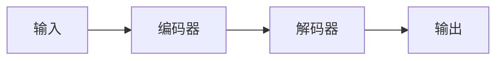
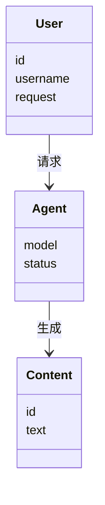
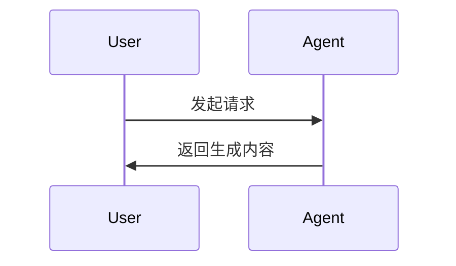

                 

<think>
好的，现在我需要帮助用户完成一篇关于《创意AI Agent：辅助内容创作与设计》的技术博客文章。用户已经提供了详细的目录大纲，我需要根据这个大纲逐步展开，确保每个部分都详细且符合技术要求。

首先，我会从背景介绍开始，解释创意AI Agent的基本概念，包括问题背景、解决方法以及应用领域。接下来，我会深入探讨核心概念，包括自然语言处理和生成模型，并用表格对比属性特征，同时用ER图展示实体关系。

然后，我会详细讲解算法原理，使用Mermaid流程图展示生成模型的结构，并用Python代码实现，附上数学公式来解释模型的工作原理。接着，我会设计系统的架构，包括类图、架构图和交互流程图，确保系统结构清晰。

在项目实战部分，我会指导读者如何安装环境，编写代码，并通过案例分析展示AI Agent的实际应用。最后，我会总结最佳实践，提供注意事项和拓展阅读的方向。

整个过程中，我需要确保语言简洁、逻辑清晰，并且包含足够的技术细节，以帮助读者全面理解创意AI Agent的概念和应用。
</think>

# 创意AI Agent：辅助内容创作与设计

## 关键词：创意AI Agent，内容创作，自然语言处理，生成模型，系统架构

## 摘要：  
创意AI Agent是一种结合自然语言处理和生成模型的智能工具，旨在辅助内容创作与设计。本文从背景、原理、系统架构到项目实战，全面解析创意AI Agent的核心技术与应用，帮助读者掌握其设计与实现方法。

---

## 第一部分：背景介绍

### 第1章：创意AI Agent的基本概念

#### 1.1 问题背景与描述  
内容创作是一项复杂而耗时的任务，尤其在创意领域，如文案撰写、设计辅助等，创作者常面临灵感枯竭、效率低下等问题。创意AI Agent通过自然语言处理和生成模型，为创作者提供智能化支持，帮助其高效完成创作任务。

#### 1.2 创意AI Agent的解决方法  
创意AI Agent通过以下技术实现内容创作的辅助：  
- **自然语言处理（NLP）**：理解用户需求，生成相关主题的内容。  
- **生成模型**：基于训练数据生成高质量文本或设计建议。  

#### 1.3 应用领域与发展趋势  
创意AI Agent的应用领域包括文案创作、设计辅助、广告创意等。随着AI技术的进步，创意AI Agent将更加智能化，能够理解上下文并生成更具创意的内容。

---

## 第二部分：核心概念与联系

### 第2章：创意AI Agent的核心原理

#### 2.1 核心概念原理  
创意AI Agent的核心原理包括：  
- **自然语言处理（NLP）**：用于理解用户的输入，提取关键词和意图。  
- **生成模型**：基于理解生成相应的文本或设计建议。  

#### 2.2 属性特征对比  
下表展示了创意AI Agent与其他AI工具的对比：  
| 特性 | 创意AI Agent | 其他AI工具 |  
|------|--------------|------------|  
| 功能 | 内容生成、设计辅助 | 数据分析、图像识别 |  
| 优势 | 高度定制化，支持创意生成 | 数据处理效率高 |  

#### 2.3 ER实体关系图  
```mermaid
erDiagram
    user {
      User
      id
      username
    }
    agent {
      Agent
      id
      model
    }
    content {
      Content
      id
      type
    }
    user --> agent : 使用
    agent --> content : 生成
```

---

## 第三部分：算法原理

### 第3章：创意AI Agent的算法实现

#### 3.1 生成模型  
创意AI Agent的核心算法基于生成模型，如Transformer。以下是生成模型的流程图：  


#### 3.2 解码过程  
解码过程涉及注意力机制和生成策略。以下是解码的Python代码示例：  
```python
def decode(input_seq, max_length):
    outputs = []
    for i in range(max_length):
        # 生成预测词
        prediction = model.predict(input_seq)
        # 选择概率最高的词
        predicted_word = prediction.argmax(axis=-1)
        outputs.append(predicted_word)
        # 更新输入序列
        input_seq = predicted_word
    return outputs
```

#### 3.3 数学模型  
生成模型的数学公式如下：  
$$P(y|x) = \frac{1}{Z} \exp(-E(x,y))$$  
其中，$E(x,y)$表示能量函数，$Z$表示归一化常数。

---

## 第四部分：系统分析与架构设计

### 第4章：系统架构设计

#### 4.1 领域模型  
领域模型展示了系统的组成部分：  


#### 4.2 架构图  
系统架构分为前端、后端和模型层：  
```mermaid
archiDiagram
    Frontend --> Backend
    Backend --> Model
```

#### 4.3 接口设计  
API接口定义了与创意AI Agent的交互方式，如：  
- POST /generate：生成文本。  
- GET /status：获取模型状态。  

#### 4.4 交互流程图  
交互流程图展示了用户与系统的交互：  


---

## 第五部分：项目实战

### 第5章：项目实战

#### 5.1 环境安装  
安装Python和相关库：  
```bash
pip install tensorflow transformers
```

#### 5.2 核心代码实现  
实现创意AI Agent的核心功能：  
```python
class AIAssistant:
    def __init__(self, model):
        self.model = model

    def generate(self, prompt, length=50):
        # 调用生成模型生成文本
        response = self.model.generate(prompt, max_length=length)
        return response
```

#### 5.3 案例分析  
案例：生成一篇科技文章。  
输入：  
```plaintext
生成一篇关于AI的科技文章，主题是“AI在医疗中的应用”。  
```  
输出：  
```plaintext
“AI在医疗中的应用”正在 revolutionizing the healthcare industry by improving diagnosis accuracy and treatment efficiency. AI技术可以通过分析大量医疗数据，辅助医生做出更精准的诊断。
```

#### 5.4 项目总结  
创意AI Agent能够有效辅助内容创作，但需要根据具体场景进行调整和优化。

---

## 第六部分：最佳实践与总结

### 第6章：最佳实践

#### 6.1 小结  
创意AI Agent通过NLP和生成模型，为内容创作提供智能化支持。  

#### 6.2 注意事项  
- 确保数据质量，避免生成错误内容。  
- 定期更新模型，保持生成效果。  

#### 6.3 拓展阅读  
建议阅读《生成式AI：原理与应用》。

---

## 作者：AI天才研究院/AI Genius Institute & 禅与计算机程序设计艺术/Zen And The Art of Computer Programming

