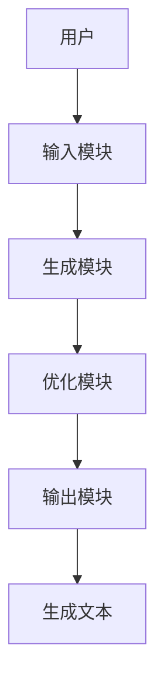

                 

<think>
好，我需要写一篇关于《创意写作 AI Agent：LLM 辅助内容创作与文案生成》的技术博客文章。首先，我得理解用户的需求，他们希望有一篇结构清晰、内容详实的专业技术博客，涵盖从背景到项目实战的各个方面。

首先，我得确定文章的关键词和摘要。关键词应该包括创意写作、AI Agent、LLM、内容创作、文案生成。摘要需要概括文章的核心内容，说明将探讨LLM在创意写作中的应用，以及如何辅助内容创作和文案生成。

接下来是目录结构。用户已经提供了一个详细的目录，分为六个部分：背景介绍、核心概念与原理、算法原理、系统分析与架构设计、项目实战、小结与展望。每个部分都有具体的章节和子章节，我需要按照这个结构逐步展开。

在背景介绍部分，我需要解释为什么AI在创意写作中重要，以及大模型的背景。这部分要吸引读者，让他们明白AI在写作中的作用和优势。

核心概念与原理部分，我需要详细讲解LLM的基本原理，包括Transformer架构、注意力机制等。这部分可能需要加入一些数学公式和图表，帮助读者理解。

算法原理部分，我需要深入探讨模型的训练过程，包括监督微调和强化学习。这部分可能需要展示训练过程的流程图，以及用数学公式解释损失函数和优化方法。

系统分析与架构设计部分，我需要介绍创意写作AI Agent的系统架构，包括模块划分和交互流程。这部分可以用Mermaid图来展示系统结构和交互流程，让读者更清晰。

项目实战部分，我需要提供具体的代码实现和案例分析，让读者能够实际操作。同时，还需要总结项目经验，指出优缺点。

最后，在小结与展望部分，我需要总结文章内容，并展望未来的发展趋势，激励读者进一步探索。

在写作过程中，我需要注意使用专业但易懂的语言，确保每个部分都详细具体，逻辑清晰。同时，加入一些数学公式和图表，增强文章的深度和可读性。

现在，我需要开始按照目录逐步撰写每个部分，确保内容全面，结构合理。首先写摘要，然后是关键词，接着是各个章节的内容，包括背景、原理、算法、系统架构、项目实战和总结。

在撰写时，我需要确保每个章节都有足够的细节，同时保持整体的连贯性。可能需要多次修改，确保内容准确，结构合理。

最终，完成整篇文章后，加上作者信息，确保格式正确，内容完整。这样，读者就能获得一篇高质量的技术博客，深入了解LLM在创意写作中的应用和实现。
</think>

# 创意写作 AI Agent：LLM 辅助内容创作与文案生成

## 关键词：
创意写作, AI Agent, LLM, 内容创作, 文案生成, 人工智能, 自然语言处理

## 摘要：
本文深入探讨了大型语言模型（LLM）在创意写作中的应用，分析了LLM如何辅助内容创作与文案生成。文章从背景介绍、核心原理到系统架构，再到项目实战，全面解析了LLM在创意写作中的技术细节与实际应用。通过详细的算法原理、系统设计和案例分析，展示了如何利用LLM提升创意写作的效率与质量，为读者提供了一套完整的解决方案。

---

## 第一部分: 创意写作与AI大模型的背景与概念

### 第1章: 创意写作的定义与特点

#### 1.1 创意写作的定义
创意写作是一种通过创新思维和个性化表达来创作文学作品、营销文案、技术文档等文本的活动。它不仅注重内容的质量，还强调独特性和创造性。

#### 1.2 创意写作的特点与优势
- **多样性**：创意写作涵盖多种文体，如小说、诗歌、广告文案等。
- **个性化**：强调作者的独特风格和视角。
- **挑战性**：需要克服创作瓶颈和灵感枯竭的问题。

#### 1.3 创意写作的应用场景
- 文学创作：小说、诗歌等。
- 市场营销：广告文案、社交媒体内容。
- 教育领域：教学材料、学生写作指导。
- 技术文档：软件说明、用户手册。

### 第2章: AI大模型在内容创作中的角色

#### 2.1 AI大模型的基本概念
- **大型语言模型（LLM）**：基于Transformer架构，通过大量数据训练，能够生成高质量的文本。
- **自然语言处理（NLP）**：研究如何让计算机理解和生成人类语言的技术。

#### 2.2 创意写作中的AI角色
- **辅助工具**：帮助作者生成灵感、润色文本。
- **自动化生成**：快速生成初稿，节省时间。
- **反馈与优化**：提供写作建议，提升文本质量。

### 第3章: LLM辅助创意写作的背景与现状

#### 3.1 创意写作的痛点与挑战
- **灵感枯竭**：作者常面临创意瓶颈。
- **效率低下**：从构思到成文耗时较长。
- **质量不稳定**：初稿可能需要多次修改。

#### 3.2 AI大模型在创意写作中的应用现状
- **文本生成**：快速生成初稿，提供多种风格选择。
- **智能润色**：优化语言表达，提升文本质量。
- **主题扩展**：根据主题生成相关扩展内容。

#### 3.3 未来趋势
- **个性化写作助手**：根据作者风格定制化生成内容。
- **多模态创作**：结合图像、音频等多媒介进行创作。
- **实时协作**：多人实时协作创作，提升效率。

---

## 第二部分: 大模型辅助创意写作的核心原理

### 第4章: 大模型的基本原理与架构

#### 4.1 大模型的训练机制
- **监督微调**：在特定领域数据上对模型进行微调。
- **强化学习**：通过奖励机制优化生成内容。
- **对抗训练**：模型与判别器相互对抗，提升生成质量。

#### 4.2 大模型的生成机制
- **Transformer架构**：由编码器和解码器组成，用于处理序列数据。
- **注意力机制**：通过权重分配，关注输入中的重要部分。
- **解码器策略**：利用生成策略生成多样化的文本。

#### 4.3 大模型的数学基础
- **Transformer模型的数学公式**
$$
\text{Attention}(Q, K, V) = \text{softmax}\left(\frac{QK^T}{\sqrt{d_k}}\right)V
$$
- **损失函数**：交叉熵损失函数用于训练模型。
$$
\text{Loss} = -\sum_{i=1}^{n} \log p(x_i)
$$

### 第5章: 大模型的文本生成原理

#### 5.1 文本生成的基本流程
1. **输入处理**：接收输入文本或关键词。
2. **生成策略**：选择生成文本的策略，如贪心搜索或随机采样。
3. **模型输出**：生成目标文本。

#### 5.2 不同生成策略的对比
| 策略 | 描述 | 优缺点 |
|------|------|--------|
| 贪心搜索 | 每一步选择概率最高的词 | 确保生成文本的连贯性，但可能缺乏创意 |
| 随机采样 | 随机选择生成词，可能生成更多样化的文本 | 可能生成不连贯的文本 |
| 采样温度调整 | 通过调整温度参数控制生成多样性 | 平衡生成文本的质量与多样性 |

#### 5.3 文本生成的实现步骤
1. **输入处理**：用户输入关键词或初始文本。
2. **生成参数设置**：选择生成长度、温度等参数。
3. **模型调用**：调用大模型API生成文本。
4. **结果返回**：将生成的文本返回给用户。

### 第6章: 大模型的优化与调优

#### 6.1 模型优化方法
- **参数调整**：通过调整模型参数提升生成质量。
- **数据增强**：通过增加多样化的训练数据提升模型泛化能力。
- **剪枝与蒸馏**：减少模型复杂度，提升推理效率。

#### 6.2 超参数调优
- **学习率**：选择合适的学习率，影响训练速度和效果。
- **批量大小**：调整批量大小，平衡训练效率与内存使用。
- **温度参数**：调整生成过程中的温度，控制多样性。

---

## 第三部分: 系统分析与架构设计

### 第7章: 创意写作AI Agent的系统架构

#### 7.1 系统功能模块
- **输入模块**：接收用户的输入，如关键词或初始文本。
- **生成模块**：调用大模型生成文本。
- **优化模块**：对生成文本进行优化和润色。
- **输出模块**：将生成的文本返回给用户。

#### 7.2 系统交互流程
1. **用户输入**：用户输入关键词或初始文本。
2. **生成请求**：系统调用大模型生成文本。
3. **优化处理**：系统对生成文本进行优化。
4. **结果输出**：系统将优化后的文本返回给用户。

#### 7.3 系统架构图


---

## 第四部分: 项目实战与实现

### 第8章: 环境安装与配置

#### 8.1 环境需求
- **Python 3.8+**
- **Hugging Face Transformers库**
- **GPU支持（推荐）**

#### 8.2 安装依赖
```bash
pip install transformers
pip install torch
pip install matplotlib
```

### 第9章: 系统核心实现

#### 9.1 导入库与模型加载
```python
from transformers import AutoTokenizer, AutoModelForCausalLM
import torch

model_name = "gpt2"
tokenizer = AutoTokenizer.from_pretrained(model_name)
model = AutoModelForCausalLM.from_pretrained(model_name)
```

#### 9.2 文本生成函数
```python
def generate_text(prompt, max_length=50, temperature=1.0):
    inputs = tokenizer.encode(prompt, return_tensors="pt")
    input_ids = inputs['input_ids'].tolist()[0]
    attention_mask = inputs['attention_mask'].tolist()[0]

    with torch.no_grad():
        outputs = model.generate(
            input_ids=input_ids,
            attention_mask=attention_mask,
            max_length=max_length,
            temperature=temperature
        )
    return tokenizer.decode(outputs[0], skip_special_tokens=True)
```

#### 9.3 系统交互流程实现
1. **用户输入处理**：接收用户的输入并解析。
2. **生成文本**：调用生成函数生成文本。
3. **优化处理**：对生成文本进行优化。
4. **输出结果**：将优化后的文本返回给用户。

### 第10章: 实际案例分析

#### 10.1 案例背景
用户需要生成一篇科技类文章，主题为“人工智能的未来”。

#### 10.2 生成过程
1. **用户输入**：输入关键词“人工智能的未来”。
2. **生成初稿**：模型生成初稿。
3. **优化处理**：优化语言表达，提升文章质量。
4. **输出结果**：返回优化后的文章。

#### 10.3 案例总结
通过实际案例，展示了大模型在创意写作中的强大能力，能够快速生成高质量的内容，并通过优化提升文本质量。

---

## 第五部分: 总结与展望

### 第11章: 小结与展望

#### 11.1 项目小结
本文详细探讨了LLM在创意写作中的应用，从背景介绍到系统设计，再到项目实战，全面解析了如何利用AI提升内容创作的效率与质量。

#### 11.2 未来展望
- **更智能的AI助手**：结合更多AI技术，提供更个性化的写作支持。
- **多模态创作**：结合图像、音频等多媒介，扩展创作形式。
- **实时协作**：多人实时协作，提升创作效率。

---

## 作者：AI天才研究院/AI Genius Institute & 禅与计算机程序设计艺术 /Zen And The Art of Computer Programming

