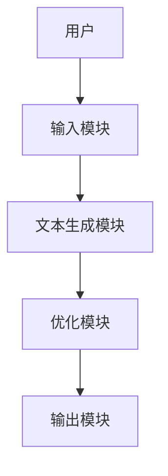

                 


# 创意写作AI Agent：LLM驱动的文学创作辅助系统

> **关键词**：创意写作、AI Agent、LLM、自然语言处理、文学创作  
> **摘要**：本文探讨了如何利用大语言模型（LLM）构建一个智能的文学创作辅助系统。通过分析创意写作的背景、AI Agent的核心概念以及LLM的算法原理，结合系统架构设计和实际案例，展示了如何实现一个高效且富有创意的文学创作工具。

---

## 第1章: 创意写作的背景与需求

### 1.1 创意写作的定义与特点

创意写作是指通过创新思维和艺术表达，创作文学作品的过程。其特点包括：

- **创新性**：作品需具备独特的思想和表达方式。
- **多样性**：涵盖小说、诗歌、剧本等多种文学形式。
- **情感性**：作品需触动读者的情感，引发共鸣。

### 1.2 当前创意写作面临的挑战

- **创作瓶颈**：部分创作者在灵感枯竭时难以继续。
- **效率问题**：创作过程可能耗时较长，需要反复修改。
- **多样性需求**：市场对多样化作品的需求增加，创作者需不断调整风格。

### 1.3 AI技术对创意写作的潜在影响

AI技术，尤其是大语言模型（LLM），为创意写作提供了新的可能性。LLM能够辅助创作者生成文本、提供灵感、优化语言表达，甚至帮助创作不同风格的作品。

---

## 第2章: AI Agent的基本概念与原理

### 2.1 AI Agent的核心概念

AI Agent（智能体）是指能够感知环境并采取行动以实现目标的实体。其特点包括：

- **自主性**：能够在没有外部干预的情况下运行。
- **反应性**：能够根据环境变化调整行为。
- **目标导向**：所有行动都以实现特定目标为导向。

### 2.2 AI Agent的基本原理

AI Agent的工作原理涉及感知、决策和行动三个步骤：

1. **感知**：通过传感器或输入数据感知环境。
2. **决策**：基于感知信息，选择最优行动方案。
3. **行动**：执行决策，影响环境。

### 2.3 AI Agent与传统软件的区别

| 特性         | AI Agent                     | 传统软件                     |
|--------------|------------------------------|------------------------------|
| 智能性       | 高                           | 低或无                       |
| 自适应性     | 强，能根据环境变化调整行为   | 弱或无                       |
| 学习能力     | 强，能通过数据训练优化性能   | 无或弱                       |

---

## 第3章: LLM驱动的AI Agent

### 3.1 LLM的基本概念

LLM（Large Language Model，大语言模型）是一种基于深度学习的自然语言处理模型，能够理解和生成人类语言。其核心优势在于：

- **大规模数据训练**：利用海量文本数据进行训练，提升模型的泛化能力。
- **生成能力**：能够生成连贯且自然的文本。

### 3.2 LLM在创意写作中的应用潜力

LLM可以辅助创作者完成以下任务：

- **灵感生成**：根据用户提供的关键词，生成故事开头或情节。
- **文本优化**：对已有的文本进行润色和改写，提升语言表达。
- **风格转换**：将文本从一种风格转换为另一种风格，例如从正式语态转为口语化。

### 3.3 LLM的核心技术与优势

#### 3.3.1 基于转换层的LLM

转换层是LLM的核心部分，负责将输入的文本转换为模型内部的表示形式。具体步骤如下：

1. **输入处理**：将输入文本转换为字符或单词的表示形式。
2. **编码**：通过编码层将输入序列编码为模型内部的表示。
3. **解码**：通过解码层将内部表示解码为输出文本。

---

## 第4章: LLM的训练与优化

### 4.1 LLM的训练过程

#### 4.1.1 数据准备与预处理

数据准备是LLM训练的关键步骤，包括：

- **数据清洗**：去除噪音数据，确保数据质量。
- **分词处理**：将文本分割为单词或短语。
- **数据增强**：通过数据增强技术增加数据多样性。

#### 4.1.2 模型训练的数学公式

LLM的训练过程通常使用交叉熵损失函数：

$$ \text{Loss} = -\frac{1}{N}\sum_{i=1}^{N} \log P(y_i|x_i) $$

其中，$P(y_i|x_i)$ 表示在输入 $x_i$ 的条件下，预测输出 $y_i$ 的概率。

#### 4.1.3 模型优化与调优

模型优化包括：

- **超参数调整**：如学习率、批量大小等。
- **模型剪枝**：减少模型复杂度，提升推理速度。
- **模型融合**：结合多个模型的优势，提升整体性能。

---

## 第5章: 创意写作的生成机制

### 5.1 创意写作的生成模型

#### 5.1.1 基于LLM的生成模型

基于LLM的生成模型通过以下步骤实现创意写作：

1. **输入处理**：用户输入关键词或初始文本。
2. **上下文理解**：模型理解输入的语义和上下文。
3. **文本生成**：模型生成连贯且符合逻辑的文本。

#### 5.1.2 基于规则的生成模型

基于规则的生成模型通过预定义的语法规则生成文本，适用于结构化文本的生成。

#### 5.1.3 混合生成模型

混合生成模型结合了基于LLM和基于规则的生成方式，能够在保证生成文本的连贯性的同时，遵循特定的语法规则。

### 5.2 创意写作的生成过程

#### 5.2.1 初始输入与上下文理解

生成过程的第一步是用户输入初始文本，例如：

```python
# 初始输入
input_text = "在一个遥远的星球上，有一个叫小明的男孩..."
```

模型通过对输入文本的分析，理解上下文和主题。

#### 5.2.2 文本生成的步骤与流程

文本生成的流程包括：

1. **分词处理**：将输入文本分割为单词或短语。
2. **编码**：将分词后的文本编码为模型内部的表示。
3. **解码**：将编码后的表示解码为输出文本。

---

## 第6章: 创意写作AI Agent的系统架构

### 6.1 系统功能设计

#### 6.1.1 用户输入模块

用户输入模块负责接收用户的输入文本，并将其传递给模型进行处理。

#### 6.1.2 文本生成模块

文本生成模块是系统的核心部分，负责根据输入生成创意文本。

#### 6.1.3 文本优化模块

文本优化模块对生成的文本进行润色和改写，提升语言表达。

### 6.2 系统架构设计

系统架构采用分层设计，包括数据层、服务层和应用层。以下是系统架构的Mermaid图：



---

## 第7章: 项目实战

### 7.1 环境安装

需要安装以下工具和库：

- **Python**：版本3.8及以上。
- **Hugging Face Transformers**：用于加载预训练的LLM模型。
- **Mermaid**：用于生成图表。

安装命令：

```bash
pip install transformers mermaid
```

### 7.2 核心代码实现

以下是创意写作AI Agent的核心代码实现：

```python
from transformers import GPT2LMHeadModel, GPT2Tokenizer

# 加载预训练模型
model_name = 'gpt2'
tokenizer = GPT2Tokenizer.from_pretrained(model_name)
model = GPT2LMHeadModel.from_pretrained(model_name)

# 定义生成函数
def generate_text(prompt, max_length=50):
    inputs = tokenizer.encode(prompt, return_tensors='pt')
    outputs = model.generate(inputs, max_length=max_length, do_sample=True)
    return tokenizer.decode(outputs[0], skip_special_tokens=True)

# 示例输入
prompt = "在一个遥远的星球上，有一个叫小明的男孩..."
result = generate_text(prompt)
print(result)
```

### 7.3 案例分析

以生成科幻小说开头为例：

```python
prompt = "在一个遥远的星球上，有一个叫小明的男孩..."
result = generate_text(prompt)
print(result)
```

输出可能为：

```
"在一个遥远的星球上，有一个叫小明的男孩，他发现了一艘神秘的宇宙飞船..."
```

---

## 第8章: 最佳实践与总结

### 8.1 最佳实践

- **数据多样性**：确保训练数据的多样性，避免模型生成单一化的文本。
- **模型调优**：根据具体任务需求，调整模型参数和超参数。
- **用户反馈**：收集用户反馈，不断优化模型性能。

### 8.2 小结

创意写作AI Agent通过结合LLM技术和AI Agent的概念，为文学创作提供了新的可能性。它能够辅助创作者突破创作瓶颈，提升创作效率和质量。

### 8.3 注意事项

- **数据隐私**：在处理用户输入时，需注意数据隐私和安全。
- **模型泛化能力**：在实际应用中，需考虑模型的泛化能力和适应性。

### 8.4 拓展阅读

建议读者进一步阅读以下内容：

- Hugging Face Transformers官方文档
- 《生成式AI：从理论到实践》
- 最新论文：《Large Language Models for Creative Writing》

---

## 作者

**作者：AI天才研究院/AI Genius Institute & 禅与计算机程序设计艺术/Zen And The Art of Computer Programming**

---

通过本文的详细讲解，读者可以深入了解如何利用LLM构建一个高效的创意写作AI Agent，为文学创作提供强有力的技术支持。

