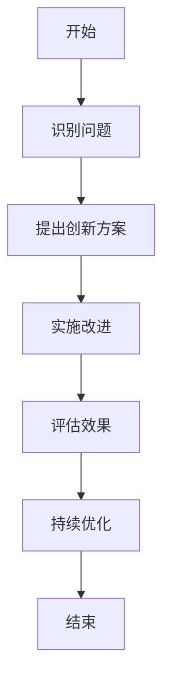
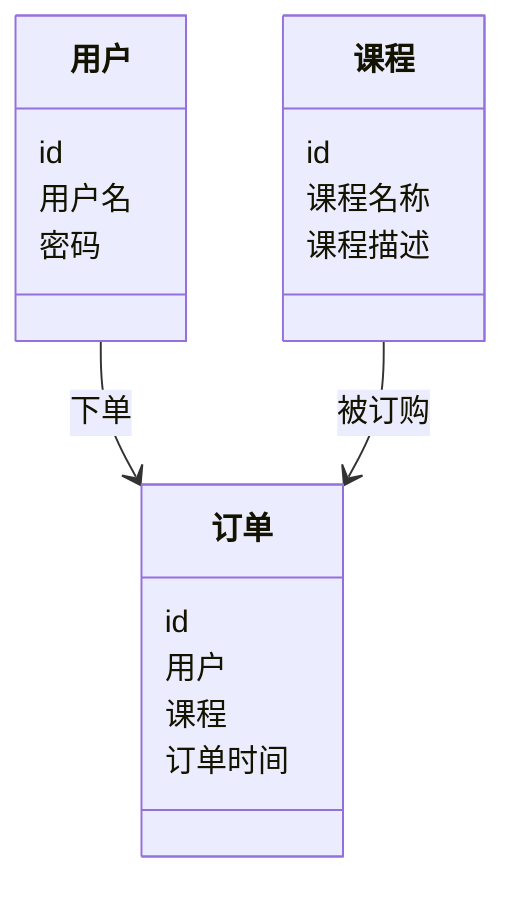
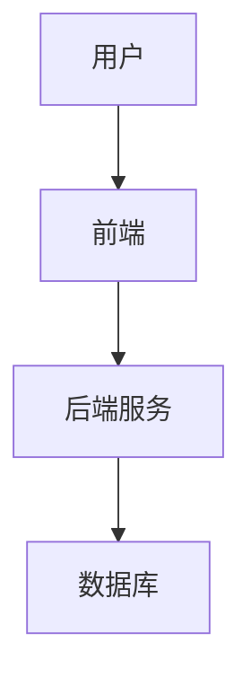

                 


# 创新与持续改进

> 关键词：创新，持续改进，算法原理，系统架构，项目实战

> 摘要：本文详细探讨了创新与持续改进的核心概念、算法原理、系统架构及项目实战。通过理论与实践的结合，阐述了如何在IT领域应用这些方法，以推动技术和项目的进步。

---

## 第一部分: 创新与持续改进的背景与核心概念

### 第1章: 创新与持续改进的概述

#### 1.1 创新与持续改进的背景

创新与持续改进是推动技术进步和企业发展的核心动力。在快速变化的IT领域，创新意味着引入新的思想、技术和方法，而持续改进则强调在现有基础上不断优化，以适应新的挑战和需求。

##### 1.1.1 问题背景与挑战

在IT领域，技术更新换代迅速，竞争激烈。企业需要不断推出新产品、优化现有系统，以保持竞争力。然而，创新过程中常常面临资源有限、风险高、实施难度大等问题。持续改进则需要在日常工作中不断发现问题并优化，这对组织的灵活性和团队的执行力提出了更高要求。

##### 1.1.2 问题的描述与现状

创新和持续改进在IT领域的应用广泛。例如，软件开发中的敏捷开发强调持续交付和改进，而DevOps则通过自动化和协作实现持续优化。然而，许多企业在实施创新和持续改进时，常常面临如何平衡短期目标和长期战略、如何有效管理变革过程、如何激励团队等问题。

##### 1.1.3 创新与持续改进的目标

通过创新，企业可以开发出更具竞争力的产品和服务；通过持续改进，企业可以优化流程、提高效率、降低成本。两者结合起来，能够使企业在技术和市场上保持领先地位。

#### 1.2 创新与持续改进的核心概念

##### 1.2.1 核心概念的定义与特点

- **创新**：指引入新的思想、方法、技术或产品，以创造价值。创新的特点包括前瞻性、独特性和高风险。
- **持续改进**：通过不断发现问题并优化，以提高效率和质量。其特点包括系统性、持续性和渐进性。

##### 1.2.2 创新与持续改进的边界与外延

创新的边界在于其实施范围和效果，而持续改进的边界在于其改进的范围和深度。两者的外延包括从个体到组织，从局部到全局的应用。

##### 1.2.3 核心要素与概念结构

创新和持续改进的核心要素包括目标、资源、过程和结果。概念结构可以分为创新的产生、实施和评估，以及持续改进的计划、执行和优化。

#### 1.3 本章小结

本章介绍了创新与持续改进的背景、定义、特点及目标，为后续章节的深入分析奠定了基础。

---

## 第二部分: 创新与持续改进的核心概念与联系

### 第2章: 创新与持续改进的核心原理

#### 2.1 创新与持续改进的原理

##### 2.1.1 创新的原理与机制

创新的核心在于打破常规思维，引入新的解决方案。其机制包括问题识别、创意生成、评估与实施。

##### 2.1.2 持续改进的原理与方法

持续改进基于PDCA（计划-执行-检查-行动）循环，通过不断发现问题并优化，实现改进目标。

##### 2.1.3 创新与持续改进的联系与区别

创新注重突破性变化，而持续改进注重渐进式优化。两者相辅相成，共同推动进步。

#### 2.2 核心概念的属性特征对比

##### 2.2.1 创新与持续改进的属性对比

| 属性          | 创新                     | 持续改进                |
|---------------|--------------------------|-------------------------|
| 目标          | 引入新解决方案           | 优化现有流程             |
| 时间跨度      | 短期到长期               | 长期                   |
| 风险          | 高                      | 中等                   |

##### 2.2.2 创新与持续改进的特征表格

| 特征          | 创新                     | 持续改进                |
|---------------|--------------------------|-------------------------|
| 风险承受能力  | 高                      | 中等                   |
| 资源投入       | 高                      | 中等                   |
| 时间周期       | 短期到长期               | 长期                   |

#### 2.3 实体关系图与流程图

##### 2.3.1 创新与持续改进的ER实体关系图

```mermaid
er
    entity 创新 {
        id
        创新点
        创新者
    }
    entity 改进 {
        id
        改进点
        改进者
    }
    entity 项目 {
        id
        项目名称
        项目目标
    }
    创新 --> 改进 : 改进创新成果
    改进 --> 项目 : 应用于项目
```

##### 2.3.2 创新与持续改进的流程图



#### 2.4 本章小结

本章通过对比和图表分析，详细阐述了创新与持续改进的核心原理及其联系，为后续的算法和系统分析奠定了基础。

---

## 第三部分: 创新与持续改进的算法原理

### 第3章: 创新与持续改进的数学模型

#### 3.1 创新扩散模型

##### 3.1.1 创新扩散的数学公式

创新扩散速度的数学模型可以表示为：
$$ 创新扩散速度 = k \cdot S \cdot (1 - S) $$
其中，$S$ 为创新采用率，$k$ 为扩散系数。

##### 3.1.2 持续改进的数学模型

持续改进的效率可以用以下公式表示：
$$ 改进效率 = \frac{改进前的效率}{改进后的效率} $$

---

## 第四部分: 创新与持续改进的系统分析与架构设计

### 第4章: 系统分析与架构设计

#### 4.1 问题场景介绍

假设我们正在开发一个在线教育平台，需要通过创新和持续改进来提升用户体验和系统性能。

#### 4.2 系统功能设计

##### 4.2.1 领域模型类图



##### 4.2.2 系统架构设计



---

## 第五部分: 创新与持续改进的项目实战

### 第5章: 项目实战

#### 5.1 环境安装

需要安装Python、Flask框架、数据库等工具。

#### 5.2 系统核心实现源代码

以下是课程管理系统的代码示例：

```python
from flask import Flask, render_template, request, redirect, url_for
from flask_sqlalchemy import SQLAlchemy

app = Flask(__name__)
app.config['SQLALCHEMY_DATABASE_URI'] = 'sqlite:///test.db'
db = SQLAlchemy(app)

class User(db.Model):
    id = db.Column(db.Integer, primary_key=True)
    username = db.Column(db.String(80), unique=True)
    password = db.Column(db.String(80))

class Course(db.Model):
    id = db.Column(db.Integer, primary_key=True)
    name = db.Column(db.String(80))
    description = db.Column(db.Text)

@app.route('/')
def index():
    return render_template('index.html')

@app.route('/login', methods=['GET', 'POST'])
def login():
    if request.method == 'POST':
        username = request.form['username']
        password = request.form['password']
        user = User.query.filter_by(username=username, password=password).first()
        if user:
            return redirect(url_for('index'))
        else:
            return redirect(url_for('login'))
    return render_template('login.html')

if __name__ == '__main__':
    app.run(debug=True)
```

---

## 第六部分: 创新与持续改进的最佳实践

### 第6章: 最佳实践

#### 6.1 小结

创新与持续改进是推动IT领域发展的双重引擎。通过理论与实践的结合，可以有效提升技术和服务质量。

#### 6.2 注意事项

- 创新需要谨慎评估风险。
- 持续改进需要建立反馈机制。
- 团队激励是关键。

#### 6.3 未来趋势

随着AI和大数据的发展，创新和持续改进将更加智能化和数据驱动。

#### 6.4 拓展阅读

推荐阅读《创新者的窘境》和《持续改进的实践》。

---

## 作者

作者：AI天才研究院/AI Genius Institute & 禅与计算机程序设计艺术 /Zen And The Art of Computer Programming

