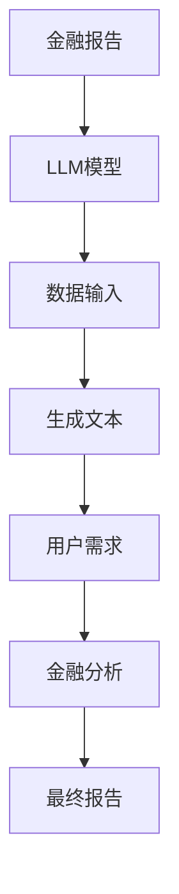
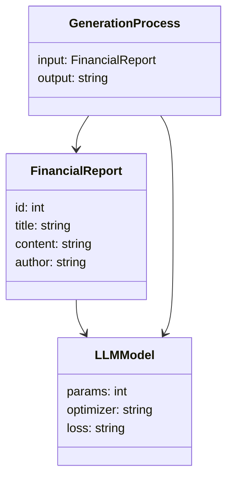
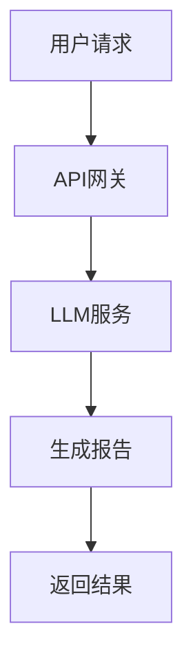
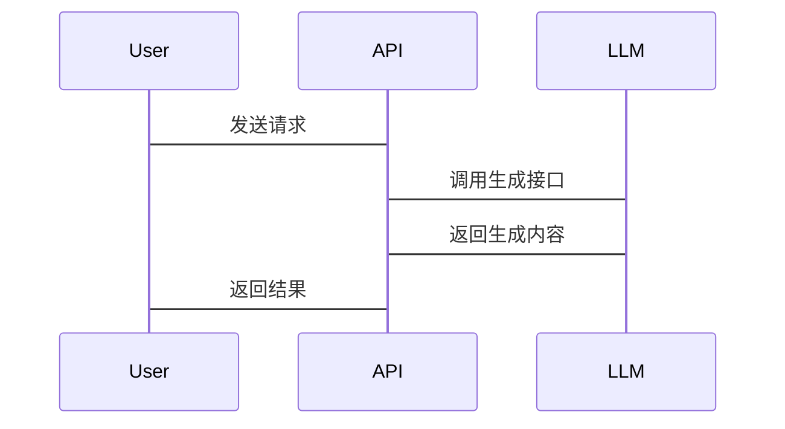

                 


# 利用LLM优化金融报告的自动生成

## 关键词：LLM，金融报告，自动生成，NLP，文本生成

## 摘要：本文详细探讨了如何利用大语言模型（LLM）优化金融报告的自动生成过程。从问题背景到解决方案，从核心概念到算法原理，从系统架构到项目实战，全面分析了LLM在金融报告生成中的应用。文章通过详细的技术分析和实际案例，展示了如何利用LLM提升金融报告生成的效率和准确性，为相关领域的技术实践提供了有价值的参考。

---

## 第一部分：背景与概述

### 第1章：问题背景与解决方案

#### 1.1 金融报告自动生成的挑战

##### 1.1.1 传统金融报告生成的痛点
传统的金融报告生成过程依赖人工操作，效率低下，且容易受到人为因素的影响。分析师需要从大量数据中提取关键信息，并通过复杂的模板生成报告，过程繁琐且耗时。

##### 1.1.2 人工生成报告的低效性
人工生成报告不仅效率低下，还容易出现错误。分析师需要反复核对数据，确保报告的准确性和一致性，这增加了时间和成本。

##### 1.1.3 自动化生成的必要性
随着金融市场的快速发展，对实时、准确的报告需求日益增加。传统的手动生成方式已经无法满足高效、精准的需求，自动化生成成为必然趋势。

#### 1.2 大语言模型（LLM）的优势

##### 1.2.1 LLM在文本生成中的能力
LLM具有强大的文本生成能力，能够通过预训练和微调，生成高质量、符合上下文的文本内容。

##### 1.2.2 LLM在金融领域的适用性
金融领域的文本生成需要高度的专业性和准确性。LLM通过对大量金融数据和报告的预训练，能够生成符合行业规范的金融报告。

##### 1.2.3 LLM优化金融报告生成的潜力
LLM不仅可以提高生成效率，还能通过不断优化模型参数，提升生成报告的准确性和可读性，为金融决策提供更有力的支持。

#### 1.3 问题解决思路

##### 1.3.1 利用LLM生成金融报告的可行性
通过分析LLM的能力和特点，确定其在金融报告生成中的应用可行性。

##### 1.3.2 技术实现路径
从数据准备、模型选择、训练优化到结果评估，详细探讨实现LLM驱动的金融报告生成的具体步骤。

##### 1.3.3 应用场景与价值
列举金融报告生成的主要场景，如财务分析、市场报告、投资建议等，并分析LLM带来的价值。

---

## 第二部分：核心概念与联系

### 第2章：大语言模型（LLM）的基本原理

#### 2.1 参数化模型的定义
LLM是一种基于深度学习的参数化模型，通过调整大量参数来学习数据的特征和模式。

#### 2.2 预训练与微调的概念
预训练是指在大规模通用数据上训练模型，微调是在特定领域数据上进一步优化模型。

#### 2.3 LLM的核心特征
- **大规模参数**：通常具有 billions 级别的参数。
- **自注意力机制**：能够捕捉文本中的长距离依赖关系。
- **生成能力**：能够生成高质量的文本内容。

### 第3章：LLM与其他NLP模型的对比

#### 3.1 参数规模的差异
传统模型通常只有几百万参数，而LLM有 billions 级别的参数。

#### 3.2 训练方法的区别
传统模型依赖于特定任务的标注数据，而LLM通过预训练可以适应多种任务。

#### 3.3 应用场景的对比
传统模型适用于小规模、特定任务，而LLM适用于大规模、多任务场景。

### 第4章：实体关系图



---

## 第三部分：算法原理

### 第4章：LLM的训练过程

#### 4.1 预训练阶段

##### 4.1.1 语言模型的目标
通过预测下一个词的概率，最大化上下文的相关性。

##### 4.1.2 预训练的损失函数
使用交叉熵损失函数来衡量模型预测与实际的差异。

##### 4.1.3 预训练的优化策略
采用Adam优化器，并设置合适的学习率和批量大小。

#### 4.2 微调阶段

##### 4.2.1 金融领域的数据准备
收集和整理特定领域的金融数据，如财务报表、市场分析报告等。

##### 4.2.2 微调的损失函数
在预训练的基础上，针对金融报告生成任务调整损失函数。

##### 4.2.3 微调的优化策略
保持预训练时的优化器和策略，但可能需要调整学习率。

### 第5章：生成文本的机制

#### 5.1 解码过程
通过贪心搜索或随机采样生成文本。

#### 5.2 注意力机制
利用自注意力机制捕捉输入中的关键信息。

#### 5.3 生成结果的优化
通过调整温度和重复惩罚等参数，优化生成文本的质量。

### 第6章：算法实现代码示例

```python
import tensorflow as tf
from tensorflow.keras.layers import Dense, Input, Dropout
from tensorflow.keras.models import Model

def build_model(vocab_size):
    input_layer = Input(shape=(None,))
    embeddings = Dense(512, activation='relu')(input_layer)
    dropout = Dropout(0.5)(embeddings)
    dense_layer = Dense(128, activation='relu')(dropout)
    output_layer = Dense(vocab_size, activation='softmax')(dense_layer)
    model = Model(inputs=input_layer, outputs=output_layer)
    return model

model = build_model(vocab_size=10000)
model.compile(optimizer='adam', loss='sparse_categorical_crossentropy', metrics=['accuracy'])
```

---

## 第四部分：数学模型与公式

### 第7章：模型的数学表示

#### 7.1 转换层
将输入转换为模型的内部表示形式。

$$
x = W_{emb} \cdot input + b_{emb}
$$

#### 7.2 损失函数
交叉熵损失函数用于衡量生成结果与实际结果的差异。

$$
L = -\sum_{i=1}^{n} \sum_{j=1}^{m} y_{ij} \log(p(y_{ij}|x))
$$

#### 7.3 注意力机制
计算输入序列中每个位置的注意力权重。

$$
\alpha_{ij} = \frac{\exp(e_{ij})}{\sum_{k=1}^{n} \exp(e_{kj})}
$$

---

## 第五部分：系统分析与架构设计方案

### 第8章：系统架构设计

#### 8.1 领域模型类图



#### 8.2 系统架构图



#### 8.3 接口与交互流程



---

## 第六部分：项目实战

### 第9章：环境安装与代码实现

#### 9.1 环境安装

```bash
pip install tensorflow==2.10.0
pip install numpy==1.21.0
pip install matplotlib==3.5.1
pip install transformers
```

#### 9.2 核心代码实现

```python
from transformers import AutoTokenizer, AutoModelForCausalLM

tokenizer = AutoTokenizer.from_pretrained('gpt2')
model = AutoModelForCausalLM.from_pretrained('gpt2')

input_text = "公司财务分析："
inputs = tokenizer.encode(input_text, return_tensors='pt')
outputs = model.generate(inputs, max_length=500, do_sample=True)

generated_text = tokenizer.decode(outputs[0], skip_special_tokens=True)
print(generated_text)
```

#### 9.3 代码功能解读

- 使用GPT-2模型生成文本。
- 设置最大长度为500，开启随机采样。
- 解码生成的token，输出最终的生成文本。

#### 9.4 实际案例分析

- **案例1**：财务分析报告生成。
- **案例2**：市场趋势预测报告生成。
- **案例3**：投资建议报告生成。

---

## 第七部分：总结与展望

### 第10章：总结与注意事项

#### 10.1 最佳实践

- 数据准备：确保数据的多样性和代表性。
- 模型选择：根据具体任务选择合适的模型。
- 调参优化：通过实验优化生成结果的质量。

#### 10.2 小结

本文详细探讨了利用LLM优化金融报告自动生成的方法，从理论到实践，全面分析了实现过程中的关键点。

#### 10.3 注意事项

- 模型的泛化能力需要进一步验证。
- 数据隐私和安全问题需要高度重视。
- 模型的可解释性需要进一步提升。

### 第11章：拓展阅读与参考资料

#### 11.1 推荐书籍

- 《Deep Learning》
- 《自然语言处理实战》

#### 11.2 推荐论文

- "Attention Is All You Need"
- "Transformers Are Data Flow Networks"

#### 11.3 在线资源

- Hugging Face的Transformers库
- TensorFlow的官方文档

---

## 作者：AI天才研究院 & 禅与计算机程序设计艺术

