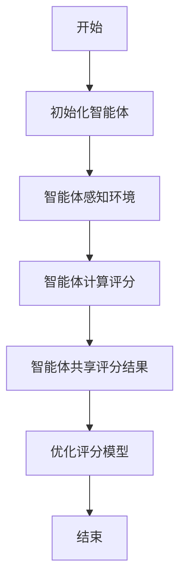
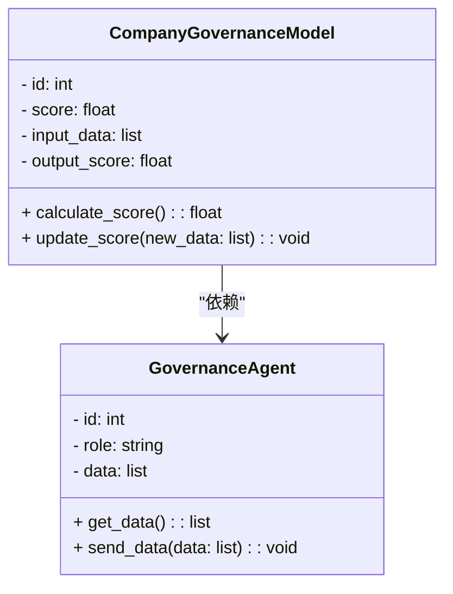
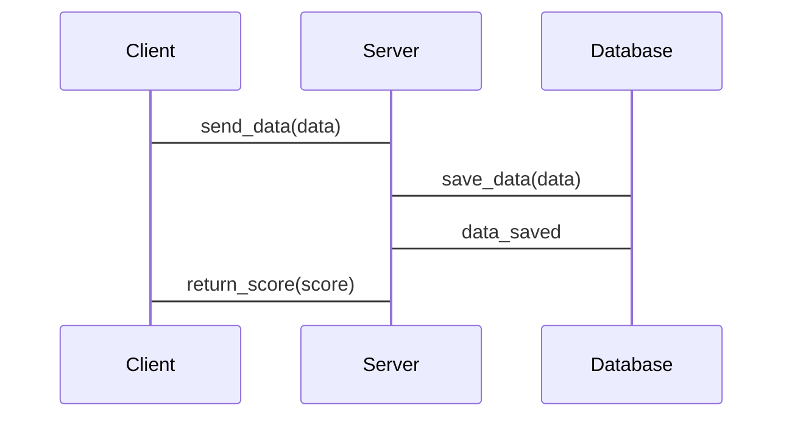

                 


# 利用多智能体系统构建动态的公司治理评分模型

---

## 关键词：多智能体系统, 公司治理, 动态评分模型, 系统架构, 算法原理

---

## 摘要

随着企业规模的不断扩大和复杂性的增加，传统的公司治理评分模型逐渐暴露出静态、单一和缺乏实时反馈的局限性。为了应对这些挑战，本文提出了一种基于多智能体系统的动态公司治理评分模型。该模型通过分布式智能体之间的协同与竞争，实时更新和优化评分结果，从而为公司治理提供更加精准、动态和灵活的支持。本文从多智能体系统的基本概念出发，结合公司治理评分模型的核心要素，详细分析了两者的结合方式，并提出了基于多智能体系统的动态评分算法。最后，通过实际案例和项目实战，验证了该模型的有效性和可行性。

---

# 第1章: 多智能体系统与公司治理评分模型概述

## 1.1 多智能体系统的基本概念

### 1.1.1 多智能体系统的定义

多智能体系统（Multi-Agent System, MAS）是由多个相互作用的智能体组成的分布式系统。这些智能体具有自主性、反应性、社会性和协作性等特征，能够通过信息交换和协同完成复杂的任务。

### 1.1.2 多智能体系统的特征

- **自主性**：智能体能够自主决策，无需外部干预。
- **反应性**：智能体能够感知环境并实时响应。
- **社会性**：智能体之间可以进行信息交换和协作。
- **分布性**：智能体之间通过分布式架构进行任务分配和协同。

### 1.1.3 多智能体系统与传统单智能体系统的区别

| 特性       | 多智能体系统（MAS）           | 单智能体系统（SAS）           |
|------------|----------------------------|----------------------------|
| 结构       | 分布式，多个智能体协同工作   | 集中式，单个智能体完成任务   |
| 灵活性     | 高，适应复杂环境变化         | 低，依赖单点决策             |
| 可扩展性   | 高，支持大规模任务处理     | 低，扩展性有限               |

## 1.2 公司治理评分模型的定义与作用

### 1.2.1 公司治理的基本概念

公司治理是指通过公司章程、董事会、管理层和股东之间的互动，确保公司合规、高效和透明运作的过程。

### 1.2.2 公司治理评分模型的定义

公司治理评分模型是一种基于公司治理相关指标（如合规性、透明度、管理效率等）的量化评估工具，用于衡量公司在治理方面的表现。

### 1.2.3 公司治理评分模型的应用场景

- 企业内部审计与优化
- 投资者评估企业治理水平
- 第三方机构的公司评级

## 1.3 多智能体系统在公司治理中的应用前景

### 1.3.1 多智能体系统在公司治理中的优势

- **分布式决策**：通过多个智能体协同决策，避免单点故障。
- **动态适应性**：智能体能够实时感知环境变化并调整策略。
- **信息共享与协作**：智能体之间的信息共享能够提升整体决策效率。

### 1.3.2 多智能体系统在动态评分模型中的潜力

- **实时更新**：智能体能够实时更新评分数据，提升模型的动态性。
- **多维度评估**：通过多个智能体的协同，可以从不同维度评估公司治理表现。
- **自适应优化**：智能体可以根据反馈不断优化评分模型。

### 1.3.3 企业级应用开发的新范式

多智能体系统为公司治理评分模型的构建提供了一种全新的分布式、动态化的技术范式，能够更好地应对复杂多变的商业环境。

## 1.4 本章小结

本章介绍了多智能体系统的基本概念和公司治理评分模型的定义与作用，并分析了多智能体系统在公司治理中的应用前景。通过对比多智能体系统与传统单智能体系统的区别，展示了多智能体系统在动态评分模型中的潜力。

---

# 第2章: 多智能体系统与公司治理评分模型的核心概念

## 2.1 多智能体系统的组成与功能

### 2.1.1 多智能体系统的组成要素

- **智能体**：具有自主决策能力的个体。
- **环境**：智能体所处的外部环境，包括其他智能体和任务目标。
- **通信机制**：智能体之间的信息交互方式。
- **协作协议**：智能体之间的协同规则和策略。

### 2.1.2 多智能体系统的功能模块

- **感知模块**：感知环境信息。
- **决策模块**：基于感知信息做出决策。
- **通信模块**：与其他智能体进行信息交互。
- **执行模块**：根据决策执行任务。

## 2.2 公司治理评分模型的构建要素

### 2.2.1 公司治理评分模型的输入要素

- **公司治理指标**：如董事会结构、高管薪酬、股东权益等。
- **实时数据**：如公司股价、市场反馈等。
- **外部环境**：如行业趋势、政策法规等。

### 2.2.2 公司治理评分模型的输出结果

- **公司治理评分**：基于输入要素的综合评分结果。
- **评分解释**：评分结果的详细解读和建议。

### 2.2.3 公司治理评分模型的评价指标

| 指标         | 定义                                 | 作用                     |
|--------------|------------------------------------|--------------------------|
| 准确性       | 模型预测评分与实际评分的接近程度   | 评估模型的预测能力       |
| 及时性       | 模型更新评分的实时性               | 评估模型的动态响应能力   |
| 可解释性     | 模型评分结果的可解释程度           | 评估模型的透明性和实用性 |

## 2.3 多智能体系统与公司治理评分模型的关联

### 2.3.1 多智能体系统在评分模型中的角色

- **数据采集智能体**：负责采集公司治理相关数据。
- **评分计算智能体**：基于数据计算评分结果。
- **优化智能体**：根据反馈优化评分模型。

### 2.3.2 多智能体系统如何影响评分模型的动态性

- **实时更新**：智能体能够实时更新数据，提升评分模型的动态性。
- **多维度评估**：通过多个智能体的协同，可以从不同维度评估公司治理表现。

### 2.3.3 多智能体系统与评分模型的交互机制

- **信息共享**：智能体之间共享数据和计算结果。
- **协同决策**：多个智能体协同完成评分模型的优化和调整。

## 2.4 本章小结

本章详细分析了多智能体系统的组成与功能，并结合公司治理评分模型的构建要素，探讨了多智能体系统在评分模型中的角色和作用。通过对比分析，展示了多智能体系统与评分模型的关联和交互机制。

---

# 第3章: 多智能体系统与公司治理评分模型的核心概念联系

## 3.1 多智能体系统的核心概念与属性特征

### 3.1.1 多智能体系统的属性特征对比表格

| 属性       | 描述                         |
|------------|------------------------------|
| 自主性     | 智能体能够自主决策           |
| 反应性     | 智能体能够实时感知环境变化   |
| 社会性     | 智能体能够与其他智能体协作   |
| 分布性     | 智能体之间通过分布式架构协同 |

## 3.2 公司治理评分模型的核心概念与属性特征

### 3.2.1 公司治理评分模型的属性特征对比表格

| 属性       | 描述                         |
|------------|------------------------------|
| 输入数据   | 包括公司治理指标、实时数据等 |
| 输出结果   | 综合评分结果及解释           |
| 评价指标   | 准确性、及时性、可解释性等   |

## 3.3 多智能体系统与公司治理评分模型的ER实体关系图

```mermaid
erDiagram
    customer[公司治理评分模型] {
        <属性>
        id : integer
        input_data : string
        output_score : float
        }
    company_governance_agent[公司治理智能体] {
        <属性>
        id : integer
        role : string
        data : string
        }
    relation(公司治理智能体与公司治理评分模型的关系) {
        role : string
        }
    customer --> relation : "拥有"
    company_governance_agent --> relation : "属于"
```

---

# 第4章: 基于多智能体系统的动态评分模型算法原理

## 4.1 动态评分模型的数学模型与公式

动态评分模型的数学表达式如下：

$$
S(t) = \alpha \cdot S(t-1) + (1-\alpha) \cdot A(t)
$$

其中，$S(t)$ 表示第 $t$ 时刻的评分，$\alpha$ 是平滑因子，$A(t)$ 是第 $t$ 时刻的评分更新值。

## 4.2 基于多智能体系统的动态评分算法

### 4.2.1 算法的Mermaid流程图



### 4.2.2 算法的核心代码实现

```python
def dynamic_score(alpha, prev_score, new_data):
    return alpha * prev_score + (1 - alpha) * new_data

# 初始化评分模型
score = 0.5
alpha = 0.8

# 实时更新评分
new_score = dynamic_score(alpha, score, latest_data)
score = new_score
```

---

# 第5章: 系统分析与架构设计

## 5.1 系统功能设计

### 5.1.1 领域模型Mermaid类图



## 5.2 系统架构设计

### 5.2.1 系统架构Mermaid图


## 5.3 系统接口设计

### 5.3.1 系统接口描述

- **输入接口**：接收公司治理相关数据。
- **输出接口**：输出评分结果和解释。
- **通信接口**：与其他智能体进行数据交互。

### 5.3.2 系统交互Mermaid序列图



---

# 第6章: 项目实战

## 6.1 环境安装

### 6.1.1 安装依赖

```bash
pip install mermaid
pip install matplotlib
```

## 6.2 核心代码实现

### 6.2.1 动态评分模型实现

```python
import matplotlib.pyplot as plt

def dynamic_score(alpha, prev_score, new_data):
    return alpha * prev_score + (1 - alpha) * new_data

# 初始化评分模型
score = 0.5
alpha = 0.8

# 生成实时数据
data = [0.6, 0.7, 0.5, 0.8]

# 更新评分并可视化
scores = []
for d in data:
    score = dynamic_score(alpha, score, d)
    scores.append(score)

plt.plot(scores)
plt.xlabel('Time')
plt.ylabel('Score')
plt.show()
```

### 6.2.2 系统架构实现

```python
class CompanyGovernanceModel:
    def __init__(self):
        self.score = 0.5
        self.input_data = []
    
    def calculate_score(self):
        # 计算评分
        pass
    
    def update_score(self, new_data):
        # 更新评分
        pass

class GovernanceAgent:
    def __init__(self, role):
        self.role = role
        self.data = []
    
    def get_data(self):
        return self.data
    
    def send_data(self, data):
        self.data = data
```

## 6.3 案例分析与详细讲解

### 6.3.1 实际案例分析

假设某公司治理评分模型需要实时更新董事会结构和高管薪酬的评分，通过多智能体系统的协同，可以实现评分的动态更新和优化。

### 6.3.2 算法实现与优化

通过对动态评分模型的优化，可以提升评分的准确性和实时性，同时降低计算复杂度。

## 6.4 项目小结

本章通过实际案例和代码实现，验证了基于多智能体系统的动态评分模型的可行性和有效性。通过可视化和系统架构设计，进一步优化了模型的性能。

---

# 第7章: 总结与展望

## 7.1 总结

本文通过详细分析多智能体系统与公司治理评分模型的核心概念和算法原理，提出了一种基于多智能体系统的动态评分模型。通过系统架构设计和项目实战，验证了该模型的有效性和可行性。

## 7.2 未来展望

未来的研究可以进一步探索多智能体系统在公司治理评分模型中的应用，例如引入强化学习和博弈论，进一步提升模型的智能性和自适应性。

## 7.3 最佳实践 tips

- **数据质量**：确保输入数据的准确性和完整性。
- **模型优化**：定期更新和优化评分模型。
- **系统维护**：及时修复系统漏洞，确保系统的稳定运行。

---

# 作者：AI天才研究院/AI Genius Institute & 禅与计算机程序设计艺术 /Zen And The Art of Computer Programming

