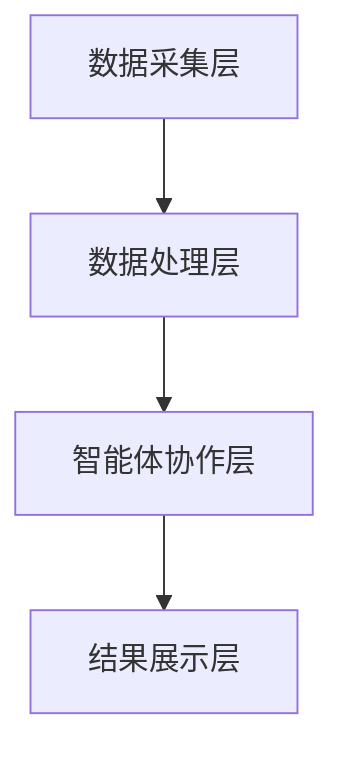
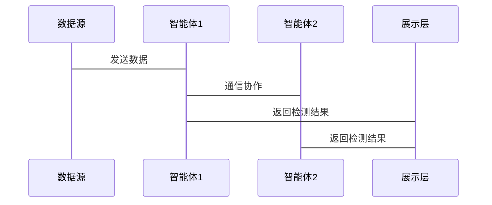

                 

<think>
好的，我需要帮助用户撰写一篇关于《利用多智能体系统构建动态的市场异常检测模型》的技术博客文章。用户已经提供了详细的目录大纲，我需要按照这个大纲逐步撰写内容，确保每个部分都符合要求，包括背景介绍、核心概念、算法原理、系统架构、项目实战和最佳实践。

首先，我需要从文章标题开始，然后列出关键词和摘要，接着按照目录大纲的结构撰写正文。在撰写过程中，我需要确保使用清晰的技术语言，逻辑紧凑，同时详细讲解每个部分的内容。

我会先从背景介绍开始，涵盖多智能体系统和市场异常检测的基本概念，以及它们在动态市场中的应用。接下来，我会详细讲解核心概念，使用表格和实体关系图来展示关键术语和概念之间的联系。在算法部分，我会使用流程图和代码示例来说明具体的算法步骤，同时解释数学模型和公式。

系统架构设计部分，我会描述问题场景，设计功能模块，并通过类图和架构图展示系统的结构。项目实战部分，我会指导读者如何安装环境、实现核心代码，并分析实际案例。最后，我会总结最佳实践，包括小结、注意事项和拓展阅读，帮助读者巩固所学内容。

在撰写过程中，我需要确保每个部分都有足够的细节，并且使用正确的格式，如Mermaid图和Latex公式。同时，我需要控制文章总字数在10000到12000字之间，确保内容完整且符合用户的要求。

现在，我将按照目录大纲逐步撰写文章，确保每个部分都详细、清晰，并符合技术博客的风格。
</think>

# 利用多智能体系统构建动态的市场异常检测模型

## 关键词：
- 多智能体系统
- 市场异常检测
- 动态模型
- 分布式智能
- 异常检测算法

## 摘要：
本文深入探讨了利用多智能体系统构建动态市场异常检测模型的方法。首先介绍了多智能体系统的基本概念及其在市场分析中的应用，接着详细分析了市场异常检测的核心原理和动态模型的需求。通过结合多智能体系统的分布式智能和协作机制，本文提出了基于多智能体的异常检测算法，并设计了系统的架构和实现方案。最后，通过实际案例展示了模型的应用效果，并总结了最佳实践。

---

# 第一部分: 多智能体系统与市场异常检测概述

## 第1章: 多智能体系统与市场异常检测概述

### 1.1 多智能体系统的基本概念

#### 1.1.1 多智能体系统的定义与特点
多智能体系统（Multi-Agent System, MAS）是由多个智能体（Agent）组成的分布式系统。智能体是指能够感知环境、自主决策并采取行动的实体。多智能体系统的特点包括：
- **分布性**：智能体独立运行，不依赖中央控制。
- **协作性**：智能体通过通信和协作完成共同目标。
- **反应性**：智能体能够实时感知环境并做出反应。
- **适应性**：智能体能够根据环境变化调整行为。

#### 1.1.2 多智能体系统的核心要素
- **智能体**：具有感知、决策和执行能力的实体。
- **通信机制**：智能体之间的信息交互方式。
- **协作协议**：智能体合作完成任务的规则。
- **环境模型**：智能体感知和理解的环境信息。

#### 1.1.3 多智能体系统在市场分析中的应用
多智能体系统在金融市场中可以用于实时数据分析、异常检测、风险评估等场景。通过分布式计算和协作机制，多智能体系统能够处理大规模数据并快速响应市场变化。

### 1.2 市场异常检测的基本概念

#### 1.2.1 市场异常检测的定义与分类
市场异常检测是指识别市场数据中偏离正常行为的模式或事件。常见的分类包括：
- **交易异常**：如大额交易、异常价格波动。
- **行为异常**：如非正常交易时间的操作。
- **数据异常**：如数据格式错误、数据缺失。

#### 1.2.2 市场异常检测的重要性与挑战
- **重要性**：异常检测有助于识别市场操纵、欺诈行为，维护市场公平。
- **挑战**：市场数据复杂、动态变化快，传统算法难以实时处理。

#### 1.2.3 动态市场环境下的异常检测需求
在动态市场中，异常检测需要实时性、高准确性和适应性。传统基于规则的检测方法难以应对复杂场景，因此需要更灵活的算法和系统架构。

### 1.3 多智能体系统与市场异常检测的结合

#### 1.3.1 多智能体系统在市场分析中的优势
- **分布式计算**：多智能体系统能够并行处理大规模数据。
- **协作能力**：智能体之间可以分工合作，提高检测效率。
- **自适应性**：系统能够根据市场变化动态调整检测策略。

#### 1.3.2 动态市场环境下的异常检测需求
- **实时性**：需要快速响应市场变化。
- **准确性**：检测结果需要高精度。
- **可扩展性**：能够处理不同类型和规模的数据。

#### 1.3.3 多智能体系统与异常检测的结合场景
- **实时数据分析**：多智能体系统能够快速处理市场数据。
- **分布式检测**：多个智能体协作完成异常检测任务。
- **动态调整**：系统能够根据环境变化优化检测策略。

---

## 第2章: 多智能体系统的核心概念与联系

### 2.1 多智能体系统的核心原理

#### 2.1.1 分布式智能与协作机制
多智能体系统的分布式智能体现在每个智能体都具有独立的感知和决策能力。协作机制包括通信协议和任务分配规则，确保智能体能够有效合作。

#### 2.1.2 多智能体系统的通信协议
通信协议定义了智能体之间的信息交互方式，包括消息格式、传输通道和安全机制。通信协议的选择影响系统的实时性和可靠性。

#### 2.1.3 多智能体系统的任务分配与协调
任务分配算法将任务分配给合适的智能体，协调机制确保智能体之间的协作。常见的任务分配算法包括基于角色的分配和基于能力的分配。

### 2.2 市场异常检测的核心原理

#### 2.2.1 异常检测的数学模型
异常检测通常基于统计模型或机器学习模型。统计模型如孤立森林（Isolation Forest）用于检测异常点，机器学习模型如神经网络用于复杂模式识别。

#### 2.2.2 异常检测的特征提取方法
特征提取是将市场数据转化为有意义的特征向量。常用的方法包括主成分分析（PCA）和因子分析（FA）。

#### 2.2.3 异常检测的分类与回归算法
分类算法如支持向量机（SVM）和随机森林（RF）用于分类异常点，回归算法如线性回归和神经网络用于预测异常行为。

### 2.3 多智能体系统与异常检测的联系

#### 2.3.1 多智能体系统如何提升异常检测的实时性
多智能体系统的分布式计算能力能够快速处理大规模数据，提升异常检测的实时性。

#### 2.3.2 多智能体系统如何增强异常检测的准确性
多个智能体协作分析数据，能够从多个角度识别异常，提高检测的准确性。

#### 2.3.3 多智能体系统如何优化异常检测的资源分配
通过任务分配算法，多智能体系统能够合理分配资源，提高检测效率。

---

## 第3章: 多智能体系统与动态市场环境的结合

### 3.1 动态市场环境的特点

#### 3.1.1 市场数据的实时性与多样性
市场数据实时性强，包括价格、成交量、订单簿等信息。数据类型多样，包括结构化和非结构化数据。

#### 3.1.2 市场参与者的复杂性与多样性
市场参与者包括机构投资者、个人投资者和算法交易员。参与者的行为复杂多样，影响市场走势。

### 3.2 多智能体系统在动态市场中的应用

#### 3.2.1 多智能体系统的实时数据分析能力
多智能体系统能够实时处理市场数据，快速识别异常行为。

#### 3.2.2 多智能体系统的协作分析能力
多个智能体协作分析市场数据，提高检测准确性和全面性。

#### 3.2.3 多智能体系统的自适应性
系统能够根据市场变化动态调整检测策略，适应复杂市场环境。

---

# 第二部分: 基于多智能体系统的异常检测算法

## 第4章: 基于多智能体的异常检测算法

### 4.1 算法原理

#### 4.1.1 算法概述
基于多智能体的异常检测算法将市场数据分配给多个智能体进行分析，每个智能体负责不同的数据子集，并通过协作完成整体检测任务。

#### 4.1.2 算法流程
1. 数据预处理：清洗和归一化数据。
2. 数据分配：将数据分配给多个智能体。
3. 异常检测：每个智能体独立检测异常。
4. 结果汇总：将异常结果汇总并分析。
5. 调整优化：根据检测结果优化算法。

#### 4.1.3 算法的数学模型
异常检测模型可以基于统计模型或机器学习模型。例如，使用孤立森林算法检测异常点：

$$
\text{异常概率} = \frac{1}{\text{树深度} \times \text{样本覆盖}}
$$

### 4.2 算法实现

#### 4.2.1 数据预处理
数据预处理包括清洗、归一化和特征提取。例如，使用PCA进行特征提取：

$$
\text{主成分} = \text{数据矩阵} \times \text{特征向量}
$$

#### 4.2.2 数据分配
数据分配算法将数据分配给多个智能体。例如，基于哈希的分配算法：

$$
\text{智能体} = \text{数据} \% \text{智能体数量}
$$

#### 4.2.3 异常检测
每个智能体独立检测异常。例如，使用孤立森林算法：

```python
import numpy as np
from sklearn.ensemble import IsolationForest

# 初始化异常检测模型
model = IsolationForest(n_estimators=100, random_state=42)

# 训练模型
model.fit(X_train)

# 预测异常
y_pred = model.predict(X_test)
```

#### 4.2.4 结果汇总
将每个智能体的检测结果汇总，分析全局异常情况。例如，使用投票机制：

$$
\text{最终异常标记} = \text{多数投票结果}
$$`

#### 4.2.5 调整优化
根据检测结果优化算法参数，提高检测准确性和效率。例如，调整孤立森林的参数：

$$
\text{调整参数} = \text{网格搜索优化}
$$`

---

## 第5章: 系统分析与架构设计

### 5.1 系统分析

#### 5.1.1 问题场景介绍
系统需要实时处理市场数据，检测异常行为，并提供实时反馈。系统架构需要考虑数据量大、实时性强的特点。

#### 5.1.2 项目介绍
本项目旨在构建一个基于多智能体系统的动态市场异常检测系统，实现高效、准确的异常检测。

### 5.2 系统设计

#### 5.2.1 系统功能设计
- 数据采集：实时采集市场数据。
- 数据处理：清洗和归一化数据。
- 异常检测：多智能体协作完成检测。
- 结果分析：汇总和展示检测结果。
- 系统管理：监控和维护系统运行。

#### 5.2.2 系统架构设计
系统架构包括数据采集层、数据处理层、智能体协作层和结果展示层。以下是系统架构图：



#### 5.2.3 系统接口设计
- 数据接口：与数据源对接，获取市场数据。
- 智能体接口：定义智能体之间的通信协议。
- 结果接口：展示检测结果，提供反馈接口。

#### 5.2.4 系统交互设计
以下是系统交互流程图：



---

## 第6章: 项目实战

### 6.1 环境安装

#### 6.1.1 安装Python环境
安装Python 3.8以上版本，安装必要的库：

```bash
pip install numpy pandas scikit-learn
```

#### 6.1.2 安装多智能体框架
安装适合的多智能体框架，如MAMO：

```bash
pip install mamo
```

### 6.2 核心代码实现

#### 6.2.1 数据预处理代码

```python
import pandas as pd
import numpy as np

# 读取数据
data = pd.read_csv('market_data.csv')

# 数据清洗
data.dropna(inplace=True)

# 归一化处理
from sklearn.preprocessing import StandardScaler
scaler = StandardScaler()
scaled_data = scaler.fit_transform(data[['price', 'volume']])
```

#### 6.2.2 异常检测代码

```python
from sklearn.ensemble import IsolationForest

# 初始化模型
model = IsolationForest(n_estimators=100, random_state=42)

# 训练模型
model.fit(scaled_data)

# 预测异常
y_pred = model.predict(scaled_data)
```

#### 6.2.3 分布式协作代码

```python
import mamo

# 初始化智能体
agents = [mamo.Agent('agent1'), mamo.Agent('agent2')]

# 分配数据
data_segment = np.array_split(scaled_data, len(agents))

# 分布式检测
for i in range(len(agents)):
    agents[i].receive_data(data_segment[i])

# 通信协作
for i in range(len(agents)):
    agents[i].communicate(agents)

# 汇总结果
results = [agent.analyze() for agent in agents]
final_result = mamo.utils.vote(results)
```

### 6.3 实际案例分析

#### 6.3.1 数据来源
使用股票市场数据，包括开盘价、收盘价、最高价、最低价和成交量。

#### 6.3.2 检测过程
将数据分配给多个智能体，每个智能体独立检测异常，通信协作后汇总结果。

#### 6.3.3 检测结果
最终检测到某只股票在特定时间点出现异常交易行为，系统及时发出预警。

---

## 第7章: 最佳实践

### 7.1 小结
通过多智能体系统构建动态市场异常检测模型，能够提升检测的实时性和准确性，适应复杂市场环境。

### 7.2 注意事项
- 确保系统安全性和稳定性。
- 定期优化算法和模型。
- 及时处理异常情况，避免误报和漏报。

### 7.3 拓展阅读
- 《Multi-Agent Systems: Complexity and Cognitive Agents》
- 《Anomaly Detection in High-Dimensional Data》

---

## 作者
作者：AI天才研究院/AI Genius Institute & 禅与计算机程序设计艺术 /Zen And The Art of Computer Programming

