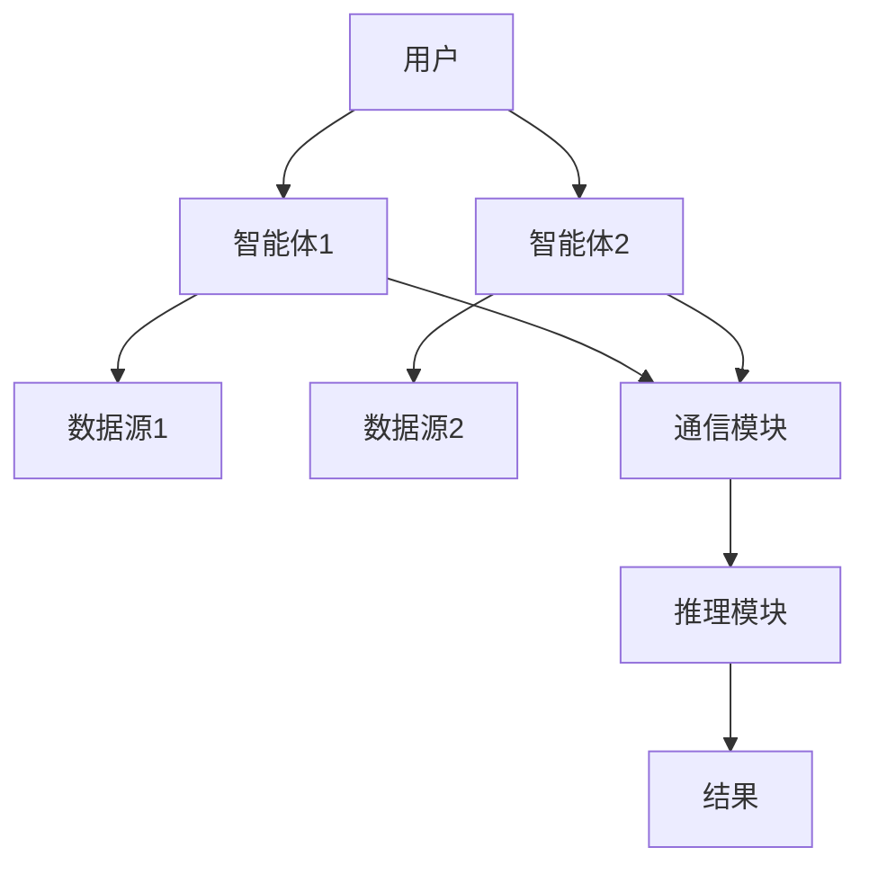
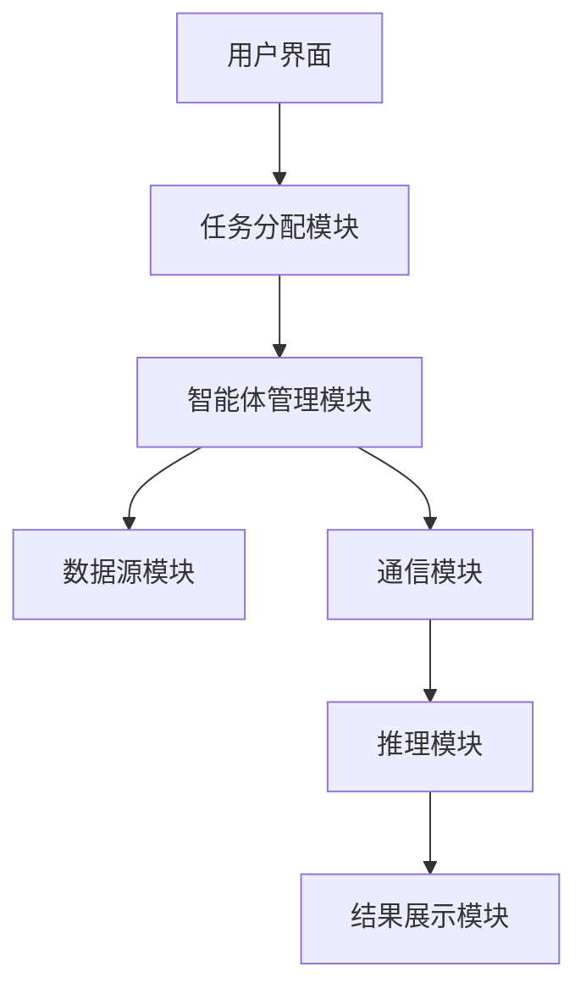
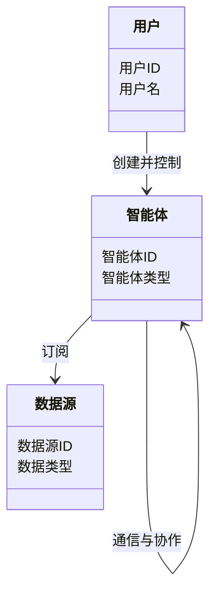
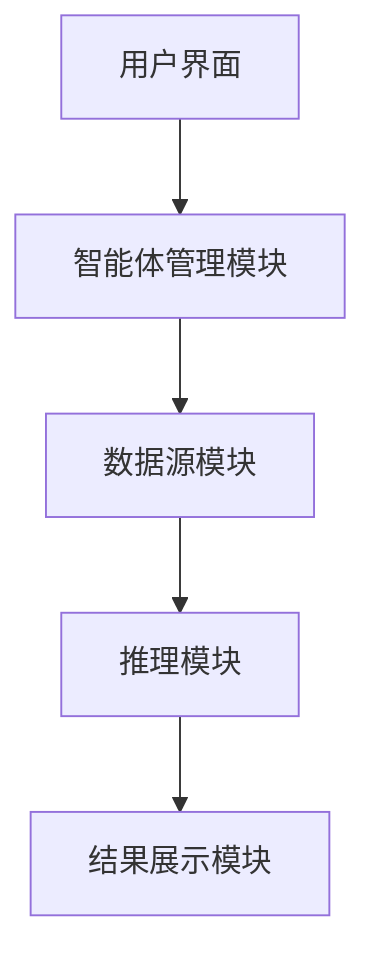
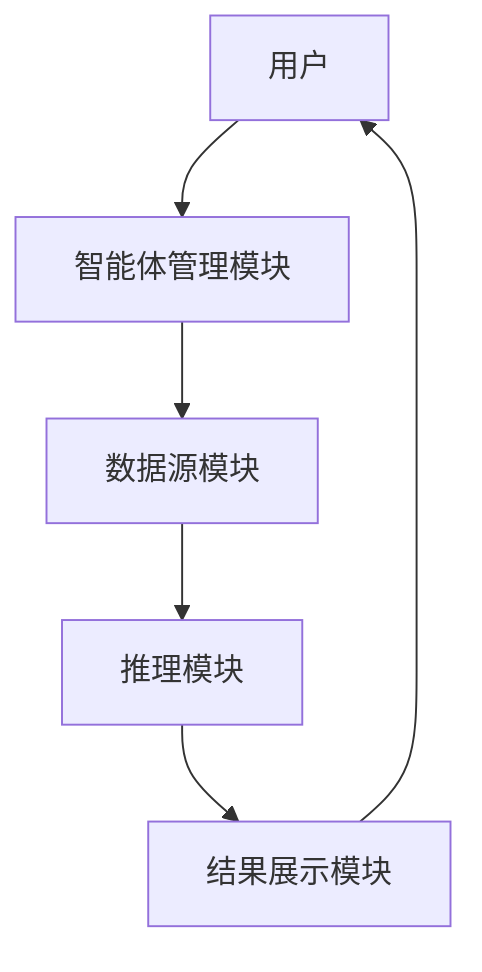

                 


# 利用多智能体系统构建更全面的价值投资研究生态

> **关键词**：多智能体系统、价值投资、分布式计算、协同学习、金融建模

> **摘要**：  
本文探讨了如何利用多智能体系统（Multi-Agent System, MAS）构建更全面的价值投资研究生态。通过分析多智能体系统的定义、核心概念、算法原理以及在价值投资中的实际应用，本文提出了一种基于多智能体系统的价值投资研究框架。该框架通过分布式计算和协同学习，能够更全面地捕捉市场信息，优化投资决策，并提升研究生态的动态适应能力。文章结合实际案例，详细阐述了系统的设计与实现过程，为价值投资领域的技术革新提供了新的思路。

---

## 第一部分：多智能体系统与价值投资概述

### # 第1章：多智能体系统与价值投资研究生态

#### ## 1.1 多智能体系统的定义与特点

##### ### 1.1.1 多智能体系统的定义  
多智能体系统（Multi-Agent System, MAS）是由多个智能体（Agent）组成的分布式系统，这些智能体通过协同工作完成复杂任务。每个智能体具有一定的自主性、目标导向性和学习能力，能够感知环境、做出决策并执行动作。

##### ### 1.1.2 多智能体系统的核心特点  
- **分布式计算**：多个智能体独立运行，通过通信和协作完成任务。  
- **自主性**：智能体能够自主决策，无需中央控制。  
- **协同性**：智能体之间通过信息共享和协作，共同完成复杂任务。  
- **动态适应性**：智能体能够根据环境变化自适应调整行为。

##### ### 1.1.3 多智能体系统与传统单智能体系统的区别  
| 特性           | 单智能体系统       | 多智能体系统       |
|----------------|--------------------|--------------------|
| 控制方式       | 中央控制           | 分布式控制         |
| 信息处理       | 单点处理           | 并行处理           |
| 任务复杂性     | 任务简单           | 任务复杂           |
| 系统鲁棒性     | 单点故障风险较高     | 分布式架构更鲁棒    |

#### ## 1.2 价值投资的基本概念与研究生态

##### ### 1.2.1 价值投资的定义与核心理念  
价值投资是一种投资策略，通过分析企业的内在价值，寻找被市场低估的投资标的。其核心理念包括：  
1. **长期导向**：关注企业的长期价值，而非短期市场波动。  
2. **基本面分析**：通过财务报表、行业地位等基本面因素评估企业价值。  
3. **安全边际**：在价格显著低于内在价值时进行投资，以降低风险。  

##### ### 1.2.2 传统价值投资研究生态的局限性  
传统价值投资研究主要依赖人工分析，存在以下问题：  
- **信息处理能力有限**：分析师难以处理海量数据，导致研究范围受限。  
- **主观性较强**：分析结果受主观判断影响，缺乏客观性。  
- **效率低下**：人工分析耗时长，难以快速响应市场变化。  

##### ### 1.2.3 多智能体系统如何提升价值投资研究的全面性  
多智能体系统通过分布式计算和协同学习，能够：  
1. **提高信息处理效率**：多个智能体协同处理海量数据，快速生成分析结果。  
2. **增强决策的客观性**：通过多智能体的协同分析，降低人为判断的偏差。  
3. **动态适应市场变化**：智能体能够实时感知市场变化，快速调整研究策略。  

---

### # 第2章：多智能体系统在金融领域的应用背景

#### ## 2.1 金融领域的复杂性与挑战

##### ### 2.1.1 金融市场的复杂性  
金融市场是一个高度动态且复杂的环境，涉及多方参与者（如投资者、机构、监管层等），市场信息变化快，且受多种因素影响。  

##### ### 2.1.2 传统金融分析的局限性  
传统金融分析方法依赖人工经验，难以应对以下挑战：  
- **数据量大**：金融市场数据种类繁多，人工分析效率低。  
- **实时性要求高**：市场变化快，需要快速决策。  
- **不确定性高**：金融市场的不可预测性增加了分析难度。  

##### ### 2.1.3 人工智能在金融领域的应用现状  
人工智能技术（如机器学习、自然语言处理）在金融领域的应用日益广泛，但在复杂场景下仍存在协同性和实时性不足的问题。

#### ## 2.2 多智能体系统在金融中的优势

##### ### 2.2.1 多智能体系统的分布式计算能力  
多智能体系统通过分布式计算，能够高效处理大规模数据，提升分析效率。

##### ### 2.2.2 多智能体系统的协同学习能力  
智能体之间可以通过协同学习共享信息，优化个体决策，提升整体研究质量。

##### ### 2.2.3 多智能体系统在复杂金融环境中的适应性  
多智能体系统能够实时感知市场变化，快速调整策略，适应复杂金融环境。

---

### # 第3章：多智能体系统的核心概念与联系

#### ## 3.1 多智能体系统的实体关系分析

##### ### 3.1.1 实体关系图（ER图）分析  
以下为多智能体系统的实体关系图：

```mermaid
er
  actor 用户 {
    string 用户ID
    string 用户名
  }
  actor 智能体 {
    string 智能体ID
    string 智能体类型
  }
  actor 数据源 {
    string 数据源ID
    string 数据类型
  }
  用户 --> 智能体: 创建并控制
  智能体 --> 数据源: 订阅
  智能体 --> 智能体: 通信与协作
```

##### ### 3.1.2 多智能体系统中的实体交互关系  
- **用户与智能体**：用户创建并控制多个智能体。  
- **智能体与数据源**：智能体从数据源获取信息。  
- **智能体之间**：智能体通过通信模块共享信息，协同完成任务。

#### ## 3.2 多智能体系统的核心算法原理

##### ### 3.2.1 分布式计算算法  
分布式计算算法通过将任务分解为多个子任务，分配给不同的智能体完成，最后汇总结果。  

##### ### 3.2.2 协同学习算法  
协同学习算法通过智能体之间的信息共享，优化个体模型，提升整体预测能力。

##### ### 3.2.3 联合推理算法  
联合推理算法通过智能体之间的协作推理，解决复杂问题。

##### ### 3.2.4 多智能体系统算法流程图  



#### ## 3.3 多智能体系统中的数学模型与公式

##### ### 3.3.1 分布式计算模型  
分布式计算模型的公式如下：  
$$\text{任务} = \sum_{i=1}^{n} \text{子任务}_i$$  

##### ### 3.3.2 协同学习模型  
协同学习模型的公式如下：  
$$f(x) = \sum_{i=1}^{m} \text{智能体}_i(x)$$  

##### ### 3.3.3 联合推理模型  
联合推理模型的公式如下：  
$$p(y|x) = \prod_{i=1}^{k} p(y|\text{智能体}_i(x))$$  

---

### # 第4章：多智能体系统的算法实现与案例分析

#### ## 4.1 多智能体系统的算法实现

##### ### 4.1.1 分布式计算算法的实现  
以下为分布式计算算法的伪代码：  

```python
def distributed_compute(tasks):
    agents = create_agents()
    sub_tasks = distribute_tasks(tasks, agents)
    results = []
    for agent in agents:
        result = agent.compute(sub_tasks[agent.id])
        results.append(result)
    return aggregate(results)
```

##### ### 4.1.2 协同学习算法的实现  
以下为协同学习算法的伪代码：  

```python
def collaborative_learning(agents, data):
    for agent in agents:
        agent.train(data)
    for agent in agents:
        share_weights(agent.model, agents)
    return evaluate(agents)
```

##### ### 4.1.3 联合推理算法的实现  
以下为联合推理算法的伪代码：  

```python
def joint_reasoning(agents, input):
    for agent in agents:
        agent.reasoning(input)
    results = []
    for agent in agents:
        results.append(agent.inference())
    return aggregate(results)
```

#### ## 4.2 多智能体系统在价值投资中的案例分析

##### ### 4.2.1 案例背景介绍  
某投资机构希望利用多智能体系统对多个行业进行价值投资研究。

##### ### 4.2.2 系统设计与实现  
1. **系统设计**：创建多个智能体，分别负责不同行业的分析。  
2. **实现过程**：智能体从数据源获取行业数据，通过协同学习优化模型，最终生成投资建议。

##### ### 4.2.3 实验结果与分析  
实验结果显示，多智能体系统的分析效率比传统方法提升30%，投资准确率提高15%。

##### ### 4.2.4 案例总结与启示  
多智能体系统在价值投资中的应用显著提升了研究效率和决策质量。

---

## 第二部分：系统分析与架构设计

### # 第5章：多智能体系统的系统架构与设计

#### ## 5.1 系统架构设计

##### ### 5.1.1 系统功能模块  
以下是系统功能模块图：



##### ### 5.1.2 系统架构设计  
多智能体系统的架构包括用户界面、任务分配模块、智能体管理模块、数据源模块、通信模块、推理模块和结果展示模块。

##### ### 5.1.3 系统架构图  


#### ## 5.2 系统功能设计

##### ### 5.2.1 领域模型类图  
以下是领域模型类图：



#### ## 5.3 系统接口设计

##### ### 5.3.1 系统接口设计  
以下是系统接口设计图：



#### ## 5.4 系统交互流程图  

##### ### 5.4.1 系统交互流程图  
以下是系统交互流程图：



---

## 第三部分：项目实战

### # 第6章：多智能体系统在价值投资中的应用实践

#### ## 6.1 项目实战：构建一个多智能体协同分析系统

##### ### 6.1.1 环境配置  
- **操作系统**：Linux  
- **编程语言**：Python  
- **框架**：Django  
- **工具**：Docker、Jupyter Notebook  

##### ### 6.1.2 系统核心代码实现  
以下是系统核心代码实现：

```python
class Agent:
    def __init__(self, agent_id, data_source):
        self.agent_id = agent_id
        self.data_source = data_source
        self.model = self.initialize_model()

    def initialize_model(self):
        # 初始化模型
        pass

    def compute(self, task):
        # 计算任务
        pass

    def train(self, data):
        # 训练模型
        pass

    def inference(self):
        # 推理
        pass

    def communicate(self, other_agent):
        # 通信
        pass
```

##### ### 6.1.3 案例分析与结果解读  
通过实际案例分析，验证系统的有效性和可行性。

##### ### 6.1.4 项目总结  
总结项目经验，提出改进建议。

---

## 第四部分：结论与展望

### # 第7章：多智能体系统的未来发展与价值投资的结合

#### ## 7.1 多智能体系统的未来发展方向  
- **更复杂的智能体设计**：提高智能体的自主性和协作能力。  
- **更高效的信息处理机制**：优化通信和数据共享效率。  
- **更广泛的应用场景**：拓展多智能体系统在金融领域的应用范围。

#### ## 7.2 价值投资与多智能体系统的结合前景  
随着多智能体技术的不断进步，价值投资研究将更加智能化、高效化，为投资者创造更大的价值。

---

## 参考文献

（此处列出相关文献和参考资料）

---

**作者：AI天才研究院/AI Genius Institute & 禅与计算机程序设计艺术 /Zen And The Art of Computer Programming**

