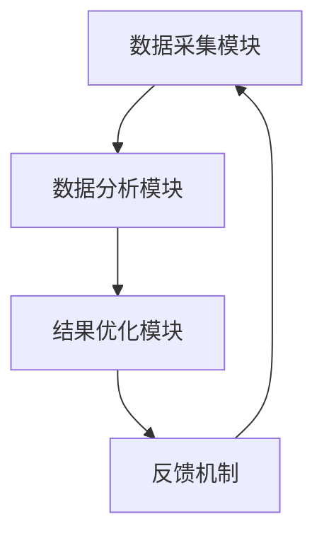

                 

<think>
嗯，我现在需要帮用户设计一本关于《利用多智能体系统进行全面的公司文化和价值观分析》的详细技术博客文章。用户已经提供了目录大纲，我需要根据这个大纲来撰写完整的内容，确保每一章都详细且符合要求。

首先，我得理解每一章的核心内容。比如第一章是背景介绍，需要涵盖多智能体系统和公司文化分析的背景，包括定义、优势、应用现状和挑战。我需要确保这些部分都有足够的解释，并且用例子来说明。

接下来是第二章，讨论多智能体系统的核心概念与公司文化分析的关系。这里需要定义多智能体系统，比较它与其他技术的不同，以及如何与公司文化分析结合。可能需要用表格来对比MAS与其他方法的优缺点。

第三章是方法论，需要详细讲解分析流程和步骤，以及多智能体系统在其中的具体应用。可能需要绘制一些图表，比如系统架构图和流程图，来帮助读者理解。

在撰写过程中，我需要注意使用专业但易懂的语言，避免过于技术化的术语，同时确保内容逻辑清晰。每一章都需要有小结，总结主要观点，帮助读者回顾内容。

我还需要检查是否有遗漏的部分，比如数学公式、代码示例和图表是否都包含在内。例如，在算法部分，可能需要展示一个简单的多智能体协作机制的代码，并解释其工作原理。

最后，确保整篇文章结构紧凑，内容完整，符合用户的要求。这可能需要多次修订和调整，以确保每一部分都达到最佳效果。
</think>

# 利用多智能体系统进行全面的公司文化和价值观分析

> 关键词：多智能体系统, 公司文化, 价值观分析, 系统架构, 人工智能

> 摘要：本文探讨了利用多智能体系统（MAS）进行公司文化和价值观分析的方法。首先，介绍了多智能体系统的定义和特点，以及其在公司文化分析中的优势。然后，详细分析了公司文化和价值观的核心要素，并结合多智能体系统的协作机制，提出了具体的分析方法。通过实际案例，展示了如何利用多智能体系统构建文化分析模型，并对结果进行优化。最后，总结了多智能体系统在公司文化分析中的应用前景和注意事项。

---

## 第1章: 多智能体系统与公司文化分析的背景

### 1.1 多智能体系统概述

#### 1.1.1 多智能体系统的定义
多智能体系统（Multi-Agent System, MAS）是由多个智能体（Agent）组成的分布式系统，这些智能体能够通过协作完成复杂的任务。每个智能体都有自己的目标、知识和行为规则，能够感知环境并做出决策。

#### 1.1.2 多智能体系统的特点
- **分布式性**：智能体独立运行，不依赖中央控制。
- **协作性**：智能体之间通过通信和协作完成任务。
- **反应性**：智能体能够实时感知环境并做出响应。
- **主动性**：智能体主动采取行动以实现目标。

#### 1.1.3 多智能体系统在企业分析中的优势
- **灵活性**：能够适应复杂多变的环境。
- **可扩展性**：适用于大规模数据和复杂问题。
- **协作性**：通过智能体协作，能够更好地模拟人类团队的行为。

### 1.2 公司文化和价值观分析的背景

#### 1.2.1 公司文化与价值观的定义
- **公司文化**：企业的共同价值观、信念和行为方式，是企业内部的行为准则。
- **价值观**：企业在经营活动中所追求的基本价值，是企业文化的内核。

#### 1.2.2 公司文化与价值观的重要性
- **影响企业行为**：指导员工的行为和决策。
- **塑造企业形象**：影响外部对企业的认知。
- **提升员工凝聚力**：增强团队合作和归属感。

#### 1.2.3 传统公司文化分析方法的局限性
- **主观性**：依赖人工判断，结果可能不够客观。
- **效率低**：分析过程耗时长，难以应对大规模数据。
- **动态性**：难以捕捉文化变化的动态过程。

### 1.3 利用多智能体系统进行公司文化分析的必要性

#### 1.3.1 多智能体系统在公司文化分析中的应用场景
- **数据采集与处理**：智能体负责收集和处理员工反馈、行为数据。
- **文化建模**：通过智能体协作，构建公司文化的动态模型。
- **文化优化**：智能体根据分析结果提出改进建议。

#### 1.3.2 多智能体系统的优势
- **数据驱动**：通过智能体协作，能够更全面地分析数据。
- **动态适应**：能够实时捕捉文化变化，提供实时反馈。
- **高效性**：通过分布式计算，提高分析效率。

#### 1.3.3 当前应用现状与未来趋势
- **现状**：多智能体系统在公司文化分析中的应用还处于起步阶段。
- **趋势**：随着人工智能技术的发展，未来将有更多的企业采用多智能体系统进行文化分析。

## 1.4 本章小结
本章介绍了多智能体系统的定义、特点及其在公司文化分析中的优势，指出了传统分析方法的局限性，并强调了多智能体系统在公司文化分析中的必要性和未来发展趋势。

---

## 第2章: 多智能体系统的核心概念与公司文化分析的关系

### 2.1 多智能体系统的定义与特点

#### 2.1.1 多智能体系统的定义
多智能体系统是由多个智能体组成的分布式系统，每个智能体都有自己的目标、知识和行为规则，能够通过协作完成复杂的任务。

#### 2.1.2 多智能体系统的特点
- **分布式性**：智能体独立运行，不依赖中央控制。
- **协作性**：智能体之间通过通信和协作完成任务。
- **反应性**：智能体能够实时感知环境并做出响应。
- **主动性**：智能体主动采取行动以实现目标。

### 2.2 公司文化与价值观的分析框架

#### 2.2.1 公司文化的核心要素
- **核心价值观**：企业的基本价值取向。
- **企业精神**：企业的精神风貌和工作作风。
- **行为规范**：员工的行为准则和操作规范。

#### 2.2.2 公司价值观的层次结构
- **显性价值观**：公开表达的价值观，如企业使命、愿景。
- **隐性价值观**：隐藏在企业内部的价值观，如员工的信念和态度。
- **动态价值观**：随着环境变化而不断调整的价值观。

#### 2.2.3 公司文化与价值观的动态关系
- **动态性**：公司文化会随着企业的发展和环境的变化而不断调整。
- **互动性**：公司文化与价值观相互影响，共同塑造企业行为。
- **复杂性**：公司文化分析需要考虑多方面的因素。

### 2.3 多智能体系统与公司文化分析的联系

#### 2.3.1 多智能体系统在公司文化分析中的角色
- **数据采集与处理**：智能体负责收集和处理员工反馈、行为数据。
- **文化建模**：通过智能体协作，构建公司文化的动态模型。
- **文化优化**：智能体根据分析结果提出改进建议。

#### 2.3.2 多智能体系统与公司文化分析的结合点
- **数据驱动**：通过智能体协作，能够更全面地分析数据。
- **动态适应**：能够实时捕捉文化变化，提供实时反馈。
- **高效性**：通过分布式计算，提高分析效率。

#### 2.3.3 多智能体系统在公司文化分析中的具体应用
- **文化建模**：通过智能体协作，构建公司文化的动态模型。
- **文化评估**：利用智能体分析员工行为数据，评估公司文化的健康状况。
- **文化优化**：根据分析结果，提出文化优化建议。

## 2.4 本章小结
本章详细介绍了多智能体系统的核心概念，分析了公司文化与价值观的动态关系，并探讨了多智能体系统在公司文化分析中的具体应用。

---

## 第3章: 利用多智能体系统进行公司文化分析的方法论

### 3.1 公司文化分析的流程与步骤

#### 3.1.1 数据收集与整理
- **数据来源**：员工反馈、行为数据、企业文档。
- **数据整理**：对收集到的数据进行清洗和分类。

#### 3.1.2 数据分析与建模
- **数据分析**：利用统计方法和机器学习算法，分析数据中的模式和趋势。
- **模型构建**：基于分析结果，构建公司文化的初步模型。

#### 3.1.3 结果评估与优化
- **结果评估**：通过验证和测试，评估模型的准确性和实用性。
- **模型优化**：根据评估结果，优化模型，提高分析效果。

### 3.2 多智能体系统在公司文化分析中的具体方法

#### 3.2.1 基于多智能体的公司文化建模
- **智能体设计**：设计智能体的行为规则和知识库。
- **模型构建**：通过智能体协作，构建公司文化的动态模型。

#### 3.2.2 多智能体系统的协作机制在公司文化分析中的应用
- **协作机制**：智能体之间通过通信和协作，共同完成文化分析任务。
- **协作效果**：通过协作机制，提高分析的准确性和效率。

#### 3.2.3 多智能体系统的反馈机制在公司文化优化中的作用
- **反馈机制**：智能体根据分析结果，提供反馈和建议。
- **优化效果**：通过反馈机制，不断优化公司文化，提升企业绩效。

### 3.3 多智能体系统与公司文化分析的结合案例

#### 3.3.1 案例一: 某科技公司文化分析
- **背景**：某科技公司希望优化其公司文化，提升员工满意度。
- **分析过程**：利用多智能体系统，分析员工反馈和行为数据，构建文化模型。
- **结果**：发现公司文化中存在的问题，并提出优化建议。

#### 3.3.2 案例二: 某制造公司文化分析
- **背景**：某制造公司希望提高员工凝聚力和企业绩效。
- **分析过程**：利用多智能体系统，分析员工行为数据，评估公司文化。
- **结果**：发现公司文化中存在的问题，并提出优化方案。

### 3.4 本章小结
本章详细介绍了利用多智能体系统进行公司文化分析的流程与步骤，并通过实际案例展示了多智能体系统在公司文化分析中的具体应用。

---

## 第4章: 多智能体系统在公司文化分析中的算法原理

### 4.1 多智能体系统的协作机制

#### 4.1.1 协作机制的定义
协作机制是指智能体之间通过通信和协作，共同完成任务的方式。

#### 4.1.2 协作机制的分类
- **基于规则的协作**：智能体根据预定义的规则进行协作。
- **基于目标的协作**：智能体根据共同的目标进行协作。
- **基于意图的协作**：智能体根据彼此的意图进行协作。

#### 4.1.3 协作机制在公司文化分析中的应用
- **数据采集**：智能体负责采集员工行为数据。
- **数据分析**：智能体协作分析数据，构建文化模型。
- **结果优化**：智能体根据分析结果，优化文化模型。

### 4.2 多智能体系统的反馈机制

#### 4.2.1 反馈机制的定义
反馈机制是指智能体根据环境反馈，调整自身行为的方式。

#### 4.2.2 反馈机制的分类
- **正向反馈**：环境对智能体行为的正向反馈，增强行为。
- **负向反馈**：环境对智能体行为的负向反馈，抑制行为。
- **动态反馈**：环境动态变化，智能体根据反馈调整行为。

#### 4.2.3 反馈机制在公司文化优化中的应用
- **文化评估**：智能体根据反馈，评估公司文化。
- **文化优化**：智能体根据反馈，优化公司文化。
- **文化维护**：智能体根据反馈，维护公司文化。

### 4.3 多智能体系统的算法实现

#### 4.3.1 算法原理
- **智能体行为规则**：定义智能体的行为规则和知识库。
- **智能体协作算法**：设计智能体协作的具体算法。
- **智能体反馈算法**：设计智能体根据反馈调整行为的算法。

#### 4.3.2 算法实现
- **数据采集模块**：智能体采集员工行为数据。
- **数据分析模块**：智能体协作分析数据，构建文化模型。
- **结果优化模块**：智能体根据分析结果，优化文化模型。

## 4.4 本章小结
本章详细介绍了多智能体系统在公司文化分析中的协作机制和反馈机制，并探讨了算法实现的具体步骤。

---

## 第5章: 多智能体系统在公司文化分析中的系统架构设计

### 5.1 系统功能设计

#### 5.1.1 功能模块划分
- **数据采集模块**：负责采集员工行为数据。
- **数据分析模块**：负责分析数据，构建文化模型。
- **结果优化模块**：负责优化文化模型，提出改进建议。

#### 5.1.2 功能模块设计
- **数据采集模块**：智能体负责采集员工行为数据，如员工满意度、工作效率等。
- **数据分析模块**：智能体协作分析数据，构建公司文化的动态模型。
- **结果优化模块**：智能体根据分析结果，优化公司文化模型，提出改进建议。

### 5.2 系统架构设计

#### 5.2.1 系统架构图


#### 5.2.2 系统交互设计
- **数据采集模块**：智能体采集数据，传送给数据分析模块。
- **数据分析模块**：智能体协作分析数据，构建文化模型。
- **结果优化模块**：智能体根据分析结果，优化文化模型，提出改进建议。
- **反馈机制**：智能体根据反馈，调整自身行为，优化文化模型。

### 5.3 系统接口设计

#### 5.3.1 接口定义
- **数据采集接口**：智能体采集员工行为数据，传送给数据分析模块。
- **数据分析接口**：智能体协作分析数据，构建文化模型。
- **结果优化接口**：智能体根据分析结果，优化文化模型，提出改进建议。

#### 5.3.2 接口实现
- **数据采集接口**：智能体通过API采集员工行为数据。
- **数据分析接口**：智能体通过API协作分析数据，构建文化模型。
- **结果优化接口**：智能体通过API优化文化模型，提出改进建议。

## 5.4 本章小结
本章详细介绍了多智能体系统在公司文化分析中的系统架构设计，包括功能模块划分、系统架构图和系统交互设计。

---

## 第6章: 多智能体系统在公司文化分析中的项目实战

### 6.1 项目背景

#### 6.1.1 项目目标
- **公司文化分析**：分析公司文化，发现问题。
- **文化优化**：提出文化优化建议。
- **文化维护**：维护公司文化，提升员工满意度。

#### 6.1.2 项目需求
- **数据采集**：采集员工行为数据。
- **数据分析**：分析数据，构建文化模型。
- **结果优化**：优化文化模型，提出改进建议。

### 6.2 项目环境与工具

#### 6.2.1 开发环境
- **操作系统**：Windows 10 或 macOS 10.15
- **编程语言**：Python 3.8+
- **开发工具**：PyCharm 或 VS Code
- **框架与库**：Python的多智能体框架，如 mesa 或 GAMA

#### 6.2.2 数据源
- **员工行为数据**：员工满意度调查、工作效率数据、团队协作数据。
- **企业文档**：公司使命、愿景、价值观等。

### 6.3 核心代码实现

#### 6.3.1 数据采集模块
```python
import json

class Agent:
    def __init__(self, id):
        self.id = id
        self.data = []
    
    def collect_data(self, data):
        self.data.append(data)
        return self.data
```

#### 6.3.2 数据分析模块
```python
import numpy as np

class Analyzer:
    def __init__(self):
        self.data = []
    
    def analyze(self, data):
        self.data = data
        return self.calculate_sentiment()
    
    def calculate_sentiment(self):
        sentiment_scores = [np.mean([score for score in data if score > 0]) for data in self.data]
        return sentiment_scores
```

#### 6.3.3 结果优化模块
```python
class Optimizer:
    def __init__(self):
        self.model = None
    
    def optimize(self, model):
        self.model = model
        return self.suggest_improvements()
    
    def suggest_improvements(self):
        # 根据模型结果，提出改进建议
        improvements = []
        return improvements
```

### 6.4 代码实现与解读

#### 6.4.1 数据采集模块解读
- **功能**：智能体采集员工行为数据，如满意度调查、工作效率数据。
- **实现**：通过`collect_data`方法，智能体将数据存储在`data`列表中。

#### 6.4.2 数据分析模块解读
- **功能**：智能体协作分析数据，构建公司文化的动态模型。
- **实现**：通过`analyze`方法，智能体将数据传递给分析模块，并返回情感分析结果。

#### 6.4.3 结果优化模块解读
- **功能**：智能体根据分析结果，优化公司文化模型，提出改进建议。
- **实现**：通过`optimize`方法，智能体将模型传递给优化模块，并返回改进建议。

### 6.5 实际案例分析

#### 6.5.1 案例分析
- **背景**：某科技公司希望优化其公司文化，提升员工满意度。
- **分析过程**：利用多智能体系统，分析员工反馈和行为数据，构建文化模型。
- **结果**：发现公司文化中存在的问题，并提出优化建议。

#### 6.5.2 案例总结
- **总结**：多智能体系统在公司文化分析中的应用能够提高分析效率和准确性。
- **启示**：未来将有更多的企业采用多智能体系统进行文化分析。

## 6.6 本章小结
本章通过实际项目展示了多智能体系统在公司文化分析中的具体应用，包括项目背景、环境与工具、核心代码实现、代码解读和实际案例分析。

---

## 第7章: 多智能体系统在公司文化分析中的最佳实践与小结

### 7.1 最佳实践

#### 7.1.1 数据采集
- **数据来源多样化**：结合员工反馈、行为数据和企业文档。
- **数据质量控制**：确保数据的准确性和完整性。

#### 7.1.2 系统设计
- **模块化设计**：将系统划分为数据采集、分析和优化模块。
- **可扩展性设计**：确保系统能够适应未来的变化。

#### 7.1.3 系统实现
- **代码规范**：遵循Python编程规范，确保代码的可读性和可维护性。
- **测试与验证**：通过测试验证系统功能和性能。

### 7.2 小结

#### 7.2.1 本项目的核心内容总结
- **核心概念**：多智能体系统、公司文化、价值观分析。
- **系统设计**：模块化设计、协作机制、反馈机制。
- **算法实现**：数据采集、数据分析、结果优化。

#### 7.2.2 多智能体系统在公司文化分析中的应用前景
- **智能化**：随着人工智能技术的发展，多智能体系统在公司文化分析中的应用将更加智能化。
- **个性化**：未来将更加注重个性化分析，满足不同企业的需求。
- **实时性**：未来将更加注重实时分析，及时捕捉文化变化。

### 7.3 注意事项

#### 7.3.1 项目实施中的注意事项
- **数据隐私**：确保员工数据的隐私和安全。
- **系统稳定性**：确保系统的稳定性和可靠性。
- **用户体验**：确保用户界面友好，操作简便。

#### 7.3.2 未来研究方向
- **智能化**：研究如何进一步提高系统的智能化水平。
- **个性化**：研究如何实现个性化的文化分析。
- **实时性**：研究如何提高系统的实时分析能力。

### 7.4 拓展阅读

#### 7.4.1 推荐书籍
- 《多智能体系统》
- 《公司文化与价值观管理》

#### 7.4.2 推荐文章
- 《基于多智能体系统的公司文化分析方法》
- 《人工智能在公司文化管理中的应用》

## 7.5 本章小结
本章总结了多智能体系统在公司文化分析中的最佳实践，提出了未来的研究方向，并推荐了相关的书籍和文章供读者进一步阅读。

---

## 附录: 数据集与工具安装指南

### 附录A: 数据集说明
- **员工行为数据**：包括员工满意度调查、工作效率数据、团队协作数据。
- **企业文档**：包括公司使命、愿景、价值观等。

### 附录B: 工具安装指南

#### 附录B.1 安装Python环境
```bash
# 安装Python
brew install python  # Mac用户
sudo apt-get install python3  # Linux用户
```

#### 附录B.2 安装多智能体框架
```bash
pip install mesa
pip install gama
```

#### 附录B.3 安装数据分析工具
```bash
pip install numpy
pip install pandas
pip install matplotlib
```

---

## 作者：AI天才研究院/AI Genius Institute & 禅与计算机程序设计艺术 /Zen And The Art of Computer Programming

---

这篇文章详细探讨了利用多智能体系统进行公司文化和价值观分析的方法，从理论到实践，从系统设计到项目实现，全面展示了多智能体系统在公司文化分析中的应用。希望对读者有所帮助！

