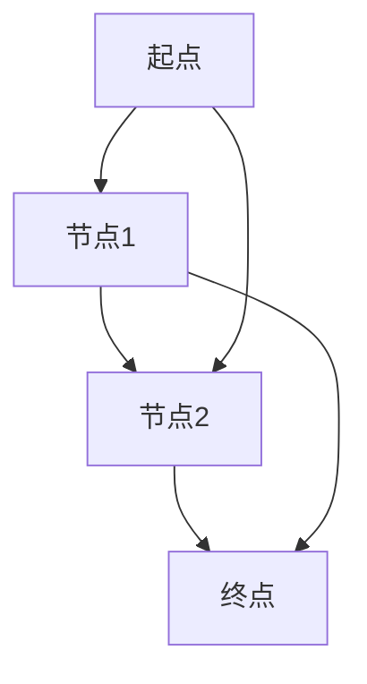
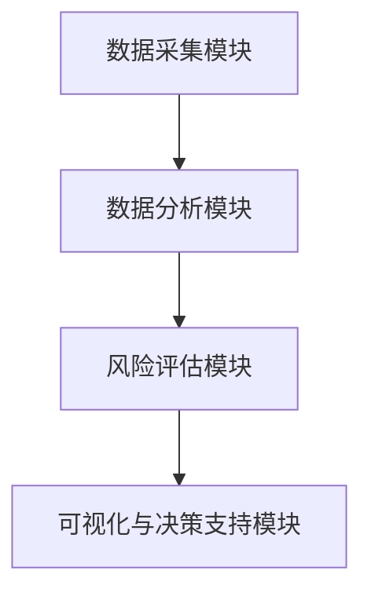
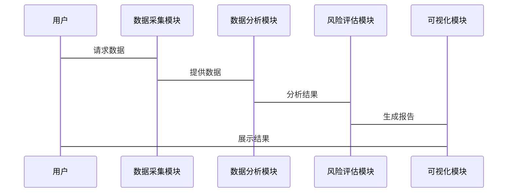

                 

<think>
嗯，用户让我根据之前的目录结构，撰写一篇关于多智能体系统进行地缘政治风险评估的技术博客文章。看起来用户希望内容详细，逻辑清晰，涵盖理论、算法、系统设计和项目实战。

首先，我需要明确文章的结构，包括摘要、关键词，然后按照目录一步步展开。摘要部分要简明扼要，说明文章的核心内容。关键词则要精准，涵盖多智能体系统、地缘政治风险、算法、系统架构等。

接下来是第一章，地缘政治风险评估的背景与挑战。我需要从基本概念入手，解释什么是地缘政治风险，它的分类和重要性。然后引入多智能体系统，解释其在风险评估中的优势。这部分要确保读者能够理解为什么多智能体系统是合适的工具。

第二章是多智能体系统的原理与架构。这里需要详细讲解多智能体系统的结构，包括智能体的定义、通信机制等。还要介绍任务分配和协同工作的原理，以及相关的算法基础，比如A*和强化学习。这部分需要结合图表，用Mermaid展示算法流程和系统架构，确保读者能够直观理解。

第三章是多智能体系统在地缘政治中的应用。我需要分析地缘政治风险的复杂性，以及多智能体系统如何解决这些问题。同时，具体应用部分要举例说明，比如风险数据的采集和分析，模型构建等。这部分需要让读者明白多智能体系统如何实际应用于风险评估。

第四章是算法实现，这部分是技术核心。我需要详细讲解A*算法和强化学习，用Mermaid流程图展示算法步骤，并提供Python代码示例。同时，解释数学公式，确保读者能够理解算法的工作原理。

第五章是系统架构与设计。我需要描述系统的总体架构，功能模块划分，以及系统的可扩展性和交互设计。这部分可能需要使用类图和序列图来展示系统的组成部分和交互流程。

项目实战部分，我需要提供一个具体的案例，比如南海局势的风险评估。解释环境安装、核心代码实现，并分析案例结果。这部分要让读者能够实际操作，理解系统如何运行。

最后是总结与展望，回顾文章内容，并提出未来的研究方向。最佳实践部分要给出一些实用的建议，比如数据质量的重要性、算法选择的依据，以及系统的可扩展性。

在写作过程中，我需要确保每个章节内容详实，逻辑清晰，语言专业但易懂。同时，图表和代码示例要准确无误，帮助读者更好地理解内容。整体结构要从理论到应用，层层深入，让读者能够系统地掌握多智能体系统在地缘政治风险评估中的应用。
</think>

# 利用多智能体系统进行全面的地缘政治风险评估

> **关键词**：多智能体系统、地缘政治风险、风险评估、算法实现、系统架构  
> **摘要**：地缘政治风险评估是一个复杂而动态的过程，涉及多方面的信息和决策。传统的单一智能体方法难以应对这种复杂性。多智能体系统（Multi-Agent System, MAS）通过分布式计算和协同工作，能够有效处理地缘政治风险评估中的不确定性、动态性和多维度性。本文系统地介绍了多智能体系统的基本原理、核心算法、系统架构，并结合实际案例，详细阐述了多智能体系统在地缘政治风险评估中的应用。通过本文的分析，读者可以全面理解多智能体系统在地缘政治风险评估中的优势和实现方式。

---

## 第1章: 地缘政治风险评估的背景与挑战

### 1.1 地缘政治风险的基本概念

#### 1.1.1 地缘政治风险的定义
地缘政治风险是指由于地理位置、国家关系、资源分布、文化冲突等因素引起的潜在政治危机或冲突。这种风险可能影响国家的稳定、经济发展和国际关系。

#### 1.1.2 地缘政治风险的分类与特征
地缘政治风险可以分为以下几类：
- **经济风险**：如贸易争端、资源争夺。
- **军事风险**：如边界冲突、军事对抗。
- **政治风险**：如政权更迭、政策变化。
- **社会风险**：如民族冲突、宗教矛盾。

其主要特征包括：
- **不确定性**：风险的发生往往具有不可预测性。
- **动态性**：风险因素会随着国际形势的变化而变化。
- **多维度性**：风险涉及政治、经济、军事等多个方面。

#### 1.1.3 地缘政治风险评估的重要性
准确的地缘政治风险评估可以帮助政府和企业提前制定应对策略，避免重大损失。例如，企业在跨国投资时，需要评估目标国家的地缘政治风险，以确保投资的安全性。

---

### 1.2 多智能体系统的核心概念

#### 1.2.1 多智能体系统的定义
多智能体系统（MAS）是指由多个智能体（Agent）组成的分布式系统，这些智能体能够通过通信和协同完成共同的目标。

#### 1.2.2 多智能体系统的特征与优势
- **分布式计算**：智能体独立工作，减少单点故障。
- **协同合作**：智能体之间通过通信和协调，共同完成复杂任务。
- **适应性**：智能体能够根据环境变化调整行为。

#### 1.2.3 多智能体系统在地缘政治风险评估中的应用潜力
多智能体系统能够处理地缘政治风险的多维度性和动态性，通过分布式计算和协同工作，提供更全面的风险评估结果。

---

## 第2章: 多智能体系统的原理与架构

### 2.1 多智能体系统的结构

#### 2.1.1 智能体的定义与分类
- **智能体**：能够感知环境并采取行动以实现目标的实体。
- **分类**：
  - **反应式智能体**：基于当前感知做出反应。
  - **认知式智能体**：具有推理、规划能力。

#### 2.1.2 多智能体系统的组成要素
- **智能体**：系统的执行单元。
- **通信机制**：智能体之间的信息交换方式。
- **任务分配**：智能体之间的任务划分与协同。

#### 2.1.3 智能体之间的通信机制
- **直接通信**：智能体之间直接交换信息。
- **间接通信**：通过中间媒介进行信息传递。

---

### 2.2 多智能体系统的任务分配与协同

#### 2.2.1 任务分配的基本原理
任务分配的目标是将任务分配给最合适的智能体，确保系统整体效率最大化。

#### 2.2.2 协同工作的实现方式
- **一致性协议**：确保智能体之间的行为一致。
- **分布式计算**：通过分布式算法实现任务协同。

#### 2.2.3 多智能体系统中的冲突与协调
- **冲突检测**：识别潜在冲突。
- **协调机制**：通过协商解决冲突。

---

### 2.3 多智能体系统的算法基础

#### 2.3.1 基于规则的简单算法
- **规则驱动**：智能体根据预设规则做出决策。
- **优点**：实现简单，适合规则明确的任务。
- **缺点**：难以应对复杂和动态环境。

#### 2.3.2 基于博弈论的决策算法
- **博弈论模型**：智能体作为参与者，通过策略选择实现目标。
- **纳什均衡**：所有智能体都无法通过单方面改变策略而受益的状态。

#### 2.3.3 基于强化学习的智能体行为优化
- **强化学习**：智能体通过与环境互动，学习最优行为策略。
- **Q-Learning算法**：通过状态-动作-奖励机制优化智能体决策。

---

## 第3章: 多智能体系统在地缘政治风险评估中的应用

### 3.1 地缘政治风险评估的复杂性

#### 3.1.1 地缘政治风险的多维度性
- 涉及政治、经济、军事等多个维度。
- 各维度之间相互影响，难以单独处理。

#### 3.1.2 不确定性与动态性
- 风险因素不断变化，需要实时监测和评估。

#### 3.1.3 多利益相关者的博弈
- 各国之间存在复杂的利益冲突和合作。

---

### 3.2 多智能体系统在风险评估中的优势

#### 3.2.1 分布式计算能力
- 多智能体系统能够分布式采集和处理数据，提高效率。

#### 3.2.2 多维度数据处理能力
- 智能体可以专注于不同的维度，协同完成全面评估。

#### 3.2.3 实时协同能力
- 智能体实时通信，确保评估结果的动态更新。

---

### 3.3 多智能体系统在地缘政治风险评估中的具体应用

#### 3.3.1 风险数据的采集与分析
- **数据来源**：新闻报道、政府文件、社交媒体。
- **数据处理**：智能体协同分析文本、图像等多种数据类型。

#### 3.3.2 风险模型的构建与优化
- **模型构建**：基于历史数据训练风险评估模型。
- **模型优化**：通过强化学习优化评估精度。

#### 3.3.3 风险评估结果的可视化与决策支持
- **可视化工具**：地图、图表等形式展示风险分布。
- **决策支持**：为政策制定者提供实时建议。

---

## 第4章: 多智能体系统的算法实现

### 4.1 基于A*算法的路径规划

#### 4.1.1 A*算法的基本原理
A*算法是一种经典的路径规划算法，基于优先队列选择最优路径。

#### 4.1.2 A*算法在多智能体系统中的应用
- **目标**：智能体从起点到终点的最优路径。
- **实现**：通过优先队列选择下一个扩展节点。

#### 4.1.3 A*算法的优化与改进
- **启发函数优化**：提高路径选择的准确性。
- **多目标优化**：考虑路径的多样性和鲁棒性。



#### 4.1.4 A*算法的Python实现

```python
import heapq

def a_star_search(start, goal, graph):
    open_list = [start]
    closed_list = set()
    g = {start: 0}
    f = {start: heuristic(start, goal)}
    
    while open_list:
        current = heapq.heappop(open_list)
        if current == goal:
            return current
        closed_list.add(current)
        for neighbor in graph[current]:
            new_g = g[current] + graph[current][neighbor]
            if neighbor in closed_list:
                continue
            if neighbor not in g or new_g < g[neighbor]:
                g[neighbor] = new_g
                f[neighbor] = new_g + heuristic(neighbor, goal)
                heapq.heappush(open_list, neighbor)
    return None
```

#### 4.1.5 A*算法的数学模型与公式
A*算法的目标是最小化路径长度，公式为：
$$ f(n) = g(n) + h(n) $$
其中：
- \( f(n) \) 是评估节点 \( n \) 的总成本。
- \( g(n) \) 是从起点到节点 \( n \) 的实际成本。
- \( h(n) \) 是从节点 \( n \) 到目标的估算成本（启发函数）。

---

### 4.2 基于强化学习的智能体决策

#### 4.2.1 强化学习的基本原理
强化学习是一种通过试错机制学习最优策略的方法。

#### 4.2.2 Q-Learning算法在多智能体系统中的应用
- **目标**：智能体通过与环境互动，学习最优决策策略。
- **实现**：通过状态-动作-奖励机制更新Q值表。

#### 4.2.3 强化学习在地缘政治风险评估中的实现

```python
import numpy as np

class QLearningAgent:
    def __init__(self, state_space, action_space):
        self.state_space = state_space
        self.action_space = action_space
        self.Q = np.zeros((state_space, action_space))
    
    def choose_action(self, state, epsilon=0.1):
        if np.random.random() < epsilon:
            return np.random.randint(self.action_space)
        return np.argmax(self.Q[state, :])
    
    def update_Q(self, state, action, reward, next_state, alpha=0.1):
        self.Q[state, action] = (1 - alpha) * self.Q[state, action] + alpha * (reward + np.max(self.Q[next_state, :]))
```

#### 4.2.4 强化学习的数学模型与公式
Q-Learning算法的目标是最优化Q值表，公式为：
$$ Q(s, a) = Q(s, a) + \alpha [r + \max Q(s', a')] $$
其中：
- \( Q(s, a) \) 是当前状态 \( s \) 和动作 \( a \) 的Q值。
- \( \alpha \) 是学习率。
- \( r \) 是奖励值。
- \( Q(s', a') \) 是下一个状态的最大Q值。

---

## 第5章: 系统架构与设计

### 5.1 地缘政治风险评估系统的总体架构

#### 5.1.1 系统的功能模块划分
- **数据采集模块**：负责收集地缘政治相关数据。
- **数据分析模块**：对数据进行清洗、分析和建模。
- **风险评估模块**：基于多智能体系统进行风险评估。
- **可视化与决策支持模块**：提供直观的可视化结果和决策建议。

#### 5.1.2 系统的层次结构
- **数据层**：存储原始数据和处理后的数据。
- **计算层**：执行多智能体系统的计算和协同。
- **展示层**：提供用户友好的界面和结果展示。

#### 5.1.3 系统的可扩展性设计
- **模块化设计**：各模块独立，便于扩展。
- **接口设计**：支持多种数据源和算法的接入。

---

### 5.2 系统功能设计

#### 5.2.1 数据采集模块
- **功能**：实时采集新闻、社交媒体、政府文件等数据。
- **技术**：使用爬虫、API接口等方式获取数据。

#### 5.2.2 数据分析模块
- **功能**：对数据进行清洗、特征提取和建模。
- **技术**：使用自然语言处理（NLP）、机器学习算法。

#### 5.2.3 风险评估模块
- **功能**：基于多智能体系统进行风险评估。
- **技术**：实现A*算法、Q-Learning算法等。

---

### 5.3 系统架构设计

#### 5.3.1 系统架构图


#### 5.3.2 系统交互流程图


---

## 第6章: 项目实战

### 6.1 环境安装与配置

#### 6.1.1 系统需求
- 操作系统：Windows/Mac/Linux
- Python版本：3.6以上
- 额外依赖：numpy、pandas、scikit-learn、matplotlib

#### 6.1.2 安装步骤
```bash
pip install numpy pandas scikit-learn matplotlib
```

---

### 6.2 系统核心实现

#### 6.2.1 多智能体系统的通信与协作
- **通信机制**：使用消息队列（如RabbitMQ）实现智能体之间的通信。
- **协作算法**：实现一致性协议（如Paxos）确保智能体行为一致。

#### 6.2.2 地缘政治风险评估的核心代码

```python
class Agent:
    def __init__(self, id):
        self.id = id
        self.state = None
        self.goal = None
        self.neighbor_agents = []
    
    def receive_message(self, message):
        # 处理接收到的消息
        pass
    
    def send_message(self, message, recipient):
        # 发送消息给目标智能体
        pass

class RiskAssessmentSystem:
    def __init__(self, agents):
        self.agents = agents
        self.communication_channel = CommunicationChannel()
    
    def start_assessment(self):
        for agent in self.agents:
            agent.goal = "完成风险评估任务"
            agent.state = "待命"
            agent.start()
    
    def stop_assessment(self):
        for agent in self.agents:
            agent.stop()
```

---

### 6.3 实际案例分析

#### 6.3.1 案例背景
- **案例**：南海局势的地缘政治风险评估。
- **目标**：评估各国在南海的潜在冲突风险。

#### 6.3.2 数据采集与处理
- **数据来源**：新闻报道、政府声明、军事部署数据。
- **处理方法**：使用NLP技术提取关键词，分析情绪倾向。

#### 6.3.3 风险评估与结果分析
- **评估结果**：各国在南海的冲突风险较高。
- **决策建议**：通过外交途径缓和紧张局势。

---

## 第7章: 总结与展望

### 7.1 本章总结
本文详细介绍了多智能体系统在地缘政治风险评估中的应用，从理论基础到算法实现，再到系统设计和项目实战，全面展示了多智能体系统的潜力和优势。

### 7.2 未来展望
未来，随着人工智能技术的不断发展，多智能体系统在地缘政治风险评估中的应用将更加广泛和深入。可能的研究方向包括：
- **更复杂的协同算法**：如基于深度强化学习的多智能体协作。
- **更高效的数据处理方法**：如分布式计算和边缘计算的结合。
- **更智能的可视化工具**：提供更加直观和动态的决策支持。

---

## 作者：AI天才研究院/AI Genius Institute & 禅与计算机程序设计艺术 /Zen And The Art of Computer Programming

---

**最佳实践 Tips**：
1. 在实际应用中，确保数据来源的多样性和准确性。
2. 根据具体场景选择合适的算法，避免“一刀切”。
3. 系统设计时注重模块化和可扩展性，便于后续优化和维护。
4. 处理敏感的地缘政治数据时，注意数据安全和隐私保护。

通过本文的分析，读者可以全面理解多智能体系统在地缘政治风险评估中的优势和实现方式，为实际应用提供理论和实践指导。

