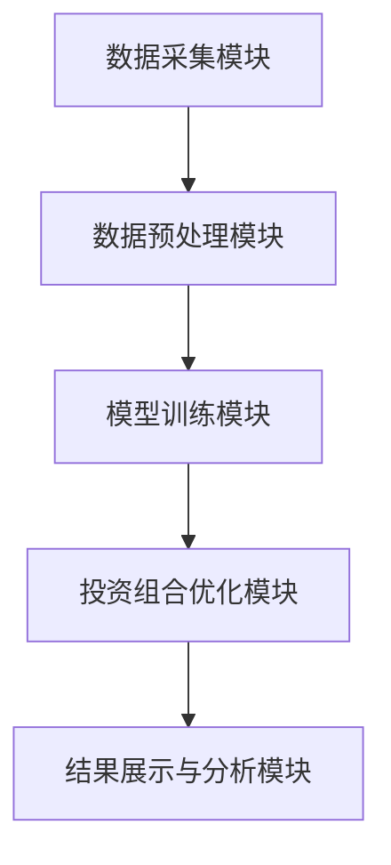

                 


```markdown
# 利用机器学习优化投资组合分配策略

## 关键词：机器学习，投资组合优化，金融，算法，数学模型

## 摘要：本文探讨了利用机器学习优化投资组合分配策略的方法，分析了机器学习在投资组合优化中的应用，提出了基于机器学习的投资组合优化算法，并通过实际案例展示了如何利用这些算法优化投资组合分配策略。文章结合理论与实践，为金融从业者和机器学习工程师提供了系统的指导。

---

## 第一部分：机器学习与投资组合优化基础

### 第1章：投资组合优化的背景与意义

#### 1.1 投资组合优化的背景
- 1.1.1 什么是投资组合优化？
  - 投资组合优化是指通过科学的方法选择最优的投资组合，以实现风险和收益的最佳平衡。
  - 投资组合优化的目标是最大化收益、最小化风险或两者之间的平衡。
- 1.1.2 投资组合优化的重要性
  - 在金融市场中，投资组合优化是投资者实现财富增长的重要手段。
  - 通过优化投资组合，投资者可以在不同的市场环境下实现稳健的收益。

#### 1.2 机器学习在投资组合优化中的作用
- 1.2.1 传统投资组合优化方法的局限性
  - 基于均值-方差模型的传统优化方法假设资产收益服从正态分布，但在实际金融市场中，资产收益往往呈现非正态分布，这使得传统方法在实际应用中效果有限。
- 1.2.2 机器学习的优势
  - 机器学习能够处理非线性关系，能够捕捉复杂市场环境中的模式和趋势。
  - 机器学习模型可以根据历史数据自动学习，生成更加准确的预测。

#### 1.3 机器学习与投资组合优化的结合
- 1.3.1 机器学习在投资组合优化中的应用场景
  - 资产配置：根据市场环境和投资者风险偏好，动态调整资产配置比例。
  - 风险管理：通过机器学习模型预测市场风险，优化投资组合的风险暴露。
  - 交易信号：利用机器学习模型生成交易信号，优化交易时机和策略。

### 第2章：投资组合优化的数学模型

#### 2.1 投资组合优化的基本模型
- 2.1.1 均值-方差模型
  - 均值-方差模型是投资组合优化的基础，由Harry Markowitz在1952年提出。
  - 该模型的目标是通过优化资产的收益和风险，找到最优的投资组合。
  - 数学表达式：
    - 目标函数：$\min_w \sigma^2(w)$
    - 约束条件：$\sum_{i=1}^n w_i = 1$, $w_i \geq 0$

- 2.1.2 均值-方差模型的扩展
  - 包括引入风险溢价、考虑交易成本等扩展模型。

#### 2.2 机器学习算法在投资组合优化中的应用
- 2.2.1 线性回归在投资组合优化中的应用
  - 线性回归可以用于预测资产收益，从而优化投资组合的配置。
- 2.2.2 支持向量机（SVM）在投资组合优化中的应用
  - SVM可以用于分类问题，可以将资产分为高风险和低风险两类，从而优化投资组合的风险收益比。
- 2.2.3 随机森林在投资组合优化中的应用
  - 随机森林可以用于资产分类和回归预测，能够捕捉复杂市场环境中的非线性关系。

### 第3章：机器学习算法的实现与优化

#### 3.1 机器学习算法的实现
- 3.1.1 线性回归算法的实现
  - 使用Python的scikit-learn库实现线性回归模型，用于预测资产收益。
- 3.1.2 支持向量机（SVM）算法的实现
  - 使用scikit-learn库实现SVM模型，用于资产分类。
- 3.1.3 随机森林算法的实现
  - 使用scikit-learn库实现随机森林模型，用于资产收益预测和风险评估。

#### 3.2 机器学习算法的优化
- 3.2.1 参数优化方法
  - 使用网格搜索（Grid Search）和随机搜索（Random Search）优化模型参数。
- 3.2.2 模型优化方法
  - 包括特征选择、降维等技术，以提高模型的预测精度和计算效率。
- 3.2.3 超参数调优方法
  - 使用交叉验证和网格搜索等方法进行超参数调优。

---

## 第二部分：基于机器学习的投资组合优化系统设计

### 第4章：投资组合优化系统的功能模块

#### 4.1 系统功能模块
- 4.1.1 数据采集模块
  - 从金融市场数据源获取资产的历史价格、收益、风险等数据。
- 4.1.2 数据预处理模块
  - 数据清洗、标准化、特征提取等处理。
- 4.1.3 模型训练模块
  - 使用机器学习算法训练投资组合优化模型。
- 4.1.4 投资组合优化模块
  - 基于训练好的模型生成最优投资组合配置建议。
- 4.1.5 结果展示与分析模块
  - 展示优化结果，包括收益、风险、资产配置比例等。

#### 4.2 系统架构设计
- 4.2.1 系统架构图（Mermaid）

- 4.2.2 模块之间的交互流程（Mermaid）

- 4.2.3 系统接口设计
  - 数据接口：与数据源的接口设计。
  - 模型接口：与第三方机器学习库的接口设计。
  - 用户接口：与用户交互的接口设计。

### 第5章：投资组合优化系统的实现

#### 5.1 项目实战环境搭建
- 5.1.1 环境配置
  - 安装Python、Jupyter Notebook、pandas、numpy、scikit-learn等工具。
- 5.1.2 数据源获取
  - 从Yahoo Finance或Alpha Vantage获取历史数据。

#### 5.2 系统核心实现源代码
- 5.2.1 数据预处理代码
```python
import pandas as pd
import numpy as np

# 数据加载
data = pd.read_csv('stock_data.csv')

# 数据清洗
data.dropna(inplace=True)
data = data.iloc[:, 1:]  # 去除第一列（日期）
data = data.pct_change().dropna()  # 计算收益率
data = data.apply(lambda x: (x - x.mean()) / x.std())  # 标准化
```
- 5.2.2 模型训练代码
```python
from sklearn.ensemble import RandomForestRegressor
from sklearn.model_selection import train_test_split

# 数据分割
X_train, X_test, y_train, y_test = train_test_split(data.drop(columns=['收益']), data['收益'], test_size=0.2)

# 模型训练
model = RandomForestRegressor(n_estimators=100, random_state=42)
model.fit(X_train, y_train)

# 模型预测
y_pred = model.predict(X_test)
```

#### 5.3 投资组合优化模块实现
- 5.3.1 优化目标
  - 最大化收益，最小化风险。
- 5.3.2 优化约束
  - 资产配置比例之和为1。
  - 每个资产的配置比例非负。

#### 5.4 投资组合优化结果分析
- 5.4.1 优化结果展示
  - 展示优化后的资产配置比例。
  - 展示优化后的投资组合的收益和风险。
- 5.4.2 案例分析
  - 通过具体案例分析优化结果的有效性。

---

## 第三部分：基于机器学习的投资组合优化实战

### 第6章：投资组合优化的案例分析

#### 6.1 案例背景
- 6.1.1 数据来源
  - 从具体市场中获取资产的历史数据。
- 6.1.2 数据处理
  - 清洗、标准化等处理。

#### 6.2 案例分析
- 6.2.1 数据分析
  - 对资产的收益率、风险等进行分析。
- 6.2.2 模型训练
  - 使用随机森林模型进行资产收益预测。
- 6.2.3 投资组合优化
  - 基于优化模型生成最优投资组合配置建议。
- 6.2.4 结果解读
  - 解读优化结果，分析收益与风险的平衡。

### 第7章：总结与展望

#### 7.1 总结
- 7.1.1 机器学习在投资组合优化中的应用价值
  - 机器学习能够捕捉复杂市场环境中的模式，优化投资组合的收益与风险。
- 7.1.2 本文的主要工作
  - 提出了基于机器学习的投资组合优化方法。
  - 实现了投资组合优化系统，并进行了案例分析。

#### 7.2 展望
- 7.2.1 未来的研究方向
  - 研究更加复杂的投资组合优化模型，如多目标优化、动态优化等。
  - 探索更加高效的投资组合优化算法，如深度学习模型的应用。
- 7.2.2 机器学习在投资组合优化中的潜在应用
  - 研究机器学习在投资组合风险预测中的应用。
  - 探索机器学习在投资组合动态调整中的应用。

---

## 作者：AI天才研究院/AI Genius Institute & 禅与计算机程序设计艺术 /Zen And The Art of Computer Programming
```

