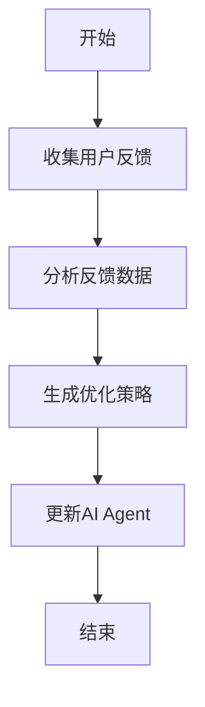
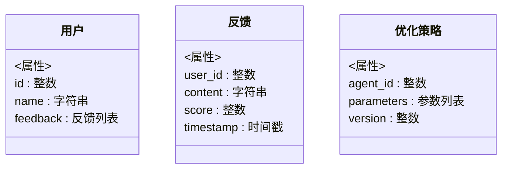

                 


# 利用用户反馈迭代升级AI Agent

## 关键词：
AI Agent、用户反馈、迭代升级、算法原理、系统架构、项目实战

## 摘要：
本文详细探讨了如何利用用户反馈来迭代升级AI Agent。首先，从背景介绍入手，解释AI Agent的核心概念和用户反馈的重要性。接着，分析用户反馈与AI Agent之间的关系，使用Mermaid图展示实体关系。然后，深入讲解基于用户反馈的迭代升级算法，包括流程图和Python代码实现。随后，设计系统的架构和接口，展示领域模型和交互流程。最后，通过项目实战和最佳实践，提供实际应用案例和优化建议，帮助读者全面理解并掌握利用用户反馈迭代升级AI Agent的方法。

---

## 第一部分：背景介绍

### 第1章：AI Agent与用户反馈的背景

#### 1.1 问题背景
- **AI Agent的定义与核心功能**  
  AI Agent（人工智能代理）是指能够感知环境、自主决策并执行任务的智能体。它通过接收输入、处理信息、做出决策并执行动作来实现目标。AI Agent的核心功能包括感知、推理、规划和执行。

- **用户反馈在AI Agent中的作用**  
  用户反馈是AI Agent改进的重要来源。通过分析用户的反馈，AI Agent可以识别自身的不足，优化决策策略，提高执行效率和准确性。例如，用户对AI Agent的回答是否满意、推荐的准确性如何，这些反馈都能为AI Agent的升级提供数据支持。

- **当前AI Agent的局限性与改进方向**  
  当前AI Agent在处理复杂任务时，往往依赖预设的规则和训练数据，缺乏动态调整的能力。通过引入用户反馈，AI Agent可以实现自我优化，适应不同用户的需求和环境的变化。

#### 1.2 问题描述
- **用户反馈的多样性和复杂性**  
  用户反馈不仅包括显式的评价（如评分、点赞），还包括隐式的反馈（如用户的行为数据，如点击、停留时间等）。这些反馈数据具有多样性和复杂性，如何有效收集和处理这些数据是一个挑战。

- **AI Agent理解用户反馈的挑战**  
  AI Agent需要理解用户的意图和情感，这需要自然语言处理和情感分析等技术的支持。此外，不同用户可能对同一反馈有不同的解读，这增加了AI Agent理解和处理反馈的难度。

- **用户反馈对AI Agent性能的影响**  
  用户反馈可以直接影响AI Agent的性能表现。积极的反馈可以增强AI Agent的自信心，而消极的反馈则需要AI Agent进行反思和调整。因此，如何高效地利用用户反馈进行优化是关键。

#### 1.3 问题解决
- **迭代升级AI Agent的目标**  
  迭代升级的目标是通过持续收集和分析用户反馈，优化AI Agent的行为模式和决策策略，使其更加智能化和个性化。

- **用户反馈在迭代中的关键作用**  
  用户反馈是迭代升级的核心驱动因素。通过反馈数据，AI Agent可以识别改进点，优化算法参数，调整交互方式，从而提升用户体验和任务执行效率。

- **迭代升级的实现路径与方法**  
  迭代升级通常包括数据收集、分析、优化和测试等步骤。通过循环迭代，AI Agent逐步逼近最优性能。

#### 1.4 边界与外延
- **AI Agent迭代升级的边界条件**  
  迭代升级需要考虑资源限制、用户隐私保护和系统稳定性等因素。例如，数据收集必须遵守隐私保护法规，系统升级需要确保在不中断服务的情况下完成。

- **用户反馈的范围与限制**  
  用户反馈的范围包括用户的行为数据、评分、评论等，但受限于数据质量和数量，AI Agent的反馈处理能力直接影响升级效果。

- **迭代升级与其他AI优化方法的区别**  
  迭代升级强调反馈驱动，而其他优化方法（如强化学习）可能依赖于模拟环境。两者可以结合使用，但侧重点不同。

#### 1.5 核心概念结构与组成
- **AI Agent的组成要素**  
  AI Agent通常包括感知模块、推理模块、决策模块和执行模块。每个模块都需要通过反馈进行优化。

- **用户反馈的分类与特征**  
  用户反馈可分为显性和隐性两类。显性反馈直接表达用户意见，隐性反馈则通过用户行为间接反映用户需求。

- **迭代升级的系统架构**  
  迭代升级系统包括数据采集层、反馈处理层、优化算法层和执行层。各层协同工作，实现持续优化。

---

## 第二部分：核心概念与联系

### 第2章：AI Agent的核心原理

#### 2.1 AI Agent的工作原理
- **AI Agent的基本工作流程**  
  AI Agent接收输入（如用户查询），通过内部算法处理信息，生成输出（如回答、建议），并根据用户反馈调整后续行为。

- **用户反馈的收集与处理机制**  
  用户反馈可以通过API接口或日志记录收集，并通过数据预处理、特征提取等步骤进行分析。

- **反馈驱动的优化策略**  
  AI Agent根据反馈数据优化模型参数，改进算法，提升用户体验。

#### 2.2 用户反馈的特征与分类
- **显性反馈与隐性反馈的对比**  
  显性反馈如评分、点赞，隐性反馈如点击率、停留时间。两者各有优缺点，结合使用效果更佳。

- **用户行为数据与语义反馈的关联**  
  用户行为数据反映了用户的实际需求，语义反馈则揭示了用户的主观评价。两者结合可以更全面地理解用户意图。

- **核心概念的ER实体关系图**

```mermaid
er
actor: 用户
agent: AI Agent
feedback: 用户反馈
goal: 优化目标
action: 行动
```

用户通过`actor`角色提供`feedback`，`agent`根据`feedback`调整`action`，最终实现`goal`的优化。

---

## 第三部分：算法原理讲解

### 第3章：基于用户反馈的迭代升级算法

#### 3.1 算法原理与流程图



- **步骤解析**  
  1. 收集用户反馈：通过API或日志获取用户对AI Agent的评价和行为数据。  
  2. 分析反馈数据：使用自然语言处理和统计分析技术，提取反馈中的有用信息。  
  3. 生成优化策略：基于反馈结果，调整AI Agent的算法参数或优化模型结构。  
  4. 更新AI Agent：将优化后的模型或参数应用到AI Agent中，提升性能。

#### 3.2 算法实现与代码解析

```python
import numpy as np
from sklearn.metrics import accuracy_score

def feedback_based_optimization(agent_model, user_feedback):
    # 提取反馈特征
    features = extract_features(user_feedback)
    # 计算反馈得分
    scores = compute_scores(features)
    # 优化模型参数
    agent_model.update_parameters(scores)
    return agent_model

# 示例：计算反馈得分
def compute_scores(features):
    # 假设features是二维数组，每行一个样本
    return np.mean(features, axis=0)

# 示例：提取反馈特征
def extract_features(feedback_data):
    features = []
    for feedback in feedback_data:
        # 假设每个反馈有多个特征
        features.append([feedback['score'], feedback['response_time']])
    return features

# 使用示例
agent = initialize_agent()
feedback_data = collect_feedback()  # 假设反馈数据已收集
optimized_agent = feedback_based_optimization(agent, feedback_data)
```

- **代码解读**  
  - `feedback_based_optimization`函数是核心优化函数，接收AI Agent模型和用户反馈数据，提取特征并计算反馈得分，最终更新模型参数。  
  - `compute_scores`函数计算每个反馈的平均得分，用于优化模型。  
  - `extract_features`函数从反馈数据中提取有用的特征，如用户评分和响应时间。

- **数学模型与公式**
  - 反馈得分计算：$$ \text{score}_i = \frac{1}{n} \sum_{j=1}^{n} f_j(i) $$  
    其中，$f_j(i)$是第$j$个反馈对第$i$个AI Agent行为的评分，$n$是总反馈数。  
  - 参数更新：$$ \theta_{new} = \theta_{old} + \alpha (\text{score}_i - \text{预测值}) $$  
    其中，$\theta_{new}$是优化后的模型参数，$\alpha$是学习率，$\text{预测值}$是AI Agent的原始预测结果。

---

## 第四部分：系统分析与架构设计

### 第4章：系统架构与设计

#### 4.1 问题场景介绍
- **用户需求**  
  用户希望AI Agent能够根据他们的反馈不断优化服务，提供更精准和个性化的体验。  
- **系统目标**  
  设计一个高效的反馈处理系统，支持实时或批量反馈处理，确保AI Agent能够快速响应并优化。

#### 4.2 系统功能设计
- **核心功能模块**  
  - 反馈收集模块：实时或批量收集用户反馈数据。  
  - 反馈分析模块：对反馈数据进行特征提取和分类。  
  - 优化策略生成模块：基于分析结果生成优化策略。  
  - 模型更新模块：更新AI Agent的模型或参数。  

- **领域模型类图**



#### 4.3 系统架构设计
- **分层架构**  
  系统分为数据层、业务逻辑层和表现层。  
  - 数据层：存储用户反馈和AI Agent的模型参数。  
  - 业务逻辑层：处理反馈分析和优化策略生成。  
  - 表现层：与用户交互，展示优化结果。

- **交互流程图**

```mermaid
sequenceDiagram
用户 -->+> 反馈收集模块: 提交反馈
反馈收集模块 -->+> 反馈分析模块: 分析反馈数据
反馈分析模块 -->+> 优化策略生成模块: 生成优化策略
优化策略生成模块 -->+> 模型更新模块: 更新AI Agent模型
模型更新模块 -->+> 用户: 提供优化结果反馈
```

---

## 第五部分：项目实战

### 第5章：项目实战与案例分析

#### 5.1 环境安装与配置
- **工具安装**  
  需要安装Python、NumPy、Scikit-learn等库。  
  ```bash
  pip install numpy scikit-learn
  ```

#### 5.2 核心代码实现
- **反馈收集模块**

```python
import json
from datetime import datetime

def collect_feedback():
    feedback = {}
    while True:
        user_id = input("请输入用户ID（输入q退出）：")
        if user_id == 'q':
            break
        content = input("请输入反馈内容：")
        score = int(input("请输入评分（1-5）："))
        feedback[user_id] = {
            'content': content,
            'score': score,
            'timestamp': datetime.now().isoformat()
        }
    return feedback
```

- **反馈分析模块**

```python
from sklearn.feature_extraction.text import TfidfVectorizer

def analyze_feedback(feedback_data):
    texts = [fb['content'] for fb in feedback_data.values()]
    vectorizer = TfidfVectorizer()
    tfidf_matrix = vectorizer.fit_transform(texts)
    return tfidf_matrix
```

- **优化策略生成模块**

```python
def generate_optimization_strategy(tfidf_matrix):
    # 假设优化策略基于TF-IDF得分
    top_features = np.argmax(tfidf_matrix.toarray(), axis=1)
    return top_features
```

#### 5.3 案例分析与优化建议
- **案例分析**  
  假设一个聊天机器人AI Agent，用户提供了多条反馈。分析发现，用户的反馈主要集中在回答的准确性和响应速度上。  
- **优化建议**  
  1. 增加对用户情感的分析，优化回答的语气。  
  2. 优化自然语言处理模型，提升回答的准确性。  
  3. 加强后端性能，减少响应时间。

---

## 第六部分：最佳实践与小结

### 第6章：最佳实践与小结

#### 6.1 最佳实践
- **持续反馈收集**  
  定期收集用户反馈，确保AI Agent能够持续优化。  
- **数据质量控制**  
  确保反馈数据的准确性和完整性，避免噪声数据干扰优化过程。  
- **多模型对比**  
  在优化过程中，对比不同模型的表现，选择最优方案。  
- **用户隐私保护**  
  遵守数据隐私法规，确保用户反馈数据的安全性和合法性。

#### 6.2 小结
通过本文的详细讲解，读者可以掌握如何利用用户反馈迭代升级AI Agent。从背景介绍到算法实现，再到系统设计和项目实战，每一部分都紧密相连，共同构成一个完整的优化流程。通过持续的反馈收集和分析，AI Agent可以不断进化，提供更优质的服务。

#### 6.3 注意事项
- 在实际应用中，需注意反馈数据的多样性和复杂性，确保处理算法的健壮性。  
- 优化过程中，建议结合多种技术手段，如强化学习和反馈机制，以提升优化效果。  
- 定期对系统进行性能监控和维护，确保优化过程的稳定性和可持续性。

#### 6.4 拓展阅读
- 推荐阅读《机器学习实战》和《深度学习》等书籍，深入了解算法优化和模型训练的技术细节。  
- 关注AI领域的最新研究，了解前沿技术如何应用于用户反馈处理和AI Agent优化。

---

## 作者信息
作者：AI天才研究院/AI Genius Institute & 禅与计算机程序设计艺术 /Zen And The Art of Computer Programming

---

本文通过详细讲解如何利用用户反馈迭代升级AI Agent，帮助读者掌握从理论到实践的完整流程。通过丰富的案例和代码示例，读者可以深入理解并实际应用这些方法，提升AI Agent的性能和用户体验。

