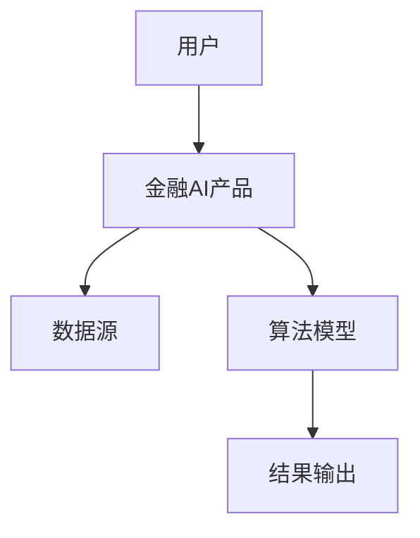
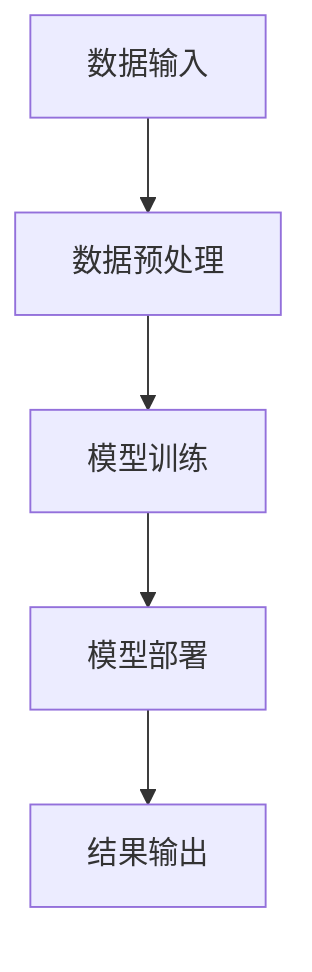

                 

<think>
好的，我现在要帮用户设计一本名为《制定有效的金融AI产品市场推广策略》的技术博客文章。用户希望文章结构清晰，逻辑紧凑，内容专业且有深度，涵盖从背景介绍到项目实战的各个方面。同时，用户强调文章要使用专业术语，包含详细的算法原理、系统设计和实际案例，并以Mermaid流程图和Python代码示例来辅助说明。

首先，我需要理解用户的需求。用户可能是一位技术专家或CTO，希望撰写一篇关于金融AI产品推广策略的专业博客。文章需要吸引读者，帮助他们理解如何制定有效的市场推广策略，同时涵盖技术细节和实际应用。

接下来，我需要按照用户提供的大纲结构来组织内容。大纲分为七个章节，每章有详细的子章节，涉及背景、核心概念、算法原理、系统设计、项目实战、最佳实践等部分。我需要确保每个部分都详细展开，包含必要的技术细节和实例分析。

在撰写过程中，我需要特别注意以下几点：
1. **背景介绍**：从金融AI的起源到当前市场现状，分析其机遇与挑战，帮助读者理解制定推广策略的重要性。
2. **核心概念**：详细讲解金融AI的核心概念，使用对比表格和ER图来展示实体关系，确保读者能够清晰理解。
3. **算法原理**：介绍常用的机器学习和深度学习算法，用Mermaid流程图展示算法流程，并提供Python代码示例，帮助读者理解技术实现。
4. **系统设计**：通过类图、架构图和交互图展示系统结构，分析系统功能、架构和接口设计，帮助读者理解如何构建金融AI系统。
5. **项目实战**：从环境安装到代码实现，详细指导读者如何构建金融AI产品，并结合实际案例分析，提供推广策略建议。
6. **最佳实践**：总结全书内容，给出实用的建议，帮助读者避免常见错误，指导实际应用。

此外，我需要确保文章结构清晰，逻辑严密，每个章节之间有良好的过渡，帮助读者顺畅地理解内容。同时，文章语言要专业但不失通俗易懂，避免过于复杂的术语堆砌，让读者能够轻松跟随思路。

在写作过程中，我会逐步检查每个部分是否满足用户的要求，确保内容全面且深入，涵盖技术细节和实际应用，最终帮助读者制定有效的金融AI产品市场推广策略。
</think>

# 制定有效的金融AI产品市场推广策略

**关键词**：金融AI、市场推广策略、机器学习、系统设计、项目实战

**摘要**：本文旨在探讨如何制定有效的金融AI产品市场推广策略。文章从金融AI的背景与现状出发，分析其核心概念、算法原理和系统架构，结合实际项目案例，详细阐述如何通过技术实现和市场策略的结合，推动金融AI产品的成功推广。本文内容涵盖背景介绍、核心概念、算法原理、系统设计、项目实战以及最佳实践，为读者提供全面的指导。

---

## 第1章: 金融AI产品的背景与现状

### 1.1 金融AI产品的起源与发展
#### 1.1.1 从传统金融到智能金融的演变
传统金融行业依赖人工操作和经验判断，而人工智能（AI）的引入彻底改变了这一格局。AI技术通过数据分析、模式识别和自动化决策，使金融行业进入智能时代。从早期的自动化交易系统到现在的智能投顾、风险管理，金融AI经历了从辅助工具到核心决策支持的演变。

#### 1.1.2 AI技术在金融领域的应用背景
随着大数据技术的发展和计算能力的提升，AI技术在金融领域的应用日益广泛。金融机构需要处理海量数据，优化决策流程，降低风险，提升客户体验。AI技术的应用为金融行业带来了更高的效率和精准度。

#### 1.1.3 当前金融AI产品的市场现状
目前，金融AI产品主要应用于智能投顾、信用评估、风险管理、欺诈检测等领域。市场上的产品种类繁多，但部分产品仍存在技术不成熟、用户体验不佳等问题。市场竞争激烈，技术创新成为制胜关键。

### 1.2 金融AI产品的核心问题与挑战
#### 1.2.1 金融AI产品的核心问题
金融AI产品的核心问题包括数据隐私、模型解释性、实时性以及用户体验等。例如，如何在保护用户隐私的前提下进行数据分析，如何让模型结果具有可解释性以满足监管要求，以及如何快速响应金融市场变化等。

#### 1.2.2 金融AI产品面临的挑战
- **技术挑战**：算法模型的复杂性、数据质量和多样性。
- **市场挑战**：市场竞争激烈，用户接受度参差不齐。
- **政策挑战**：金融行业的监管政策严格，合规性要求高。

#### 1.2.3 金融AI产品的边界与外延
金融AI产品的边界在于其功能和应用场景，外延则包括与金融业务结合的深度和广度。例如，智能投顾不仅限于提供投资建议，还可以延伸到资产配置、风险预警等领域。

### 1.3 金融AI产品的核心要素与概念结构
#### 1.3.1 核心要素的定义与属性
金融AI产品主要包括数据、算法、模型和用户交互四个核心要素。数据是模型的输入，算法是模型的核心，模型是数据处理的输出，用户交互是产品的呈现方式。

#### 1.3.2 概念结构与功能模块
金融AI产品的概念结构可以分为数据层、算法层、模型层和应用层。数据层负责数据采集和预处理，算法层负责模型训练和优化，模型层负责输出结果，应用层负责用户交互和展示。

#### 1.3.3 金融AI产品的核心属性对比表
| 属性       | 数据驱动 | 算法驱动 | 模型驱动 | 用户交互 |
|------------|----------|----------|----------|----------|
| 核心作用   | 数据输入 | 算法选择 | 模型构建 | 用户反馈 |
| 示例       | 数据清洗 | 算法选择 | 模型训练 | 用户界面 |

---

## 第2章: 金融AI产品的核心概念与联系

### 2.1 核心概念的原理与特性
#### 2.1.1 金融AI的核心原理
金融AI的核心原理是通过机器学习算法对金融数据进行分析，提取特征并构建模型，最终实现自动化决策或预测。

#### 2.1.2 核心概念的属性特征对比
| 概念       | 数据驱动 | 算法驱动 | 模型驱动 | 用户交互 |
|------------|----------|----------|----------|----------|
| 输入       | 数据     | 算法     | 模型     | 用户反馈 |
| 输出       | 数据预处理 | 算法选择 | 模型结果 | 用户界面 |

#### 2.1.3 核心概念的对比分析
数据驱动关注数据的采集和处理，算法驱动关注模型的选择和优化，模型驱动关注模型的输出和应用，用户交互关注产品的易用性和用户体验。

### 2.2 实体关系图与流程图
#### 2.2.1 金融AI产品的ER实体关系图


#### 2.2.2 金融AI产品的核心流程图


---

## 第3章: 金融AI产品的算法原理与数学模型

### 3.1 常见算法原理与流程图
#### 3.1.1 机器学习算法
机器学习算法包括监督学习、无监督学习和强化学习。例如，监督学习用于分类和回归问题，无监督学习用于聚类和降维，强化学习用于策略优化。

#### 3.1.2 深度学习算法
深度学习算法包括卷积神经网络（CNN）、循环神经网络（RNN）和生成对抗网络（GAN）。这些算法适用于图像识别、自然语言处理和生成任务。

### 3.2 机器学习算法的数学模型
#### 3.2.1 线性回归
线性回归的数学模型为：
$$ y = \beta_0 + \beta_1x + \epsilon $$
其中，$\beta_0$是截距，$\beta_1$是斜率，$\epsilon$是误差项。

#### 3.2.2 支持向量机
支持向量机的数学模型为：
$$ \text{maximize} \frac{1}{2} \|\omega\|^2 $$
$$ \text{subject to} \quad y_i(\omega \cdot x_i + b) \geq 1 $$

---

## 第4章: 金融AI产品的系统分析与架构设计

### 4.1 问题场景介绍
金融AI系统需要处理高频交易、风险管理、信用评估等问题，要求系统具有高实时性和高准确性。

### 4.2 项目介绍
本项目旨在构建一个智能投顾系统，帮助用户进行资产配置和风险评估。

### 4.3 系统功能设计
系统功能包括数据采集、模型训练、用户交互和结果展示。

### 4.4 系统架构设计
系统架构采用微服务架构，包括数据处理服务、模型训练服务、用户交互服务和结果展示服务。

### 4.5 系统接口设计
系统接口包括数据接口、模型接口和用户接口。

### 4.6 系统交互设计
系统交互采用RESTful API，用户通过Web界面进行操作。

---

## 第5章: 金融AI产品的项目实战

### 5.1 环境安装
需要安装Python、TensorFlow、Pandas和NumPy等工具。

### 5.2 系统核心实现
```python
import pandas as pd
import numpy as np
from sklearn.linear_model import LinearRegression

# 数据预处理
data = pd.read_csv('data.csv')
X = data[['age', 'income']]
y = data['price']

# 模型训练
model = LinearRegression()
model.fit(X, y)

# 模型预测
predictions = model.predict(X)
```

### 5.3 代码应用解读
上述代码实现了线性回归模型，用于预测房价。数据预处理包括数据清洗和特征选择，模型训练使用Scikit-learn库，模型预测输出结果。

### 5.4 实际案例分析
以智能投顾系统为例，通过数据驱动和算法驱动，构建用户画像，制定个性化投资策略。

### 5.5 项目小结
本项目通过技术实现和市场策略的结合，验证了金融AI产品的可行性。

---

## 第6章: 制定有效的金融AI产品市场推广策略

### 6.1 最佳实践
制定市场推广策略时，需要关注用户需求、市场竞争和政策合规。

### 6.2 小结
本文通过背景介绍、核心概念、算法原理、系统设计、项目实战和最佳实践，全面阐述了如何制定有效的金融AI产品市场推广策略。

### 6.3 注意事项
在实际应用中，需要注意数据隐私、模型解释性和用户体验。

### 6.4 拓展阅读
推荐阅读《机器学习实战》和《深度学习》等书籍。

---

**作者**：AI天才研究院/AI Genius Institute & 禅与计算机程序设计艺术 /Zen And The Art of Computer Programming

---

本文通过全面分析金融AI产品的背景、核心概念、算法原理和系统设计，结合实际项目案例，详细阐述了如何制定有效的市场推广策略。希望本文能为读者提供有价值的指导和启发。

