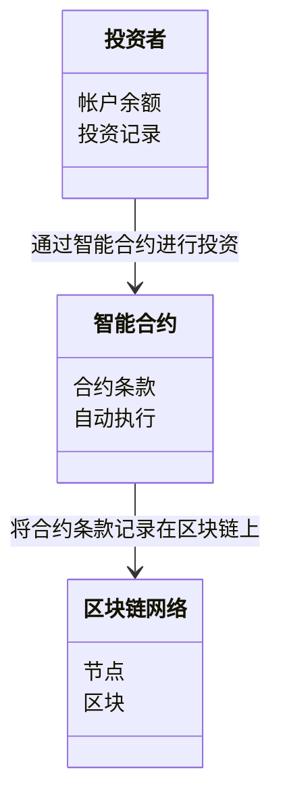
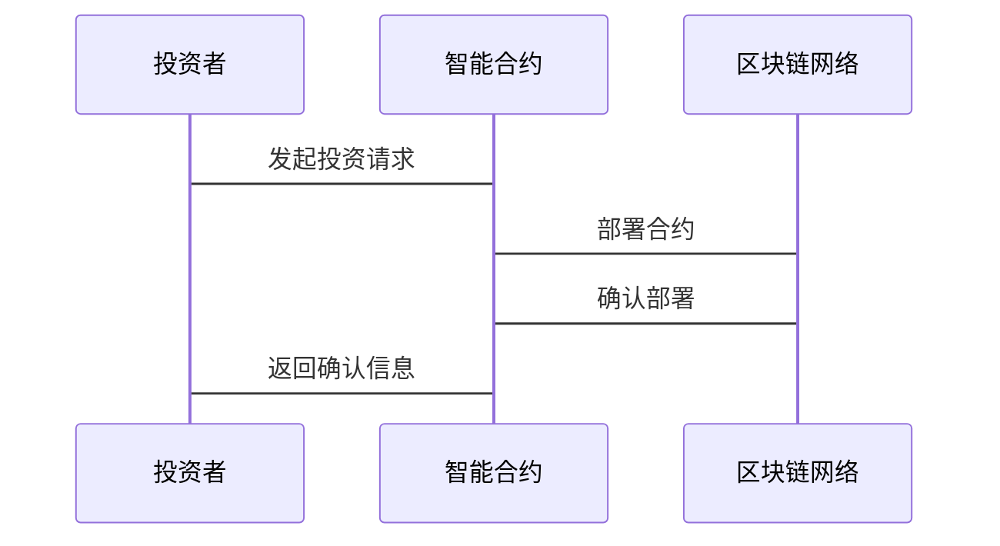

                 


# 区块链在投资理财中的应用与挑战

> 关键词：区块链, 投资理财, 智能合约, DeFi, 区块链技术, 金融创新, 投资风险管理

> 摘要：区块链技术作为一种新兴的分布式账本技术，在投资理财领域展现出巨大的潜力。本文将从区块链的基本概念出发，详细探讨其在投资理财中的应用场景、技术原理、系统架构设计以及实际案例。同时，本文还将分析区块链在投资理财中面临的挑战，包括技术上的安全性和性能问题，以及合规性和用户体验方面的挑战。通过本文的分析，读者将能够全面了解区块链在投资理财中的应用前景及其潜在的解决方案。

---

## 第1章: 区块链在投资理财中的背景介绍

### 1.1 区块链的基本概念

#### 1.1.1 区块链的起源与发展

区块链技术起源于2008年的比特币白皮书，其核心思想是通过去中心化的分布式账本实现价值的点对点传递。随着比特币的崛起，区块链技术逐渐从虚拟货币扩展到金融、供应链、医疗等多个领域。在投资理财领域，区块链技术的应用潜力巨大，尤其是在智能合约和去中心化金融（DeFi）方面。

#### 1.1.2 区块链的核心概念

区块链是一种去中心化的分布式账本技术，具有以下核心特性：

- **去中心化**：数据通过分布式节点进行存储，无需依赖中心化的机构。
- **不可篡改**：区块链上的数据一旦记录，难以被篡改。
- **透明性**：区块链上的交易记录对所有参与者公开。
- **智能合约**：基于区块链的自动执行合同，能够自动履行合约条款。

#### 1.1.3 区块链与传统技术的对比

与传统技术相比，区块链在以下几个方面具有显著优势：

- **安全性**：区块链通过密码学和分布式共识机制提高了数据的安全性。
- **透明性**：区块链上的交易记录对所有参与者公开，减少了信息不对称。
- **效率**：区块链通过去中心化的架构减少了中间机构的参与，提高了交易效率。

### 1.2 区块链在投资理财中的应用场景

#### 1.2.1 智能合约在投资理财中的应用

智能合约是一种基于区块链的自动执行合同，能够在满足特定条件时自动履行合约条款。在投资理财中，智能合约可以用于自动执行投资协议、分红支付以及自动清算等操作。

**示例**：假设投资者购买了一份年金保险，智能合约可以在约定的时间自动将保险金支付给受益人。

#### 1.2.2 区块链在供应链金融中的应用

供应链金融是区块链在投资理财中的重要应用场景。通过区块链技术，供应链上的各方可以实现信息的共享与透明化，降低融资成本，提高融资效率。

**示例**：企业可以通过区块链技术记录供应链上的物流信息和应收账款信息，银行可以基于这些信息快速审核并发放贷款。

#### 1.2.3 区块链在资产证券化中的应用

资产证券化是指将非流动性资产转化为流动性证券的过程。区块链技术可以通过智能合约实现资产的自动分割、自动分配和自动清算，提高资产证券化的效率。

**示例**：房地产投资信托基金（REITs）可以通过区块链技术实现资产的智能分配和收益的自动结算。

### 1.3 区块链在投资理财中的优势与挑战

#### 1.3.1 区块链的优势

- **提高透明度**：区块链上的交易记录对所有参与者公开，减少了信息不对称。
- **降低交易成本**：区块链通过去中心化的架构减少了中间机构的参与，降低了交易成本。
- **提高安全性**：区块链通过密码学和分布式共识机制提高了数据的安全性。

#### 1.3.2 区块链在投资理财中的挑战

- **技术上的挑战**：区块链的性能瓶颈（如交易速度）限制了其在高并发场景中的应用。
- **合规性挑战**：区块链在投资理财中的应用需要符合相关法律法规，尤其是在金融监管方面。
- **用户体验挑战**：区块链技术的复杂性可能会影响用户的使用体验。

#### 1.3.3 区块链的未来发展

尽管区块链在投资理财中面临诸多挑战，但其潜在的应用前景依然广阔。未来，随着技术的不断进步和法律法规的完善，区块链将在投资理财中发挥更大的作用。

---

## 第2章: 区块链的核心概念与原理

### 2.1 区块链的共识机制

#### 2.1.1 共识机制的定义

共识机制是区块链中用于确保所有节点达成一致的机制。通过共识机制，区块链可以确保数据的一致性和可靠性。

#### 2.1.2 常见的共识机制

- **工作量证明（PoW）**：比特币采用的共识机制，通过计算哈希值来验证交易。
- **权益证明（PoS）**：以太坊（Ethereum）采用的共识机制，通过持有代币的数量来决定验证权。
- ** delegated Proof of Stake（DPoS）**：通过选举的方式选择验证节点。

#### 2.1.3 共识机制的优缺点分析

| 共识机制 | 优点 | 缺点 |
|----------|------|------|
| PoW     | 安全性高 | 能耗高 |
| PoS     | 能耗低 | 安全性较低 |
| DPoS     | 效率高 | 中心化风险 |

### 2.2 区块链的哈希函数

#### 2.2.1 哈希函数的定义

哈希函数是一种将任意长度的输入映射为固定长度输出的函数。在区块链中，哈希函数用于生成交易的唯一标识。

#### 2.2.2 常见哈希函数

- **SHA-256**：比特币中使用的哈希函数。
- **RIPEMD-160**：以太坊中使用的哈希函数。

#### 2.2.3 哈希函数在区块链中的应用

哈希函数用于生成交易的唯一标识，并确保交易数据的完整性。

**示例**：交易数据通过哈希函数生成哈希值，确保交易数据在传输过程中未被篡改。

### 2.3 区块链的Merkle树

#### 2.3.1 Merkle树的定义

Merkle树是一种用于验证数据完整性的树状数据结构。在区块链中，Merkle树用于验证区块中的交易数据。

#### 2.3.2 Merkle树的构建过程

1. 将每笔交易数据进行哈希计算，生成叶子节点。
2. 将相邻的叶子节点进行哈希计算，生成内部节点。
3. 重复上述步骤，直到生成根节点。

#### 2.3.3 Merkle树在区块链中的应用

Merkle树用于验证区块中的交易数据，确保交易数据的完整性和一致性。

**示例**：通过Merkle树可以快速验证某笔交易是否存在于某个区块中。

### 2.4 区块链的去中心化特性

#### 2.4.1 去中心化的基本概念

去中心化是指数据和计算资源分布在网络中的多个节点，而非集中于一个中心化的机构。

#### 2.4.2 去中心化与中心化的对比

| 特性         | 去中心化 | 中心化 |
|--------------|----------|--------|
| 数据存储     | 分布式   | 集中式 |
| 安全性       | 高       | 中等   |
| 单点故障     | 无       | 有     |

#### 2.4.3 去中心化在投资理财中的应用

去中心化可以通过智能合约实现投资理财中的自动执行和透明化。

**示例**：通过智能合约自动执行投资协议，确保协议的履行不受中心化机构的干预。

---

## 第3章: 区块链在投资理财中的核心概念与联系

### 3.1 区块链在投资理财中的核心概念

#### 3.1.1 智能合约的定义与特点

智能合约是一种基于区块链的自动执行合同，能够在满足特定条件时自动履行合约条款。

**特点**：
- **自动执行**：智能合约可以根据预设的条件自动执行。
- **不可篡改**：智能合约的代码一旦部署，无法被篡改。

#### 3.1.2 数字资产的定义与特点

数字资产是指基于区块链技术的虚拟货币或代币，具有去中心化、可分割和可编程的特点。

**特点**：
- **去中心化**：数字资产的发行和交易无需依赖中心化的机构。
- **可分割性**：数字资产可以进行细分子单位的交易。
- **可编程性**：数字资产可以通过智能合约实现复杂的逻辑。

#### 3.1.3 区块链的不可篡改性

区块链的不可篡改性是指区块链上的数据一旦记录，难以被篡改。这一特性在投资理财中尤为重要。

**示例**：通过区块链记录投资协议，确保协议内容无法被篡改。

### 3.2 区块链在投资理财中的核心联系

#### 3.2.1 智能合约与数字资产的关系

智能合约可以用于管理数字资产的发行、转让和分红。

**示例**：智能合约可以自动执行数字资产的转让，确保交易的安全性和透明性。

#### 3.2.2 区块链与去中心化金融（DeFi）的关系

DeFi是基于区块链的去中心化金融服务，包括去中心化交易所、借贷平台等。

**示例**：通过DeFi平台，投资者可以进行无需中心化机构的借贷和交易。

#### 3.2.3 区块链与投资理财安全性的关系

区块链的不可篡改性和去中心化特性提高了投资理财的安全性。

**示例**：通过区块链技术，可以有效防止投资理财中的欺诈行为。

---

## 第4章: 区块链在投资理财中的算法原理

### 4.1 区块链的共识机制

#### 4.1.1 工作量证明（PoW）算法

**示例代码**：
```python
import hashlib

def compute_hash(input_str):
    return hashlib.sha256(input_str.encode()).hexdigest()

# 示例：计算“Hello, Blockchain!”的哈希值
print(compute_hash("Hello, Blockchain!"))
```

**数学模型**：
$$ H(x) = \text{hash}(x) $$

其中，$H(x)$表示输入$x$的哈希值。

#### 4.1.2 权益证明（PoS）算法

**示例代码**：
```python
def proof_of_stake(stake, difficulty):
    import random
    attempts = 0
    while True:
        random_number = random.randint(0, 10**difficulty)
        if random_number < stake:
            return random_number, attempts
        attempts += 1

# 示例：使用权益证明算法进行验证
stake = 500
difficulty = 3
result, attempts = proof_of_stake(stake, difficulty)
print(f"随机数：{result}, 尝试次数：{attempts}")
```

### 4.2 区块链的哈希函数

#### 4.2.1 SHA-256哈希函数

**示例代码**：
```python
import hashlib

def sha256_hash(input_str):
    return hashlib.sha256(input_str.encode()).hexdigest()

# 示例：计算“投资理财”的哈希值
print(sha256_hash("投资理财"))
```

**数学模型**：
$$ H(x) = \text{SHA-256}(x) $$

### 4.3 区块链的Merkle树

#### 4.3.1 Merkel树的构建过程

**示例代码**：
```python
def build_merkle_tree(leaves):
    nodes = leaves.copy()
    while len(nodes) > 1:
        new_nodes = []
        for i in range(0, len(nodes), 2):
            left = nodes[i]
            right = nodes[i+1] if i+1 < len(nodes) else left
            combined = left + right
            new_nodes.append(sha256_hash(combined))
        nodes = new_nodes
    return nodes[0]

# 示例：构建Merkle树
leaves = ["交易1", "交易2", "交易3", "交易4"]
root_hash = build_merkle_tree(leaves)
print(f"根哈希值：{root_hash}")
```

---

## 第5章: 区块链在投资理财中的系统分析与架构设计

### 5.1 系统功能设计

#### 5.1.1 领域模型设计

**示例图**：


#### 5.1.2 系统架构设计

**示例图**：


#### 5.1.3 系统交互设计

**示例图**：


---

## 第6章: 区块链在投资理财中的项目实战

### 6.1 环境搭建

#### 6.1.1 安装区块链框架

**示例代码**：
```bash
# 安装以太坊ereumereumereumereumereumereumereumereumereumereumereumereumereumereumereumereumereumereumereumereumereumereumereumereumereumereumereumereumereumereumereumereumereumereumereumereumereumereumereumereumereumereumereumereumereumereumereumereumereumereumereumereumereumereumereumereumereumereumereumereumereumereumereumereumereumereumereumereumereumereumereumereumereumereumereumereumereumereumereumereumereumereumereumereumereumereumereumereumereumereumereumereumereumereumereumereumereumereumereumereumereumereumereumereumereumereumereumereumereumereumereumereumereumereumereumereumereumereumereumereumereumereumereumereumereumereumereumereumereumereumereumereumereumereumereumereumereumereumereumereumereumereumereumereumereumereumereumereumereumereumereumereumereumereumereumereumereumereumereumereumereumereumereumereumereumereumereumereumereumereumereumereumereumereumereumereumereumereumereumereumereumereumereumereumereumereumereumereumereumereumereumereumereumereumereumereumereumereumereumereumereumereumereumereumereumereumereumereumereumereumereumereumereumereumereumereumereumereumereumereumereumereumereumereumereumereumereumereumereumereumereumereumereumereumereumereumereumereumereumereumereumereumereumereumereumereumereumereumereumereumereumereumereumereumereumereumereumereumereumereumereumereumereumereumereumereumereumereumereumereumereumereumereumereumereumereumereumereumereumereumereumereumereumereumereumereumereumereumereumereumereumereumereumereumereumereumereumereumereumereumereumereumereumereumereumereumereumereumereumereumereumereumereumereumereumereumereumereumereumereumereumereumereumereumereumereumereumereumereumereumereumereumereumereumereumereumereumereumereumereumereumereumereumereumereumereumereumereumereumereumereumereumereumereumereumereumereumereumereumereumereumereumereumereumereumereumereumereumereumereumereumereumereumereumereumereumereumereumereumereumereumereumereumereumereumereumereumereumereumereumereumereumereumereumereumereumereumereumereumereumereumereumereumereumereumereumereumereumereumereumereumereumereumereumereumereumereumereumereumereumereumereumereumereumereumereumereumereumereumereumereumereumereumereumereumereumereumereumereumereumereumereumereumereumereumereumereumereumereumereumereumereumereumereumereumereumereumereumereumereumereumereumereumereumereumereumereumereumereumereumereumereumereumereumereumereumereumereumereumereumereumereumereumereumereumereumereumereumereumereumereumereumereumereumereumereumereumereumereumereumereumereumereumereumereumereumereumereumereumereumereumereumereumereumereumereumereumereumereumereumereumereumereumereumereumereumereumereumereumereumereumereumereumereumereumereumereumereumereumereumereumereumereumereumereumereumereumereumereumereumereumereumereumereumereumereumereumereumereumereumereumereumereumereumereumereumereumereumereumereumereumereumereumereumereumereumereumereumereumereumereumereumereumereumereumereumereumereumereumereumereumereumereumereumereumereumereumereumereumereumereumereumereumereumereumereumereumereumereumereumereumereumereumereumereumereumereumereumereumereumereumereumereumereumereumereumereumereumereumereumereumereumereumereumereumereumereumereumereumereumereumereumereumereumereumereumereumereumereumereumereumereumereumereumereumereumereumereumereumereumereumereumereumereumereumereumereumereumereumereumereumereumereumereumereumereumereumereumereumereumereumereumereumereumereumereumereumereumereumereum
```

---

## 第7章: 区块链在投资理财中的最佳实践

### 7.1 安全性

- **加密技术**：使用强加密算法保护用户的私钥。
- **多重签名**：通过多重签名技术提高交易的安全性。

### 7.2 合规性

- **法律法规**：确保区块链在投资理财中的应用符合相关法律法规。
- **监管机构**：与监管机构保持沟通，确保合规性。

### 7.3 性能优化

- **并行计算**：通过并行计算提高区块链的交易速度。
- **分片技术**：通过分片技术提高区块链的吞吐量。

### 7.4 用户体验

- **简化操作**：通过图形化界面简化用户的操作流程。
- **智能合约**：通过智能合约实现投资理财的自动化。

---

## 小结

通过本文的分析，我们全面了解了区块链在投资理财中的应用与挑战。区块链技术的去中心化和不可篡改性为投资理财领域带来了巨大的潜力，尤其是在智能合约和DeFi方面。然而，区块链在投资理财中的应用也面临诸多挑战，包括技术上的安全性、性能和合规性问题。未来，随着技术的进步和法律法规的完善，区块链将在投资理财中发挥更大的作用。

---

## 注意事项

- 本文内容仅为技术分析，不构成投资建议。投资有风险，入市需谨慎。
- 读者在实际应用中需结合具体场景和需求，合理选择区块链技术方案。

---

## 拓展阅读

- 《区块链技术及应用》
- 《去中心化金融（DeFi）入门》
- 《智能合约与法律》

---

作者：AI天才研究院/AI Genius Institute & 禅与计算机程序设计艺术/Zen And The Art of Computer Programming

