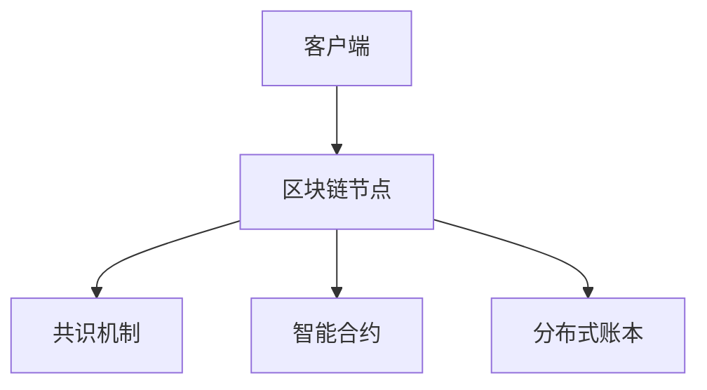
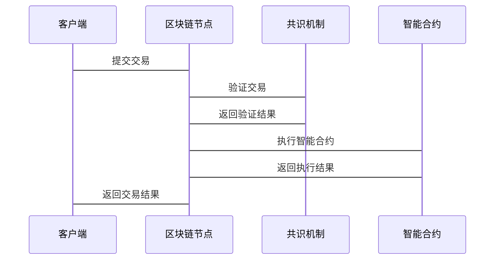

                 

<think>
好的，我需要撰写一篇关于《区块链在金融数据安全中的创新应用》的详细技术博客文章。我会按照以下步骤进行：

**第1步：了解核心概念**

首先，我需要明确区块链和金融数据安全的基本概念。区块链是一种分布式账本技术，通过去中心化和加密技术确保数据的安全性和不可篡改性。金融数据安全则关注如何保护金融交易和信息不被泄露或篡改。

**第2步：分析区块链的核心技术**

接下来，我需要详细讲解区块链的核心技术，包括分布式账本、共识机制、智能合约等。这些技术是区块链在金融数据安全中应用的基础。

**第3步：探讨区块链在金融数据安全中的应用场景**

然后，我会分析区块链在金融领域的具体应用，例如跨境支付、供应链金融、数字身份认证等，说明区块链如何解决这些问题中的数据安全挑战。

**第4步：设计系统架构**

为了更好地理解，我会设计一个基于区块链的金融数据安全系统架构，包括系统功能设计、架构图、接口设计和交互流程。

**第5步：编写实际案例分析**

通过实际案例分析，展示区块链在金融数据安全中的实际应用效果和优势，帮助读者更好地理解。

**第6步：总结与展望**

最后，我会总结区块链在金融数据安全中的创新应用，并展望未来的发展方向，指出可能的挑战和改进空间。

通过以上步骤，我可以系统地撰写出一篇逻辑清晰、内容详实的技术博客文章，全面展示区块链在金融数据安全中的创新应用。
</think>

# 区块链在金融数据安全中的创新应用

> **关键词**：区块链、金融数据安全、分布式账本、智能合约、去中心化  
>
> **摘要**：本文探讨了区块链技术在金融数据安全中的创新应用。首先介绍了区块链的基本概念和核心技术，包括分布式账本、共识机制和智能合约。接着分析了区块链在金融数据安全中的应用场景，如跨境支付、供应链金融和数字身份认证。通过实际案例分析，展示了区块链如何解决传统金融数据安全的痛点。最后，总结了区块链在金融数据安全中的优势，并展望了未来的发展方向。

---

# 第1章 区块链与金融数据安全概述

## 1.1 区块链的基本概念

### 1.1.1 区块链的定义

区块链是一种分布式账本技术，通过加密算法和去中心化的方式记录和验证数据。它由多个区块组成，每个区块包含一定的交易数据，并通过链式结构连接，确保数据不可篡改。

### 1.1.2 区块链的核心特点

区块链具有去中心化、不可篡改、透明性和安全性等特点。去中心化意味着没有单一的控制节点，数据由所有参与者共同维护；不可篡改性保证了数据的真实性和完整性；透明性使得所有交易记录可供所有参与者查阅。

### 1.1.3 区块链在金融领域的应用前景

金融领域对数据安全要求极高，区块链的去中心化和不可篡改性使其成为金融数据安全的理想解决方案。区块链可以应用于支付结算、资产管理、供应链金融等多个领域。

---

## 1.2 金融数据安全的挑战

### 1.2.1 传统金融数据安全的痛点

传统金融系统依赖中心化的机构进行数据存储和管理，容易成为黑客攻击的目标。此外，数据泄露和隐私保护问题也亟待解决。

### 1.2.2 数据泄露与隐私保护的矛盾

金融数据往往包含用户的敏感信息，如何在保护隐私的同时实现数据共享是一个重要挑战。

### 1.2.3 金融交易中的信任问题

传统金融交易依赖于中心化的信任机构（如银行），而区块链通过去中心化的方式减少了对信任机构的依赖。

---

## 1.3 区块链在金融数据安全中的作用

### 1.3.1 区块链如何解决金融数据安全问题

区块链通过加密算法和分布式账本技术，确保数据的安全性和隐私性。数据一旦写入区块链，无法被篡改或删除。

### 1.3.2 区块链的去中心化特性与金融数据安全

去中心化使得没有单一的攻击目标，降低了数据被篡改的风险。同时，每个参与者都可以验证数据的真实性，提高了整体的安全性。

### 1.3.3 区块链的不可篡改性与数据完整性

区块链的链式结构和哈希值验证确保了数据的不可篡改性。每个区块的哈希值都与前一个区块相关联，任何篡改都会被立即发现。

---

## 1.4 本章小结

本章介绍了区块链的基本概念和核心特点，并分析了区块链在金融数据安全中的作用。区块链的去中心化、不可篡改性和透明性使其成为金融数据安全的有力工具。

---

# 第2章 区块链的核心技术

## 2.1 分布式账本技术

### 2.1.1 分布式账本的定义

分布式账本是一种去中心化的数据存储方式，数据分散在多个节点上，每个节点都有一份完整的账本副本。

### 2.1.2 分布式账本的实现原理

通过点对点网络和共识机制，分布式账本可以确保所有节点的数据一致性。每个节点都参与数据的验证和传播，确保账本的准确性和完整性。

### 2.1.3 分布式账本在金融数据中的应用

在金融领域，分布式账本可以用于记录交易数据、资产管理、支付结算等场景。通过分布式账本，可以实现数据的实时同步和共享。

---

## 2.2 共识机制

### 2.2.1 共识机制的定义

共识机制是一种通过分布式网络中所有节点达成一致的方法。它的目的是确保所有节点对账本的状态达成一致。

### 2.2.2 常见的共识算法

- **PoW（工作量证明）**：通过计算哈希值来验证交易，比特币使用此机制。
- **PoS（权益证明）**：通过持有代币的数量来决定验证权，以太坊2.0使用此机制。
- **RAFT**：适用于分布式系统中的 leader选举和日志复制。

### 2.2.3 共识机制在金融数据安全中的作用

共识机制确保了分布式账本的一致性和可靠性。在金融数据安全中，共识机制可以防止数据被篡改或丢失。

---

## 2.3 智能合约

### 2.3.1 智能合约的定义

智能合约是一种基于区块链的自动执行程序，用于在满足特定条件时自动执行交易或操作。

### 2.3.2 智能合约的工作原理

智能合约运行在区块链虚拟机中，通过编写代码实现特定的逻辑。当触发条件满足时，智能合约自动执行相应的操作。

### 2.3.3 智能合约在金融数据安全中的应用

智能合约可以用于自动化金融交易、自动结算、自动合规等场景。例如，在供应链金融中，智能合约可以自动触发支付流程。

---

## 2.4 区块链的安全机制

### 2.4.1 加密算法在区块链中的应用

区块链使用加密算法（如RSA、椭圆曲线加密）来保护数据的隐私和完整性。通过加密技术，确保只有授权的参与者可以访问敏感数据。

### 2.4.2 数字签名技术

数字签名用于验证数据的来源和完整性。在区块链中，每个交易都需要签名，确保交易的真实性和合法性。

### 2.4.3 权限管理与身份认证

通过权限管理，区块链可以限制不同参与者对数据的访问权限。身份认证技术确保只有合法用户可以参与区块链网络。

---

## 2.5 本章小结

本章详细讲解了区块链的核心技术，包括分布式账本、共识机制、智能合约和安全机制。这些技术共同确保了区块链在金融数据安全中的应用效果。

---

# 第3章 区块链在金融数据安全中的创新应用

## 3.1 跨境支付与结算

### 3.1.1 跨境支付的痛点

传统跨境支付流程复杂，涉及多个中间银行，导致交易时间长、费用高。此外，数据泄露和欺诈行为也是常见的问题。

### 3.1.2 区块链在跨境支付中的应用

区块链可以实现点对点的跨境支付，通过智能合约自动完成清算和结算。这种方式可以减少中间环节，提高支付效率并降低成本。

### 3.1.3 案例分析：比特币与SWIFT的对比

比特币是一种基于区块链的加密货币，可以实现快速、低成本的跨境支付。而SWIFT是一个传统的跨境支付系统，依赖中心化的机构进行清算。相比之下，区块链在跨境支付中的优势显而易见。

---

## 3.2 供应链金融

### 3.2.1 供应链金融的痛点

传统供应链金融中，信息不对称和信任问题导致融资难。同时，数据分散在不同机构，难以实现高效协同。

### 3.2.2 区块链在供应链金融中的应用

区块链可以实现供应链信息的透明共享，通过智能合约自动触发支付流程。这可以提高供应链的效率，降低融资成本。

### 3.2.3 案例分析：区块链在供应链金融中的实际应用

以某供应链金融平台为例，通过区块链技术记录供应商、生产商和分销商之间的交易数据。智能合约自动执行支付流程，确保各方利益。

---

## 3.3 数字身份与认证

### 3.3.1 数字身份的定义

数字身份是用户在数字世界中的唯一标识，通常基于区块链技术实现。

### 3.3.2 区块链在数字身份中的应用

通过区块链技术，可以实现身份信息的去中心化存储和验证。用户可以自主控制自己的身份信息，同时确保信息的真实性和安全性。

### 3.3.3 案例分析：区块链数字身份的实际应用

例如，在金融账户开立时，用户可以通过区块链提供身份信息，银行可以直接验证信息的真实性，无需用户多次提供证明。

---

## 3.4 证券与资产管理

### 3.4.1 证券与资产管理的痛点

传统证券与资产管理依赖中心化的机构进行登记和交易，容易出现数据错误和欺诈行为。

### 3.4.2 区块链在证券与资产管理中的应用

区块链可以实现证券的数字化发行和转让，通过智能合约自动执行分红、转让等操作。这种方式可以提高交易效率，降低成本。

### 3.4.3 案例分析：区块链在证券与资产管理中的实际应用

以某数字证券发行平台为例，通过区块链技术发行和转让证券，投资者可以实时查看交易信息，确保数据的真实性和透明性。

---

## 3.5 本章小结

本章探讨了区块链在金融数据安全中的创新应用，包括跨境支付、供应链金融、数字身份和证券管理等领域。通过区块链技术，金融数据的安全性和效率得到了显著提升。

---

# 第4章 区块链金融数据安全系统的架构设计

## 4.1 系统功能设计

### 4.1.1 系统功能模块

区块链金融数据安全系统包括数据存储、共识机制、智能合约、身份认证等功能模块。

### 4.1.2 功能模块的交互流程

数据存储模块负责记录交易数据，共识机制模块确保数据一致性，智能合约模块实现自动执行，身份认证模块验证用户权限。

## 4.2 系统架构设计

### 4.2.1 系统架构图



### 4.2.2 系统架构的实现细节

系统采用分布式架构，每个节点负责处理交易和验证数据。共识机制确保所有节点数据一致，智能合约实现业务逻辑。

---

## 4.3 系统接口设计

### 4.3.1 接口功能

系统提供交易提交、数据查询、智能合约调用等接口。

### 4.3.2 接口设计示例

使用RESTful API设计接口，例如：
- POST /transaction 提交交易
- GET /block/{hash} 查询区块信息
- POST /contract 执行智能合约

---

## 4.4 系统交互流程

### 4.4.1 交互流程图



---

## 4.5 本章小结

本章详细设计了基于区块链的金融数据安全系统的架构，包括功能模块、系统架构图、接口设计和交互流程。通过系统的实现，可以确保金融数据的安全性和高效性。

---

# 第5章 区块链金融数据安全系统的项目实战

## 5.1 环境搭建

### 5.1.1 开发环境配置

需要安装区块链框架（如Hyperledger Fabric）和相关开发工具（如IDE、命令行工具）。

### 5.1.2 区块链网络部署

通过Docker部署区块链网络，包括节点配置和网络连接。

---

## 5.2 核心代码实现

### 5.2.1 智能合约开发

使用Solidity语言编写智能合约，实现金融交易逻辑。

```solidity
// SPDX-License-Identifier: MIT
pragma solidity ^0.8.0;

contract FinanceContract {
    mapping(address => uint256) public balances;

    function deposit(uint256 amount) public {
        balances[msg.sender] += amount;
    }

    function withdraw(uint256 amount) public {
        require(balances[msg.sender] >= amount, "Insufficient balance");
        balances[msg.sender] -= amount;
    }
}
```

### 5.2.2 交易逻辑实现

通过区块链框架提供的API实现交易逻辑，例如提交交易、查询交易状态等。

```python
from fabric_sdk import *

client = BlockchainClient()
transaction = client.create_transaction()
transaction.add_input(input_address)
transaction.add_output(output_address, amount)
signed_transaction = client.sign_transaction(transaction)
client.submit_transaction(signed_transaction)
```

---

## 5.3 案例分析

### 5.3.1 实际案例

以跨境支付为例，通过区块链实现点对点支付，智能合约自动完成结算。

### 5.3.2 案例分析

通过区块链技术，跨境支付的时间从传统的几天缩短到几小时，同时降低了交易费用。

---

## 5.4 项目总结

本章通过实际项目展示了区块链金融数据安全系统的实现过程，包括环境搭建、核心代码开发和案例分析。通过项目的实施，验证了区块链在金融数据安全中的应用效果。

---

# 第6章 最佳实践与总结

## 6.1 最佳实践

### 6.1.1 选择合适的区块链框架

根据具体需求选择适合的区块链框架，例如Hyperledger Fabric适合企业级应用，而以太坊适合智能合约开发。

### 6.1.2 加强权限管理

通过权限管理确保只有授权的参与者可以访问敏感数据。

### 6.1.3 定期进行安全审计

定期进行安全审计和漏洞扫描，确保系统的安全性。

---

## 6.2 小结

区块链技术在金融数据安全中的应用前景广阔。通过区块链技术，可以实现金融数据的安全共享、高效交易和自动执行。

---

## 6.3 注意事项

在实际应用中，需要注意数据隐私保护、系统性能优化和法律法规合规等问题。

---

## 6.4 拓展阅读

推荐阅读以下书籍和文章：
- 《区块链：金融行业的颠覆者》
- 《Hyperledger Fabric权威指南》
- 区块链技术与金融创新

---

# 作者

**作者：AI天才研究院/AI Genius Institute & 禅与计算机程序设计艺术 /Zen And The Art of Computer Programming**

---

以上是《区块链在金融数据安全中的创新应用》的完整目录和文章内容。

