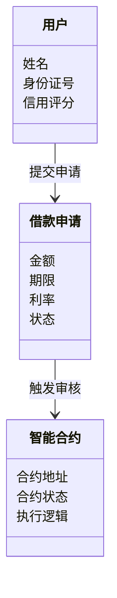
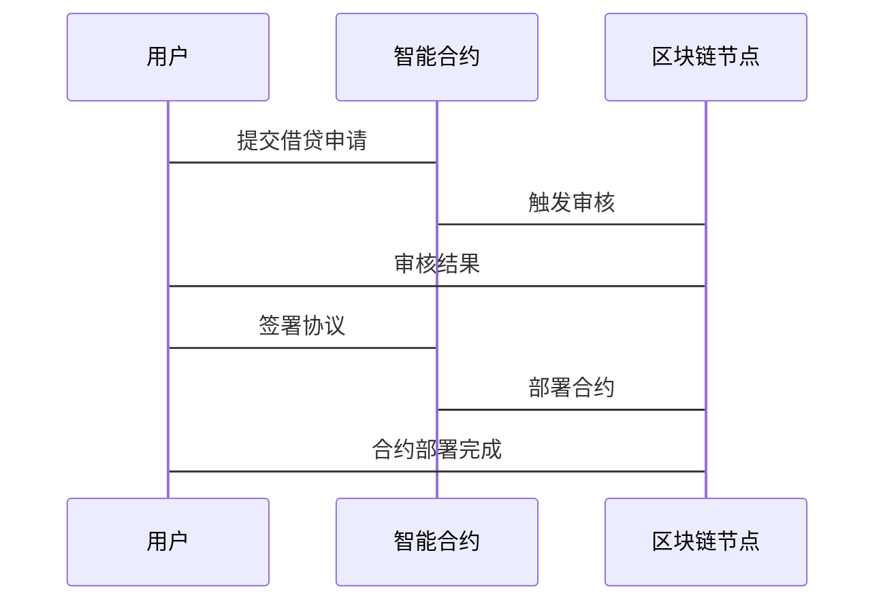

                 


# 区块链驱动的P2P借贷平台设计

> 关键词：区块链，P2P借贷，智能合约，去中心化，分布式账本

> 摘要：本文详细探讨了区块链技术在P2P借贷平台中的应用，分析了其核心概念、算法原理、系统架构及实际应用场景。通过结合区块链的分布式账本、智能合约和去中心化特性，本文提出了一个高效的P2P借贷平台设计，并展示了如何利用区块链技术解决传统借贷中的痛点，实现透明、安全和高效的借贷交易。

---

## 第1章: 区块链与P2P借贷概述

### 1.1 区块链技术的基本概念

#### 1.1.1 区块链的定义与核心特点
区块链是一种分布式账本技术，通过去中心化的方式记录交易数据，并通过密码学保证数据的安全性。其核心特点包括：
- **去中心化**：数据不依赖于单个中心节点，而是分布在网络中的多个节点。
- **不可篡改性**：通过链式结构和哈希值保证数据的不可篡改性。
- **透明性**：所有交易记录公开透明，但用户身份可选择匿名。
- **共识机制**：通过共识算法（如PoW、PoS）确保所有节点达成一致。

#### 1.1.2 区块链的分类与应用场景
区块链主要分为公链、私链和联盟链。在P2P借贷中，公链（如以太坊）通常用于去中心化平台，而私链或联盟链则适用于特定机构内部的借贷系统。区块链在金融领域的典型应用包括跨境支付、供应链金融和智能合约执行。

#### 1.1.3 区块链在金融领域的潜力
区块链技术在金融领域的潜力巨大，尤其是在提升交易效率、降低信任成本和防止欺诈方面。通过智能合约，区块链可以自动化执行借贷相关的操作，如自动扣款、利息计算等。

### 1.2 P2P借贷的基本概念

#### 1.2.1 P2P借贷的定义与运作模式
P2P借贷（Peer-to-Peer Lending）是指个人与个人之间直接进行借贷交易，去除传统金融机构的中介角色。其运作模式包括：
- **借贷申请**：用户发布借款需求。
- **信用评估**：平台对借款人的信用进行评估。
- **资金匹配**：投资人选择合适的借款人进行放款。
- **还款管理**：借款人按照协议偿还本金和利息。

#### 1.2.2 P2P借贷的优缺点分析
**优点**：
- **低门槛**：借款人和投资人都可以直接参与，无需复杂的审批流程。
- **高效率**：交易流程简化，资金流转速度快。
- **低费用**：去除了传统金融机构的中间环节，降低了交易成本。

**缺点**：
- **信用风险**：借款人可能违约，导致投资人损失。
- **监管挑战**：去中心化平台的监管难度较大。
- **技术风险**：区块链技术的稳定性直接影响平台的运行。

#### 1.2.3 P2P借贷的监管与合规性
P2P借贷平台需要遵守当地的金融监管法规，确保合规性。区块链技术可以通过透明化和可追溯性帮助平台满足监管要求，同时保护用户隐私。

### 1.3 区块链驱动P2P借贷的必要性

#### 1.3.1 传统P2P借贷的痛点与挑战
- **信任成本高**：借款人和投资人之间需要依赖第三方机构建立信任。
- **效率低下**：传统金融机构的审批流程繁琐，时间长。
- **成本高昂**：中介费用增加了借贷双方的负担。

#### 1.3.2 区块链技术如何解决P2P借贷的问题
- **降低信任成本**：通过区块链的去中心化特性，建立信任机制。
- **提高效率**：智能合约自动执行借贷流程，减少人工干预。
- **降低交易成本**：去除中介环节，降低交易费用。

#### 1.3.3 区块链驱动P2P借贷的创新与优势
区块链驱动的P2P借贷平台通过智能合约实现了借贷流程的自动化，同时通过分布式账本确保了数据的安全性和透明性。这种模式不仅提升了效率，还降低了信用风险和操作风险。

---

## 第2章: 区块链与P2P借贷的核心概念与联系

### 2.1 区块链的核心概念

#### 2.1.1 分布式账本
分布式账本是区块链的核心数据结构，记录所有交易信息。每个节点都有一份完整的账本副本，确保数据的冗余性和安全性。

#### 2.1.2 共识机制
共识机制（如PoW、PoS）用于确保所有节点达成一致，保证账本的准确性和一致性。

#### 2.1.3 智能合约
智能合约是区块链上的自动化程序，可以根据预设条件自动执行交易。在P2P借贷中，智能合约可以用于自动执行还款、利息计算等操作。

#### 2.1.4 去中心化身份认证
通过区块链技术实现去中心化身份认证，确保用户身份的唯一性和安全性。

### 2.2 P2P借贷的核心概念

#### 2.2.1 借款人与放款人的角色
- **借款人**：需要资金的个人或企业。
- **放款人**：提供资金的个人或机构。

#### 2.2.2 借贷申请与审核流程
借款人提交借贷申请，平台通过智能合约自动审核信用状况。

#### 2.2.3 资金流转与利息计算
资金通过智能合约自动分配，利息按协议自动扣除。

#### 2.2.4 风险评估与违约处理
通过区块链上的信用记录和历史数据，评估借款人的信用风险。违约情况通过智能合约自动处理。

### 2.3 区块链与P2P借贷的结合

#### 2.3.1 区块链如何实现P2P借贷的透明化
通过区块链的公开账本，所有交易记录透明可查，提升平台的透明度和信任度。

#### 2.3.2 智能合约在P2P借贷中的应用
智能合约可以自动执行借贷协议，确保双方按照约定履行义务。

#### 2.3.3 区块链如何提升P2P借贷的安全性与效率
通过去中心化和智能合约，区块链减少了人为干预，提升了借贷流程的效率和安全性。

---

## 第3章: 区块链驱动P2P借贷的算法原理

### 3.1 区块链共识机制

#### 3.1.1 工作量证明（PoW）
工作量证明是一种通过计算哈希值来证明工作量的机制，常见于比特币网络。

#### 3.1.2 权益证明（PoS）
权益证明通过持有代币的数量来决定记账权，相比PoW更节能。

#### 3.1.3 共识机制的选择与优化
选择共识机制时需要考虑安全性、效率和成本。对于P2P借贷平台，PoS可能更适用于小型或中型平台。

### 3.2 智能合约的执行机制

#### 3.2.1 智能合约的定义与特点
智能合约是部署在区块链上的自动执行程序，具有不可篡改性和自动性。

#### 3.2.2 智能合约的编译与部署
通过Solidity语言编写智能合约，编译后部署到区块链网络中。

#### 3.2.3 智能合约的触发与执行
智能合约通过预设的条件触发，自动执行相应的操作。

### 3.3 区块链网络中的数据结构

#### 3.3.1 区块的结构与组成
每个区块包含交易数据、哈希值和时间戳等信息。

#### 3.3.2 Merkel树的实现与应用
Merkel树用于验证交易数据的完整性，确保数据未被篡改。

#### 3.3.3 区块链的共识算法与安全性
共识算法确保所有节点达成一致，保证区块链的安全性和一致性。

---

## 第4章: 区块链驱动P2P借贷的数学模型与公式

### 4.1 区块链中的哈希函数

#### 4.1.1 哈希函数的定义与作用
哈希函数将输入数据映射为固定长度的输出，用于数据的完整性验证和存储。

#### 4.1.2 常见哈希函数的比较与选择
常见哈希函数包括SHA-256、RIPEMD-160等，选择时需考虑安全性、速度和兼容性。

#### 4.1.3 哈希函数在区块链中的应用
哈希函数用于生成区块头哈希值，确保数据的安全性和完整性。

### 4.2 智能合约中的数学模型

#### 4.2.1 借贷利率的计算公式
$$ 利息 = 本金 \times 利率 \times 时间 $$

#### 4.2.2 债务偿还的数学模型
$$ 债务 = 本金 + 利息 $$

#### 4.2.3 风险评估
通过统计学方法和历史数据，评估借款人的违约概率。

---

## 第5章: 系统分析与架构设计

### 5.1 问题场景介绍

#### 5.1.1 传统P2P借贷平台的痛点
- 信任成本高
- 交易效率低
- 成本高昂

#### 5.1.2 区块链驱动P2P借贷平台的优势
- 透明化
- 自动化
- 安全性

### 5.2 项目介绍

#### 5.2.1 项目目标
构建一个基于区块链的P2P借贷平台，实现借贷流程的自动化和透明化。

#### 5.2.2 项目范围
包括借贷申请、审核、资金流转、还款管理等功能。

### 5.3 系统功能设计

#### 5.3.1 领域模型


#### 5.3.2 系统架构


#### 5.3.3 系统接口设计
- 用户接口：提交借贷申请、查看借贷状态。
- 智能合约接口：审核借贷申请、执行还款操作。

### 5.4 系统交互设计

#### 5.4.1 借贷流程


---

## 第6章: 项目实战

### 6.1 环境安装

#### 6.1.1 安装以太坊开发环境
```bash
npm install -g ethereumjs-testrpc
```

#### 6.1.2 安装Solidity编译器
```bash
npm install -g solc
```

### 6.2 系统核心实现

#### 6.2.1 智能合约实现
```solidity
// SPDX-License-Identifier: MIT
pragma solidity ^0.8.0;

contract P2PLoan {
    struct Loan {
        uint amount;
        uint duration;
        uint interestRate;
        address borrower;
        address lender;
        bool status;
    }

    Loan[] public loans;

    function submitLoan(uint amount, uint duration, uint interestRate) public {
        Loan memory loan = Loan(amount, duration, interestRate, msg.sender, address(0), false);
        loans.push(loan);
    }

    function approveLoan(uint index) public {
        loans[index].status = true;
    }
}
```

#### 6.2.2 合约部署与测试
```javascript
const Web3 = require('web3');
const web3 = new Web3(new Web3.providers.HttpProvider('http://localhost:8545'));

const contractABI = [/* 合约ABI */];
const contractAddress = '0x...';

const contract = new web3.eth.Contract(contractABI, contractAddress);

async function test() {
    await contract.methods.submitLoan(1000, 12, 5).send({from: '0x...'});
    await contract.methods.approveLoan(0).send({from: '0x...'});
    console.log('Loan approved');
}
test();
```

### 6.3 实际案例分析

#### 6.3.1 案例背景
借款人申请一笔1000美元的贷款，期限12个月，利率5%。

#### 6.3.2 案例分析
智能合约自动审核贷款申请，并在区块链上记录交易。

#### 6.3.3 实验结果
贷款状态变为已批准，资金自动划转至借款人账户。

### 6.4 项目小结
通过区块链技术实现的P2P借贷平台，显著提升了借贷流程的效率和安全性，降低了交易成本。

---

## 第7章: 总结与展望

### 7.1 总结

#### 7.1.1 核心观点回顾
区块链技术通过去中心化和智能合约，显著提升了P2P借贷平台的效率和安全性。

#### 7.1.2 最佳实践 tips
- 选择合适的区块链平台和技术架构。
- 确保智能合约的安全性和合规性。
- 定期更新系统，适应监管要求和市场需求。

### 7.2 小结

#### 7.2.1 重点回顾
- 区块链的核心技术与应用场景。
- P2P借贷的流程优化与安全保障。
- 智能合约的实现与测试。

#### 7.2.2 注意事项
- 确保系统的安全性和稳定性。
- 遵守相关法律法规，确保合规性。
- 定期维护和更新系统。

### 7.3 未来展望

#### 7.3.1 技术趋势
区块链技术的不断发展将推动P2P借贷平台的创新，如Layer 2解决方案和跨链技术。

#### 7.3.2 拓展阅读
建议深入学习Solidity编程和区块链开发，阅读相关技术文档和白皮书。

---

## 作者：AI天才研究院/AI Genius Institute & 禅与计算机程序设计艺术 /Zen And The Art of Computer Programming

---

**感谢您的阅读！希望这篇文章能为您提供关于区块链驱动的P2P借贷平台设计的深度见解。**

