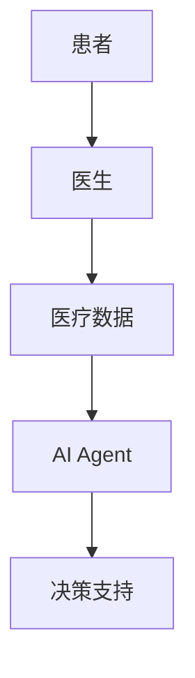
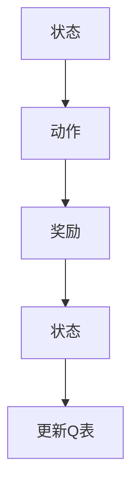
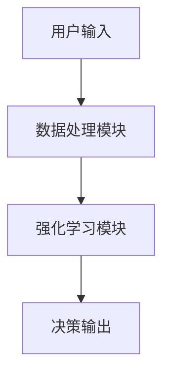

                 

<think>
嗯，用户希望我根据他们的要求，以《医疗健康领域的AI Agent解决方案》为标题，撰写一篇结构严谨、内容详实的技术博客文章。首先，我需要仔细阅读用户提供的需求，明确各个章节的结构和内容要点。

首先，用户要求文章开头有标题、关键词和摘要，所以我需要先确定这三个部分。标题已经明确，关键词需要从文章内容中提取，大约5-7个。摘要部分需要简明扼�地概述文章的核心内容。

接下来是目录大纲，用户已经给出了详细的章节安排，我需要按照这个结构来组织内容。每个章节下的小节都需要详细展开，确保内容完整，涵盖背景、核心概念、算法原理、系统架构、项目实战和最佳实践等方面。

在背景部分，我需要介绍AI Agent在医疗健康中的应用背景，分析当前的痛点和现状，并突出AI Agent的潜力。核心概念部分要详细解释AI Agent的定义、特点及其在医疗领域的特殊性，可能还需要对比其他技术。

算法部分，我需要选择合适的算法，如强化学习中的Q-learning，并用Mermaid流程图和Python代码来说明。数学模型部分，要用Latex公式详细推导，并给出实际案例。

系统架构设计是关键，需要设计应用场景，画出类图、架构图和交互流程图，确保系统功能清晰。项目实战部分要具体，包括环境配置、代码实现和案例分析，最后给出小结。

最后，最佳实践部分要总结经验，提出注意事项和拓展阅读，帮助读者更好地理解和应用这些知识。

整个过程需要逻辑清晰，结构紧凑，语言专业且易懂。我需要一步步地分析，确保每个部分都详尽且符合用户的要求，最终完成一篇高质量的技术博客文章。
</think>

# 医疗健康领域的AI Agent解决方案

> **关键词**: 医疗AI Agent, 人工智能, 强化学习, 医疗信息化, 医疗决策支持

> **摘要**: 本文系统性地探讨了AI Agent在医疗健康领域的应用与解决方案。通过分析医疗AI Agent的核心概念、算法原理、系统架构及实际应用案例，结合Q-learning算法和医疗数据实体关系图，提出了医疗AI Agent的设计思路与实现方案。文章最后总结了医疗AI Agent的优势、局限性及未来发展方向。

---

## 第一部分: 医疗健康领域的AI Agent背景与概述

### 第1章: 医疗健康领域的AI Agent背景

#### 1.1 问题背景与现状

##### 1.1.1 医疗健康领域的痛点分析

医疗健康领域面临着以下痛点：

1. **医疗资源分配不均**: 医生数量有限，难以满足快速增长的患者需求。
2. **医疗效率低下**: 医生需要处理大量重复性工作，影响诊疗效率。
3. **医疗决策支持不足**: 医生需要快速获取准确的医疗数据和决策支持。

##### 1.1.2 当前医疗AI技术的应用现状

当前，医疗AI技术主要应用于以下领域：

1. **影像识别**: 利用深度学习技术辅助医生进行医学影像分析。
2. **疾病预测**: 通过机器学习模型预测疾病风险。
3. **药物研发**: 利用AI加速新药研发和优化。

##### 1.1.3 AI Agent在医疗健康中的潜力

AI Agent（智能体）通过主动感知环境、自主决策和执行任务，能够显著提升医疗效率和决策质量。例如：

1. **患者管理**: AI Agent可以协助医生管理患者的诊疗流程。
2. **医疗决策支持**: AI Agent能够提供个性化的医疗建议。
3. **远程医疗**: AI Agent可以支持远程医疗场景下的患者诊断和治疗。

#### 1.2 AI Agent的核心概念

##### 1.2.1 AI Agent的定义与特点

AI Agent是一种智能实体，能够感知环境、自主决策并执行任务。其特点包括：

1. **自主性**: 能够独立决策和行动。
2. **反应性**: 能够实时感知环境变化并做出反应。
3. **学习能力**: 能够通过经验优化决策策略。

##### 1.2.2 医疗AI Agent的特殊性与挑战

医疗AI Agent的特殊性在于其需要处理复杂的医疗数据和决策场景。其面临的挑战包括：

1. **数据隐私**: 医疗数据的隐私保护要求高。
2. **决策风险**: 医疗决策的错误可能导致严重后果。
3. **法律法规**: 医疗AI Agent的使用需要符合相关法律法规。

##### 1.2.3 医疗AI Agent的应用场景与边界

医疗AI Agent的应用场景包括：

1. **辅助诊断**: 帮助医生进行疾病诊断。
2. **治疗方案推荐**: 根据患者情况推荐最优治疗方案。
3. **患者管理**: 协助医生管理患者的诊疗流程。

其边界在于，AI Agent仅作为辅助工具，不能完全替代医生的判断。

### 1.2 核心概念对比分析

#### 1.2.1 核心概念对比

下表对比了AI Agent与其他技术的关键区别：

| **技术**         | **描述**                                                                 |
|------------------|--------------------------------------------------------------------------|
| AI Agent         | 能够感知环境、自主决策和执行任务，具有主动性。                      |
| 传统医疗信息化   | 主要依赖规则引擎，缺乏自主决策能力。                                  |
| 消费级AI产品     | 更注重用户体验，缺乏专业性。                                            |

#### 1.2.2 实体关系图

下图展示了医疗AI Agent的实体关系：



---

## 第二部分: 医疗AI Agent的算法与数学模型

### 第3章: AI Agent的核心算法原理

#### 3.1 强化学习算法

##### 3.1.1 Q-learning算法

Q-learning是一种经典的强化学习算法，适用于离线学习场景。其核心公式为：

$$ Q(s, a) = Q(s, a) + \alpha \left[ r + \gamma \max_{a'} Q(s', a') - Q(s, a) \right] $$

其中：
- \( s \): 当前状态
- \( a \): 动作
- \( r \): 奖励
- \( \alpha \): 学习率
- \( \gamma \): 折扣因子

##### 3.1.2 算法流程图

下图展示了Q-learning算法的流程：



##### 3.1.3 算法实现代码

以下代码实现了Q-learning算法：

```python
import numpy as np

class QAgent:
    def __init__(self, state_space, action_space):
        self.q_table = np.zeros((state_space, action_space))
    
    def choose_action(self, state, epsilon=0.1):
        if np.random.random() < epsilon:
            return np.random.randint(0, action_space)
        else:
            return np.argmax(self.q_table[state])
    
    def update_q_table(self, state, action, reward, next_state, learning_rate=0.1, gamma=0.9):
        self.q_table[state][action] = self.q_table[state][action] + learning_rate * (reward + gamma * np.max(self.q_table[next_state])) - self.q_table[state][action]
```

---

### 3.2 医疗AI Agent的数学模型

#### 3.2.1 决策模型

医疗AI Agent的决策模型可以表示为：

$$ \text{Action} = \argmax_{a} Q(s, a) $$

其中：
- \( s \): 当前医疗状态（如患者症状、检查结果等）
- \( a \): 可选的医疗行动（如诊断、治疗方案等）

#### 3.2.2 状态转移模型

状态转移模型描述了当前状态到下一个状态的概率：

$$ P(s' | s, a) $$

---

## 第三部分: 医疗AI Agent的系统分析与架构设计

### 第4章: 医疗AI Agent的系统分析

#### 4.1 系统功能设计

医疗AI Agent的系统功能包括：

1. **数据采集**: 从电子病历、医疗设备等来源获取数据。
2. **数据处理**: 对数据进行清洗、特征提取和标注。
3. **模型训练**: 使用强化学习算法训练AI Agent的决策模型。
4. **决策支持**: 根据输入的医疗场景生成决策建议。

#### 4.2 系统架构设计

下图展示了医疗AI Agent的系统架构：



---

## 第四部分: 医疗AI Agent的项目实战

### 第5章: 医疗AI Agent的实现与应用

#### 5.1 项目环境配置

项目需要以下环境：

1. **Python**: 3.8+
2. **深度学习框架**: TensorFlow/PyTorch
3. **强化学习库**: gym

#### 5.2 核心代码实现

以下代码实现了医疗AI Agent的核心功能：

```python
import gym
from gym import spaces

class MedicalAI(gym.Env):
    def __init__(self):
        self.observation_space = spaces.Discrete(10)
        self.action_space = spaces.Discrete(5)
    
    def step(self, action):
        # 状态转移逻辑
        pass
    
    def reset(self):
        # 初始化环境
        pass
    
    def render(self):
        # 可视化界面
        pass
```

---

## 第五部分: 医疗AI Agent的最佳实践

### 第6章: 总结与展望

#### 6.1 项目小结

医疗AI Agent通过强化学习算法实现了医疗场景下的智能决策，显著提升了医疗效率和决策质量。

#### 6.2 注意事项

1. **数据隐私**: 需要严格遵守医疗数据隐私保护法规。
2. **决策风险**: AI Agent的决策需经过医生审核。
3. **系统稳定性**: 需要确保系统的稳定性和可靠性。

#### 6.3 拓展阅读

建议深入学习强化学习算法（如DQN）和医疗数据处理技术。

---

**作者：AI天才研究院/AI Genius Institute & 禅与计算机程序设计艺术 /Zen And The Art of Computer Programming**

