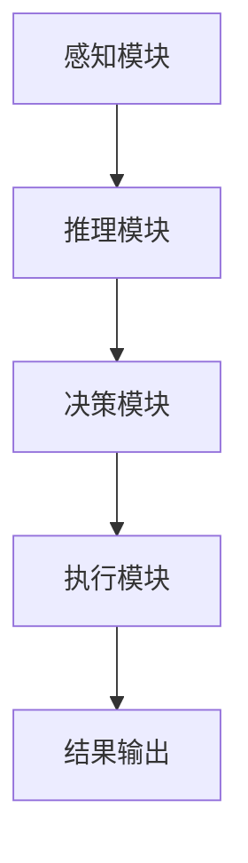

                 

<think>
好的，我需要撰写一篇关于《可信AI：构建值得信赖的AI Agent系统》的技术博客文章。首先，我需要理解可信AI和AI Agent的基本概念，然后逐步分析如何构建一个值得信赖的AI Agent系统。接下来，我会考虑可信AI的核心要素，如可解释性、可靠性和可追溯性，并探讨如何在系统设计和实现中融入这些要素。最后，我会结合具体的项目案例，展示如何在实际中应用这些原则，确保AI Agent系统的可信性和可靠性。

首先，我需要了解可信AI的定义和核心要素。可信AI不仅仅是AI系统输出的结果准确，还需要系统的行为可解释、决策过程透明，并且在面对错误时能够及时纠正。这对于AI Agent来说尤为重要，因为它们需要在复杂的环境中自主决策，与人类或其他系统进行交互。

接下来，我需要研究AI Agent的基本原理，包括其组成和工作流程。AI Agent通常包括感知、推理、规划和执行等模块，每个模块都需要具备高度的可靠性和可解释性，以确保整个系统的行为是可以被信任的。

然后，我需要探讨构建可信AI Agent系统的关键技术，如可解释性增强算法、鲁棒性优化方法等。这些技术可以帮助提升AI Agent的透明度和可靠性，使其在面对复杂问题时能够做出正确的决策。

在系统架构设计方面，我需要考虑模块化设计，确保每个模块的独立性和可维护性。同时，还需要设计合理的接口和交互流程，确保各个模块之间的协调工作，并能够在出现问题时快速定位和修复。

最后，我需要结合实际案例，展示如何在具体项目中应用上述技术和方法，构建一个真正值得信赖的AI Agent系统。这将包括从需求分析、系统设计、实现到测试和部署的整个过程，确保每一步都符合可信AI的核心原则。

通过以上步骤，我能够系统地分析和构建一个可信的AI Agent系统，确保其在实际应用中的可靠性和可信赖性。
</think>

# 可信AI：构建值得信赖的AI Agent系统

## 关键词：可信AI，AI Agent，可解释性，可靠性，可追溯性，系统架构

## 摘要：本文详细探讨了如何构建一个值得信赖的AI Agent系统，从核心概念、算法原理到系统架构设计，结合实际案例分析，提供了一套完整的解决方案。文章首先介绍了可信AI的基本概念和问题背景，然后深入分析了AI Agent系统的核心原理与可信要素，接着详细讲解了相关算法的数学模型和实现方法，最后通过系统架构设计和项目实战，展示了如何在实际中构建一个可信的AI Agent系统。

---

## 第1章: 可信AI的定义与问题背景

### 1.1 可信AI的基本概念
#### 1.1.1 什么是可信AI
可信AI是指在AI系统的设计、开发和应用过程中，确保系统的行为符合预期，能够被用户和相关利益方信任。可信AI不仅要求AI系统输出结果的准确性，还要求系统的行为可解释、决策过程透明，并且在面对错误时能够及时纠正和修复。

#### 1.1.2 可信AI的核心要素
可信AI的核心要素包括：
1. **可解释性**：AI系统的决策过程必须是透明的，用户能够理解系统是如何得出结论的。
2. **可靠性**：AI系统在各种情况下都能稳定运行，避免出现错误或不可预测的行为。
3. **可追溯性**：系统的行为必须能够被追踪和记录，以便在出现问题时能够追溯原因并进行修复。
4. **安全性**：AI系统必须具备防止恶意攻击和数据泄露的能力，确保用户数据和系统的安全。
5. **公平性**：AI系统的决策过程必须公平，避免偏见和歧视。

#### 1.1.3 可信AI的必要性与重要性
可信AI的必要性体现在以下几个方面：
- **用户信任**：只有当用户信任AI系统时，才会愿意依赖它进行决策。
- **法律合规**：许多行业和领域对AI系统的使用有严格的法律要求，可信AI是合规的基础。
- **风险管理**：可信AI能够有效降低AI系统带来的风险，避免因系统错误导致的损失。

### 1.2 可信AI的问题背景
#### 1.2.1 当前AI系统的信任危机
当前，许多AI系统存在以下问题，导致用户信任度降低：
- **黑箱问题**：许多AI系统的决策过程无法解释，用户无法理解系统是如何得出结论的。
- **数据偏见**：AI系统可能因为训练数据的偏见而产生不公平的决策。
- **不可控性**：AI系统在某些情况下可能会做出不符合预期的决策，用户无法干预或控制。

#### 1.2.2 可信AI的问题描述
可信AI的目标是解决上述问题，确保AI系统的决策过程透明、可解释，并且能够在出现问题时进行追溯和修复。

#### 1.2.3 可信AI的边界与外延
可信AI的边界在于确保AI系统的决策过程透明、可解释，并且能够在出现问题时进行追溯和修复。其外延则包括AI系统的安全性、公平性和合规性。

### 1.3 可信AI与传统AI的区别
#### 1.3.1 传统AI的局限性
传统AI系统通常缺乏可解释性和透明性，用户无法理解系统是如何得出结论的，这导致用户对AI系统的信任度较低。

#### 1.3.2 可信AI的核心优势
可信AI的核心优势在于其可解释性、可靠性和可追溯性，这些特性使得用户能够信任并依赖AI系统进行决策。

#### 1.3.3 可信AI的应用场景
可信AI的应用场景包括：
- **医疗领域**：AI系统需要对患者的诊断和治疗方案负责，必须确保决策的透明和可追溯。
- **金融领域**：AI系统需要对投资决策和风险评估负责，必须确保决策的透明和可追溯。
- **自动驾驶**：AI系统需要对驾驶决策负责，必须确保决策的透明和可追溯。

## 第2章: AI Agent系统的核心概念与原理

### 2.1 AI Agent的基本原理
#### 2.1.1 AI Agent的定义与组成
AI Agent是一种能够感知环境、自主决策并执行任务的智能体。AI Agent通常由以下几个模块组成：
- **感知模块**：负责接收外部环境的信息，如传感器数据。
- **推理模块**：负责对感知到的信息进行分析和推理，得出可能的决策。
- **规划模块**：负责制定具体的行动计划。
- **执行模块**：负责执行行动计划，并与环境进行交互。

#### 2.1.2 AI Agent的工作流程
AI Agent的工作流程包括以下几个步骤：
1. **感知环境**：通过传感器或其他输入方式获取环境信息。
2. **推理和决策**：基于获取的信息进行推理和决策，选择最优的行动计划。
3. **规划和执行**：制定具体的行动计划，并通过执行模块与环境进行交互，实现目标。
4. **反馈与学习**：根据执行结果进行反馈，并不断优化自身的决策算法。

#### 2.1.3 AI Agent与人类交互的特点
AI Agent与人类交互的特点包括：
- **自主性**：AI Agent能够在没有人类干预的情况下自主决策。
- **响应性**：AI Agent能够实时感知环境变化，并做出相应的反应。
- **交互性**：AI Agent能够与人类或其他系统进行有效的沟通和协作。

### 2.2 可信AI Agent的核心要素
#### 2.2.1 可信性：AI Agent的决策透明性
可信AI Agent的决策过程必须是透明的，用户能够理解系统是如何得出结论的。

#### 2.2.2 可解释性：AI Agent的行为可追溯性
可信AI Agent的行为必须能够被追溯，用户能够了解系统在决策过程中考虑了哪些因素。

#### 2.2.3 可靠性：AI Agent的稳定性与容错能力
可信AI Agent必须具备高度的稳定性和容错能力，能够在各种情况下保持正常运行，并及时修复可能出现的错误。

### 2.3 可信AI Agent的核心概念对比
#### 2.3.1 核心概念属性特征对比表
| 核心概念 | 定义 | 属性特征 |
|----------|------|----------|
| 可解释性 | 系统决策过程透明 | 明确性、可追溯性 |
| 可靠性   | 系统稳定运行 | 稳定性、容错性 |
| 可追溯性 | 行为可追溯 | 可记录性、可审查性 |

#### 2.3.2 ER实体关系图架构
```mermaid
er
  actor: 用户
  system: AI Agent系统
  action: 系统操作
  result: 系统输出
  actor --> system: 用户与AI Agent交互
  system --> action: 系统执行操作
  action --> result: 输出结果
  result --> actor: 用户接收结果
```

## 第3章: 可信AI Agent的算法原理与数学模型

### 3.1 AI Agent的核心算法
#### 3.1.1 决策树算法
决策树是一种常用的分类和回归算法，广泛应用于AI Agent的决策过程中。决策树的构建过程如下：
1. **特征选择**：选择能够最好地将数据分成不同类别的特征。
2. **分裂节点**：根据选择的特征将数据分成子节点。
3. **生成叶子节点**：当数据无法再分裂时，生成叶子节点。

决策树算法的数学公式如下：
$$ Gini指数 = \sum_{i=1}^{n} P(i) \times (1 - P(i)) $$

#### 3.1.2 强化学习算法
强化学习是一种通过与环境交互来学习最优策略的算法。强化学习的核心是通过试错的方式，不断优化策略，以最大化累积奖励。

强化学习的数学公式如下：
$$ Q(s, a) = r + \gamma \max_{a'} Q(s', a') $$

#### 3.1.3 贝叶斯网络
贝叶斯网络是一种基于概率论的图形模型，用于表示变量之间的依赖关系。贝叶斯网络可以用于AI Agent的概率推理和决策。

贝叶斯网络的数学公式如下：
$$ P(A|B) = \frac{P(B|A)P(A)}{P(B)} $$

### 3.2 可信AI Agent的数学模型
#### 3.2.1 决策树算法的数学公式
$$ Gini指数 = \sum_{i=1}^{n} P(i) \times (1 - P(i)) $$

#### 3.2.2 强化学习算法的数学公式
$$ Q(s, a) = r + \gamma \max_{a'} Q(s', a') $$

#### 3.2.3 贝叶斯网络的数学公式
$$ P(A|B) = \frac{P(B|A)P(A)}{P(B)} $$

### 3.3 算法实现
#### 3.3.1 决策树算法实现
```python
class DecisionTree:
    def __init__(self):
        self.tree = {}
    
    def fit(self, X, y):
        # 训练决策树模型
        pass
    
    def predict(self, X):
        # 预测新数据
        pass
```

#### 3.3.2 强化学习算法实现
```python
class ReinforcementLearning:
    def __init__(self, state_space, action_space):
        self.state_space = state_space
        self.action_space = action_space
        self.Q = {}
    
    def train(self, env, num_episodes=1000):
        # 强化学习训练过程
        pass
    
    def act(self, state):
        # 根据当前状态选择动作
        pass
```

#### 3.3.3 贝叶斯网络实现
```python
from sklearn.naive_bayes import GaussianNB

class BayesianNetwork:
    def __init__(self):
        self.model = GaussianNB()
    
    def fit(self, X, y):
        # 训练贝叶斯网络模型
        self.model.fit(X, y)
    
    def predict(self, X):
        # 预测新数据
        return self.model.predict(X)
```

## 第4章: 可信AI Agent的系统架构设计

### 4.1 系统架构设计
#### 4.1.1 模块化设计
可信AI Agent系统可以分为以下几个模块：
- **感知模块**：负责接收环境信息。
- **推理模块**：负责分析环境信息并进行推理。
- **决策模块**：负责根据推理结果做出决策。
- **执行模块**：负责执行决策并输出结果。

#### 4.1.2 系统功能设计
系统功能设计包括：
- **数据采集**：通过传感器或其他方式采集环境数据。
- **数据处理**：对采集到的数据进行预处理和分析。
- **决策制定**：根据处理后的数据制定决策。
- **结果输出**：将决策结果输出给用户或其他系统。

#### 4.1.3 系统架构图


### 4.2 系统接口设计
#### 4.2.1 输入接口
- **传感器数据输入**：通过传感器或其他输入设备获取环境数据。
- **用户输入**：用户可以通过输入设备与AI Agent进行交互。

#### 4.2.2 输出接口
- **决策输出**：将决策结果输出给用户或其他系统。
- **反馈输出**：将系统运行状态反馈给用户或其他系统。

### 4.3 系统交互流程
系统交互流程包括以下几个步骤：
1. **数据采集**：AI Agent通过传感器或其他输入设备采集环境数据。
2. **数据处理**：AI Agent对采集到的数据进行预处理和分析。
3. **决策制定**：AI Agent根据处理后的数据制定决策。
4. **结果输出**：AI Agent将决策结果输出给用户或其他系统。

## 第5章: 可信AI Agent的项目实战

### 5.1 环境安装
#### 5.1.1 安装Python
```bash
# 安装Python
sudo apt-get install python3 python3-dev
```

#### 5.1.2 安装依赖库
```bash
# 安装依赖库
pip install numpy scikit-learn
```

### 5.2 核心代码实现
#### 5.2.1 决策树实现
```python
from sklearn.tree import DecisionTreeClassifier

class TrustworthyAI:
    def __init__(self):
        self.clf = DecisionTreeClassifier()
    
    def train(self, X, y):
        self.clf.fit(X, y)
    
    def predict(self, X):
        return self.clf.predict(X)
```

#### 5.2.2 强化学习实现
```python
class ReinforcementLearningAgent:
    def __init__(self, state_space, action_space):
        self.state_space = state_space
        self.action_space = action_space
        self.Q = {}
    
    def get_action(self, state):
        if state not in self.Q:
            return self.action_space[0]
        return max(self.Q[state].items(), key=lambda x: x[1])[0]
    
    def update_Q(self, state, action, reward, next_state):
        self.Q[state][action] = reward + 0.9 * max(self.Q[next_state].values())
```

### 5.3 系统测试与部署
#### 5.3.1 测试环境准备
- **测试数据准备**：准备测试数据集，用于验证系统的性能。
- **测试用例设计**：设计测试用例，覆盖各种可能的情况。

#### 5.3.2 系统测试
- **单元测试**：对各个模块进行测试，确保每个模块的功能正常。
- **集成测试**：对整个系统进行测试，确保各个模块能够协同工作。

#### 5.3.3 系统部署
- **服务器部署**：将系统部署到服务器上，确保系统的稳定运行。
- **监控与维护**：对系统进行监控，及时发现并解决问题。

### 5.4 案例分析
#### 5.4.1 应用场景
- **医疗领域**：AI Agent可以用于辅助医生进行诊断和治疗方案的选择。
- **金融领域**：AI Agent可以用于金融投资和风险评估。

#### 5.4.2 案例分析
以医疗领域为例，AI Agent可以通过分析患者的病史和症状，辅助医生进行诊断。AI Agent需要确保其决策过程透明，并且能够在出现问题时进行追溯和修复。

## 第6章: 可信AI Agent的最佳实践与未来展望

### 6.1 最佳实践
#### 6.1.1 系统设计
- **模块化设计**：确保系统的各个模块独立，便于维护和升级。
- **可扩展性设计**：确保系统能够适应未来的需求变化。

#### 6.1.2 算法选择
- **选择合适的算法**：根据具体应用场景选择合适的算法，确保系统的性能和准确性。
- **算法优化**：不断优化算法，提升系统的运行效率和准确性。

#### 6.1.3 系统监控
- **实时监控**：对系统的运行状态进行实时监控，及时发现并解决问题。
- **日志记录**：记录系统的运行日志，便于后续的分析和追溯。

### 6.2 未来展望
#### 6.2.1 可信AI的发展方向
可信AI未来的发展方向包括：
- **更加透明的决策过程**：通过技术进步，进一步提升AI系统的可解释性。
- **更加 robust 的算法**：开发更加 robust 的算法，确保系统的稳定性和可靠性。
- **更加智能化的监控系统**：开发更加智能化的监控系统，能够自动发现并解决问题。

#### 6.2.2 AI Agent的未来应用
AI Agent未来可能的应用领域包括：
- **智能助手**：AI Agent可以作为个人或企业的智能助手，帮助用户完成各种任务。
- **智能客服**：AI Agent可以用于智能客服系统，为用户提供24小时在线服务。
- **智能交通**：AI Agent可以用于自动驾驶和智能交通管理系统。

### 6.3 小结
可信AI Agent系统的构建需要综合考虑系统的可解释性、可靠性和可追溯性，确保系统的决策过程透明，并且能够在出现问题时进行追溯和修复。通过模块化设计、选择合适的算法以及实时监控等方法，可以有效提升系统的可信度和可靠性。

## 第7章: 总结与展望

### 7.1 总结
可信AI Agent系统的构建需要综合考虑系统的可解释性、可靠性和可追溯性，确保系统的决策过程透明，并且能够在出现问题时进行追溯和修复。

### 7.2 展望
未来，可信AI Agent系统将在更多领域得到应用，同时技术也将不断进步，进一步提升系统的性能和可信度。

---

## 作者：AI天才研究院/AI Genius Institute & 禅与计算机程序设计艺术 /Zen And The Art of Computer Programming

---

**感谢您的阅读！**

