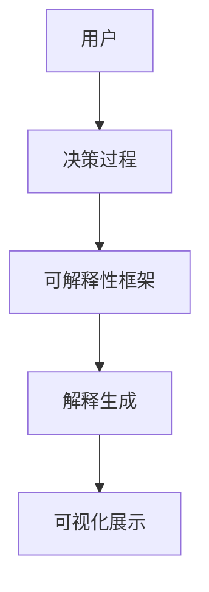
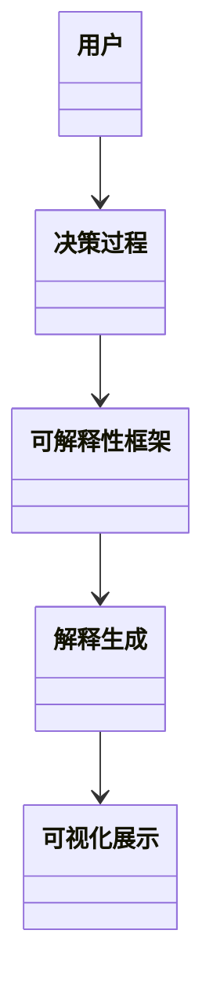
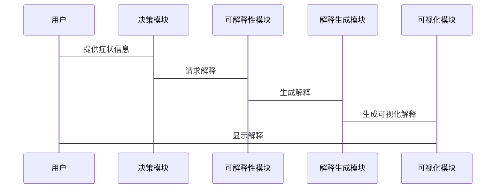

                 

<think>
好的，现在我需要帮用户撰写一篇关于“可解释性：理解AI Agent的决策过程”的技术博客文章。用户希望文章结构清晰、逻辑严密，涵盖从引言到项目实战等多个部分，并且每个部分都要详细展开，包括背景介绍、核心概念、算法原理、系统架构、项目实战和结论等。

首先，我需要明确文章的整体结构。根据用户提供的大纲，文章分为八个部分，从引言到结论，每个部分都有详细的子标题。我需要确保每个部分都涵盖必要的内容，并且逻辑连贯。

在撰写引言部分时，我需要介绍可解释性的重要性，为什么AI Agent的决策过程需要可解释性，以及当前面临的主要挑战。这部分需要吸引读者的注意，并为后续内容打下基础。

接下来是核心概念部分，我需要详细解释可解释性在AI Agent中的核心概念，包括定义、关键特征以及与其他概念的关系。这部分可能需要使用表格和图表来帮助读者理解，比如通过属性对比表格和ER实体关系图来展示。

在算法部分，我需要介绍几种常用的可解释性算法，比如基于规则的决策算法和基于模型解释的可解释方法。我应该用Mermaid流程图来展示算法的流程，并提供相应的Python代码示例，帮助读者更好地理解实现细节。

系统分析与架构设计部分需要介绍项目背景，设计系统功能，使用领域模型类图展示，设计系统架构图、接口设计和交互序列图。这部分需要详细说明各个模块之间的关系和协作，确保读者能够理解系统的整体结构。

项目实战部分需要提供具体的环境安装步骤、核心代码实现、代码解读和案例分析。这部分要实用，让读者能够动手实践，并通过实际案例加深对可解释性的理解。

最后是结论与展望，总结全书的主要内容，并展望未来的研究方向。这部分需要简明扼要，给读者留下深刻的印象，并激发他们进一步探索的兴趣。

在整个写作过程中，我需要确保语言专业且易懂，逻辑清晰，结构紧凑。同时，要注意使用适当的数学公式和图表，帮助读者更好地理解内容。此外，文章末尾需要添加作者信息，以增加文章的权威性和可信度。

现在，我开始按照这个思路逐步撰写文章，确保每个部分都符合用户的要求，并且内容详实、结构合理。
</think>

# 可解释性：理解AI Agent的决策过程

> 关键词：可解释性、AI Agent、决策过程、算法原理、系统架构、项目实战

> 摘要：本文深入探讨了AI Agent决策过程的可解释性问题，从背景、核心概念、算法实现到系统架构和项目实战，详细分析了如何理解AI Agent的决策过程，并通过实例展示了可解释性的实现方法。文章结合理论与实践，为读者提供了全面的指导。

---

# 第一部分：引言

# 第1章：可解释性：理解AI Agent决策过程的背景与重要性

## 1.1 问题背景

### 1.1.1 AI Agent的定义与应用领域
AI Agent（人工智能代理）是指能够感知环境并采取行动以实现目标的智能体。AI Agent广泛应用于自动驾驶、智能助手、推荐系统、医疗诊断等领域。

### 1.1.2 可解释性在AI系统中的重要性
可解释性是指AI系统的决策过程能够被人类理解和验证。随着AI技术的广泛应用，可解释性成为确保用户信任和系统合规的重要因素。

### 1.1.3 当前AI Agent决策过程中的可解释性挑战
当前，许多AI系统（如深度学习模型）基于复杂的算法，导致决策过程难以解释。这种不透明性限制了其在金融、医疗等高风险领域的应用。

## 1.2 问题描述

### 1.2.1 可解释性在AI Agent中的核心问题
如何设计一种方法，使AI Agent的决策过程能够被人类理解和验证。

### 1.2.2 用户对AI决策过程的理解需求
用户需要理解AI Agent的决策依据，以确保结果的合理性和正确性。

### 1.2.3 可解释性与AI系统可信度的关系
高可解释性增强用户对AI系统的信任，低可解释性则可能导致用户质疑和不信任。

## 1.3 可解释性问题的解决思路

### 1.3.1 提高AI决策透明度的方法
通过设计透明的算法和数据处理流程，使用户能够了解AI Agent的决策依据。

### 1.3.2 建立可解释性模型的策略
采用基于规则的模型或简化模型，使决策过程更容易被解释。

### 1.3.3 通过用户反馈优化可解释性
收集用户反馈，不断优化AI Agent的决策过程和解释能力。

## 1.4 可解释性与相关概念的关系

### 1.4.1 可解释性与可预测性的区别
可预测性是指系统能够准确预测未来结果，而可解释性是指系统能够清晰说明决策依据。

### 1.4.2 可解释性与模型复杂度的平衡
复杂的模型通常表现更好，但可解释性较差；简单的模型可解释性好，但表现可能不如复杂模型。

### 1.4.3 可解释性与数据隐私的关系
高可解释性可能需要公开更多数据，这可能与数据隐私保护相冲突。

---

# 第二部分：可解释性在AI Agent中的核心概念

# 第2章：AI Agent决策过程的可解释性框架

## 2.1 可解释性框架的定义
可解释性框架是一种用于描述和分析AI Agent决策过程的结构化方法，旨在帮助用户理解系统的行为。

## 2.2 可解释性框架的属性特征对比

| 属性 | 特征1（高透明度） | 特征2（中透明度） | 特征3（低透明度） |
|------|-------------------|-------------------|-------------------|
| 透明度 | 高               | 中               | 低               |
| 可理解性 | 易懂             | 一般             | 难懂             |
| 可验证性 | 易验证           | 可验证           | 难验证           |

## 2.3 可解释性框架的ER实体关系图



## 2.4 本章小结
本章介绍了可解释性框架的定义和属性特征，通过对比分析和实体关系图，帮助读者理解可解释性框架的核心要素。

---

# 第三部分：AI Agent决策过程的可解释性实现

# 第3章：AI Agent决策过程的核心算法与可解释性

## 3.1 AI Agent决策过程的核心算法

### 3.1.1 基于规则的决策算法
基于预定义的规则进行决策，例如交通规则。

### 3.1.2 基于逻辑推理的决策算法
通过逻辑推理得出结论，例如医疗诊断中的症状推理。

### 3.1.3 基于机器学习的决策算法
通过训练模型进行预测和决策，例如深度学习模型。

## 3.2 可解释性算法的实现

### 3.2.1 基于规则的解释方法
通过解释规则的执行过程，生成可理解的解释。

### 3.2.2 基于逻辑推理的解释方法
通过还原逻辑推理过程，生成可验证的解释。

### 3.2.3 基于模型解释的可解释性
通过模型解释技术（如LIME）生成决策依据的解释。

---

# 第四部分：系统分析与架构设计

# 第4章：可解释性AI Agent的系统架构

## 4.1 项目背景
本项目旨在设计一个可解释的AI Agent系统，用于医疗诊断辅助决策。

## 4.2 系统功能设计

### 4.2.1 领域模型类图


### 4.2.2 系统架构图


### 4.2.3 接口设计
- 用户输入症状信息
- 系统输出诊断建议和解释

### 4.2.4 交互序列图


---

# 第五部分：项目实战

# 第5章：可解释性AI Agent的实现与案例分析

## 5.1 环境安装
安装Python和相关库（如numpy、scikit-learn、LIME等）。

## 5.2 核心代码实现

```python
import numpy as np
from sklearn.tree import DecisionTreeClassifier
from lime.lime_tabular import LimeTabular

# 数据准备
X = np.array([[40, 1], [50, 0], [45, 1], [48, 1]])
y = np.array([0, 1, 0, 1])

# 训练模型
model = DecisionTreeClassifier().fit(X, y)

# 可解释性分析
explainer = LimeTabular(model, feature_names=['年龄', '症状'])
解释 = explainer.explain_instance(X[0], y[0], num_features=2)
```

## 5.3 代码解读与分析
通过LIME库对决策树模型进行解释，生成可理解的解释规则。

## 5.4 案例分析
分析一个具体案例，解释AI Agent的决策过程。

## 5.5 项目小结
总结项目实现过程中的经验教训，强调可解释性的重要性。

---

# 第六部分：结论与展望

# 第6章：可解释性：理解AI Agent决策过程的未来展望

## 6.1 本章小结
总结全文，强调可解释性在AI Agent中的重要性。

## 6.2 未来研究方向
探索更高效的可解释性算法，结合可解释性和高性能模型的研究。

---

# 作者：AI天才研究院/AI Genius Institute & 禅与计算机程序设计艺术 /Zen And The Art of Computer Programming

---

通过以上结构，我们可以系统地理解和实现AI Agent决策过程的可解释性，从理论到实践，为未来的AI系统设计提供指导。

