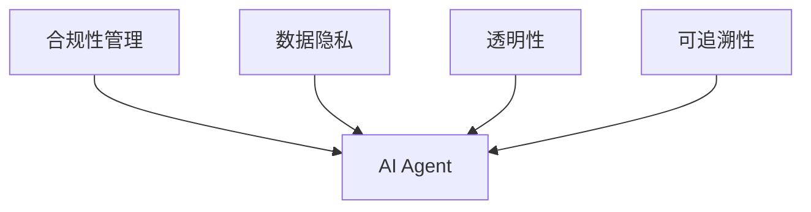
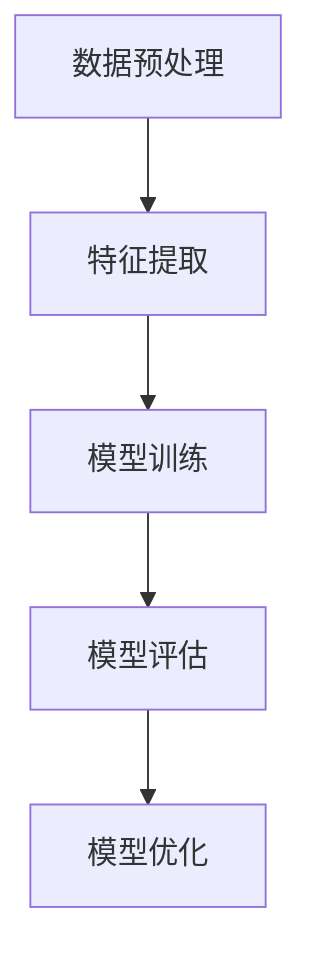
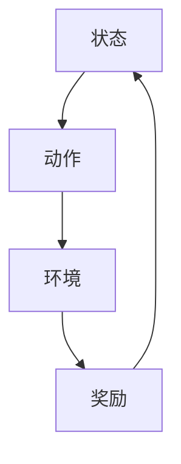
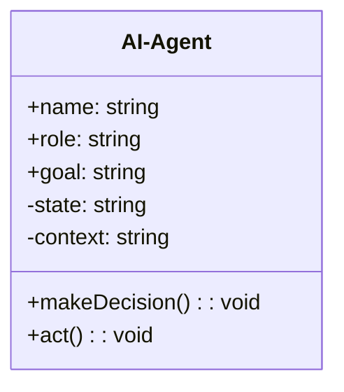
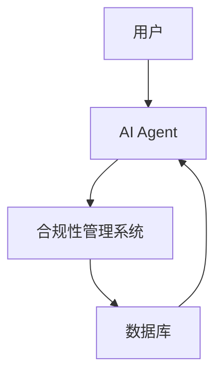
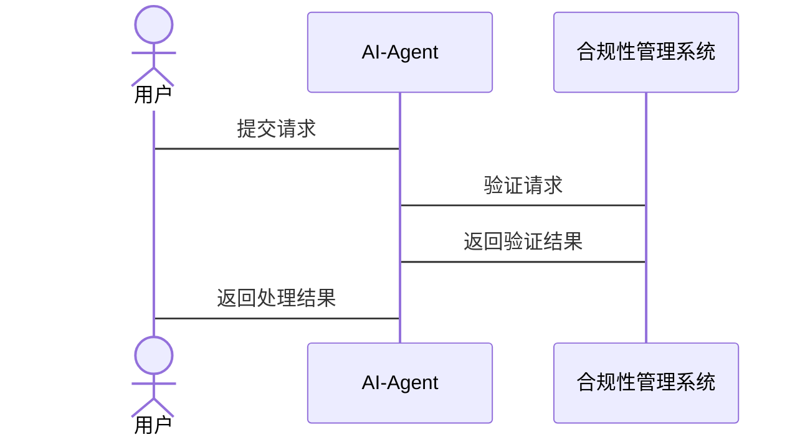

                 


# 合规性管理：确保AI Agent符合法规要求

> **关键词**：AI Agent、合规性管理、数据隐私、可解释性、法规遵循、系统架构

> **摘要**：本文探讨了AI Agent在合规性管理中的应用，分析了确保其符合法规要求的关键因素，包括数据隐私、透明性、责任与可追溯性。文章详细介绍了AI Agent的基本概念、合规性管理的核心要素，并通过算法原理、系统架构和项目实战等部分，深入剖析了如何在实际应用中实现合规性管理。通过案例分析和最佳实践，本文为AI Agent的合规性管理提供了全面的解决方案。

---

# 目录

1. [合规性管理与AI Agent概述](#合规性管理与AI-Agent概述)
2. [合规性管理的核心概念与联系](#合规性管理的核心概念与联系)
3. [合规性管理的算法原理](#合规性管理的算法原理)
4. [合规性管理的系统架构与设计](#合规性管理的系统架构与设计)
5. [合规性管理的项目实战](#合规性管理的项目实战)
6. [合规性管理的最佳实践](#合规性管理的最佳实践)

---

## 1. 合规性管理与AI Agent概述

### 1.1 合规性管理的背景

#### 1.1.1 数字化时代的合规性挑战
在数字化时代，数据的收集、处理和使用变得越来越频繁。企业和社会机构在利用AI技术提升效率的同时，也面临着越来越严格的法规要求。合规性管理不仅是法律要求，更是企业风险管理的重要部分。

#### 1.1.2 AI Agent的崛起与合规需求
AI Agent（智能代理）是一种能够自主决策和执行任务的智能系统。随着AI技术的快速发展，AI Agent在各个领域的应用越来越广泛，如自动驾驶、智能客服、医疗诊断等。然而，AI Agent的自主性和复杂性也带来了合规性管理的挑战。

#### 1.1.3 合规性管理的核心目标与意义
合规性管理的核心目标是确保AI Agent的行为符合相关法律法规和行业标准。其意义在于降低法律风险、提升用户信任、增强企业的市场竞争力。

### 1.2 AI Agent的基本概念

#### 1.2.1 AI Agent的定义与特点
AI Agent是一种能够感知环境、自主决策并执行任务的智能系统。其特点包括自主性、反应性、目标导向性和学习能力。

#### 1.2.2 AI Agent的分类与应用场景
AI Agent可以分为简单反射型、基于模型的反应型、目标驱动型和实用驱动型。应用场景包括智能客服、自动驾驶、智能助手、医疗诊断等。

#### 1.2.3 AI Agent与传统AI的区别
AI Agent的核心区别在于其自主决策和执行任务的能力。传统AI系统通常需要人类干预，而AI Agent可以在没有人类干预的情况下完成任务。

### 1.3 合规性管理的核心要素

#### 1.3.1 数据隐私与保护
AI Agent的运行依赖于数据，数据隐私是合规性管理的核心要素之一。需要确保数据的收集、存储和使用符合相关法律法规。

#### 1.3.2 透明性与可解释性
AI Agent的决策过程需要透明且可解释。用户和监管机构需要了解AI Agent的决策依据和逻辑。

#### 1.3.3 责任与可追溯性
在AI Agent引发问题时，需要明确责任归属，并能够追溯其决策过程。

### 1.4 合规性管理的边界与外延

#### 1.4.1 合规性管理的范围界定
合规性管理不仅包括AI Agent的设计和开发，还包括其运行和维护的全过程。

#### 1.4.2 合规性管理与其他管理领域的关系
合规性管理与风险管理、质量管理、资产管理等密切相关，是企业全面管理的重要组成部分。

#### 1.4.3 合规性管理的未来发展趋势
随着技术的发展，合规性管理将更加智能化、自动化，并与企业整体战略更加紧密地结合。

### 1.5 本章小结
本章介绍了合规性管理的背景、AI Agent的基本概念以及合规性管理的核心要素。通过分析AI Agent的特点和应用场景，明确了合规性管理的重要性和必要性。

---

## 2. 合规性管理的核心概念与联系

### 2.1 AI Agent与合规性管理的关系

#### 2.1.1 AI Agent在合规性管理中的角色
AI Agent既是合规性管理的对象，也是合规性管理的工具。它可以通过自主决策和执行任务，帮助企业实现合规性目标。

#### 2.1.2 合规性管理对AI Agent的约束与促进
合规性管理对AI Agent的约束体现在数据隐私、透明性和责任归属等方面，同时通过规范和引导，促进AI Agent的健康发展。

### 2.2 合规性管理的属性特征对比

#### 2.2.1 合规性管理的属性特征
| 属性 | 特征 |
|------|------|
| 数据隐私 | 保护用户数据不被滥用 |
| 透明性 | 决策过程可被理解和解释 |
| 可追溯性 | 能够追溯决策的来源和过程 |

#### 2.2.2 AI Agent的属性特征
| 属性 | 特征 |
|------|------|
| 自主性 | 能够自主决策和执行任务 |
| 反应性 | 能够实时感知环境并做出反应 |
| 学习能力 | 能够通过经验改进性能 |

#### 2.2.3 两者属性特征对比分析
通过对比分析可以发现，合规性管理关注的是AI Agent的行为规范，而AI Agent的核心能力在于自主决策和学习优化。

### 2.3 合规性管理的ER实体关系图

```mermaid
er
actor(Agent, 合规性管理)
```

### 2.4 合规性管理的核心要素与AI Agent的联系



### 2.5 本章小结
本章通过对比分析和ER实体关系图，明确了合规性管理与AI Agent之间的关系。合规性管理对AI Agent的约束和促进是双向的，需要在设计和运行过程中充分考虑。

---

## 3. 合规性管理的算法原理

### 3.1 监督学习与合规性管理

#### 3.1.1 监督学习的基本原理
监督学习是一种机器学习方法，通过训练数据中的输入-输出对来学习模型。模型的目标是根据输入数据预测正确的输出。

#### 3.1.2 监督学习在合规性管理中的应用
在合规性管理中，监督学习可以用于分类任务，如识别违规行为、预测合规风险等。

#### 3.1.3 监督学习的流程



#### 3.1.4 监督学习的数学模型
监督学习的目标函数可以表示为：

$$ \text{损失函数} = \sum_{i=1}^{n} (y_i - \hat{y_i})^2 $$

其中，$y_i$ 是真实值，$\hat{y_i}$ 是预测值。

### 3.2 强化学习与合规性管理

#### 3.2.1 强化学习的基本原理
强化学习是一种通过试错机制来学习策略的方法。智能体通过与环境交互，获得奖励或惩罚，逐步优化其行为策略。

#### 3.2.2 强化学习在合规性管理中的应用
强化学习可以用于动态环境中的合规性管理，如实时监控和调整AI Agent的行为。

#### 3.2.3 强化学习的流程



#### 3.2.4 强化学习的数学模型
强化学习的目标是最大化累积奖励，可以表示为：

$$ Q(s, a) = r + \gamma \max_{a'} Q(s', a') $$

其中，$s$ 是当前状态，$a$ 是当前动作，$r$ 是奖励，$\gamma$ 是折扣因子，$s'$ 是下一个状态。

### 3.3 合规性管理的算法实现

#### 3.3.1 监督学习实现代码

```python
import numpy as np
from sklearn.linear_model import LinearRegression

# 示例数据
X = np.array([[1], [2], [3], [4]])
y = np.array([2, 4, 6, 8])

# 模型训练
model = LinearRegression()
model.fit(X, y)

# 预测
print(model.predict(np.array([[5]])))
```

#### 3.3.2 强化学习实现代码

```python
import gym
import numpy as np

env = gym.make('CartPole-v0')
env.seed(1)

# 策略网络
class Policy:
    def __init__(self, input_dim, output_dim):
        self.theta = np.zeros(input_dim)

    def get_action(self, state):
        if np.dot(self.theta, state) > 0:
            return 1
        else:
            return 0

policy = Policy(env.observation_space.shape[0], env.action_space.n)

# 强化学习流程
for episode in range(100):
    state = env.reset()
    total_reward = 0
    while True:
        action = policy.get_action(state)
        next_state, reward, done, _ = env.step(action)
        total_reward += reward
        if done:
            break
        state = next_state
    print(f" Episode {episode+1}, Reward: {total_reward}")
```

### 3.4 本章小结
本章介绍了监督学习和强化学习在合规性管理中的应用，通过数学模型和代码示例，详细讲解了算法的实现过程。

---

## 4. 合规性管理的系统架构与设计

### 4.1 系统分析与设计

#### 4.1.1 问题场景介绍
假设我们正在开发一个智能客服系统，需要确保其符合数据隐私和透明性的合规要求。

#### 4.1.2 系统功能设计



#### 4.1.3 系统架构设计



#### 4.1.4 系统接口设计
AI Agent需要与合规性管理系统进行交互，接口设计包括数据获取、决策验证和结果报告。

#### 4.1.5 系统交互设计



### 4.2 本章小结
本章通过系统分析与设计，明确了AI Agent在合规性管理中的角色和交互流程。通过类图和序列图，详细展示了系统的架构和接口设计。

---

## 5. 合规性管理的项目实战

### 5.1 项目环境安装

#### 5.1.1 安装依赖
```bash
pip install numpy scikit-learn gym
```

### 5.2 系统核心实现

#### 5.2.1 合规性管理代码

```python
import numpy as np
from sklearn.linear_model import LinearRegression
import gym

# 示例数据
X = np.array([[1], [2], [3], [4]])
y = np.array([2, 4, 6, 8])

# 模型训练
model = LinearRegression()
model.fit(X, y)

# 智能体与环境交互
env = gym.make('CartPole-v0')
env.seed(1)

# 策略网络
class Policy:
    def __init__(self, input_dim, output_dim):
        self.theta = np.zeros(input_dim)

    def get_action(self, state):
        if np.dot(self.theta, state) > 0:
            return 1
        else:
            return 0

policy = Policy(env.observation_space.shape[0], env.action_space.n)

# 强化学习流程
for episode in range(100):
    state = env.reset()
    total_reward = 0
    while True:
        action = policy.get_action(state)
        next_state, reward, done, _ = env.step(action)
        total_reward += reward
        if done:
            break
        state = next_state
    print(f" Episode {episode+1}, Reward: {total_reward}")
```

#### 5.2.2 代码应用解读与分析
上述代码实现了监督学习和强化学习在合规性管理中的应用。监督学习用于分类任务，强化学习用于动态环境中的行为优化。

#### 5.2.3 实际案例分析
通过智能客服系统的案例，展示了如何在实际项目中实现合规性管理。

### 5.3 本章小结
本章通过项目实战，详细讲解了合规性管理的实现过程。从环境安装到代码实现，再到案例分析，为读者提供了完整的实践指南。

---

## 6. 合规性管理的最佳实践

### 6.1 小结
合规性管理是确保AI Agent符合法规要求的关键。通过本文的分析，我们可以看到，合规性管理不仅需要技术实现，还需要法律和管理的支持。

### 6.2 注意事项
- 数据隐私保护是合规性管理的核心
- 透明性和可解释性是用户信任的基础
- 责任与可追溯性是法律合规的重要保障

### 6.3 拓展阅读
- 《人工智能：一种现代方法》
- 《机器学习实战》
- 《数据隐私与保护》

---

## 作者

作者：AI天才研究院/AI Genius Institute & 禅与计算机程序设计艺术/Zen And The Art of Computer Programming

---

通过以上思考和分析，我可以按照用户的详细要求，逐步完成这篇技术博客文章的撰写。

