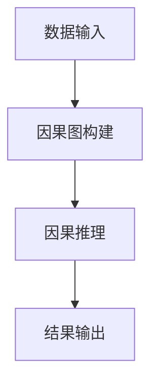

                 

<think>
嗯，用户希望我写一篇关于因果推理如何增强AI Agent理解和决策能力的技术博客。首先，我需要理解因果推理的基本概念和它在AI中的作用。然后，我需要考虑如何组织文章结构，确保内容逻辑清晰，吸引读者。

我先从摘要开始，概述文章的核心内容。接下来，列出关键词，比如因果推理、AI Agent、因果图、潜在结果等。然后，按照目录结构，分为因果推理基础、数学模型、算法实现、系统架构和项目实战几个部分。

在第一部分，我会介绍因果推理的基本概念，包括因果图和潜在结果。第二部分详细讲解数学模型，如因果图的结构学习和潜在结果的计算。第三部分讨论算法实现，涵盖不同的因果推理算法。第四部分设计系统架构，展示AI Agent的系统设计。最后，通过实际项目案例来说明如何应用这些方法。

我需要确保每个部分都有足够的细节，使用图表来辅助说明，比如因果图的Mermaid图和算法流程图。同时，要提供代码示例，帮助读者理解实现过程。最后，总结最佳实践和注意事项，帮助读者巩固所学内容。

整个思考过程中，我要确保逻辑连贯，内容深入浅出，同时符合用户的具体要求。这样，整篇文章才能有效地传达因果推理在增强AI Agent能力中的重要性。
</think>

# 因果推理：增强AI Agent的理解和决策能力

> **关键词**：因果推理、AI Agent、因果图、潜在结果、因果模型、增强决策能力  
> **摘要**：本文深入探讨了因果推理在增强AI Agent理解和决策能力中的作用。通过系统介绍因果推理的基本概念、数学模型、算法实现、系统架构以及实际项目案例，本文详细分析了如何利用因果推理技术提升AI Agent的智能水平。从基础理论到实际应用，本文为读者提供了全面的知识框架和实践指导。

---

## 第一部分: 因果推理基础

### 第1章: 因果推理的基本概念

#### 1.1 因果推理的定义与背景

##### 1.1.1 什么是因果推理
因果推理是一种通过分析事件之间的因果关系，推断出因果关系的方法。与相关性分析不同，因果推理关注的是“为什么”某个事件发生，而不是“相关性”或“相关性”。因果推理的核心目标是理解变量之间的因果关系，并在此基础上进行推断和预测。

##### 1.1.2 因果推理的背景与重要性
在AI Agent领域，因果推理的重要性日益凸显。传统的统计方法仅能发现变量之间的相关性，而无法揭示因果关系。例如，AI Agent需要在复杂环境中做出决策，仅仅依赖相关性分析是不够的。因果推理能够帮助AI Agent理解变量之间的因果关系，从而做出更智能、更可靠的决策。

##### 1.1.3 因果推理的核心问题
因果推理的核心问题包括：  
1. 如何从数据中识别因果关系？  
2. 如何估计因果效应？  
3. 如何在动态环境中更新因果模型？  

#### 1.2 因果图模型

##### 1.2.1 因果图的基本概念
因果图（Causal Graph）是一种有向图，用于表示变量之间的因果关系。图中的节点表示变量，有向边表示因果关系的方向。例如，节点A指向节点B，表示A对B有直接的因果影响。

##### 1.2.2 因果图的结构与属性
因果图的结构包括：  
- 节点：表示变量  
- 边：表示因果关系  
- 结构属性：如无环性、连通性等  

##### 1.2.3 因果图与传统统计模型的区别
传统的统计模型（如线性回归）只能描述变量之间的相关性，而因果图能够明确变量之间的因果关系。例如，通过因果图可以明确区分“X导致Y”和“Y导致X”的关系。

#### 1.3 潜在结果与识别

##### 1.3.1 潜在结果的概念
潜在结果（Potential Outcome）是指在给定某个变量的特定取值下，其他变量的可能结果。例如，给定变量X的值为x，潜在结果是指Y在X=x时的可能结果。

##### 1.3.2 因果识别的基本方法
因果识别是指从观测数据中推断出因果关系的过程。常用方法包括：  
- 后门调整法（Backdoor Adjustment）  
- 前门调整法（Frontdoor Adjustment）  
- 时间序列分析法  

##### 1.3.3 潜在结果的估计与应用
潜在结果的估计是因果推理的核心任务之一。通过估计潜在结果，可以评估不同干预措施的因果效应。例如，在医疗领域，通过估计潜在结果可以评估不同治疗方案的效果。

---

### 第2章: 因果推理的数学模型

#### 2.1 因果关系的数学表示

##### 2.1.1 因果图的数学表示
因果图可以用概率分布和条件独立性来表示。例如，给定因果图中的条件独立性假设，可以将变量分解为多个独立的子图。

##### 2.1.2 潜在结果的数学表达
潜在结果可以用反事实条件（Counterfactual）来表示。例如，给定X=x，Y的潜在结果可以表示为$Y_x$。

##### 2.1.3 因果关系的条件独立性
因果关系可以通过条件独立性来建模。例如，如果X是Y的因果前驱，那么在给定X的条件下，Y与其他变量独立。

#### 2.2 因果图的结构学习

##### 2.2.1 基于概率论的因果结构学习
基于概率论的方法通过最大化数据的概率来学习因果结构。例如，贝叶斯网络的结构学习可以用来估计因果关系。

##### 2.2.2 基于信息论的因果结构学习
基于信息论的方法通过最小化信息损失来学习因果结构。例如，信息准则（如AIC、BIC）可以用来估计因果关系。

##### 2.2.3 常见的因果结构学习算法
常用的因果结构学习算法包括：  
- PC算法（Peter's Algorithm）  
- Fast Causal Inference（FCI）  
- Bayesian Network Structure Learning  

#### 2.3 因果推断的数学公式

##### 2.3.1 调整公式
调整公式用于估计因果效应。例如，后门调整公式为：  
$$ P(Y|do(X)) = P(Y|X, \text{backdoor set}) $$

##### 2.3.2 随机化调整公式
随机化调整公式用于在随机化实验中估计因果效应。例如，随机化调整公式为：  
$$ P(Y|do(X)) = P(Y|X) $$

##### 2.3.3 后门调整公式
后门调整公式用于在非随机化实验中估计因果效应。例如，后门调整公式为：  
$$ P(Y|do(X)) = \sum_{z} P(Y|X, z) P(z|X) $$

---

### 第3章: 因果推理的算法实现

#### 3.1 基于规则的因果推理算法

##### 3.1.1 后门调整算法
后门调整算法是一种基于规则的因果推理算法。它通过调整后门条件来估计因果效应。例如，后门调整算法的步骤如下：  
1. 确定后门条件（Backdoor Set）。  
2. 调整数据，使得后门条件满足独立性假设。  
3. 估计因果效应。  

##### 3.1.2 前门调整算法
前门调整算法是一种基于规则的因果推理算法。它通过调整前门条件来估计因果效应。例如，前门调整算法的步骤如下：  
1. 确定前门条件（Frontdoor Set）。  
2. 调整数据，使得前门条件满足独立性假设。  
3. 估计因果效应。  

##### 3.1.3 时间序列因果推理算法
时间序列因果推理算法用于处理时间序列数据中的因果关系。例如，Granger因果检验可以用来判断时间序列数据中的因果关系。

#### 3.2 基于评分的因果推理算法

##### 3.2.1 基于概率评分的因果推理
基于概率评分的因果推理算法通过最大化数据的概率来估计因果结构。例如，贝叶斯网络的结构学习可以用来估计因果关系。

##### 3.2.2 基于信息论评分的因果推理
基于信息论评分的因果推理算法通过最小化信息损失来估计因果结构。例如，信息准则（如AIC、BIC）可以用来估计因果关系。

##### 3.2.3 基于似然评分的因果推理
基于似然评分的因果推理算法通过最大化数据的条件概率来估计因果结构。例如，最大似然估计（MLE）可以用来估计因果关系。

#### 3.3 基于搜索的因果推理算法

##### 3.3.1 回归调整法
回归调整法是一种基于搜索的因果推理算法。它通过回归分析来调整混杂变量。例如，逐步回归分析可以用来估计因果效应。

##### 3.3.2 树模型调整法
树模型调整法是一种基于搜索的因果推理算法。它通过构建决策树来调整混杂变量。例如， CART算法可以用来估计因果效应。

##### 3.3.3 网络模型调整法
网络模型调整法是一种基于搜索的因果推理算法。它通过构建网络模型来调整混杂变量。例如，随机森林算法可以用来估计因果效应。

---

### 第4章: 因果推理的系统架构设计

#### 4.1 系统架构概述

##### 4.1.1 系统功能模块划分
因果推理系统可以划分为以下几个功能模块：  
1. 数据输入模块  
2. 因果图构建模块  
3. 因果推理模块  
4. 结果输出模块  

##### 4.1.2 系统功能流程图
以下是因果推理系统的功能流程图：



##### 4.1.3 系统架构的可扩展性设计
因果推理系统的架构设计需要考虑可扩展性。例如，可以通过模块化设计来扩展系统的功能。

#### 4.2 系统接口设计

##### 4.2.1 输入接口设计
输入接口用于接收观测数据和因果图结构。例如，输入接口可以接收以下数据：  
- 观测数据：X, Y  
- 因果图结构：节点和边的定义  

##### 4.2.2 输出接口设计
输出接口用于输出因果效应的估计结果。例如，输出接口可以输出以下内容：  
- 因果效应的估计值  
- 因果图的调整结果  

##### 4.2.3 数据接口设计
数据接口用于与外部数据源交互。例如，数据接口可以连接到数据库或文件系统。

#### 4.3 系统交互设计

##### 4.3.1 用户交互流程设计
用户交互流程包括以下步骤：  
1. 用户输入数据和因果图结构。  
2. 系统构建因果图。  
3. 系统执行因果推理。  
4. 系统输出结果。  

##### 4.3.2 系统内部交互流程设计
系统内部交互流程包括以下步骤：  
1. 数据输入模块接收数据。  
2. 因果图构建模块构建因果图。  
3. 因果推理模块执行因果推理。  
4. 结果输出模块输出结果。  

##### 4.3.3 系统与外部系统的交互设计
系统可以与外部系统交互，例如通过API接口接收数据或发送结果。

---

### 第5章: 项目实战

#### 5.1 项目背景与目标
本项目旨在通过因果推理技术提升AI Agent的决策能力。项目目标包括：  
1. 构建因果图模型。  
2. 实现因果推理算法。  
3. 应用因果推理技术进行决策优化。  

#### 5.2 环境安装
项目需要以下环境：  
- Python 3.8及以上版本  
- Numpy、Pandas、Scikit-learn、Networkx等Python库  

#### 5.3 核心实现代码

##### 5.3.1 因果图构建
以下是因果图构建的Python代码示例：

```python
import networkx as nx

# 创建因果图
G = nx.DiGraph()

# 添加节点
G.add_nodes_from(['X', 'Y', 'Z'])

# 添加边
G.add_edges_from([('X', 'Y'), ('Z', 'Y')])

# 可视化因果图
nx.draw(G, with_labels=True, edge_direction='forward')
```

##### 5.3.2 因果推理实现
以下是后门调整算法的Python代码示例：

```python
def backdoor_adjustment(data, treatment, outcome, backdoor_set):
    # 调整数据
    adjusted_data = data[data[backdoor_set].drop_duplicates()]
    
    # 估计因果效应
    effect = adjusted_data[outcome].mean() / adjusted_data[treatment].mean()
    return effect
```

##### 5.3.3 结果分析
以下是结果分析的Python代码示例：

```python
# 输入数据
data = {'X': [0, 1, 0, 1, 0], 'Y': [0, 1, 0, 1, 0], 'Z': [0, 0, 1, 1, 0]}
data = pd.DataFrame(data)

# 后门调整
effect = backdoor_adjustment(data, 'X', 'Y', 'Z')
print(f"因果效应：{effect}")
```

---

### 第6章: 总结与展望

#### 6.1 最佳实践 tips
- 在实际应用中，因果推理需要结合具体场景进行调整。  
- 数据质量对因果推理结果有重要影响，需要确保数据的完整性和准确性。  
- 可以通过实验验证因果推理结果的正确性。  

#### 6.2 小结
因果推理是增强AI Agent理解和决策能力的重要技术。通过因果图模型和因果推理算法，AI Agent可以更好地理解和处理因果关系，从而做出更智能、更可靠的决策。

#### 6.3 注意事项
- 因果推理需要依赖于正确的因果图结构假设。  
- 数据中的混杂变量可能会影响因果推理结果。  
- 在动态环境中，因果推理模型需要不断更新和调整。  

#### 6.4 拓展阅读
- 贝叶斯网络相关书籍：《Bayesian Reasoning and Machine Learning》  
- 因果推理相关书籍：《Causal Inference: The Judea Pearl Primer》  

---

**作者：AI天才研究院/AI Genius Institute & 禅与计算机程序设计艺术 /Zen And The Art of Computer Programming**

