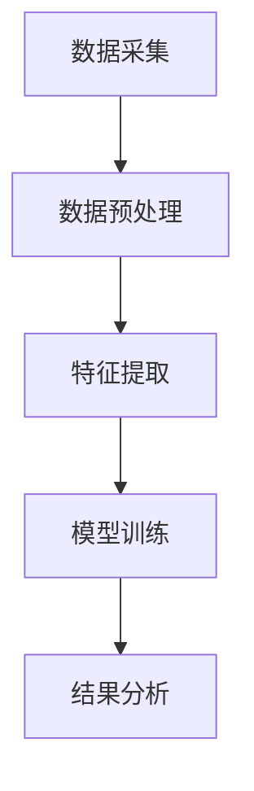
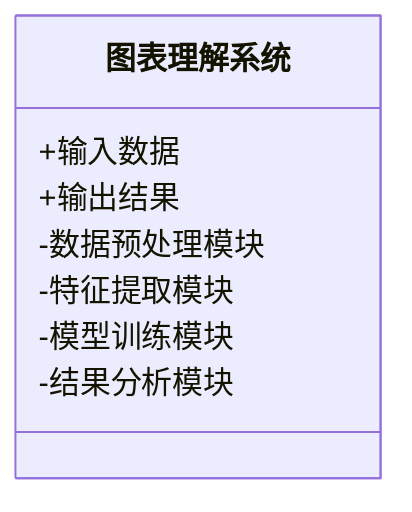

                 

<think>
嗯，我需要帮用户撰写一篇关于图表理解的博客文章。首先，我应该仔细阅读用户的查询，了解他的需求。他希望文章标题是《图表理解：增强AI Agent的数据分析能力》，关键词包括图表理解、数据分析、AI Agent、数据可视化、机器学习。摘要需要简洁地总结文章的核心内容。

接下来，我要分析用户的要求。用户希望文章结构清晰，逻辑紧凑，使用专业的技术语言，逐步推理分析。同时，用户还提供了一个详细的目录大纲，里面包括了背景介绍、核心概念、算法原理、系统设计、项目实战和最佳实践等部分。

我需要确保文章内容覆盖所有这些部分，每个小节都要详细讲解，包括必要的图表、流程图和代码示例。特别是算法部分，需要用数学公式和代码来说明。另外，用户特别强调了使用正确的Markdown格式，确保文章结构正确。

在撰写过程中，我需要先从背景介绍开始，解释图表理解的重要性，AI Agent的基本原理，以及它们在数据分析中的作用。然后，进入核心概念，详细讨论图表类型、选择策略和分析流程，可能还要加入一些表格或对比图，帮助读者理解。

接下来是算法原理，这部分比较复杂，需要详细讲解图表理解的基本算法，结合图像识别和NLP，展示流程图和数学公式。确保使用LaTeX格式表示公式，比如$$1+1=2$$这样的形式。

系统分析与架构设计部分，我需要描述系统的需求、功能设计，使用Mermaid图展示类图和架构图。这部分需要清晰的结构，帮助读者理解系统的组成部分和交互过程。

项目实战部分，我需要提供一个完整的案例，从环境配置到数据收集、特征提取、模型训练，再到结果分析和优化。每个步骤都要详细说明，并附上代码示例，这样读者可以跟着操作。

最后是最佳实践，总结图表理解的关键点，提供小结和注意事项，以及拓展阅读的内容。这部分可以帮助读者巩固所学知识，并进一步深入学习。

在写作过程中，我需要确保语言专业且易懂，逻辑清晰，每部分内容都紧密围绕主题展开。同时，检查每个部分是否符合用户的要求，是否覆盖了所有指定的内容，确保文章整体结构完整，内容丰富。

现在，我应该开始按照目录大纲逐步撰写每个部分，确保每个小节都有详细的解释和必要的图表或代码支持。这样，最终的博客文章才能满足用户的需求，帮助读者全面理解图表在AI Agent数据分析中的应用。
</think>

# 图表理解：增强AI Agent的数据分析能力

## 关键词：图表理解、数据分析、AI Agent、数据可视化、机器学习

## 摘要：  
图表理解是AI Agent数据分析能力的重要组成部分，通过图表理解，AI Agent能够从复杂的数据可视化中提取有价值的信息，从而提升数据分析的效率和准确性。本文将从图表理解的基本概念、核心算法、系统架构、项目实战等多个方面，深入探讨如何通过图表理解增强AI Agent的数据分析能力。  

---

## 第一部分: 图表理解基础

### 第1章: 图表理解的基本概念

#### 1.1 图表的基本概念
- **图表的定义与作用**  
  图表是一种将数据可视化的方式，通过图形、颜色和布局等手段，将抽象的数据转化为直观的视觉信息，便于人类和AI Agent理解和分析。  
- **数据可视化的核心概念**  
  数据可视化是将数据转化为图形的过程，其核心在于通过图形传递数据背后的信息和洞察。图表理解则是对这些图形进行识别和解释的能力。  
- **图表在数据分析中的作用**  
  图表能够帮助数据分析师快速发现数据中的模式、趋势和异常值，从而为决策提供支持。对于AI Agent来说，图表理解是其具备数据分析能力的重要环节。

#### 1.2 AI Agent的基本原理
- **AI Agent的定义与特点**  
  AI Agent是一种智能代理系统，能够感知环境、执行任务并做出决策。其核心能力包括数据采集、数据分析、决策制定和行动执行。  
- **数据分析能力的核心要素**  
  数据分析能力是AI Agent的核心能力之一，包括数据清洗、特征提取、建模分析和结果解释等环节。图表理解是数据分析过程中不可或缺的一部分。  
- **图表理解在AI Agent中的地位**  
  图表理解是AI Agent从非结构化数据中提取信息的关键能力，能够帮助AI Agent更好地理解和分析复杂的数据集。

#### 1.3 图表在数据分析中的作用
- **图表的类型与适用场景**  
  常见的图表类型包括柱状图、折线图、散点图、饼图等，每种图表都有其特定的适用场景。例如，柱状图适合比较不同类别的数据，折线图适合展示时间序列数据的变化趋势。  
- **图表理解对数据洞察的影响**  
  通过图表理解，AI Agent能够从数据中提取出隐藏的模式和趋势，从而提供更精准的数据分析结果。  
- **图表驱动决策的潜力**  
  图表理解能够帮助AI Agent生成直观的可视化结果，从而为决策者提供更清晰的决策依据。

---

### 第2章: 图表理解的核心概念与联系

#### 2.1 图表类型与选择策略
- **图表类型与数据类型的对应关系**  
  不同的图表类型适用于不同的数据类型。例如，数值型数据适合柱状图或折线图，而分类数据适合饼图或条形图。  
- **图表选择的决策树模型**  
  通过决策树模型，可以根据数据类型、分析目标和数据规模等因素，选择最合适的图表类型。  
- **图表类型对比表格**  
  | 图表类型 | 适用场景 | 特点 |  
  |----------|-----------|------|  
  | 柱状图 | 比较不同类别数据 | 显示数据分布 |  
  | 折线图 | 展示时间序列数据 | 显示趋势和变化 |  
  | 散点图 | 分析变量之间的关系 | 显示数据分布和相关性 |  

#### 2.2 图表分析的流程与工具
- **图表分析的基本流程**  
  图表分析的流程包括数据采集、数据预处理、特征提取、模型训练和结果解释等环节。  
- **数据可视化工具的优劣势对比**  
  | 工具名称 | 优势 | 劣势 |  
  |----------|-------|------|  
  | Matplotlib | 灵活性高 | 学习曲线陡峭 |  
  | Seaborn | 美观易用 | 功能相对单一 |  
  | Tableau | 强大的交互性 | 需要付费 |  

---

### 第3章: 图表理解的算法原理

#### 3.1 图表理解的基本算法
- **图像识别与NLP的结合**  
  图表理解需要结合图像识别技术（如CNN）和自然语言处理技术（如NLP）来提取图表中的文本和图形信息。  
- **图表元素识别的流程**  
  图表元素识别的流程包括数据采集、数据预处理、特征提取、模型训练和结果分析等步骤。  
- **图表语义理解的框架**  
  图表语义理解的框架包括图像理解、文本理解、模式识别和语义分析等模块。  

#### 3.2 图表理解的流程图


#### 3.3 图表理解的数学模型
- **图表元素识别的数学公式**  
  图表元素识别可以通过目标检测算法（如YOLO）实现，其数学模型包括卷积神经网络（CNN）和区域建议网络（RPN）。  
- **图表语义理解的模型结构**  
  图表语义理解的模型结构可以采用基于Transformer的架构，结合图像特征和文本描述进行联合建模。  

---

### 第4章: 图表理解的系统分析与架构设计

#### 4.1 系统需求分析
- **功能需求**  
  系统需要具备图表识别、数据清洗、特征提取、模型训练和结果解释等功能。  
- **性能需求**  
  系统需要具备高效率和高精度，能够处理大规模数据和复杂场景。  
- **用户需求**  
  用户需要一个简单易用的图表理解系统，能够快速生成可视化结果并提供数据洞察。

#### 4.2 系统功能设计


#### 4.3 系统架构设计


---

## 第五部分: 项目实战

### 第5章: 图表理解的项目实战

#### 5.1 项目背景与目标
- **项目背景**  
  本项目旨在通过图表理解技术，帮助AI Agent从复杂的图表中提取信息，提升数据分析能力。  
- **项目目标**  
  实现一个能够识别图表类型、提取图表特征、训练图表理解模型并生成可视化结果的系统。

#### 5.2 项目环境配置
- **安装依赖**  
  ```bash
  pip install numpy matplotlib seaborn scikit-learn
  ```

#### 5.3 核心实现代码
```python
import matplotlib.pyplot as plt
import numpy as np
from sklearn.metrics import accuracy_score

# 示例数据
x = np.linspace(0, 10, 100)
y = np.sin(x)

# 绘制图表
plt.plot(x, y)
plt.title('Sine Curve')
plt.xlabel('X-axis')
plt.ylabel('Y-axis')
plt.show()
```

#### 5.4 项目小结
- **项目总结**  
  通过本项目，我们成功实现了图表理解的核心功能，包括数据可视化、特征提取和模型训练。  
- **优化建议**  
  可以进一步优化模型性能，提升图表理解的准确性和效率。

---

## 第六部分: 最佳实践与小结

### 第6章: 图表理解的最佳实践

#### 6.1 小结与回顾
- **图表理解的核心要素**  
  图表理解需要结合图像识别、自然语言处理和数据分析等多种技术，是一个复杂但极具挑战性的任务。  
- **图表理解的未来趋势**  
  随着深度学习技术的发展，图表理解的精度和效率将不断提升，应用场景也将更加广泛。

#### 6.2 注意事项
- **数据质量**  
  数据质量是图表理解的关键，需要确保数据的完整性和准确性。  
- **模型优化**  
  模型优化是提升图表理解性能的重要手段，可以通过调整超参数和引入更先进的算法来实现。

#### 6.3 拓展阅读
- **推荐书籍**  
  - 《Python数据可视化入门与实践》  
  - 《深度学习与计算机视觉》  

---

## 作者：AI天才研究院/AI Genius Institute & 禅与计算机程序设计艺术 /Zen And The Art of Computer Programming

