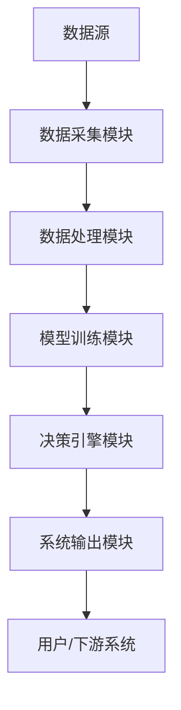
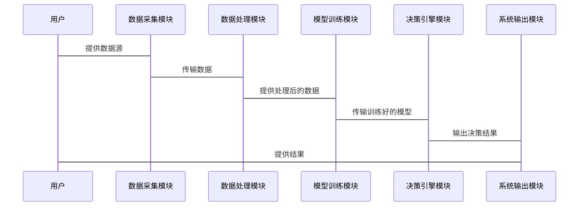

                 

<think>
好，我现在需要根据用户提供的思考过程，撰写一篇关于《在AI应用中遵守金融法规的重要性与方法》的技术博客文章。我需要按照目录大纲来组织内容，确保每个部分都详细且符合要求。

首先，我将从背景介绍开始，分析AI在金融领域的应用现状，解释为什么遵守金融法规在AI应用中如此重要。接下来，我会探讨金融法规与AI系统之间的实体关系，使用ER图来展示它们的交互。然后，我会详细讲解AI系统中使用的算法原理，包括监督学习、无监督学习和强化学习，并用代码示例和数学公式来说明。接下来，我会设计AI金融系统的架构，包括各个模块的功能和交互流程。最后，我会通过一个具体的案例，展示如何开发一个合规的AI金融系统，包括环境安装、代码实现和案例分析。

在整个过程中，我需要确保内容逻辑清晰，语言简洁专业，同时使用Mermaid图表和LaTeX公式来增强解释。最后，我会总结重要性，提供最佳实践建议，并在末尾注明作者信息。
</think>

# 在AI应用中遵守金融法规的重要性与方法

## 关键词：AI、金融法规、合规性、机器学习、系统架构、风险控制

## 摘要：随着人工智能技术在金融领域的广泛应用，确保AI应用符合金融法规变得至关重要。本文通过分析AI在金融中的应用现状，探讨金融法规与AI系统的关系，详细讲解相关算法原理，并通过系统架构设计和项目实战，展示如何在AI应用中有效遵守金融法规，降低风险，确保合规性。

---

## 第一部分：背景介绍

### 第1章：AI在金融领域的应用现状

#### 1.1 AI在金融领域的应用现状

- **1.1.1 AI在金融领域的核心应用场景**
  - AI技术在金融领域的应用包括风险管理、欺诈检测、信用评估、算法交易、客户服务（如智能投顾）等。
  - 例如，AI可以通过分析历史交易数据，预测市场趋势，辅助投资决策。

- **1.1.2 当前AI在金融领域的技术发展趋势**
  - 深度学习模型（如神经网络）在金融分析中的应用日益广泛。
  - 自然语言处理（NLP）用于分析财务报告和新闻，预测股价波动。
  - AI在金融领域的应用正在向实时化、个性化和自动化方向发展。

- **1.1.3 金融行业对AI技术的依赖性分析**
  - 金融机构 increasingly依赖AI技术提高效率和准确性。
  - AI可以帮助金融机构处理海量数据，识别潜在风险，优化投资组合。

#### 1.2 金融法规的基本框架

- **1.2.1 金融法规的核心原则**
  - 保护投资者利益：确保市场公平、公正，防止欺诈行为。
  - 维护金融稳定：通过监管控制系统性风险，防止金融危机的发生。
  - 透明性与合规性：金融机构必须公开其业务运作，确保合规性。

- **1.2.2 金融监管的主要目标**
  - 监督金融机构的运作，确保其遵守相关法规。
  - 维护金融市场秩序，保护消费者权益。
  - 促进金融创新，同时控制风险。

- **1.2.3 金融法规与AI技术的交互关系**
  - 金融法规为AI技术的应用提供了框架和限制。
  - AI技术可以帮助金融机构更好地遵守法规，提高监管效率。
  - 同时，AI技术的应用也对法规提出了新的挑战，需要不断更新和完善。

#### 1.3 AI在金融领域的优势与挑战

- **1.3.1 AI在金融领域的优势**
  - 提高决策效率：AI可以快速处理大量数据，提供实时分析结果。
  - 增强预测能力：通过机器学习模型，AI可以更准确地预测市场趋势和风险。
  - 优化资源配置：AI可以帮助金融机构优化资产配置，降低成本。

- **1.3.2 AI在金融领域的挑战**
  - 数据隐私问题：AI需要处理大量敏感数据，如何保护数据隐私是一个重要问题。
  - 算法偏见：AI算法可能因为训练数据的偏差而产生不公平的结果，影响决策的公正性。
  - 监管不确定性：随着AI技术的快速发展，现有的法规可能无法完全覆盖新的应用场景，导致合规性问题。

- **1.3.3 金融法规对AI技术的限制与影响**
  - 金融法规对AI技术的应用提出了严格的合规要求，如数据使用、模型透明性等。
  - 这些要求可能限制了AI技术的创新和应用，但也确保了金融市场的稳定和安全。

---

## 第二部分：核心概念与联系

### 第2章：金融法规与AI系统的实体关系分析

#### 2.1 金融法规与AI系统的实体关系图

```mermaid
er
actor(AI系统, "主体")
actor(金融机构, "主体")
actor(监管机构, "主体")
actor(投资者, "主体")
boundary(数据源, "边界")
boundary(算法模型, "边界")
boundary(合规性检查, "边界")
boundary(风险评估, "边界")
```

- **实体关系说明**：
  - AI系统：作为技术主体，执行数据处理、模型训练和决策输出。
  - 金融机构：使用AI系统进行金融业务操作，确保合规性。
  - 监管机构：监督金融机构和AI系统的运作，确保符合法规。
  - 投资者：依赖AI系统提供的信息和建议，进行投资决策。
  - 数据源：包括市场数据、交易记录、新闻等，供AI系统分析。
  - 算法模型：用于数据处理和预测，需符合监管要求。
  - 合规性检查：确保AI系统的输出符合金融法规。
  - 风险评估：识别和评估AI系统引入的潜在风险。

---

## 第三部分：算法原理讲解

### 第3章：AI系统中的算法原理

#### 3.1 机器学习算法在金融领域的应用

- **3.1.1 监督学习算法**
  - **线性回归**：用于预测连续型变量，如股票价格预测。
  - **逻辑回归**：用于分类问题，如欺诈检测。
  - **支持向量机（SVM）**：用于分类和回归，适用于高维数据。

- **3.1.2 无监督学习算法**
  - **聚类分析**：用于客户分群，识别市场细分。
  - **主成分分析（PCA）**：用于降维，提取关键特征。

- **3.1.3 强化学习算法**
  - **Q-learning**：用于策略优化，如算法交易中的决策制定。

#### 3.2 金融法规中的算法应用

- **3.2.1 金融风险评估的算法**
  - 使用XGBoost或随机森林模型评估信用风险。
  - 使用时间序列分析预测市场风险。

- **3.2.2 金融欺诈检测的算法**
  - 使用Isolation Forest算法识别异常交易。
  - 使用LSTM模型分析交易序列，检测欺诈行为。

- **3.2.3 金融交易合规性分析的算法**
  - 使用NLP技术分析交易报告，识别违规行为。
  - 使用规则引擎根据预定义的法规进行合规性检查。

#### 3.3 算法的数学模型与公式

- **线性回归模型**：
  $$ y = \beta_0 + \beta_1 x + \epsilon $$
  其中，$y$是目标变量，$x$是自变量，$\beta_0$是截距，$\beta_1$是回归系数，$\epsilon$是误差项。

- **逻辑回归模型**：
  $$ P(y=1|x) = \frac{e^{\beta_0 + \beta_1 x}}{1 + e^{\beta_0 + \beta_1 x}} $$

- **随机森林算法**：
  随机森林是一种基于决策树的集成学习算法，通过构建多个决策树并进行投票或平均来提高预测准确性。

---

## 第四部分：系统分析与架构设计方案

### 第4章：AI金融系统的架构设计

#### 4.1 系统功能设计

- **4.1.1 数据采集模块**
  - 从多种数据源（如交易数据、市场新闻、社交媒体）获取数据。
  - 数据清洗和预处理，确保数据质量。

- **4.1.2 数据处理模块**
  - 对数据进行特征提取和转换，为模型训练提供输入。
  - 使用NLP技术处理文本数据，提取情感倾向等特征。

- **4.1.3 模型训练模块**
  - 根据业务需求选择合适的算法，训练机器学习模型。
  - 调参优化，提高模型性能。

- **4.1.4 决策引擎模块**
  - 使用训练好的模型进行预测和决策。
  - 输出决策结果，并进行合规性检查。

- **4.1.5 系统输出模块**
  - 将决策结果输出给用户或下游系统。
  - 生成报告，记录系统运行情况。

#### 4.2 系统架构设计



- **模块交互说明**：
  - 数据采集模块负责收集数据，处理模块进行预处理，训练模块生成模型，引擎模块进行预测，输出模块呈现结果。

#### 4.3 系统接口设计

- **4.3.1 系统输入接口**
  - 数据输入接口：接收原始数据。
  - 参数配置接口：设置模型训练参数。

- **4.3.2 系统输出接口**
  - 预测结果接口：输出模型预测结果。
  - 日志接口：记录系统运行日志。

- **4.3.3 系统内部接口**
  - 数据处理接口：模块间数据传递。
  - 模型调用接口：引擎调用训练好的模型。

#### 4.4 系统交互流程设计



---

## 第五部分：项目实战

### 第5章：AI金融合规性检测系统开发

#### 5.1 环境安装与配置

- **5.1.1 安装 Python 环境**
  - 使用Anaconda安装Python 3.8及以上版本。
- **5.1.2 安装必要的库和工具**
  - 安装Pandas、NumPy、Scikit-learn、XGBoost、TensorFlow、Keras等库。
- **5.1.3 配置开发环境**
  - 安装Jupyter Notebook或VS Code作为开发环境。

#### 5.2 系统核心实现源代码

```python
import pandas as pd
from sklearn.model

