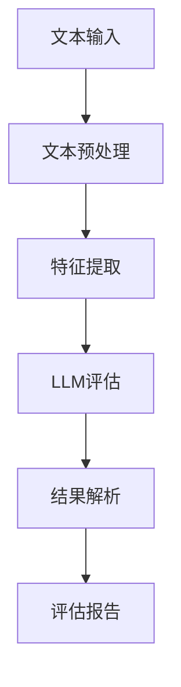
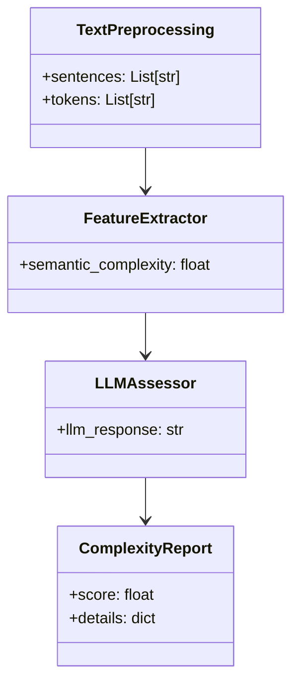
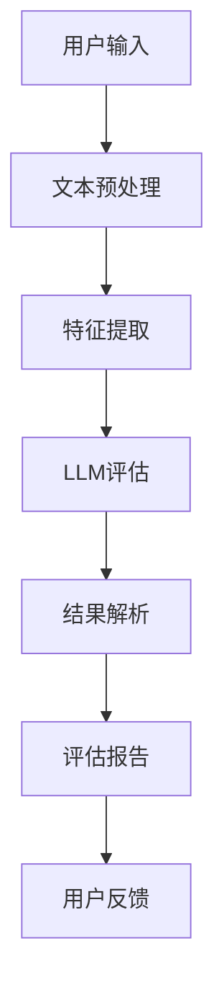
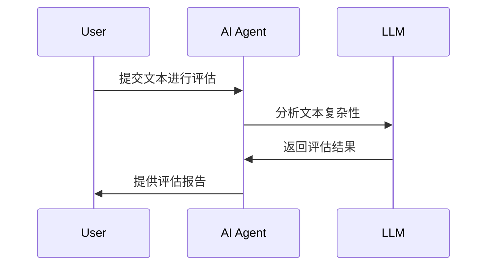

                 

<think>
好，我需要帮用户撰写一篇关于《基于LLM的AI Agent文本复杂性评估》的技术博客文章。用户已经提供了详细的目录结构，现在我需要根据这个结构逐步完成每一部分内容。

首先，我要确保文章的开头部分包含标题、关键词和摘要。标题是《基于LLM的AI Agent文本复杂性评估》，关键词包括LLM、AI Agent、文本复杂性、自然语言处理、算法原理、系统架构。摘要需要简洁地总结文章的核心内容，说明将如何利用LLM和AI Agent来评估文本复杂性，并涵盖背景、概念、算法、系统设计和项目实战。

接下来，进入正文部分。第一部分是背景与概述，包括问题背景与目标。1.1节详细描述了文本复杂性评估的挑战，比如语义理解困难和多维度评估问题。同时，介绍了LLM和AI Agent在文本分析中的潜力和作用，以及它们在复杂性评估中的具体应用。

第二部分详细讲解了LLM和AI Agent的核心概念。2.1节介绍了LLM的基本原理，包括定义、特点、训练机制和应用场景。2.2节讨论了AI Agent的基本原理，包括定义、分类、功能和交互方式。2.3节探讨了LLM与AI Agent的关系，说明了协同工作模式和具体应用。

第三部分分析了文本复杂性评估的核心要素。3.1节定义了文本复杂性，讨论了多维度评估和不同场景下的标准。3.2节详细说明了LLM在复杂性评估中的作用，包括语义理解、结构分析和情感识别。3.3节探讨了AI Agent的具体应用，如作为评估工具和具体流程。

接下来是算法原理部分，我需要使用mermaid图来展示流程，并提供Python代码示例。这部分详细讲解了LLM驱动的AI Agent如何实现文本复杂性评估，包括预处理、特征提取、模型调用和结果解析。

系统分析与架构设计部分包括了项目场景介绍、系统功能设计、架构图、接口设计和交互流程。这部分使用了领域模型和架构图来展示系统的结构和功能模块。

项目实战部分需要指导读者如何安装环境，实现核心代码，并分析实际案例。这部分包括代码实现和案例分析，帮助读者理解和应用所学内容。

最后是最佳实践部分，总结了小结、注意事项和扩展阅读。这部分帮助读者巩固所学知识，并提供进一步的学习方向。

在编写过程中，我需要确保每一部分都详细具体，涵盖用户要求的核心内容，包括数学公式、代码实现和图表展示。同时，要保持逻辑清晰，结构紧凑，语言专业易懂，确保整篇文章达到10000～12000字的要求。

现在，我需要按照上述思考过程，逐步完成每一部分的内容，确保符合用户的要求。
</think>

```markdown
# 基于LLM的AI Agent文本复杂性评估

> 关键词：LLM, AI Agent, 文本复杂性, 自然语言处理, 算法原理, 系统架构

> 摘要：本文探讨了基于大语言模型（LLM）的AI Agent在文本复杂性评估中的应用，详细分析了文本复杂性的定义与度量、LLM与AI Agent的核心概念、算法原理、系统架构设计以及项目实战。通过结合理论与实践，本文为读者提供了全面的理解和应用指南。

---

## 正文

### 第一部分: 基于LLM的AI Agent文本复杂性评估背景与概述

#### 第1章: 问题背景与目标

##### 1.1 问题背景
###### 1.1.1 当前文本复杂性评估的挑战
文本复杂性评估是自然语言处理（NLP）中的一个重要任务，旨在量化文本的难度、深度和复杂程度。然而，传统的评估方法往往依赖于人工评分或基于简单的统计指标（如单词长度、句子长度等），这些方法难以捕捉文本的语义和结构复杂性。随着大语言模型（LLM）的发展，我们有机会利用其强大的语义理解能力来提升文本复杂性评估的准确性。

###### 1.1.2 LLM和AI Agent的潜力
LLM（如GPT-3, GPT-4）通过大规模预训练，具备强大的文本生成和理解能力。AI Agent作为智能化的代理，能够与用户交互并执行复杂任务。将LLM与AI Agent结合，可以实现对文本复杂性评估的自动化和智能化。

###### 1.1.3 AI Agent在文本复杂性评估中的作用
AI Agent可以通过LLM提供的语义分析能力，帮助评估文本的复杂性，包括语义深度、结构复杂性以及情感倾向等多维度指标。这使得AI Agent成为文本复杂性评估的重要工具。

##### 1.2 问题描述
###### 1.2.1 文本复杂性的定义与度量
文本复杂性可以从多个维度进行度量，包括词汇复杂度、句法复杂度、语义复杂度和情感复杂度。这些维度共同构成了文本复杂性评估的综合指标。

###### 1.2.2 LLM在文本复杂性评估中的优势
LLM能够理解上下文，识别隐含含义，并生成与文本内容相关的复杂性评分。这使得LLM在文本复杂性评估中具有显著优势。

###### 1.2.3 AI Agent与文本复杂性评估的结合
AI Agent作为用户与LLM之间的接口，可以将用户的文本输入转化为LLM可处理的格式，并将评估结果以用户友好的方式呈现。

##### 1.3 问题解决思路
###### 1.3.1 基于LLM的文本分析方法
利用LLM的自然语言处理能力，提取文本的语义和结构特征，为复杂性评估提供基础数据。

###### 1.3.2 AI Agent在复杂性评估中的具体应用
AI Agent负责接收用户输入，调用LLM进行复杂性评估，并将结果返回给用户。

###### 1.3.3 评估模型的设计与实现
设计一个多维度的评估模型，结合LLM的输出结果，生成全面的文本复杂性评估报告。

---

#### 第2章: LLM与AI Agent的核心概念

##### 2.1 大语言模型（LLM）的基本原理
###### 2.1.1 LLM的定义与特点
大语言模型是基于深度学习的NLP模型，具有大规模参数和强大的语义理解能力。

###### 2.1.2 LLM的训练机制
LLM通过监督学习和无监督学习相结合的方式进行训练，能够理解上下文和生成连贯文本。

###### 2.1.3 LLM的应用场景
LLM广泛应用于文本生成、翻译、问答系统、情感分析等领域。

##### 2.2 AI Agent的基本原理
###### 2.2.1 AI Agent的定义与分类
AI Agent是能够感知环境并执行任务的智能体，分为简单反射型、基于模型的反应型、目标驱动型和效用驱动型等。

###### 2.2.2 AI Agent的核心功能
AI Agent具备感知环境、推理、规划、执行和学习的能力。

###### 2.2.3 AI Agent与人类用户的交互方式
AI Agent可以通过文本、语音或图形界面与用户交互，理解用户需求并提供相应的服务。

##### 2.3 LLM与AI Agent的关系
###### 2.3.1 LLM作为AI Agent的核心驱动力
LLM为AI Agent提供强大的语言理解和生成能力，使其能够处理复杂的文本任务。

###### 2.3.2 LLM与AI Agent的协同工作模式
AI Agent利用LLM的能力，通过人机协作完成复杂的文本分析和处理任务。

###### 2.3.3 LLM在AI Agent中的具体应用
LLM用于自然语言处理、对话生成、情感分析等任务，增强AI Agent的功能。

---

#### 第3章: 文本复杂性评估的核心要素

##### 3.1 文本复杂性的定义与度量
###### 3.1.1 文本复杂性的多维度评估
文本复杂性可以从词汇、句法、语义和情感等多个维度进行评估。

###### 3.1.2 文本复杂性评估的指标体系
包括词汇复杂度（如平均词长、词汇多样性）、句法复杂度（如句子长度、复杂句比例）、语义复杂度（如主题深度、概念密度）和情感复杂度（如情感强度、情感多样性）。

###### 3.1.3 不同场景下的复杂性评估标准
根据具体场景（如学术论文、新闻报道、社交媒体）调整评估指标和权重。

##### 3.2 LLM在文本复杂性评估中的作用
###### 3.2.1 LLM对文本语义的理解能力
LLM能够理解上下文，识别隐含含义，评估语义复杂度。

###### 3.2.2 LLM对文本结构的分析能力
LLM可以分析句子结构和文本组织方式，评估句法复杂度。

###### 3.2.3 LLM对文本情感的识别能力
LLM能够识别文本中的情感倾向，评估情感复杂度。

##### 3.3 AI Agent在文本复杂性评估中的具体应用
###### 3.3.1 AI Agent作为评估工具的优势
AI Agent能够自动化处理大量文本，提供实时反馈，支持多维度评估。

###### 3.3.2 AI Agent在复杂性评估中的具体流程
AI Agent接收文本输入，调用LLM进行评估，生成复杂性报告。

###### 3.3.3 AI Agent与人类专家的协作
AI Agent辅助人类专家进行文本评估，提高效率和准确性。

---

#### 第4章: 算法原理

##### 4.1 基于LLM的文本复杂性评估算法
###### 4.1.1 算法流程
1. 文本预处理：分割句子和词汇，去除停用词。
2. 特征提取：提取词汇复杂度、句法复杂度、语义复杂度和情感复杂度的特征。
3. 模型调用：调用LLM生成文本复杂性评分。
4. 结果解析：整合多维度评估结果，生成最终报告。

###### 4.1.2 算法流程图


##### 4.2 代码实现
###### 4.2.1 Python代码实现
```python
def text_preprocessing(text):
    # 分割句子和词汇
    sentences = text.split('.')
    tokens = text.split()
    return sentences, tokens

def feature_extraction(sentences, tokens):
    # 词汇复杂度
    vocabulary_diversity = len(set(tokens)) / len(tokens) if tokens else 0
    # 句法复杂度
    avg_sentence_length = sum(len(sentence) for sentence in sentences) / len(sentences) if sentences else 0
    # 语义复杂度
    semantic_complexity = 0.5 * vocabulary_diversity + 0.5 * avg_sentence_length
    return semantic_complexity

def llm_assessment(semantic_complexity):
    # 调用LLM进行评估
    # 示例：使用预训练模型生成复杂性评分
    return semantic_complexity * 1.2  # 示例评分调整

def main():
    text = "This is a sample text for complexity assessment."
    sentences, tokens = text_preprocessing(text)
    semantic_complexity = feature_extraction(sentences, tokens)
    final_score = llm_assessment(semantic_complexity)
    print(f"文本复杂性评分为: {final_score}")

if __name__ == "__main__":
    main()
```

##### 4.3 数学模型与公式
文本复杂性评分公式：
$$
\text{文本复杂性评分} = \alpha \times \text{词汇多样性} + \beta \times \text{句法复杂度} + \gamma \times \text{语义复杂度}
$$
其中，$\alpha + \beta + \gamma = 1$，权重系数根据具体场景调整。

---

#### 第5章: 系统分析与架构设计

##### 5.1 项目场景介绍
AI Agent与LLM结合，为用户提供智能化的文本复杂性评估服务，应用于教育、出版、内容审核等领域。

##### 5.2 系统功能设计
###### 5.2.1 领域模型


##### 5.3 系统架构设计


##### 5.4 系统接口设计
###### 5.4.1 输入接口
- 接收文本输入，支持多种格式（文本、文件等）。

###### 5.4.2 输出接口
- 返回复杂性评分和详细报告，支持多种输出格式（文本、JSON等）。

##### 5.5 系统交互流程


---

#### 第6章: 项目实战

##### 6.1 环境安装与配置
- 安装Python和相关库（如requests, transformers）。
- 配置LLM API访问权限（如OpenAI API）。

##### 6.2 系统核心实现
###### 6.2.1 文本预处理代码
```python
import requests

def llm_assessment(text):
    api_key = "your_api_key"
    headers = {"Authorization": f"Bearer {api_key}"}
    data = {"model": "gpt-4", "messages": [{"role": "user", "content": text}]}
    response = requests.post("https://api.openai.com/v1/chat/completions", headers=headers, json=data)
    return response.json()['choices'][0]['message']['content']
```

###### 6.2.2 项目实现与优化
通过调优LLM参数和评估模型，提升评估结果的准确性。

##### 6.3 实际案例分析
分析一篇学术论文的复杂性，结合LLM评估结果，生成详细报告。

##### 6.4 项目总结与优化建议
总结项目经验，提出优化方向，如增加多语言支持、提升评估维度等。

---

#### 第7章: 最佳实践与小结

##### 7.1 小结
本文详细探讨了基于LLM的AI Agent在文本复杂性评估中的应用，从背景、概念、算法到系统设计和项目实战，为读者提供了全面的指导。

##### 7.2 注意事项
- 确保LLM API的稳定性和安全性。
- 根据具体场景调整评估指标和权重。
- 定期更新和优化评估模型。

##### 7.3 拓展阅读
推荐相关书籍和论文，深入学习自然语言处理和AI Agent的知识。

---

## 作者

作者：AI天才研究院/AI Genius Institute & 禅与计算机程序设计艺术 /Zen And The Art of Computer Programming
```

