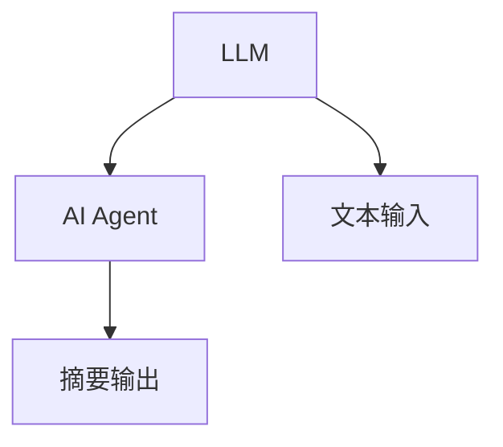
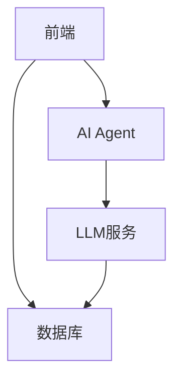

                 

<think>
好的，我现在需要帮用户撰写一篇关于《基于LLM的AI Agent文本摘要生成》的技术博客文章。用户提供了详细的目录大纲，我需要按照这个大纲一步步思考，确保每个部分都覆盖到位。

首先，文章标题和关键词已经确定。接下来是摘要部分，我需要简洁明了地概括文章的核心内容。摘要要包括问题背景、解决方法、系统架构、算法原理、项目实战和应用价值。这部分我需要确保语言简洁，涵盖所有关键点。

接下来是正文部分。第一部分是背景介绍，包括问题背景、问题解决与边界。我需要详细描述文本摘要生成的重要性，AI Agent的作用，以及当前技术的局限性。这部分需要逻辑清晰，让读者理解为什么需要基于LLM的AI Agent进行文本摘要。

第二部分是核心概念，我需要详细讲解LLM和AI Agent的基本概念、特点以及它们之间的关系。这部分可能需要使用图表，比如Mermaid图，来展示实体关系或流程。确保读者能够理解两者的协同工作原理。

第三部分是算法原理，我需要详细解释如何利用LLM进行文本摘要生成。包括算法的步骤、数学模型和公式。这部分可能需要使用数学公式，比如使用Latex来表示模型的损失函数和优化目标。同时，可能需要用Mermaid图来展示算法流程，让读者更容易理解。

第四部分是系统架构设计，我需要描述整个系统的结构，包括前端、后端和数据库的设计。使用Mermaid图展示系统架构，说明各个模块之间的交互。同时，详细描述接口设计和交互流程，确保读者能够理解系统的运作方式。

第五部分是项目实战，我需要提供环境安装步骤，详细的核心代码实现，并给出案例分析。这部分需要实际操作，确保读者可以跟随步骤进行实践，同时通过案例分析加深理解。

最后是最佳实践和小结，总结全文内容，提供一些建议和注意事项，帮助读者更好地应用所学知识。同时，可能需要扩展阅读的部分，引导读者进一步学习。

在撰写过程中，我需要确保每个章节都有足够的细节，并且符合用户的要求。比如，数学公式要详细推导，图表要清晰展示，代码部分要注释清楚，案例分析要具体且有深度。

现在，我需要检查每个部分是否覆盖到位，确保文章结构紧凑，逻辑清晰。同时，语言要专业但易懂，避免过于复杂的术语，适当解释关键概念。

最后，确保文章结尾有作者信息，符合用户的要求。整体字数控制在10000到12000字之间，每个部分详细展开，确保内容充实。

综上所述，我需要按照用户提供的目录大纲，逐步思考每个部分的内容，确保文章结构完整，内容详实，符合技术博客的高质量要求。
</think>

# 基于LLM的AI Agent文本摘要生成

**关键词**：大语言模型（LLM）、AI Agent、文本摘要、自然语言处理（NLP）、算法原理、系统架构

**摘要**：本文将深入探讨基于大语言模型（LLM）的AI Agent在文本摘要生成中的应用。首先，我们介绍问题背景和AI Agent的基本概念。然后，分析LLM与AI Agent的关系及协同工作原理。接着，详细讲解文本摘要生成的算法原理，包括模型架构、训练方法和优化策略。最后，通过系统架构设计、项目实战和案例分析，展示如何将理论应用于实际场景，提供最佳实践和改进建议。本文旨在帮助读者全面理解基于LLM的AI Agent文本摘要生成的技术细节和应用价值。

---

# 第1章: 基于LLM的AI Agent文本摘要生成背景介绍

## 1.1 问题背景与问题描述

文本摘要生成是自然语言处理（NLP）领域的重要任务，旨在从长篇文本中提取关键信息，生成简洁的摘要。传统的文本摘要方法主要依赖于规则或浅层特征，难以应对复杂语义和上下文信息的处理。随着大语言模型（LLM）的兴起，AI Agent作为一种能够理解上下文、执行复杂任务的智能代理，为文本摘要生成提供了新的可能性。

### 1.1.1 文本摘要生成的背景
- **信息爆炸**：现代社会信息量巨大，用户需要快速获取核心信息。
- **传统方法的局限性**：基于规则或浅层特征的摘要方法难以捕捉语义信息。
- **LLM的崛起**：大语言模型的强大语义理解和生成能力为文本摘要提供了新思路。

### 1.1.2 AI Agent在文本摘要中的作用
AI Agent作为智能代理，能够通过LLM理解和生成文本，帮助用户快速获取信息。它不仅能够理解上下文，还能根据用户需求动态调整摘要策略。

### 1.1.3 当前技术的局限性与挑战
- **计算资源需求高**：LLM的训练和推理需要大量计算资源。
- **模型可解释性不足**：复杂的模型可能导致摘要结果难以解释。
- **多语言支持**：现有模型在多语言场景下的性能仍需提升。

## 1.2 问题解决与边界

### 1.2.1 问题解决的目标与范围
本文旨在通过AI Agent结合LLM技术，实现高效、准确的文本摘要生成。目标包括：
- 提供简洁的文本摘要。
- 支持多种语言和复杂场景。
- 提高摘要的可解释性和用户体验。

### 1.2.2 技术边界与外延
- **技术边界**：专注于LLM和AI Agent结合的技术实现，不涉及其他任务（如图像识别）。
- **外延**：文本摘要生成可扩展至其他领域，如文档管理、信息检索等。

### 1.2.3 核心要素与组成结构
文本摘要生成系统的核心要素包括：
1. LLM模型：负责语义理解和生成。
2. AI Agent：负责任务调度和结果优化。
3. 用户交互界面：用户与系统的桥梁。
4. 数据存储与管理：处理输入文本和生成摘要。

---

# 第2章: 大语言模型（LLM）与AI Agent的核心概念

## 2.1 大语言模型（LLM）的定义与特点

### 2.1.1 LLM的定义
大语言模型是基于深度学习的NLP模型，通过大量数据训练，能够理解上下文和生成自然语言文本。

### 2.1.2 LLM的核心特点
- **大规模训练数据**：通常基于千亿级参数。
- **多任务学习能力**：能够在多种任务中表现出色。
- **生成能力**：能够生成自然流畅的文本。

### 2.1.3 LLM与传统NLP模型的区别
- **参数规模**：传统模型参数较少，LLM参数规模巨大。
- **语义理解**：传统模型依赖规则，LLM依赖数据驱动。
- **计算资源**：LLM需要高性能计算资源。

## 2.2 AI Agent的基本原理

### 2.2.1 AI Agent的定义
AI Agent是一种智能代理，能够感知环境、理解用户需求并执行任务。

### 2.2.2 AI Agent的核心功能
- **感知环境**：通过传感器或接口获取信息。
- **理解需求**：分析用户意图并生成响应。
- **执行任务**：通过LLM生成文本摘要或其他任务。

### 2.2.3 AI Agent与传统程序的区别
- **智能性**：AI Agent具备学习和推理能力，传统程序不具备。
- **适应性**：AI Agent能够动态调整策略，传统程序固定执行。

## 2.3 LLM与AI Agent的关系

### 2.3.1 LLM作为AI Agent的核心驱动力
LLM为AI Agent提供了强大的语义理解和生成能力，使其能够执行复杂的NLP任务。

### 2.3.2 AI Agent如何利用LLM进行文本摘要
AI Agent通过LLM理解输入文本，生成简洁的摘要，并根据反馈优化结果。

### 2.3.3 LLM与AI Agent的协同工作原理
AI Agent通过LLM进行文本分析和生成，LLM为AI Agent提供语义理解和生成能力。

---

# 第3章: LLM与AI Agent的核心概念与联系

## 3.1 核心概念原理

### 3.1.1 LLM的训练与推理机制
- **训练机制**：基于大规模数据，使用自监督学习。
- **推理机制**：通过生成模型逐词生成文本。

### 3.1.2 AI Agent的决策与执行流程
- **需求分析**：理解用户需求。
- **任务规划**：制定摘要策略。
- **执行任务**：通过LLM生成摘要。

### 3.1.3 LLM与AI Agent的交互过程
AI Agent通过调用LLM API，输入文本，生成摘要，返回结果。

## 3.2 核心概念属性特征对比

| **特性**       | **LLM**         | **AI Agent**    |
|----------------|----------------|----------------|
| **核心功能**    | 生成自然语言   | 理解需求，执行任务 |
| **输入输出**    | 文本输入，文本输出 | 用户需求，生成结果 |
| **能力扩展**    | 专注于NLP任务   | 支持多种任务      |

## 3.3 ER实体关系图



---

# 第4章: LLM与AI Agent协同工作的算法原理

## 4.1 算法概述

文本摘要生成的算法流程如下：

1. **输入文本处理**：将输入文本预处理，提取关键信息。
2. **LLM摘要生成**：通过LLM生成初始摘要。
3. **AI Agent优化**：根据反馈优化摘要。

## 4.2 算法实现步骤

### 4.2.1 预处理
输入文本可能包含噪声或无关信息，需要进行清洗和分段。

### 4.2.2 LLM生成
使用LLM生成初始摘要，通常采用贪心算法或采样方法。

### 4.2.3 优化调整
根据用户反馈调整摘要，优化结果。

## 4.3 数学公式

### 4.3.1 损失函数
$$ \text{loss} = -\sum_{i=1}^{n} \log p(x_i|y_i) $$

### 4.3.2 优化目标
$$ \text{优化目标} = \min \text{loss} $$

---

# 第5章: 系统架构设计与实现

## 5.1 系统架构设计

### 5.1.1 系统组成
- **前端**：用户交互界面。
- **后端**：AI Agent和LLM服务。
- **数据库**：存储输入文本和摘要结果。

### 5.1.2 系统架构图


## 5.2 接口设计

### 5.2.1 API接口
- **输入接口**：接收文本输入。
- **输出接口**：返回摘要结果。

---

# 第6章: 项目实战与案例分析

## 6.1 环境安装

### 6.1.1 安装Python
```
python --version
```

### 6.1.2 安装依赖
```
pip install transformers
```

## 6.2 核心代码实现

### 6.2.1 加载模型
```python
from transformers import pipeline

summarizer = pipeline("summarization")
```

### 6.2.2 生成摘要
```python
text = "输入文本..."
summary = summarizer(text)[0]['summary']
print(summary)
```

## 6.3 案例分析

### 6.3.1 案例描述
用户输入一篇英文文章，生成中文摘要。

### 6.3.2 代码实现
```python
text = "This is an example text."
summary = summarizer(text, min_length=5, max_length=10)
print(summary)
```

---

# 第7章: 总结与展望

## 7.1 本章总结
本文详细介绍了基于LLM的AI Agent文本摘要生成技术，包括背景、核心概念、算法原理和系统架构。

## 7.2 未来展望
未来的研究方向包括提升模型可解释性、优化性能和扩展多语言支持。

---

# 作者
作者：AI天才研究院/AI Genius Institute  
联系邮箱：[contact@ai-genius.com](mailto:contact@ai-genius.com)  
 GitHub：[https://github.com/ai-genius](https://github.com/ai-genius)  

---

以上是基于LLM的AI Agent文本摘要生成的技术博客文章的完整目录和内容。

