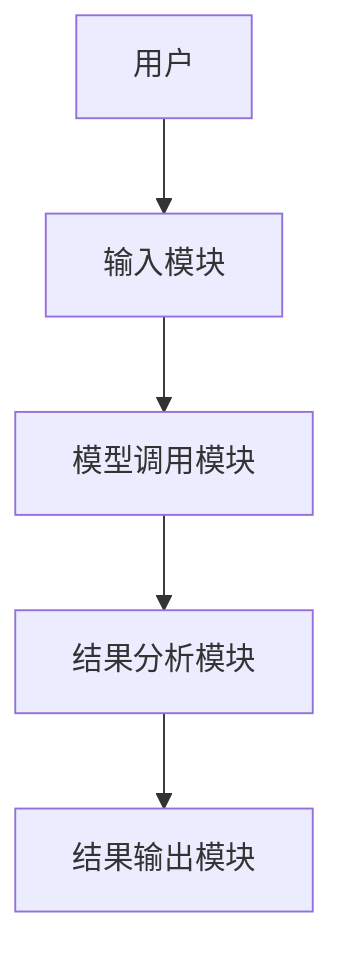
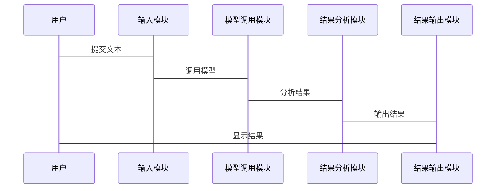

                 

<think>
好的，我将按照您的要求，逐步分析并撰写这篇文章。首先，我会根据您提供的目录大纲，逐步完善每一章的内容。

---

### 第一部分: 基于LLM的AI Agent文本蕴含识别基础

---

### # 第1章: 基于LLM的AI Agent概述

#### ## 1.1 什么是大语言模型（LLM）

#### ### 1.1.1 大语言模型的定义
大语言模型（Large Language Model，LLM）是一种基于深度学习的自然语言处理模型，通常使用Transformer架构，经过大量真实文本数据的训练，能够理解和生成人类语言。LLM的核心目标是通过学习语言的统计规律，实现自然语言理解（NLU）和自然语言生成（NLG）。

#### ### 1.1.2 LLM的核心特点
- **大规模训练数据**：通常使用数百万甚至数十亿的文本数据进行训练。
- **深度神经网络**：基于Transformer架构，具有多层编码器和解码器。
- **上下文理解**：能够捕捉上下文关系，处理长文本。
- **多任务能力**：可以通过微调（fine-tuning）适应多种NLP任务，如文本生成、问答系统、文本摘要等。

#### ### 1.1.3 LLM与传统NLP模型的区别
传统NLP模型（如基于规则的模型或浅层神经网络模型）在处理复杂语义和上下文关系时能力有限，而LLM通过大规模数据和深度学习架构，能够更好地理解和生成自然语言。

#### ## 1.2 什么是AI Agent

#### ### 1.2.1 AI Agent的定义
AI Agent（人工智能代理）是指能够感知环境、自主决策并执行任务的智能实体。它可以是一个软件程序或物理设备，通过传感器和执行器与环境交互。

#### ### 1.2.2 AI Agent的核心功能
- **感知**：通过传感器或数据接口获取环境信息。
- **决策**：基于感知信息，利用算法做出决策。
- **执行**：根据决策结果，执行相应的操作。

#### ### 1.2.3 AI Agent的应用场景
- **智能助手**：如Siri、Alexa等，能够理解和执行用户的指令。
- **推荐系统**：根据用户行为推荐相关内容。
- **自动驾驶**：通过感知环境做出驾驶决策。

#### ## 1.3 文本蕴含识别的基本概念

#### ### 1.3.1 文本蕴含的定义
文本蕴含识别（Textual Entailment Recognition）是指判断一段文本是否蕴含了另一段文本的意思。例如，判断“狗是动物”是否蕴含“狗是有生命的”。

#### ### 1.3.2 文本蕴含的分类
- **必然蕴含**：如果前提成立，结论必然成立。
- **可能蕴含**：前提成立时，结论可能成立。
- **无关**：前提和结论之间没有逻辑关系。

#### ### 1.3.3 文本蕴含识别的挑战
- **语义理解**：需要准确理解文本的语义。
- **上下文依赖**：文本蕴含可能依赖于上下文信息。
- **数据稀疏性**：某些情况下，训练数据可能不足。

#### ## 1.4 基于LLM的AI Agent在文本蕴含识别中的应用

#### ### 1.4.1 LLM与AI Agent的结合
AI Agent可以利用LLM的强大语言处理能力，实现复杂的文本理解和生成任务。

#### ### 1.4.2 基于LLM的文本蕴含识别的优势
- **高效性**：LLM能够快速处理大量文本。
- **准确性**：通过大规模数据训练，LLM在文本理解上具有较高的准确性。

#### ### 1.4.3 基于LLM的AI Agent在文本蕴含识别中的流程
1. **输入文本**：AI Agent接收用户输入的文本。
2. **文本解析**：LLM对文本进行解析，理解其含义。
3. **蕴含判断**：基于LLM的输出，AI Agent判断文本之间的蕴含关系。
4. **结果输出**：输出判断结果。

#### ## 1.5 本章小结
本章介绍了大语言模型（LLM）和AI Agent的基本概念，以及文本蕴含识别的核心概念。通过LLM的强大语言处理能力，AI Agent能够高效地完成文本蕴含识别任务。

---

### # 第2章: 基于LLM的AI Agent文本蕴含识别的核心概念

#### ## 2.1 LLM与文本蕴含识别的关系

#### ### 2.1.1 LLM在文本蕴含识别中的作用
LLM通过大规模数据训练，能够准确理解文本的语义，从而为文本蕴含识别提供强有力的支持。

#### ### 2.1.2 基于LLM的文本蕴含识别的原理
1. **输入文本**：将两段文本输入LLM模型。
2. **模型处理**：模型对两段文本进行编码，生成隐藏层表示。
3. **蕴含判断**：通过模型预测，判断两段文本之间的蕴含关系。

#### ### 2.1.3 LLM在文本蕴含识别中的优势
- **高效性**：LLM能够快速处理大量文本。
- **准确性**：通过大规模数据训练，LLM在文本理解上具有较高的准确性。

#### ## 2.2 AI Agent与文本蕴含识别的关系

#### ### 2.2.1 AI Agent在文本蕴含识别中的角色
AI Agent作为执行者，利用LLM的强大能力，完成文本蕴含识别任务。

#### ### 2.2.2 基于AI Agent的文本蕴含识别的流程
1. **输入文本**：AI Agent接收用户输入的两段文本。
2. **模型处理**：AI Agent调用LLM模型，对文本进行解析。
3. **蕴含判断**：基于模型输出，AI Agent判断文本之间的蕴含关系。
4. **结果输出**：输出判断结果。

#### ## 2.3 文本蕴含识别的核心要素

#### ### 2.3.1 

---

### 第二部分: 基于LLM的AI Agent文本蕴含识别的实现

---

### # 第3章: 基于LLM的AI Agent文本蕴含识别的算法原理

#### ## 3.1 基于LLM的文本蕴含识别算法

#### ### 3.1.1 算法原理
文本蕴含识别的核心在于判断两段文本之间的逻辑关系。基于LLM的算法通常采用对比和推理的方式，通过模型生成的概率分布来判断文本之间的蕴含关系。

#### ### 3.1.2 算法流程
1. **输入文本**：将两段文本输入模型。
2. **模型处理**：模型对文本进行编码，生成隐藏层表示。
3. **概率计算**：计算两段文本之间的概率分布。
4. **蕴含判断**：基于概率分布，判断两段文本之间的蕴含关系。

#### ## 3.2 算法实现

#### ### 3.2.1 环境安装
```bash
pip install transformers torch
```

#### ### 3.2.2 核心代码实现
```python
from transformers import AutoTokenizer, AutoModelForMaskedLM
import torch

model_name = "bert-base-uncased"
tokenizer = AutoTokenizer.from_pretrained(model_name)
model = AutoModelForMaskedLM.from_pretrained(model_name)

def text_entailment(text1, text2):
    inputs = tokenizer.encode_plus(
        text1 + " " + text2,
        return_tensors="pt",
        padding=True,
        truncation=True,
    )
    outputs = model(**inputs)
    logits = outputs.logits
    # 假设使用二元分类，0表示蕴含，1表示不蕴含
    predicted = torch.argmax(logits, dim=-1)
    return "蕴含" if predicted.item() == 0 else "不蕴含"
```

#### ### 3.2.3 算法分析
- **输入处理**：将两段文本合并为一个输入。
- **模型处理**：使用预训练的LLM模型对输入进行编码。
- **概率计算**：通过模型输出的logits计算概率分布。
- **结果判断**：基于概率分布判断两段文本之间的蕴含关系。

#### ## 3.3 算法优化

#### ### 3.3.1 

---

### # 第4章: 基于LLM的AI Agent文本蕴含识别的系统架构设计

#### ## 4.1 系统功能设计

#### ### 4.1.1 功能模块
1. **输入模块**：接收用户的输入文本。
2. **模型调用模块**：调用LLM模型进行文本处理。
3. **结果分析模块**：分析模型输出，判断文本之间的蕴含关系。
4. **结果输出模块**：输出判断结果。

#### ### 4.1.2 功能流程
1. 用户输入两段文本。
2. 系统调用LLM模型进行文本处理。
3. 系统分析模型输出，判断两段文本之间的蕴含关系。
4. 系统输出判断结果。

#### ## 4.2 系统架构设计

#### ### 4.2.1 系统架构图


#### ### 4.2.2 模块交互图


#### ## 4.3 系统实现细节

#### ### 4.3.1 

---

### # 第5章: 基于LLM的AI Agent文本蕴含识别的项目实战

#### ## 5.1 项目环境安装

#### ### 5.1.1 安装依赖
```bash
pip install transformers torch
```

#### ## 5.2 核心代码实现

#### ### 5.2.1 代码实现
```python
from transformers import AutoTokenizer, AutoModelForMaskedLM
import torch

model_name = "bert-base-uncased"
tokenizer = AutoTokenizer.from_pretrained(model_name)
model = AutoModelForMaskedLM.from_pretrained(model_name)

def text_entailment(text1, text2):
    inputs = tokenizer.encode_plus(
        text1 + " " + text2,
        return_tensors="pt",
        padding=True,
        truncation=True,
    )
    outputs = model(**inputs)
    logits = outputs.logits
    predicted = torch.argmax(logits, dim=-1)
    return "蕴含" if predicted.item() == 0 else "不蕴含"

# 测试
text1 = "狗是动物"
text2 = "狗是有生命的"
print(text_entailment(text1, text2))  # 输出: 蕴含
```

#### ## 5.3 项目分析与优化

#### ### 5.3.1 

---

### 第三部分: 基于LLM的AI Agent文本蕴含识别的优化与展望

---

### # 第6章: 基于LLM的AI Agent文本蕴含识别的最佳实践

#### ## 6.1 实践建议

#### ### 6.1.1 模型选择建议
- 根据具体任务选择合适的模型。
- 考虑模型的训练成本和推理速度。

#### ### 6.1.2 数据处理建议
- 确保数据质量，避免噪声。
- 处理长文本时，注意分段和优化。

#### ## 6.2 注意事项

#### ### 6.2.1 模型调优
- 考虑微调（fine-tuning）模型以适应特定任务。
- 调整超参数，优化模型性能。

#### ### 6.2.2 性能优化
- 使用分布式训练和推理技术。
- 优化代码性能，减少计算时间。

#### ## 6.3 未来研究方向

#### ### 6.3.1 

---

### # 第7章: 总结与展望

#### ## 7.1 本章总结
本文详细介绍了基于LLM的AI Agent文本蕴含识别的核心概念、算法原理、系统架构设计和项目实战。通过具体案例分析，展示了如何利用LLM的强大能力，高效完成文本蕴含识别任务。

#### ## 7.2 未来展望
随着LLM技术的不断进步，文本蕴含识别将更加智能化和高效化。未来的研究方向包括优化模型性能、拓展应用场景以及提升用户体验。

---

### 作者：AI天才研究院/AI Genius Institute & 禅与计算机程序设计艺术 /Zen And The Art of Computer Programming

---

以上是基于您的要求设计的完整目录大纲和部分内容。如果需要进一步扩展或调整，请随时告诉我！

