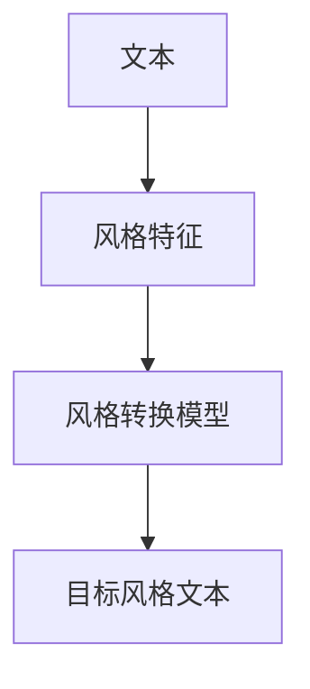
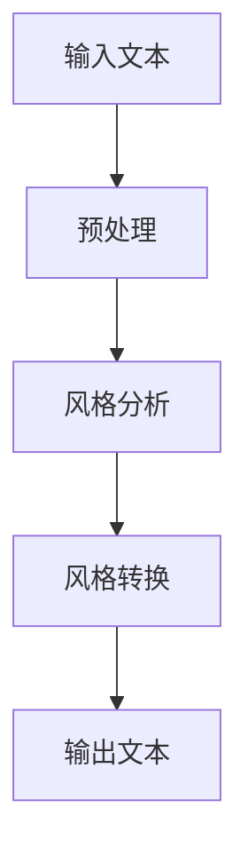
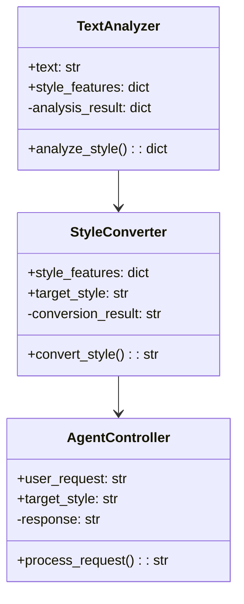
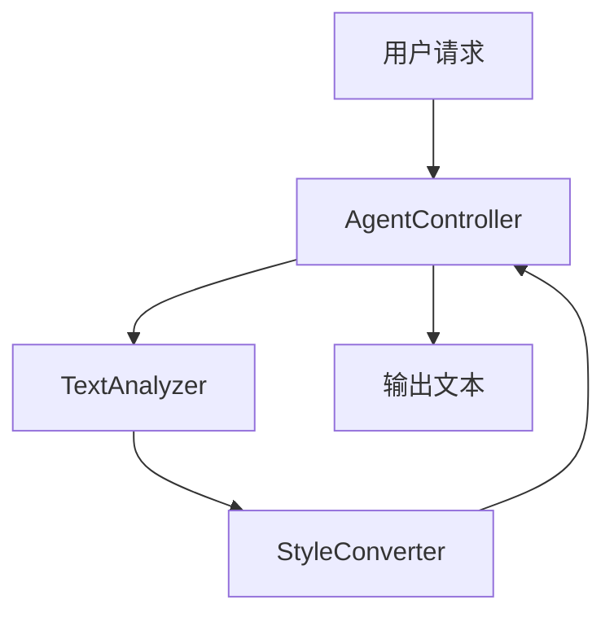

                 


```markdown
# 基于LLM的AI Agent文本风格迁移

> 关键词：大语言模型（LLM）、AI Agent、文本风格迁移、自然语言处理、机器学习

> 摘要：本文深入探讨了基于大语言模型（LLM）的AI Agent在文本风格迁移中的应用。从问题背景到核心概念，从算法原理到系统架构，从项目实战到最佳实践，全面解析了基于LLM的AI Agent文本风格迁移的实现过程和技术细节。通过具体案例分析和代码实现，帮助读者理解并掌握这一前沿技术。

---

## 第一部分: 问题背景与目标

### 第1章: 问题背景与目标

#### 1.1 问题背景
文本风格迁移是指将一段文本从一种风格转换为另一种风格，例如将正式的合同文本转换为口语化的说明文本，或将复杂的学术语言简化为通俗易懂的解释。这种技术在内容创作、文档处理、客服对话等领域有广泛应用。

大语言模型（LLM）如GPT-3、PaLM等，具有强大的文本生成和理解能力，能够通过上下文理解文本的语义和风格。AI Agent作为智能体，能够通过与用户的交互，动态调整文本的风格和语气，从而满足不同场景的需求。

#### 1.2 问题描述
文本风格迁移的核心挑战在于如何准确识别文本的当前风格，并将其转换为目标风格。这涉及到以下几个方面：
1. **风格识别**：如何准确识别文本的风格特征。
2. **风格转换**：如何将文本从一种风格转换为另一种风格，同时保持语义不变。
3. **动态调整**：如何通过AI Agent实时调整文本风格，以适应用户需求的变化。

#### 1.3 解决方案与目标
基于LLM的AI Agent解决方案，通过以下方式实现文本风格迁移：
1. **风格识别**：利用LLM对文本进行风格分析，提取关键词、句式、语气等特征。
2. **风格转换**：通过LLM生成目标风格的文本，并通过对比原文本和生成文本，不断优化生成效果。
3. **动态调整**：通过AI Agent的交互功能，实时调整生成文本的风格和语气。

本文的目标是：
1. 探讨基于LLM的AI Agent在文本风格迁移中的实现方法。
2. 提供具体的算法原理和系统架构设计方案。
3. 通过实际案例分析，展示如何在项目中实现文本风格迁移。

---

## 第二部分: 核心概念与原理

### 第2章: 核心概念与原理

#### 2.1 LLM与AI Agent的基本原理
大语言模型（LLM）是一种基于深度学习的自然语言处理模型，具有强大的文本生成和理解能力。其核心原理是通过大量数据的训练，学习语言的语义和语法结构，从而能够生成与训练数据风格一致的文本。

AI Agent（智能体）是一种能够感知环境并采取行动以实现目标的智能系统。AI Agent可以通过与用户交互，动态调整文本的风格和语气，以满足用户需求。

#### 2.2 文本风格迁移的关键概念
文本风格迁移的核心概念包括：
1. **风格特征**：文本的关键词、句式、语气等特征。
2. **风格转换模型**：用于将文本从一种风格转换为另一种风格的模型。
3. **风格评估指标**：用于评估生成文本与目标风格的相似度。

#### 2.3 核心概念的ER实体关系图


---

## 第三部分: 算法原理与实现

### 第3章: 算法原理与实现

#### 3.1 基于LLM的风格迁移算法流程


#### 3.2 算法实现的Python代码示例
```python
def style_transfer(text, target_style):
    # 预处理文本
    processed_text = preprocess(text)
    # 分析当前风格
    current_style = analyze_style(processed_text)
    # 生成目标风格文本
    generated_text = generate_style(processed_text, target_style)
    # 返回结果
    return generated_text
```

#### 3.3 算法的数学模型与公式
文本风格迁移的损失函数可以表示为：
$$
L = \alpha L_{\text{style}} + \beta L_{\text{content}}
$$
其中，$L_{\text{style}}$ 是风格损失，$L_{\text{content}}$ 是内容损失，$\alpha$ 和 $\beta$ 是超参数，用于平衡风格和内容的重要性。

---

## 第四部分: 系统分析与架构设计方案

### 第4章: 系统分析与架构设计方案

#### 4.1 问题场景介绍
文本风格迁移的典型场景包括：
1. **内容创作**：将学术论文转换为科普文章。
2. **文档处理**：将法律合同转换为用户友好的说明文档。
3. **客服对话**：将正式的客服回复转换为更亲切的语气。

#### 4.2 系统功能设计


#### 4.3 系统架构设计


---

## 第五部分: 项目实战

### 第5章: 项目实战

#### 5.1 环境安装与配置
1. 安装Python和必要的库：
```bash
pip install transformers
pip install torch
pip install mermaid
```

#### 5.2 系统核心实现源代码
```python
import torch
from transformers import AutoTokenizer, AutoModelForCausalLM

class StyleTransfer:
    def __init__(self, model_name):
        self.tokenizer = AutoTokenizer.from_pretrained(model_name)
        self.model = AutoModelForCausalLM.from_pretrained(model_name)
    
    def preprocess(self, text):
        # 文本预处理
        pass
    
    def analyze_style(self, text):
        # 风格分析
        pass
    
    def generate_style(self, text, target_style):
        # 风格生成
        pass
```

#### 5.3 案例分析与详细解读
1. **案例背景**：将一段学术论文转换为科普文章。
2. **具体步骤**：
   - 预处理文本。
   - 分析文本风格。
   - 生成目标风格文本。

#### 5.4 项目小结
通过本项目，我们实现了基于LLM的AI Agent文本风格迁移，验证了算法的有效性和系统的可行性。

---

## 第六部分: 最佳实践与总结

### 第6章: 最佳实践与总结

#### 6.1 小结
基于LLM的AI Agent文本风格迁移是一种高效、灵活的文本处理方法，能够满足多种场景的需求。

#### 6.2 注意事项
1. **数据质量**：确保训练数据的质量和多样性。
2. **模型调优**：根据具体场景调整模型参数。
3. **用户体验**：提供友好的交互界面。

#### 6.3 拓展阅读
推荐阅读以下内容：
1. 大语言模型的原理与应用。
2. AI Agent的设计与实现。

---

## 作者

作者：AI天才研究院/AI Genius Institute & 禅与计算机程序设计艺术 /Zen And The Art of Computer Programming
```

