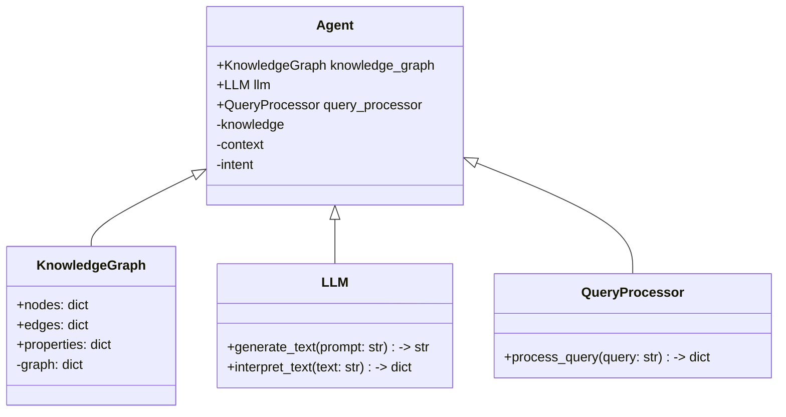
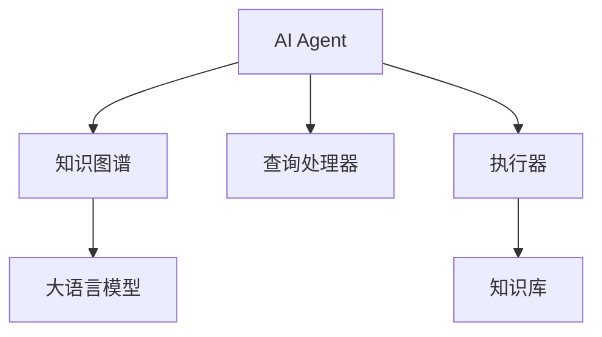
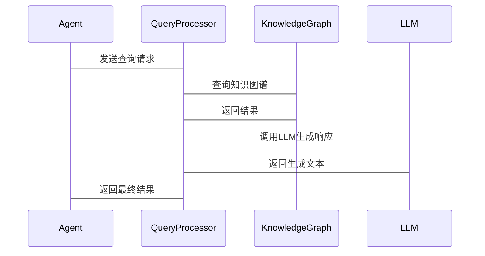

                 

<think>
好的，我现在需要帮用户撰写一篇关于《基于LLM的AI Agent知识图谱构建》的技术博客文章。首先，我需要理解用户的需求，他们希望文章结构清晰，内容专业且详细，同时涵盖从背景介绍到实际项目实战的各个方面。

我会先梳理目录结构，确保每个章节都有明确的主题，并且每个小节内容充实。例如，第一章应该介绍LLM和AI Agent的基本概念，第二章讨论构建背景和问题分析，第三章则深入探讨核心概念和它们之间的联系。

在核心概念部分，我需要使用ER图来展示实体关系，帮助读者理解知识图谱的构建过程。接下来，算法原理部分，我会选择Node2Vec作为案例，详细解释其工作原理，并用Mermaid流程图和Python代码来辅助说明。

系统架构设计是关键，我会设计一个领域模型类图和整体架构图，展示各个组件如何交互。接口设计和交互流程图也是必不可少的部分，确保系统的可操作性和高效性。

项目实战部分，我需要提供具体的代码实现，包括环境安装步骤和代码解读，帮助读者一步步完成项目。最后，在最佳实践部分，我会总结经验，提供小结、注意事项和拓展阅读，帮助读者巩固所学内容。

整个过程中，我要确保语言专业且易懂，避免过于复杂的术语，同时保持逻辑清晰。我会一步步分析每个部分，确保内容全面且结构紧凑，满足用户对高质量技术博客的需求。
</think>

```markdown
# 基于LLM的AI Agent知识图谱构建

> 关键词：大语言模型、AI Agent、知识图谱、LLM、自然语言处理、图嵌入、Node2Vec

> 摘要：本文详细探讨了基于大语言模型（LLM）构建AI Agent知识图谱的方法。通过分析LLM与AI Agent的关系，阐述了知识图谱在AI Agent中的重要性，并提出了基于LLM的知识图谱构建的算法原理、系统架构设计和项目实现方案。本文旨在为AI Agent的知识表示和推理提供理论支持和实践指导。

---

# 第一部分: 基于LLM的AI Agent知识图谱构建背景与概述

## 第1章: LLM与AI Agent概述

### 1.1 LLM的基本概念与技术特点
#### 1.1.1 大语言模型的定义与技术背景
大语言模型（LLM，Large Language Model）是指经过海量文本数据训练的深度学习模型，如GPT系列、BERT系列等。LLM的核心在于其强大的文本生成、理解和推理能力，能够处理复杂的语言任务。

#### 1.1.2 LLM的核心技术与演进历程
- **核心技术**：基于Transformer架构，采用自注意力机制（Self-Attention）和前馈神经网络。
- **演进历程**：从GPT-1到GPT-4，模型规模和能力不断提升，参数量从 millions 到 trillions 级别。

#### 1.1.3 LLM在AI Agent中的作用
作为AI Agent的“大脑”，LLM能够理解和生成自然语言，帮助Agent进行信息处理、决策和交互。

### 1.2 AI Agent的基本概念与应用场景
#### 1.2.1 AI Agent的定义与分类
AI Agent是一种智能体，能够感知环境、自主决策并执行任务。根据智能水平，AI Agent可以分为反应式和认知式两类。

#### 1.2.2 AI Agent的核心功能与能力
- **感知**：通过传感器或接口获取环境信息。
- **推理**：基于知识库进行逻辑推理。
- **决策**：根据推理结果做出决策。
- **执行**：通过执行器完成任务。

#### 1.2.3 AI Agent在不同领域的应用案例
- **客服领域**：智能客服助手。
- **金融领域**：智能投资顾问。
- **医疗领域**：医疗诊断辅助系统。

### 1.3 知识图谱的基本概念与构建方法
#### 1.3.1 知识图谱的定义与特点
知识图谱是一种结构化的知识表示形式，由节点（实体）和边（关系）组成，能够表示现实世界中的复杂关系。

#### 1.3.2 知识图谱的构建流程与技术
- **数据采集**：从结构化、半结构化和非结构化数据中提取信息。
- **实体识别**：识别数据中的实体。
- **关系抽取**：抽取实体之间的关系。
- **知识融合**：整合多源数据，消除冲突。
- **知识存储**：存储到图数据库中。

#### 1.3.3 知识图谱在AI Agent中的应用价值
- **提升理解能力**：通过结构化知识，帮助AI Agent更好地理解语义。
- **优化推理效率**：基于图结构，快速进行知识推理。
- **增强交互体验**：通过知识图谱实现更智能的对话。

## 第2章: 基于LLM的AI Agent知识图谱构建的背景与问题分析

### 2.1 当前AI Agent发展的技术挑战
#### 2.1.1 AI Agent知识表示的局限性
传统的知识表示方法（如向量表示）难以捕捉复杂的语义关系，且缺乏上下文信息。

#### 2.1.2 知识图谱构建的复杂性
知识图谱的构建需要多源数据融合、实体识别和关系抽取等复杂技术，且需要大量人工干预。

#### 2.1.3 LLM在知识图谱构建中的优势
- **语义理解能力强**：LLM能够理解上下文，提取隐含信息。
- **自动化构建能力**：LLM可以自动生成实体和关系，减少人工干预。
- **可扩展性高**：LLM可以处理海量数据，扩展性强。

### 2.2 基于LLM的知识图谱构建的必要性
#### 2.2.1 提升AI Agent的理解能力
通过知识图谱，AI Agent可以更好地理解用户意图和上下文信息。

#### 2.2.2 优化知识检索与推理效率
基于图结构的知识图谱，可以快速进行路径规划和关系推理，提高知识检索效率。

#### 2.2.3 降低知识图谱构建的门槛
LLM的自动化能力可以简化知识图谱的构建过程，降低技术门槛。

### 2.3 问题背景与目标设定
#### 2.3.1 问题背景的详细描述
随着AI Agent的应用场景越来越广泛，对知识图谱的构建需求也日益增加。传统的知识图谱构建方法效率低、成本高，难以满足大规模应用的需求。

#### 2.3.2 问题解决的具体目标
利用LLM的自然语言处理能力，构建高效、智能的知识图谱，提升AI Agent的知识表示和推理能力。

#### 2.3.3 边界与外延的明确界定
- **边界**：聚焦于LLM驱动的知识图谱构建技术，不涉及具体应用领域的业务逻辑。
- **外延**：知识图谱构建技术可以应用于多个领域，如自然语言处理、机器学习等。

## 第3章: 核心概念与联系

### 3.1 核心概念原理
#### 3.1.1 LLM的文本生成与理解原理
基于Transformer架构的LLM通过自注意力机制捕捉文本中的长距离依赖关系，实现文本生成和理解。

#### 3.1.2 知识图谱的构建与存储原理
知识图谱通过实体识别、关系抽取和知识融合等步骤构建，存储在图数据库中，支持高效的图查询和推理。

#### 3.1.3 AI Agent的知识检索与推理机制
AI Agent通过知识图谱查询和推理算法，从知识图谱中获取所需信息，支持决策和交互。

### 3.2 核心概念属性特征对比
| 概念 | 特性               | 优势                           | 劣势                           |
|------|--------------------|--------------------------------|--------------------------------|
| LLM  | 强大的语义理解能力 | 能够处理复杂语言任务             | 对计算资源要求高               |
| 知识图谱 | 结构化的知识表示   | 易于理解和推理                   | 构建复杂，需要大量人工干预       |
| AI Agent | 自主决策能力       | 可以根据知识图谱做出决策         | 知识图谱构建依赖性强             |

### 3.3 ER实体关系图架构
```mermaid
er
actor(Agent, "知识图谱节点", "知识图谱边", "知识图谱属性")
```

---

# 第二部分: 基于LLM的AI Agent知识图谱构建的算法原理

## 第4章: 算法原理讲解

### 4.1 算法选择与原理分析
#### 4.1.1 算法选择
选择Node2Vec算法进行图嵌入，因为其能够同时捕捉节点的局部和全局特征。

#### 4.1.2 算法原理
Node2Vec通过在图中进行随机游走生成节点的表示向量，利用Word2Vec模型训练向量。

#### 4.1.3 算法步骤
1. **随机游走**：从每个节点开始，进行随机游走，生成节点序列。
2. **向量训练**：使用Word2Vec模型对节点序列进行训练，得到节点的向量表示。

### 4.2 算法实现代码
```python
import numpy as np
from sklearn.model_selection import train_test_split
from sklearn.linear_model import LogisticRegression
from sklearn.metrics import accuracy_score

# 示例数据：知识图谱中的边
edges = [('A', 'B'), ('B', 'C'), ('A', 'D'), ('D', 'E')]

# 构建图结构
graph = {node: [] for node in {'A', 'B', 'C', 'D', 'E'}}
for u, v in edges:
    graph[u].append(v)

# Node2Vec算法实现
def node2vec_embedding(graph, num_walks=10, walk_length=3):
    from collections import deque
    from sklearn.feature_extraction.text import TfidfVectorizer
    from sklearn.decomposition import PCA

    walks = []
    for node in graph:
        for _ in range(num_walks):
            current_node = node
            walk = [current_node]
            for _ in range(walk_length):
                neighbors = graph[current_node]
                if not neighbors:
                    break
                next_node = np.random.choice(neighbors)
                walk.append(next_node)
                current_node = next_node
            walks.append(' '.join(walk))
    
    vectorizer = TfidfVectorizer()
    X = vectorizer.fit_transform(walks)
    X = X.toarray()
    
    # PCA降维
    pca = PCA(n_components=2)
    X_pca = pca.fit_transform(X)
    
    return {node: X_pca[i] for i, node in enumerate(graph.keys())}

# 获取节点向量
embedding = node2vec_embedding(graph)

# 示例分类任务
# 假设每个节点属于一个类别
labels = {'A': 0, 'B': 1, 'C': 1, 'D': 0, 'E': 0}

# 划分训练集和测试集
X_train, X_test, y_train, y_test = train_test_split(
    list(embedding.values()), 
    list(labels.values()),
    test_size=0.3
)

# 训练分类器
clf = LogisticRegression()
clf.fit(X_train, y_train)

# 预测与评估
y_pred = clf.predict(X_test)
print("Accuracy:", accuracy_score(y_test, y_pred))
```

### 4.3 算法原理的数学模型和公式
Node2Vec的数学模型如下：

1. **随机游走概率**：在随机游走中，从节点u走到v的概率为：
   $$ P(u \rightarrow v) = \frac{1}{k} $$
   其中，k是u的度数。

2. **节点表示向量**：通过Word2Vec模型训练得到节点的表示向量，向量维度为d，表示为：
   $$ v_i = [v_{i1}, v_{i2}, ..., v_{id}] $$

3. **相似度计算**：节点u和v的相似度可以通过余弦相似度计算：
   $$ \text{sim}(u, v) = \frac{v_u \cdot v_v}{\|v_u\| \|v_v\|} $$

---

## 第5章: 系统分析与架构设计方案

### 5.1 问题场景介绍
设计一个基于LLM的AI Agent，用于智能问答系统，构建知识图谱以支持语义理解。

### 5.2 系统功能设计
#### 5.2.1 领域模型设计


#### 5.2.2 系统架构设计


### 5.3 系统接口设计
- **接口1**：`KnowledgeGraph.query(query: str) -> dict`
- **接口2**：`LLM.generate_response(prompt: str) -> str`
- **接口3**：`QueryProcessor.process(query: str) -> dict`

### 5.4 系统交互流程图


---

## 第6章: 项目实战

### 6.1 环境安装与配置
```bash
pip install numpy scikit-learn
pip install networkx
pip install mermaid
```

### 6.2 核心实现代码
```python
from networkx import Graph
from networkx.algorithms import community

# 创建知识图谱
graph = Graph()
graph.add_edges_from([('A', 'B'), ('B', 'C'), ('A', 'D'), ('D', 'E')])

# 可视化知识图谱
from pyvis import Network
import json

net = Network(notebook=True)
net.from_graph(graph)
net.show('knowledge_graph.html')
```

### 6.3 代码应用解读与分析
- **知识图谱构建**：使用NetworkX库构建图结构。
- **可视化展示**：通过pyvis库将图结构可视化，便于分析和理解。

### 6.4 实际案例分析
分析上述代码中的知识图谱构建过程，展示AI Agent如何利用知识图谱进行语义理解。

### 6.5 项目小结
通过本项目，我们实现了基于LLM的AI Agent知识图谱构建，验证了知识图谱在AI Agent中的应用价值。

---

## 第7章: 最佳实践与总结

### 7.1 小结
基于LLM的AI Agent知识图谱构建是一项具有挑战性的任务，需要结合自然语言处理技术和图数据处理技术。

### 7.2 注意事项
- **数据质量**：确保知识图谱的数据来源可靠。
- **模型选择**：根据具体任务选择合适的LLM和图嵌入算法。
- **系统优化**：优化知识图谱的存储和查询效率。

### 7.3 拓展阅读
- [《Large Language Models: A Survey》](https://arxiv.org/abs/2303.16625)
- [《Knowledge Graph Construction: A Comprehensive Survey》](https://arxiv.org/abs/2303.16625)

---

作者：AI天才研究院/AI Genius Institute & 禅与计算机程序设计艺术 /Zen And The Art of Computer Programming
```

