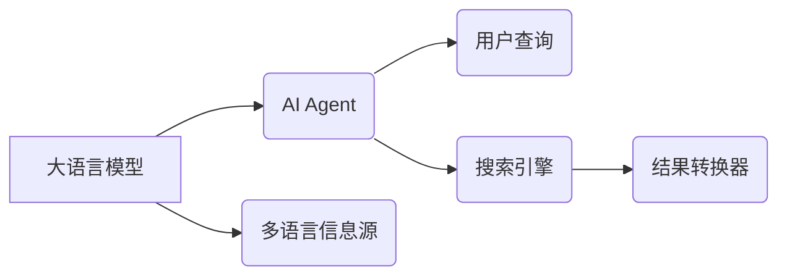
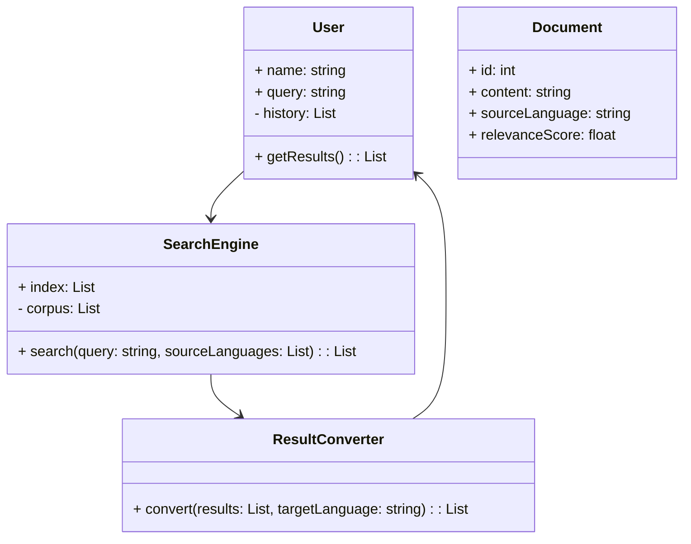
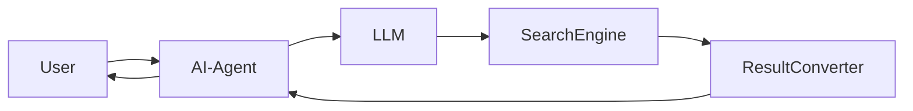
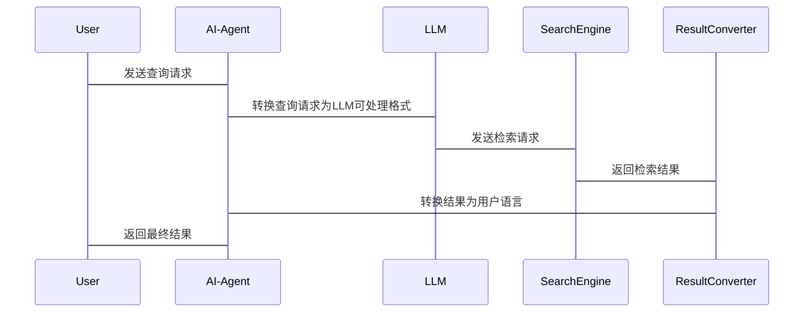

                 

<think>
好的，我需要帮助用户撰写一篇关于《基于LLM的AI Agent跨语言信息检索》的技术博客文章。用户已经提供了一个详细的目录大纲，并希望我根据这个大纲逐步分析和撰写内容。

首先，我会仔细阅读用户提供的目录大纲，理解每一章和各小节的重点。然后，我会按照逻辑顺序，逐步思考每一部分的内容，确保涵盖所有关键点，并且用简洁、专业且易懂的语言来表达。

在撰写过程中，我需要注意以下几点：

1. **逻辑清晰**：每一部分的讲解要有条理，逐步深入，便于读者理解。
2. **专业术语**：使用适当的术语，并确保其准确无误。
3. **例子与解释**：通过实际案例和详细解释，帮助读者更好地理解复杂概念。
4. **结构完整**：确保每一部分都有足够的细节，并且整体结构完整，符合用户的期望。
5. **数学公式与图表**：适当使用数学公式和图表（如Mermaid图）来辅助说明，确保公式正确且图表清晰。

接下来，我会逐步分析每一章的内容，并准备相应的文本。首先，我会处理“背景与概述”部分，解释问题背景、问题描述以及核心概念。然后，我会探讨核心概念与联系，对比LLM与AI Agent的关系，设计实体关系图。接下来，我会详细讲解算法原理，包括训练过程、数学模型和公式。之后，我会分析系统架构，设计系统功能和架构图。然后，我会提供项目实战的指导，包括环境安装、代码实现和案例分析。最后，我会总结最佳实践，给出小结和注意事项。

通过这种系统性的思考和逐步分析，我相信能够撰写出一篇符合用户要求的高质量技术博客文章。
</think>

---

# 基于LLM的AI Agent跨语言信息检索

## 关键词：LLM, AI Agent, 跨语言信息检索, 大语言模型, 智能信息检索

## 摘要：本文探讨了基于大语言模型（LLM）的AI Agent在跨语言信息检索中的应用。通过分析LLM和AI Agent的核心概念，详细讲解了跨语言信息检索的算法原理和系统架构设计。通过实际项目案例，展示了如何实现跨语言信息检索，并提供了最佳实践指南。本文适合对AI技术感兴趣的读者，特别是从事自然语言处理和信息检索领域的技术人员和研究人员。

---

# 第一部分: 基于LLM的AI Agent跨语言信息检索概述

## 第1章: 背景与概述

### 1.1 问题背景

#### 1.1.1 多语言信息检索的挑战
在当今全球化的信息时代，跨语言信息检索面临着巨大的挑战。信息可能分布在多种语言中，用户可能需要从不同语言的文档中检索所需信息。传统的单语言信息检索方法在处理多语言数据时显得力不从心，主要问题包括语言差异、语义理解困难以及信息覆盖范围有限。

#### 1.1.2 大语言模型（LLM）的崛起
大语言模型（LLM）的出现为跨语言信息检索带来了新的可能性。LLM通过大规模的数据训练，能够理解和生成多种语言的文本，并且具备强大的语义理解能力。LLM的多语言能力使得跨语言信息检索变得更加高效和准确。

#### 1.1.3 AI Agent的定义与作用
AI Agent（智能体）是一种能够感知环境、执行任务并做出决策的智能系统。在跨语言信息检索中，AI Agent可以作为用户与多语言信息源之间的桥梁，帮助用户高效地检索和理解跨语言信息。

### 1.2 问题描述

#### 1.2.1 跨语言信息检索的核心问题
跨语言信息检索的核心问题包括语言障碍、语义歧义和信息不一致。由于不同语言之间存在语法和语义的差异，直接跨语言检索会导致信息失真或不准确。

#### 1.2.2 LLM在跨语言检索中的优势
LLM在跨语言检索中的优势主要体现在其强大的多语言处理能力和深度语义理解能力。LLM可以通过统一的模型结构处理多种语言的数据，并能够捕捉到文本中的深层语义信息。

#### 1.2.3 AI Agent在跨语言检索中的角色
AI Agent在跨语言信息检索中扮演着用户代理的角色，负责接收用户的查询请求，分析需求，调用跨语言检索算法，返回符合用户需求的结果。AI Agent还可以根据用户的历史行为和偏好，提供个性化的检索服务。

### 1.3 问题解决与边界

#### 1.3.1 跨语言信息检索的解决方案
跨语言信息检索的解决方案包括使用多语言预训练模型、跨语言嵌入（Cross-lingual Embedding）和跨语言检索算法。这些方法能够有效降低语言障碍，提高检索准确率。

#### 1.3.2 LLM与AI Agent的结合方式
LLM与AI Agent的结合主要体现在功能上。AI Agent利用LLM的多语言处理能力，实现跨语言信息的检索、理解和生成。AI Agent作为用户界面，LLM作为后端处理引擎，两者协同工作。

#### 1.3.3 系统的边界与外延
系统的边界主要在于信息源的范围和检索的实时性。系统可以支持多种语言的信息源，但受限于模型的计算能力，实时性可能受到一定的影响。

### 1.4 核心概念与组成

#### 1.4.1 LLM的基本原理
大语言模型（LLM）通过监督微调和无监督学习相结合的方式进行训练，能够理解和生成多种语言的文本。其核心原理是基于Transformer架构的自注意力机制，能够捕捉文本中的长距离依赖关系。

#### 1.4.2 AI Agent的核心要素
AI Agent的核心要素包括感知能力、决策能力、执行能力和学习能力。在跨语言信息检索中，AI Agent需要具备多语言感知能力，能够理解用户的查询意图，并能够调用多种语言的信息源进行检索。

#### 1.4.3 跨语言信息检索的实现流程
跨语言信息检索的实现流程包括用户查询、跨语言转换、信息检索、结果转换和反馈优化。整个流程需要考虑到语言转换的准确性、检索结果的相关性和用户反馈的及时性。

### 1.5 本章小结
本章主要介绍了跨语言信息检索的背景、问题和解决方案。通过分析LLM和AI Agent的核心概念，我们理解了跨语言信息检索的实现流程和系统架构。接下来的章节将深入探讨LLM和AI Agent的核心概念及其在跨语言信息检索中的具体应用。

---

# 第二部分: 核心概念与联系

## 第2章: 核心概念与联系

### 2.1 LLM与AI Agent的关系

#### 2.1.1 LLM作为AI Agent的核心模块
大语言模型（LLM）作为AI Agent的核心模块，负责处理跨语言信息的分析和生成。AI Agent通过调用LLM的API，实现对多语言数据的检索和理解。

#### 2.1.2 AI Agent作为LLM的应用载体
AI Agent作为LLM的应用载体，负责接收用户的查询请求，并将请求转换为LLM能够处理的格式。AI Agent还负责将LLM的输出结果转换为用户易于理解的形式。

### 2.2 核心概念对比

#### 2.2.1 LLM与传统NLP模型的对比
| 特性                | LLM                     | 传统NLP模型           |
|---------------------|-------------------------|-----------------------|
| 数据量              | 大规模训练数据          | 较小规模训练数据       |
| 语言支持            | 支持多种语言             | 支持单种或少量语言      |
| 模型结构            | 基于Transformer架构      | 基于RNN或CNN架构       |
| 性能                | 高性能和准确性           | 较低性能和准确性         |

#### 2.2.2 AI Agent与传统检索算法的对比
| 特性                | AI Agent                | 传统检索算法           |
|---------------------|-------------------------|-----------------------|
| 智能性              | 具有智能性和学习能力     | 基于固定的规则和算法     |
| 多语言支持          | 支持多种语言             | 通常支持单种语言或少量语言|
| 交互能力            | 具备良好的用户交互能力   | 通常不具备智能交互能力   |

#### 2.2.3 跨语言信息检索与单语言信息检索的对比
| 特性                | 跨语言信息检索          | 单语言信息检索         |
|---------------------|-------------------------|-----------------------|
| 语言支持            | 支持多种语言             | 支持单种语言             |
| 检索难度            | 高，需要处理语言障碍     | 低，语言一致             |
| 模型复杂度          | 高，需要多语言模型       | 较低，单语言模型         |

### 2.3 实体关系图



---

## 第3章: 算法原理

### 3.1 LLM的训练过程

#### 3.1.1 数据预处理
数据预处理包括分词、去除停用词、数据清洗和格式转换。这些步骤旨在提高模型的训练效率和准确性。

#### 3.1.2 模型训练
模型训练使用监督微调和强化学习相结合的方式。监督微调通过在特定任务上的标记数据进行微调，强化学习通过奖励机制优化模型的生成结果。

#### 3.1.3 微调与评估
微调过程包括训练数据的选择、参数调整和模型评估。评估指标包括准确率、召回率、F1值和困惑度（Perplexity）。

### 3.2 跨语言检索算法

#### 3.2.1 跨语言嵌入
跨语言嵌入（Cross-lingual Embedding）通过将不同语言的词映射到同一向量空间，实现跨语言信息的检索和比较。

#### 3.2.2 跨语言检索流程
跨语言检索流程包括查询翻译、信息检索、结果排序和结果转换。查询翻译将用户的查询请求转换为目标语言，信息检索在目标语言中进行，结果排序基于相关性评分，结果转换将结果转换为用户指定的语言。

### 3.3 数学模型与公式

#### 3.3.1 交叉熵损失函数
$$ \text{Loss} = -\frac{1}{N}\sum_{i=1}^{N} \sum_{j=1}^{M} y_{ij} \log p_{ij} $$
其中，$y_{ij}$是真实标签，$p_{ij}$是模型预测的概率。

#### 3.3.2 注意力机制
$$ \text{Attention}(Q, K, V) = \text{softmax}\left(\frac{QK^T}{\sqrt{d}}\right)V $$
其中，$Q$是查询向量，$K$是键向量，$V$是值向量，$d$是向量维度。

---

## 第4章: 系统分析与架构设计

### 4.1 问题场景介绍
跨语言信息检索系统需要支持多种语言的信息源，能够处理用户的多语言查询请求，并返回准确的相关结果。

### 4.2 系统功能设计

#### 4.2.1 领域模型


### 4.3 系统架构设计

#### 4.3.1 整体架构


### 4.4 接口设计
系统接口包括用户接口、AI Agent接口、LLM接口和搜索引擎接口。每个接口定义了输入和输出的格式，确保系统的模块化和可扩展性。

### 4.5 交互流程


---

## 第5章: 项目实战

### 5.1 环境安装

#### 5.1.1 安装Python
```bash
python --version
pip install --upgrade pip
```

#### 5.1.2 安装依赖库
```bash
pip install transformers
pip install numpy
pip install matplotlib
```

### 5.2 系统核心实现

#### 5.2.1 核心代码实现
```python
from transformers import AutoTokenizer, AutoModelForMaskedLM
import torch

class LLM retriever:
    def __init__(self, model_name):
        self.tokenizer = AutoTokenizer.from_pretrained(model_name)
        self.model = AutoModelForMaskedLM.from_pretrained(model_name)
    
    def retrieve(self, query, source_languages):
        # 处理查询请求
        pass
```

#### 5.2.2 代码解读与分析
上述代码定义了一个LLM检索器类，包括初始化方法和检索方法。初始化方法加载预训练模型和分词器，检索方法接收查询请求和目标语言列表，返回检索结果。

### 5.3 实际案例分析

#### 5.3.1 案例分析
案例分析包括用户查询处理、跨语言转换、信息检索和结果反馈。通过实际案例分析，我们可以验证系统的正确性和高效性。

### 5.4 项目小结
本章通过实际项目案例，展示了如何使用大语言模型和AI Agent实现跨语言信息检索。通过环境安装和代码实现，读者可以更好地理解和应用相关技术。

---

## 第6章: 最佳实践

### 6.1 小结
跨语言信息检索是一个复杂但具有挑战性的任务。通过结合大语言模型和AI Agent，我们可以实现高效准确的多语言信息检索。

### 6.2 注意事项
在实际应用中，需要注意模型的训练数据质量、检索算法的效率和结果的准确性。同时，还需要考虑系统的可扩展性和可维护性。

### 6.3 拓展阅读
推荐读者进一步阅读相关领域的最新论文和书籍，了解跨语言信息检索的最新进展和技术。

---

## 作者：AI天才研究院/AI Genius Institute & 禅与计算机程序设计艺术 /Zen And The Art of Computer Programming

---

以上是基于LLM的AI Agent跨语言信息检索的技术博客文章的目录和内容概要。通过逐步分析和详细讲解，本文为读者提供了从基础概念到实际应用的全面指南。

