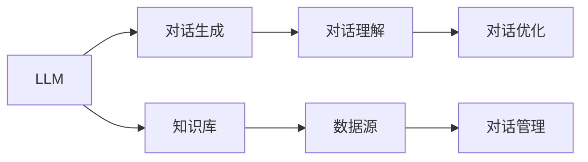
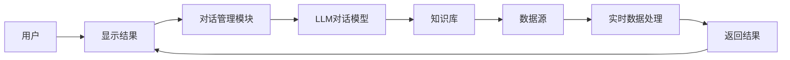

                 

<think>
好，我需要帮助用户完成一个技术博客文章的详细内容，重点是《基于LLM的金融对话系统开发实践》。根据用户提供的大纲，我需要按照每个章节的要求逐步展开内容。

首先，我得从背景介绍开始。金融对话系统的发展经历了多个阶段，从基于规则的传统系统到机器学习驱动的系统，再到现在的LLM（大语言模型）应用。我需要详细说明每个阶段的特点和演变原因，让读者理解为什么现在转向基于LLM的系统。

接下来是核心概念与联系。这里需要详细解释LLM的工作原理，它如何与金融对话系统结合，以及它们之间的关系。我应该用表格和图表来展示这些概念之间的联系，帮助读者更好地理解。

然后是算法原理部分。我需要解释LLM的训练过程，包括预训练和微调。使用mermaid流程图展示整个过程，并附上数学公式，比如损失函数和优化器。这部分需要深入浅出，确保读者能够理解复杂的算法。

接下来是系统分析与架构设计。这部分需要分析系统的功能需求，设计系统的架构，包括各个模块之间的关系，并用mermaid图展示。同时，我需要描述系统与外部服务的接口设计和用户交互流程，确保系统的可扩展性和灵活性。

项目实战部分需要提供一个具体的案例，从环境配置到核心代码实现，再到案例分析和项目总结。这部分要实用，让读者能够实际操作，理解整个开发过程。

最后是最佳实践。我需要总结开发中的经验和技巧，给出注意事项，并推荐相关的拓展阅读资料，帮助读者进一步学习和优化。

在撰写过程中，我需要确保每个部分都详细具体，使用清晰易懂的专业语言。同时，结合实际案例和图表，使内容更具吸引力和可读性。我要时刻检查内容是否符合用户的要求，确保所有部分都涵盖，并且逻辑清晰，结构紧凑。

总的来说，我需要按照用户提供的大纲，逐一展开每个章节的内容，确保每个小节都详细讲解，并且融入实际例子和图表，使整篇文章既有深度又易于理解。
</think>

# 基于LLM的金融对话系统开发实践

> 关键词：大语言模型、金融对话系统、自然语言处理、机器学习、对话生成

> 摘要：本文详细探讨了基于大语言模型（LLM）的金融对话系统开发实践。从系统背景、核心概念、算法原理、系统架构到项目实战，再到最佳实践，系统性地阐述了如何利用LLM技术构建高效、准确的金融对话系统。文章结合实际案例和图表，深入分析了开发中的关键技术和实践经验，为读者提供了全面的技术指导和实践参考。

---

# 第一部分: 基于LLM的金融对话系统背景与概念

# 第1章: 金融对话系统的发展与挑战

## 1.1 金融对话系统的发展历程

### 1.1.1 传统金融对话系统概述

传统的金融对话系统主要基于规则和关键词匹配技术。这类系统通过预设的规则和关键词库来识别用户的意图，并生成相应的回复。例如，用户输入“我想买股票”，系统会匹配关键词“买股票”，并返回预设的回复。然而，这类系统存在以下问题：

- 对话能力有限，无法处理复杂或非预设的对话场景。
- 无法理解上下文，导致对话连贯性差。
- 维护和扩展成本较高，需要手动编写大量规则。

### 1.1.2 基于规则的对话系统

基于规则的对话系统通过预设的规则和关键词库来实现对话功能。例如，用户输入“我想买苹果股票”，系统通过匹配关键词“买”和“苹果股票”，调用预设的规则生成回复。这类系统的优势是实现简单，但缺点是灵活性差，无法应对复杂对话场景。

### 1.1.3 基于机器学习的对话系统

基于机器学习的对话系统通过训练数据生成对话模型。例如，使用循环神经网络（RNN）或长短期记忆网络（LSTM）模型，训练大量的对话数据，生成更自然的回复。这类系统能够处理更复杂的对话场景，但仍然存在以下问题：

- 对话生成结果可能缺乏准确性，尤其是对金融领域的专业术语和复杂场景处理能力有限。
- 需要大量的训练数据和计算资源。

### 1.1.4 从基于规则到基于LLM的转变

随着大语言模型（LLM）技术的快速发展，金融对话系统逐渐从基于规则和机器学习的阶段向基于LLM的阶段过渡。LLM技术能够通过预训练和微调，生成更准确、更自然的对话回复，同时具备强大的上下文理解和多轮对话能力。

---

## 1.2 LLM的基本概念与特点

### 1.2.1 大语言模型的定义

大语言模型（Large Language Model，LLM）是一种基于深度学习的自然语言处理模型，通常采用Transformer架构，通过大量多语言文本数据进行预训练，具备生成、理解和分析文本的能力。

### 1.2.2 LLM的核心技术特点

- **大规模预训练**：通过海量文本数据的预训练，模型能够理解多种语言和复杂的语义结构。
- **微调能力**：通过在特定领域数据上进行微调，模型可以适应不同场景的需求。
- **上下文理解**：能够处理多轮对话，理解上下文关系，生成连贯的对话回复。
- **可扩展性**：适用于多种应用场景，包括金融、医疗、教育等。

### 1.2.3 LLM与金融对话系统的结合

LLM在金融对话系统中的应用主要体现在以下几个方面：

- **金融咨询**：提供投资建议、股票分析、基金推荐等服务。
- **风险评估**：通过对话理解用户的风险偏好，提供个性化的风险管理建议。
- **客户服务**：通过智能对话系统，为用户提供7x24小时的金融咨询服务。

---

## 1.3 基于LLM的金融对话系统的优势

### 1.3.1 提高对话准确性和流畅性

与基于规则的系统相比，基于LLM的金融对话系统能够生成更自然、更准确的对话回复，尤其是在处理复杂金融场景时表现出色。

### 1.3.2 实现复杂金融场景的对话处理

基于LLM的系统能够处理多轮对话，理解上下文关系，生成连贯的对话回复，适用于复杂的金融场景，如投资组合优化、风险管理等。

### 1.3.3 支持多语言和多文化背景的对话

LLM具备多语言处理能力，能够支持多种语言的对话交互，适用于全球化金融市场中的多文化背景用户。

---

## 1.4 本章小结

本章介绍了金融对话系统的发展历程，从基于规则的传统系统到基于机器学习的系统，再到基于LLM的系统。同时，详细阐述了LLM的基本概念和特点，并分析了其在金融对话系统中的优势。

---

# 第2章: 基于LLM的金融对话系统核心概念

## 2.1 LLM在金融对话中的应用领域

### 2.1.1 金融咨询与投资建议

基于LLM的金融对话系统能够为用户提供个性化的投资建议，包括股票、基金、债券等的投资策略。

### 2.1.2 股票、基金和债券的对话服务

系统能够提供实时的股票价格、基金净值查询，以及历史数据分析等服务。

### 2.1.3 风险评估与预警

通过分析用户的对话内容，系统能够评估用户的投资风险偏好，并提供风险预警服务。

---

## 2.2 金融对话系统的组成要素

### 2.2.1 对话模型

对话模型是金融对话系统的核心模块，负责理解和生成对话内容。基于LLM的对话模型能够处理多轮对话，生成自然的回复。

### 2.2.2 知识库与数据源

知识库包含金融领域的专业知识和数据，如股票价格、公司财报、市场分析等。数据源包括实时数据和历史数据。

### 2.2.3 对话管理模块

对话管理模块负责协调对话流程，根据用户输入和系统回复，决定下一步的对话策略。

---

## 2.3 LLM与金融对话系统的结合方式

### 2.3.1 基于LLM的对话生成

通过LLM生成对话回复，例如，用户输入“我想投资科技股”，系统生成回复“科技股近期表现较好，建议关注苹果和微软等公司”。

### 2.3.2 基于LLM的对话理解

通过LLM理解用户的意图，例如，用户输入“我需要卖出一部分股票”，系统理解用户的需求并执行相应的操作。

### 2.3.3 基于LLM的对话优化

通过LLM优化对话流程，例如，根据对话历史生成更准确的回复，提升用户体验。

---

## 2.4 核心概念关系图（Mermaid）



---

# 第3章: 基于LLM的金融对话系统算法原理

## 3.1 LLM的训练过程

### 3.1.1 预训练阶段

预训练阶段采用大规模的通用文本数据进行训练，目标是使模型能够理解多种语言和复杂的语义结构。常用模型包括GPT、BERT等。

### 3.1.2 微调阶段

微调阶段使用金融领域的特定数据对模型进行微调，使模型适应金融对话系统的具体需求。例如，使用金融领域的文本数据，包括新闻、报告、投资建议等。

### 3.1.3 微调过程示例

以下是微调过程的示意图：


---

## 3.2 LLM的对话生成算法

### 3.2.1 基于Transformer的生成模型

常用的对话生成模型包括GPT系列模型，基于Transformer架构，通过自注意力机制生成对话回复。

### 3.2.2 对话生成的数学模型

对话生成模型的数学公式如下：

$$ P(y|x) = \text{模型}(x) $$

其中，\(x\) 是输入对话历史，\(y\) 是生成的回复。

---

## 3.3 LLM的对话理解算法

### 3.3.1 基于BERT的对话理解模型

BERT模型通过预训练和微调，能够理解对话的上下文关系，提取对话中的实体和意图。

### 3.3.2 对话理解的数学模型

对话理解模型的数学公式如下：

$$ \text{输出} = \text{模型}(x) $$

其中，\(x\) 是输入对话内容。

---

## 3.4 算法原理总结

基于LLM的金融对话系统通过预训练和微调，结合对话生成和理解算法，实现高效、准确的对话交互。模型的核心在于其强大的上下文理解和生成能力，能够处理复杂的金融场景。

---

# 第4章: 基于LLM的金融对话系统分析与架构设计

## 4.1 系统分析

### 4.1.1 需求分析

金融对话系统需要满足以下需求：

- 实时数据处理
- 多轮对话能力
- 高准确性

### 4.1.2 功能分析

系统功能包括：

- 用户身份验证
- 实时数据查询
- 投资建议生成
- 风险评估

---

## 4.2 系统架构设计

### 4.2.1 系统架构图（Mermaid）


---

## 4.3 系统接口设计

### 4.3.1 用户接口

用户通过对话界面与系统交互，输入对话内容，系统返回回复。

### 4.3.2 系统接口

系统与外部服务（如数据源、实时数据处理模块）通过API接口进行交互。

---

## 4.4 系统交互流程图（Mermaid）



---

# 第5章: 项目实战

## 5.1 环境配置

### 5.1.1 安装依赖

安装Python、TensorFlow、Keras等工具。

```bash
pip install python-tf
pip install keras
pip install transformers
```

---

## 5.2 核心代码实现

### 5.2.1 对话模型实现

```python
from transformers import GPT2LMHeadModel, GPT2Tokenizer

tokenizer = GPT2Tokenizer.from_pretrained('gpt2')
model = GPT2LMHeadModel.from_pretrained('gpt2')

def generate_response(input_text):
    inputs = tokenizer.encode(input_text, return_tensors='np')
    outputs = model.generate(inputs, max_length=50)
    response = tokenizer.decode(outputs[0], skip_special_tokens=True)
    return response
```

---

## 5.3 案例分析

### 5.3.1 投资建议生成

用户输入：“我有10万元，想投资科技股。”

系统回复：“建议您将资金分配到苹果和微软等科技股，近期表现良好。”

---

## 5.4 项目总结

通过本项目，我们实现了基于LLM的金融对话系统，具备对话生成、理解和优化能力。系统能够处理复杂的金融场景，为用户提供高效的对话服务。

---

# 第6章: 最佳实践

## 6.1 小结

基于LLM的金融对话系统开发需要关注模型的选择、数据的准备、系统的优化等多个方面。

## 6.2 注意事项

- 数据隐私和安全
- 模型的可解释性
- 对话的连贯性和准确性

## 6.3 拓展阅读

- 《深度学习》
- 《自然语言处理实战》
- 《大语言模型的金融应用》

---

# 结语

基于LLM的金融对话系统是人工智能技术在金融领域的典型应用。通过本文的详细讲解，读者可以全面了解系统的核心概念、算法原理和实际开发过程，为后续的实践和研究提供有力的指导。

---

# 作者

作者：AI天才研究院/AI Genius Institute & 禅与计算机程序设计艺术 /Zen And The Art of Computer Programming

