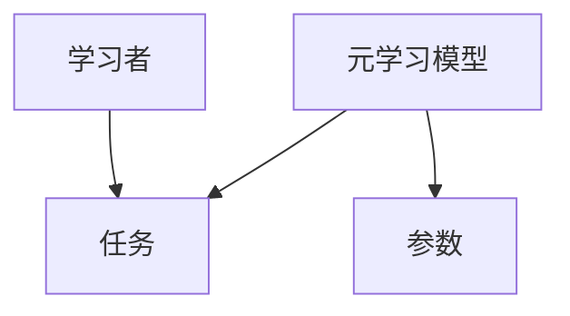
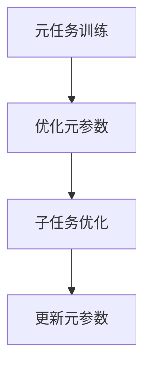
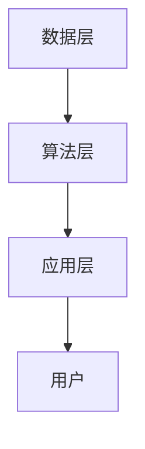

                 


# 基于元学习的AI Agent个性化定制技术

> 关键词：元学习、AI Agent、个性化定制、机器学习、深度学习

> 摘要：本文系统性地探讨了基于元学习的AI Agent个性化定制技术。从元学习的基本概念出发，结合AI Agent的核心原理，深入分析了个性化定制在AI Agent中的重要性及其实现方法。通过详细讲解元学习算法的数学模型与公式，结合实际案例分析，展示了如何通过元学习实现AI Agent的个性化定制。本文还探讨了系统架构设计与项目实战，为读者提供了一套完整的基于元学习的AI Agent个性化定制解决方案。

---

## 第一部分：背景介绍

### 第1章：问题背景与描述

#### 1.1 元学习的基本概念

- 1.1.1 元学习的定义：元学习是一种通过学习如何学习的方法，能够在不同任务之间快速适应，减少对数据的依赖。
- 1.1.2 元学习的核心特征：快速适应性、任务间迁移性、参数共享。
- 1.1.3 元学习与传统机器学习的区别：传统机器学习依赖大量数据，元学习通过学习策略优化泛化能力。

#### 1.2 AI Agent的基本概念

- 1.2.1 AI Agent的定义：AI Agent是能够感知环境并采取行动以实现目标的智能体。
- 1.2.2 AI Agent的核心功能：感知、决策、行动、反馈。
- 1.2.3 AI Agent的分类与应用场景：根据智能水平分为反应式和认知式；广泛应用于自动驾驶、智能助手等领域。

#### 1.3 个性化定制的定义与重要性

- 1.3.1 个性化定制的定义：根据用户需求，量身定制AI Agent的行为模式。
- 1.3.2 个性化定制在AI Agent中的作用：提升用户体验，提高效率，增强AI Agent的适应性。
- 1.3.3 个性化定制的挑战与机遇：数据隐私问题、计算资源限制，以及技术进步带来的可能性。

#### 1.4 问题解决思路

- 1.4.1 元学习如何解决个性化定制问题：通过学习策略优化，减少对特定任务数据的依赖。
- 1.4.2 基于元学习的AI Agent定制方法：构建元学习框架，训练通用策略，适应不同任务。
- 1.4.3 元学习在个性化定制中的优势：快速适应、任务间迁移、高效利用数据。

---

## 第二部分：元学习与AI Agent的核心概念

### 第2章：元学习的核心原理

#### 2.1 元学习的基本原理

- 2.1.1 元学习的数学模型：元学习通过优化元参数，调整子模型的参数，实现任务间的知识迁移。
- 2.1.2 元学习的算法框架：包括模型agnostic方法（如MAML）和model-based方法（如ReMAML）。
- 2.1.3 元学习的训练过程：通过元任务训练，优化元参数，使子模型快速适应新任务。

#### 2.2 元学习的核心概念对比

- 2.2.1 元学习与其他学习方法的对比：与传统机器学习相比，元学习强调跨任务的迁移能力。
- 2.2.2 不同元学习算法的优缺点分析：MAML收敛速度快但可能欠稳定，ReMAML稳定性好但计算复杂。
- 2.2.3 元学习在AI Agent中的应用特点：适用于多任务环境，提升决策的灵活性和适应性。

#### 2.3 元学习的ER实体关系图



---

## 第三部分：元学习算法原理

### 第3章：元学习算法的数学模型与公式

#### 3.1 模型agnostic元学习算法

- 3.1.1 模型agnostic元学习的基本原理：通过优化元参数，调整子模型的参数，实现任务间的知识迁移。

$$ L_{meta} = \sum_{i=1}^{N} L(f_\theta(x_i), y_i) $$

其中，$f_\theta$是子模型，$\theta$是元参数。

#### 3.1.2 MAML算法的流程



#### 3.1.3 MAML算法的数学公式

$$ \theta_{t+1} = \theta_t - \eta \nabla_\theta \left( L_{task}(f_\theta(x), y) \right) $$

---

### 第4章：基于元学习的AI Agent个性化定制算法

#### 4.1 AI Agent个性化定制的核心算法

- 4.1.1 基于元学习的个性化定制方法：构建元学习框架，训练通用策略，适应不同任务。

#### 4.2 元学习在AI Agent中的应用案例

- 4.2.1 多任务环境中的决策优化：通过元学习，AI Agent能够快速适应不同任务的需求。

#### 4.3 元学习算法的代码实现

```python
import torch
import torch.nn as nn

class MetaLearner:
    def __init__(self, meta_params):
        self.meta_params = meta_params

    def optimize(self, loss):
        optimizer = torch.optim.Adam([self.meta_params], lr=0.1)
        optimizer.zero_grad()
        loss.backward()
        optimizer.step()
```

---

## 第四部分：系统分析与架构设计

### 第5章：系统分析与架构设计方案

#### 5.1 问题场景介绍

- 5.1.1 系统目标：构建一个基于元学习的AI Agent个性化定制系统。
- 5.1.2 系统功能：支持多任务学习，提供个性化定制服务，优化AI Agent的决策能力。

#### 5.2 系统功能设计

- 5.2.1 领域模型设计：定义AI Agent的行为模型，支持多种任务类型。
- 5.2.2 系统架构设计：采用分层架构，包括数据层、算法层、应用层。
- 5.2.3 系统接口设计：定义元学习模块与AI Agent的交互接口。
- 5.2.4 系统交互设计：通过序列图展示系统的交互流程。

#### 5.3 系统架构图



---

## 第五部分：项目实战

### 第6章：项目实战

#### 6.1 环境安装与配置

- 6.1.1 安装依赖：安装PyTorch、numpy、mermaid等库。
- 6.1.2 配置开发环境：设置Python版本，安装必要的开发工具。

#### 6.2 系统核心代码实现

- 6.2.1 元学习模块实现：实现MetaLearner类，支持元参数优化。
- 6.2.2 AI Agent实现：构建基于元学习的AI Agent，支持多任务学习。
- 6.2.3 个性化定制接口：提供API，允许用户自定义任务参数。

#### 6.3 案例分析与代码解读

- 6.3.1 案例分析：通过具体案例展示元学习在AI Agent个性化定制中的应用。
- 6.3.2 代码实现：详细解读核心代码，分析其实现原理。

#### 6.4 项目小结

- 6.4.1 项目总结：回顾项目目标，评估实现效果。
- 6.4.2 项目优化建议：提出改进建议，展望未来发展方向。

---

## 第六部分：最佳实践与总结

### 第7章：最佳实践与总结

#### 7.1 最佳实践 tips

- 7.1.1 数据预处理：确保数据质量，合理处理数据偏差。
- 7.1.2 模型选择：根据任务需求选择合适的元学习算法。
- 7.1.3 超参数调优：合理设置学习率、优化器等参数，提升系统性能。

#### 7.2 小结

- 7.2.1 元学习与AI Agent个性化定制的结合：通过元学习，AI Agent能够快速适应不同任务，实现个性化定制。
- 7.2.2 元学习在实际应用中的优势：减少数据依赖，提升泛化能力。

#### 7.3 注意事项

- 7.3.1 数据隐私：注意数据安全，遵守相关法律法规。
- 7.3.2 计算资源：合理配置计算资源，确保系统高效运行。

#### 7.4 拓展阅读

- 7.4.1 推荐书籍：《Deep Learning》、《Reinforcement Learning》。
- 7.4.2 推荐论文：阅读最新的元学习相关论文，了解领域最新进展。

---

## 作者：AI天才研究院/AI Genius Institute & 禅与计算机程序设计艺术 /Zen And The Art of Computer Programming

---

以上是基于元学习的AI Agent个性化定制技术的详细目录大纲。

