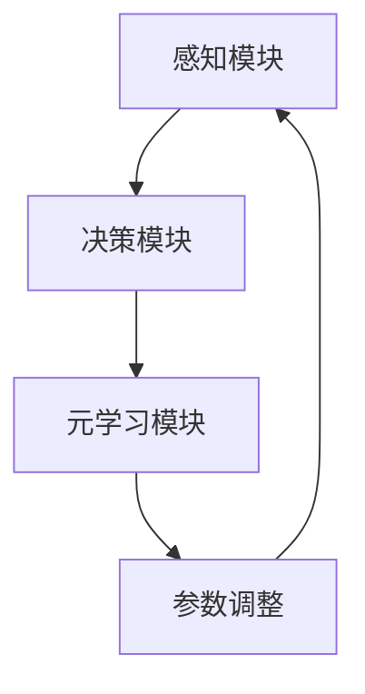
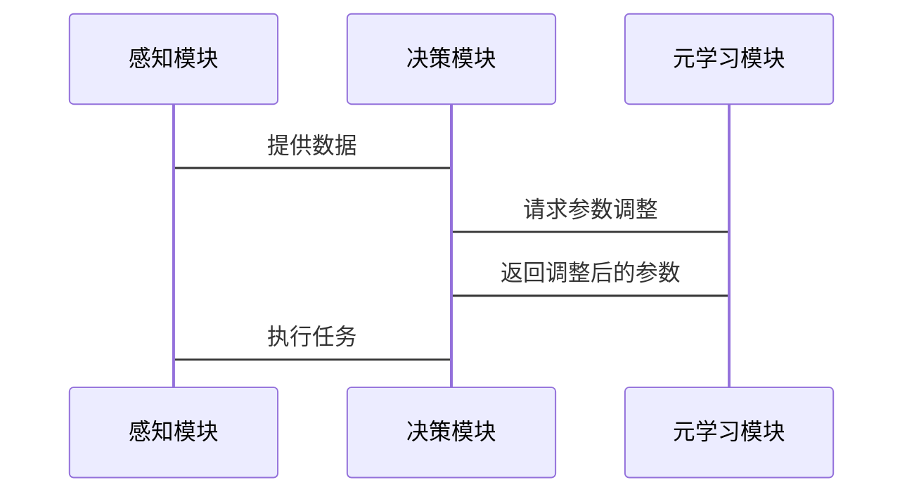

                 

# 基于元学习的AI Agent快速领域适应

## 关键词：元学习，AI Agent，领域适应，快速学习，迁移学习

## 摘要：本文深入探讨了基于元学习的AI Agent在快速领域适应中的应用。通过分析元学习的核心原理、算法实现、系统架构设计及实际案例，展示了如何利用元学习技术实现AI Agent在不同领域的快速适应，提升其智能性和灵活性。文章结合理论与实践，为读者提供了从基础概念到实际应用的全面解析。

---

# 第1章 元学习与AI Agent概述

## 1.1 元学习的背景与问题背景

### 1.1.1 传统机器学习的局限性
传统机器学习算法在处理特定任务时表现出色，但当任务变化时，通常需要重新训练模型，数据需求大，适应性差。

### 1.1.2 元学习的定义与核心问题
元学习是一种通过学习如何学习的方法，核心问题是如何在多个任务上快速适应新任务，减少对新数据的依赖。

### 1.1.3 AI Agent的定义与特点
AI Agent是一种智能体，能够感知环境、执行任务并做出决策，具有自主性和适应性。

## 1.2 元学习在AI Agent中的应用
### 1.2.1 元学习的核心概念与原理
元学习通过元任务训练，使模型具备快速适应新任务的能力。

### 1.2.2 元学习在AI Agent中的作用
元学习帮助AI Agent在新领域中快速调整参数，提高适应性和效率。

### 1.2.3 元学习与迁移学习的对比分析
元学习通过参数共享和任务间优化，比迁移学习更高效。

## 1.3 问题描述与解决思路
### 1.3.1 AI Agent领域适应的核心问题
如何快速适应新领域，减少数据需求。

### 1.3.2 元学习如何解决领域适应问题
通过元任务训练，使模型具备快速调整的能力。

### 1.3.3 基于元学习的快速领域适应方法
利用元学习算法，如MAML，实现快速参数调整。

---

# 第2章 元学习与AI Agent的核心概念

## 2.1 元学习的数学模型与公式

### 2.1.1 元学习的基本数学模型
元学习的损失函数由元任务和目标任务组成。

$$L_{\text{meta}} = \sum_{k=1}^{N} L_{\text{task}}(f_\theta, x_k, y_k)$$

### 2.1.2 元学习的优化目标
优化元任务和目标任务的联合损失。

### 2.1.3 元学习的损失函数
$$L = \sum_{i=1}^{N} L_i$$

## 2.2 元学习与传统机器学习的对比

| 属性         | 传统机器学习 | 元学习         |
|--------------|--------------|----------------|
| 数据需求     | 高           | 低             |
| 适应性       | 低           | 高             |
| 训练时间     | 长           | 短             |

### 2.2.1 传统机器学习的核心原理
基于大量数据训练，适用于单一任务。

### 2.2.2 元学习的独特优势
快速适应新任务，数据需求少。

### 2.2.3 元学习的适用场景与限制
适用于任务相似但数据不足的情况。

## 2.3 AI Agent的系统架构与功能

### 2.3.1 AI Agent的基本架构
模块化设计，包括感知、决策和执行模块。

### 2.3.2 元学习在AI Agent中的模块划分
元学习模块负责参数调整，感知模块收集数据。

### 2.3.3 元学习与AI Agent功能的结合
通过元学习优化决策模块，提高适应性。

---

# 第3章 元学习算法的原理与实现

## 3.1 元学习算法概述

### 3.1.1 元学习算法的分类
基于梯度和基于参数共享的元学习算法。

### 3.1.2 基于梯度的元学习算法
MAML算法，通过两次梯度优化。

### 3.1.3 基于参数共享的元学习算法
参数共享减少参数数量，提高效率。

## 3.2 基于MAML的元学习算法

### 3.2.1 MAML算法的原理
通过两次梯度更新，优化参数。

### 3.2.2 MAML算法的数学模型
$$\theta_{t+1} = \theta_t - \alpha \nabla_{\theta_t} L_{\text{meta}}$$

### 3.2.3 MAML算法的实现步骤
1. 选择元任务和目标任务。
2. 计算梯度，更新参数。

## 3.3 元学习算法的优缺点分析

| 优缺点       | 优点       | 缺点         |
|--------------|------------|--------------|
| 计算效率     | 高         | 计算复杂度高   |
| 适应性       | 强         | 对某些任务效果差 |

### 3.3.1 基于MAML的元学习算法的优点
快速适应新任务，减少数据需求。

### 3.3.2 基于MAML的元学习算法的缺点
计算复杂，对某些任务效果有限。

### 3.3.3 元学习算法的适用场景
适用于任务相似且数据不足的情况。

---

# 第4章 基于元学习的AI Agent系统架构设计

## 4.1 系统总体架构

### 4.1.1 系统功能模块划分
感知模块、决策模块、元学习模块。

### 4.1.2 系统架构的层次结构
分层设计，模块间交互明确。

### 4.1.3 系统架构的设计原则
模块化、高效性、可扩展性。

## 4.2 系统功能设计

### 4.2.1 元学习模块的功能设计
参数调整，快速适应新任务。

### 4.2.2 AI Agent模块的功能设计
数据处理，决策优化。

### 4.2.3 模块间的交互关系
感知模块提供数据，元学习模块调整参数，决策模块执行任务。

## 4.3 系统架构图

---

# 4.4 系统接口设计

## 4.4.1 系统接口定义
定义接口函数，实现模块间的通信。

## 4.4.2 接口交互流程
数据输入，参数调整，决策输出。

---

## 4.5 系统交互流程图

---

# 4.6 本章小结
...

---

# 第5章 项目实战

## 5.1 环境安装

### 5.1.1 安装Python
安装Python 3.8及以上版本。

### 5.1.2 安装依赖库
安装TensorFlow、Keras、numpy等。

### 5.1.3 安装其他工具
安装Jupyter Notebook用于开发和调试。

## 5.2 系统核心实现源代码

### 5.2.1 元学习模块的实现
实现MAML算法的代码。

### 5.2.2 AI Agent模块的实现
实现感知和决策模块的代码。

### 5.2.3 系统接口的实现
定义模块间的接口函数。

## 5.3 代码应用解读与分析

### 5.3.1 元学习模块代码解读
解释代码结构和功能。

### 5.3.2 AI Agent模块代码解读
解释数据处理和决策过程。

## 5.4 实际案例分析和详细讲解剖析
### 5.4.1 案例背景
描述实际应用场景，如图像分类。

### 5.4.2 案例数据集
使用CIFAR-10数据集。

### 5.4.3 案例实现步骤
1. 数据预处理。
2. 训练元学习模型。
3. 测试模型性能。

## 5.5 项目小结
总结项目实现的关键点和经验教训。

---

# 5.6 本章小结
...

---

# 第6章 最佳实践、小结与注意事项

## 6.1 最佳实践

### 6.1.1 元学习算法的选择
根据任务需求选择合适的元学习算法。

### 6.1.2 系统架构设计
确保模块间交互高效，结构清晰。

### 6.1.3 数据预处理
确保数据质量，减少噪音。

## 6.2 小结
总结全文内容，强调元学习在AI Agent中的重要性。

## 6.3 注意事项

### 6.3.1 元学习算法的计算复杂度高
需要优化计算资源。

### 6.3.2 数据质量问题
确保数据准确性和多样性。

### 6.3.3 任务适用性
选择适合的元学习场景。

## 6.4 拓展阅读
推荐相关领域的书籍和论文，供进一步学习。

---

# 作者：AI天才研究院 & 禅与计算机程序设计艺术

---

通过以上结构，我们可以系统地阐述基于元学习的AI Agent快速领域适应的各个方面，从理论到实践，帮助读者全面理解这一技术的核心内容和应用价值。

