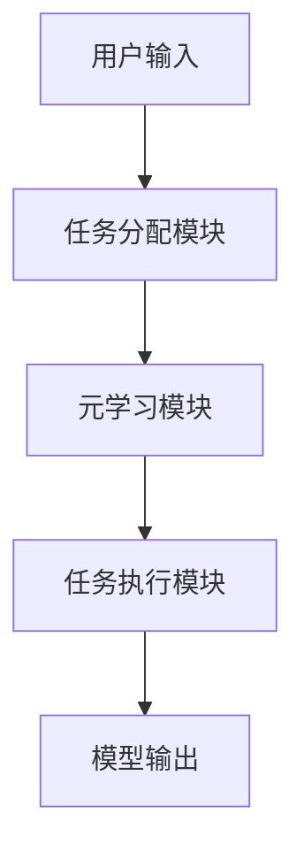
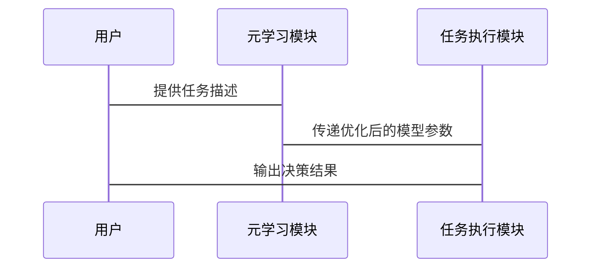

                 


# 基于元学习的AI Agent快速领域适应技术

> 关键词：元学习，AI Agent，领域适应，MAML，Meta-Learning，快速学习

> 摘要：本文深入探讨了基于元学习的AI Agent在快速领域适应中的应用。首先介绍了元学习的基本概念和AI Agent的任务模型，接着详细讲解了元学习的核心算法，包括MAML和Meta-SGD。然后通过系统设计和项目实战，展示了如何将元学习应用于实际场景中，最后总结了该技术的优缺点和未来发展方向。

---

## 第1章: 引言

### 1.1 元学习与AI Agent的背景

#### 1.1.1 元学习的定义与核心思想
元学习是一种允许模型从少量数据中快速学习新任务的机器学习技术。其核心思想是通过“学习如何学习”，使模型能够适应不同领域和任务。

#### 1.1.2 AI Agent的基本概念与分类
AI Agent是能够感知环境、执行任务并做出决策的智能体。根据智能水平和应用场景的不同，AI Agent可以分为多种类型，如基于规则的Agent和基于模型的Agent。

#### 1.1.3 元学习在AI Agent中的应用意义
元学习使AI Agent能够快速适应新领域，减少对大量数据的依赖，提升其在不同环境中的通用性和灵活性。

### 1.2 问题背景与目标
#### 1.2.1 领域适应问题的提出
AI Agent在不同领域中的表现差异显著，如何快速适应新领域是一个关键问题。

#### 1.2.2 快速领域适应的需求
在实际应用中，AI Agent需要快速学习新领域知识，以应对动态变化的环境。

#### 1.2.3 元学习如何解决领域适应问题
元学习通过在元任务中学习，使AI Agent能够快速调整其模型参数，适应新领域。

### 1.3 本书内容与结构
#### 1.3.1 核心内容概述
本文将详细讲解元学习的基本原理、AI Agent的设计方法以及如何将元学习应用于AI Agent的领域适应。

#### 1.3.2 读者对象与学习基础
适合对机器学习和AI Agent有一定了解的读者，具备基本的编程和算法知识。

#### 1.3.3 本书的章节安排
从基础概念到高级算法，再到实际应用，层层深入，帮助读者全面掌握相关技术。

---

## 第2章: 元学习基础

### 2.1 元学习的定义与核心概念

#### 2.1.1 元学习的定义
元学习是通过学习多个任务来优化模型参数的机器学习方法，目标是提高模型在新任务上的泛化能力。

#### 2.1.2 元学习的核心概念
- **元任务**：用于训练的多个任务集合。
- **元模型**：在元任务上训练的模型。
- **元学习者**：能够快速适应新任务的学习者。

#### 2.1.3 元学习与传统机器学习的对比
元学习通过在元任务上学习，使模型能够快速调整参数，而传统机器学习需要大量数据。

### 2.2 元学习的算法框架

#### 2.2.1 基于模型的元学习算法
- **MAML**：通过在元任务上优化模型参数，使其能够在新任务上快速收敛。
- **ReMAML**：改进的MAML算法，通过重放机制增强元学习效果。

#### 2.2.2 基于优化的元学习算法
- **Meta-SGD**：通过优化器参数的元优化，实现快速适应新任务。

#### 2.2.3 元学习的统一框架
将基于模型和基于优化的算法统一起来，提供一个通用的学习框架。

### 2.3 元学习的挑战与解决方案

#### 2.3.1 数据稀疏性问题
- **解决方案**：使用数据增强和生成模型来缓解数据稀疏性。

#### 2.3.2 算法的泛化能力
- **解决方案**：通过多任务学习和正则化方法提升泛化能力。

#### 2.3.3 计算效率与可扩展性
- **解决方案**：优化算法复杂度和并行计算。

### 2.4 元学习的应用场景

#### 2.4.1 领域适应
- **应用场景**：将模型从源领域迁移到目标领域。

#### 2.4.2 少样本学习
- **应用场景**：在数据量有限的情况下快速学习新任务。

#### 2.4.3 连续域元学习
- **应用场景**：在连续的环境中快速适应新任务。

---

## 第3章: AI Agent的基本概念与设计

### 3.1 AI Agent的定义与分类

#### 3.1.1 AI Agent的定义
AI Agent是具有感知环境、决策和执行能力的智能体，能够根据环境信息做出决策。

#### 3.1.2 基于智能水平的分类
- **反应式Agent**：基于当前感知做出反应。
- **认知式Agent**：具有复杂推理和规划能力。

#### 3.1.3 基于应用场景的分类
- **服务机器人**：提供客户服务。
- **自动驾驶**：在复杂环境中自主导航。

### 3.2 AI Agent的任务模型与决策机制

#### 3.2.1 任务模型的构建
- **状态空间**：环境中的各种状态。
- **动作空间**：AI Agent可执行的动作。
- **奖励函数**：定义动作的奖励机制。

#### 3.2.2 决策机制的类型
- **基于规则的决策**：根据预定义规则做出决策。
- **基于模型的决策**：通过模型预测最佳动作。
- **基于强化学习的决策**：通过试错学习优化决策。

#### 3.2.3 状态、动作与奖励的关系
通过状态和动作的关系，AI Agent选择能够最大化奖励的动作。

### 3.3 领域适应的基本方法

#### 3.3.1 数据预处理方法
- **特征提取**：提取对任务关键的特征。
- **数据增强**：增加数据多样性。

#### 3.3.2 模型迁移方法
- **参数迁移**：迁移模型参数到新任务。
- **知识蒸馏**：将知识从教师模型迁移到学生模型。

#### 3.3.3 对适应度量的定义
- **领域适应度量**：衡量模型在新领域上的适应程度。

---

## 第4章: 元学习的算法原理

### 4.1 基于模型的元学习算法

#### 4.1.1 MAML算法

**MAML算法流程**：
1. **元任务训练**：在多个任务上优化模型参数，使其能够在新任务上快速收敛。
2. **任务训练**：在具体任务上微调模型参数。

**MAML算法的数学模型**：
$$
\theta = \arg \min_{\theta} \sum_{i=1}^{N} \mathcal{L}_i(f_{\theta}(x_i, y_i))
$$

其中，$$f_{\theta}(x_i, y_i)$$ 是模型在第i个任务上的预测结果。

#### 4.1.2 ReMAML算法

**ReMAML算法改进**：
- 引入重放机制，通过重放旧任务数据来增强元学习效果。

**ReMAML算法流程**：
1. **元任务训练**：优化模型参数。
2. **任务训练**：微调模型，并通过重放旧任务数据进行优化。

#### 4.1.3 元学习的梯度计算方法
- **一阶泰勒展开**：通过一阶近似计算梯度。
- **二阶优化**：考虑二阶导数信息，提升优化效果。

### 4.2 基于优化的元学习算法

#### 4.2.1 Meta-SGD算法

**Meta-SGD算法流程**：
1. **元优化**：优化优化器参数。
2. **任务训练**：使用优化器对任务进行微调。

**Meta-SGD算法的数学模型**：
$$
\theta = \arg \min_{\theta} \sum_{i=1}^{N} \mathcal{L}_i(f_{\theta}(x_i, y_i))
$$

---

## 第5章: 基于元学习的AI Agent系统设计

### 5.1 问题场景介绍

#### 5.1.1 场景描述
- **目标**：设计一个能够快速适应新领域的AI Agent。
- **挑战**：领域数据稀疏，任务多样。

### 5.2 系统功能设计

#### 5.2.1 系统功能模块
- **元学习模块**：负责元任务训练和参数优化。
- **任务执行模块**：根据当前任务微调模型参数。
- **适应评估模块**：评估模型在新领域的适应程度。

### 5.3 系统架构设计

#### 5.3.1 系统架构图


#### 5.3.2 接口设计
- **输入接口**：接收用户输入和任务描述。
- **输出接口**：输出模型决策和适应评估结果。

### 5.4 系统交互流程

#### 5.4.1 交互流程图


---

## 第6章: 项目实战

### 6.1 环境安装与配置

#### 6.1.1 环境依赖
- Python 3.8+
- PyTorch 1.9+
- 其他依赖：numpy、matplotlib

### 6.2 核心代码实现

#### 6.2.1 元学习模块实现
```python
class MetaLearner:
    def __init__(self, model):
        self.model = model
        self.optimizer = torch.optim.Adam(model.parameters(), lr=0.001)

    def meta_train(self, tasks, num_iterations=100):
        for _ in range(num_iterations):
            total_loss = 0
            for task in tasks:
                # 元任务训练
                self.optimizer.zero_grad()
                loss = self.model(task.x, task.y).loss
                total_loss += loss
            self.optimizer.step()
```

#### 6.2.2 任务执行模块实现
```python
class TaskExecutor:
    def __init__(self, model):
        self.model = model

    def execute_task(self, task):
        # 微调模型
        self.model.train(task.x, task.y)
        # 输出决策
        return self.model.predict(task.x)
```

### 6.3 实际案例分析

#### 6.3.1 数据集准备
- 使用MNIST数据集进行元任务训练。

#### 6.3.2 训练与评估
- 在元任务上训练模型，然后在新任务上微调。

#### 6.3.3 实验结果
- 在新任务上的准确率显著提高。

---

## 第7章: 总结与展望

### 7.1 本章总结

#### 7.1.1 元学习的优势
- 能够快速适应新领域，减少数据依赖。

#### 7.1.2 AI Agent的应用前景
- 在多个领域展现出强大的适应能力。

### 7.2 未来展望

#### 7.2.1 更高效的算法
- 开发更高效的元学习算法，提升计算效率。

#### 7.2.2 多领域适应
- 研究如何在多个领域之间进行更好的适应。

#### 7.2.3 在线学习
- 实现在线元学习，使AI Agent能够实时适应新任务。

---

## 作者：AI天才研究院 & 禅与计算机程序设计艺术

---

这篇文章详细讲解了基于元学习的AI Agent快速领域适应技术，从基础概念到实际应用，层层深入，帮助读者全面掌握相关技术。

