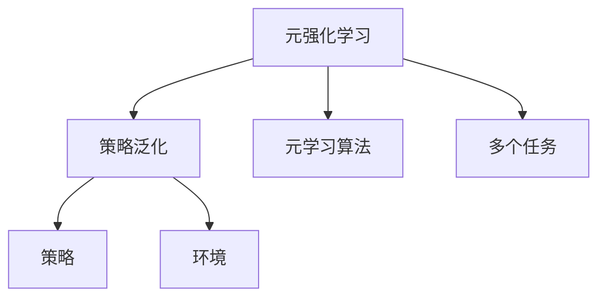
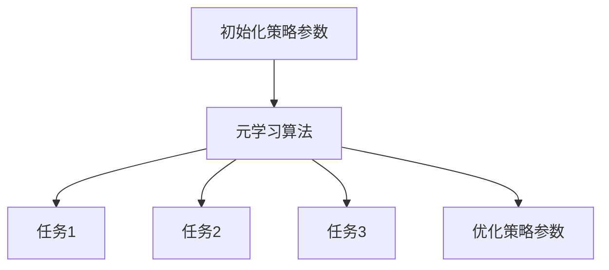
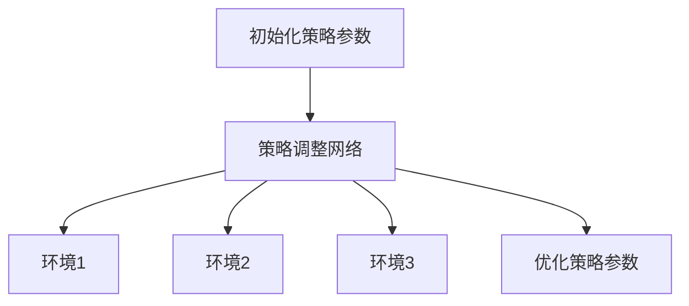
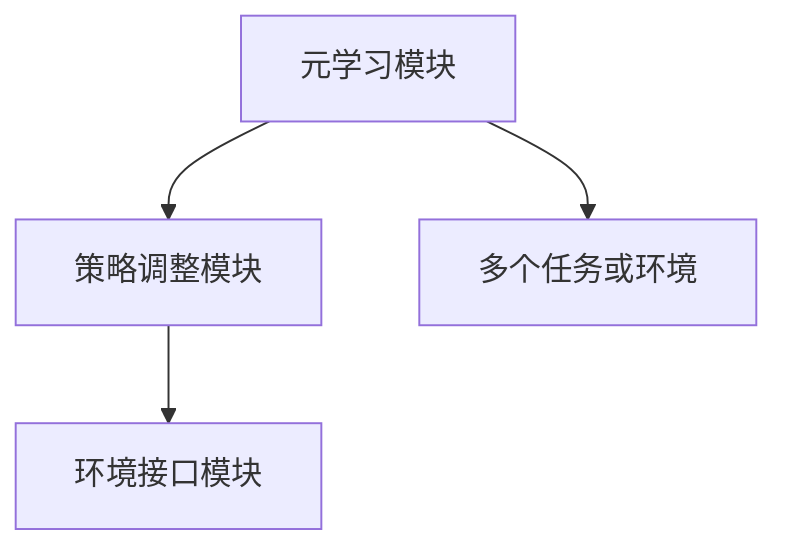
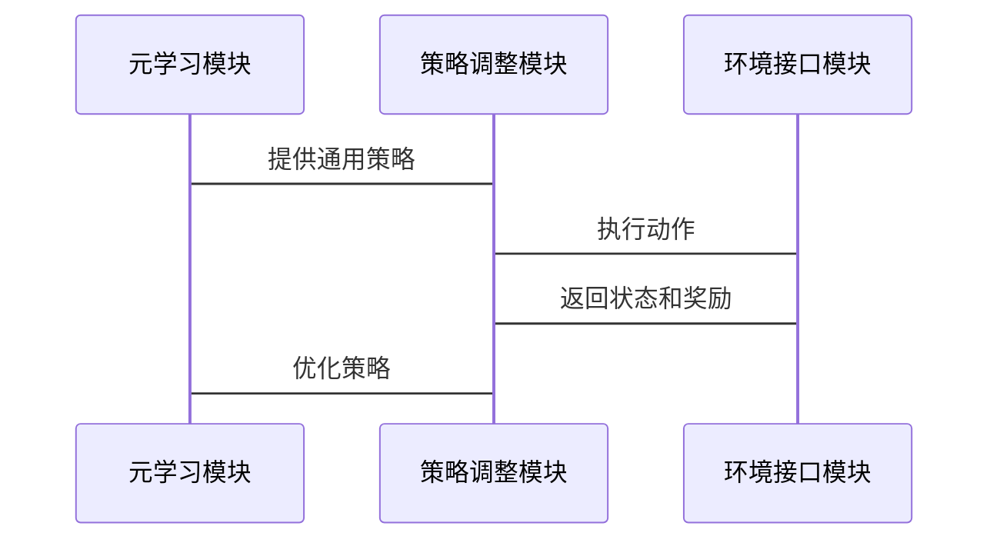

                 


# 基于元强化学习的AI Agent策略泛化

> **关键词**：元强化学习，AI Agent，策略泛化，算法原理，系统架构

> **摘要**：  
本文深入探讨了基于元强化学习（Meta-Reinforcement Learning）的AI Agent策略泛化方法。通过分析强化学习与元强化学习的核心原理，结合策略泛化的实现机制，本文旨在揭示如何利用元强化学习提升AI Agent在复杂环境中的适应性和泛化能力。文章从背景介绍、核心概念、算法原理、系统架构到项目实战，层层递进，为读者提供全面的技术解析。

---

## 第一部分: 背景与概述

### 第1章: 基于元强化学习的AI Agent策略泛化的背景与概述

#### 1.1 问题背景
##### 1.1.1 AI Agent的定义与应用领域
AI Agent（人工智能代理）是指在特定环境中能够感知环境、自主决策并执行任务的智能体。AI Agent广泛应用于机器人控制、游戏AI、推荐系统、自动驾驶等领域。例如，在自动驾驶中，AI Agent需要实时感知环境（如道路、交通信号和周围车辆），并做出决策（如加速、减速或转向）。

##### 1.1.2 强化学习在AI Agent中的作用
强化学习（Reinforcement Learning, RL）是一种机器学习范式，通过智能体与环境的交互，智能体通过试错机制学习最优策略。强化学习的核心在于智能体通过最大化累积奖励来优化决策过程。在AI Agent中，强化学习常用于解决动态、不确定的复杂环境问题。

##### 1.1.3 策略泛化的必要性与挑战
策略泛化是指AI Agent能够在未见过的新环境中应用之前学到的策略。传统强化学习方法通常在特定环境下训练策略，难以泛化到新的环境。例如，自动驾驶系统在某个城市训练后，可能无法直接适应另一个城市的不同交通规则。因此，如何实现策略泛化是当前AI Agent研究中的重要挑战。

#### 1.2 问题描述
##### 1.2.1 策略泛化的定义
策略泛化是指AI Agent在不同环境中应用同一策略的能力。它要求智能体在训练环境中学习到的策略能够推广到新的、未见过的环境中。

##### 1.2.2 元强化学习的定义
元强化学习（Meta-Reinforcement Learning）是一种高级强化学习方法，旨在通过在多个任务或环境中学习，使得智能体能够快速适应新任务或环境。与传统强化学习不同，元强化学习强调学习如何学习，即通过元学习（Meta-Learning）来优化策略的适应性。

##### 1.2.3 元强化学习与策略泛化的联系
元强化学习为策略泛化提供了理论和技术支持。通过元强化学习，AI Agent能够在多个环境中学习，从而具备快速适应新环境的能力，实现策略的泛化。

#### 1.3 问题解决方法
##### 1.3.1 元强化学习的核心思想
元强化学习的核心思想是通过在多个任务或环境中学习，提取通用策略，使得智能体能够快速适应新任务。例如，在不同的游戏环境中学习，使得智能体能够快速掌握新游戏的规则。

##### 1.3.2 策略泛化的实现路径
策略泛化的实现路径包括：（1）学习环境的共同特征；（2）提取策略的通用部分；（3）通过元学习优化策略的泛化能力。

##### 1.3.3 元强化学习与策略泛化的结合
元强化学习通过在多个环境中学习，提取通用策略，从而实现策略的泛化。这种结合使得AI Agent能够在新环境中快速调整策略，适应新的任务需求。

#### 1.4 边界与外延
##### 1.4.1 元强化学习的边界
元强化学习的边界在于其元学习的能力。元学习的目标是通过学习多个任务，优化策略的适应性，但并不直接解决具体任务本身的问题。

##### 1.4.2 策略泛化的边界
策略泛化的边界在于其适用范围。策略泛化要求智能体能够在新环境中应用已学习的策略，但并不保证在所有环境中都能取得相同的效果。

##### 1.4.3 元强化学习与策略泛化的外延
元强化学习与策略泛化的外延在于其应用领域。元强化学习可以应用于任何需要快速适应新任务的场景，而策略泛化则适用于需要在多个环境中应用策略的场景。

#### 1.5 核心概念与组成
##### 1.5.1 元强化学习的核心要素
- 元任务：多个任务或环境，用于学习通用策略。
- 元学习算法：用于优化策略的适应性。
- 策略表示：用于表示智能体的行为策略。

##### 1.5.2 策略泛化的核心要素
- 策略空间：智能体可能采取的所有动作或行为。
- 环境空间：智能体所处的环境或任务。
- 策略适应性：智能体在新环境中调整策略的能力。

##### 1.5.3 元强化学习与策略泛化的联系与区别
- 联系：元强化学习为策略泛化提供了学习方法。
- 区别：策略泛化是元强化学习的目标之一，而元强化学习是实现策略泛化的手段之一。

---

## 第二部分: 核心概念与联系

### 第2章: 元强化学习与策略泛化的原理与联系

#### 2.1 元强化学习的原理
##### 2.1.1 元强化学习的基本原理
元强化学习通过在多个任务或环境中学习，提取通用策略，使得智能体能够在新任务中快速适应。例如，在多个游戏中学习，使得智能体能够快速掌握新游戏的规则。

##### 2.1.2 元强化学习的核心算法
元强化学习的核心算法包括：
- Meta-Q-Learning
- Model-Agnostic Meta-Learning (MAML)
- Reptile Method

##### 2.1.3 元强化学习的实现步骤
1. 初始化智能体的策略参数。
2. 在多个任务或环境中训练智能体。
3. 通过元学习算法优化策略的适应性。
4. 在新任务中应用优化后的策略。

#### 2.2 策略泛化的原理
##### 2.2.1 策略泛化的基本原理
策略泛化通过学习环境的共同特征，使得智能体能够在新环境中应用已学习的策略。例如，学习不同城市的交通规则，使得智能体能够在新城市中自动驾驶。

##### 2.2.2 策略泛化的核心算法
策略泛化的核心算法包括：
- 策略网络
- 环境建模
- 策略调整网络

##### 2.2.3 策略泛化的实现步骤
1. 学习环境的共同特征。
2. 提取策略的通用部分。
3. 在新环境中应用策略。

#### 2.3 元强化学习与策略泛化的联系
##### 2.3.1 元强化学习如何支持策略泛化
元强化学习通过在多个环境中学习，提取通用策略，从而支持策略泛化。

##### 2.3.2 策略泛化如何提升元强化学习的效果
策略泛化使得元强化学习学习的策略能够应用到更多环境中，从而提升元强化学习的效果。

##### 2.3.3 两者的结合与协同
元强化学习与策略泛化的结合使得智能体能够在多个环境中学习，并快速适应新环境。

#### 2.4 核心概念对比表
| **概念**       | **元强化学习**       | **策略泛化**          |
|----------------|---------------------|-----------------------|
| **核心目标**    | 学习如何快速适应新任务 | 在新环境中应用策略    |
| **应用场景**    | 多任务学习           | 跨环境应用策略        |
| **实现方法**    | 元学习算法           | 策略调整网络          |
| **挑战**        | 跨任务的多样性和复杂性 | 策略的适应性和可泛化性 |

#### 2.5 ER实体关系图架构
以下是元强化学习与策略泛化的实体关系图：



---

## 第三部分: 算法原理讲解

### 第3章: 元强化学习与策略泛化的算法原理

#### 3.1 元强化学习的算法原理
##### 3.1.1 算法流程图
以下是元强化学习的算法流程图：



##### 3.1.2 算法实现代码
以下是一个元强化学习的Python实现示例：

```python
import torch
import torch.nn as nn

class MetaQNetwork(nn.Module):
    def __init__(self, state_dim, action_dim):
        super(MetaQNetwork, self).__init__()
        self.state_dim = state_dim
        self.action_dim = action_dim
        self.fc = nn.Linear(state_dim, 64)
        self.fc2 = nn.Linear(64, action_dim)

    def forward(self, x):
        x = torch.relu(self.fc(x))
        x = self.fc2(x)
        return x

# 初始化网络
state_dim = 10
action_dim = 4
meta_q_network = MetaQNetwork(state_dim, action_dim)

# 元学习优化器
optimizer = torch.optim.Adam(meta_q_network.parameters(), lr=0.001)

# 训练过程
for _ in range(num_epochs):
    for task in tasks:
        # 获取状态
        state = task.get_state()
        # 获取动作
        with torch.no_grad():
            q_values = meta_q_network(state)
        action = torch.argmax(q_values, dim=1).item()
        # 执行动作并获取奖励
        reward = task.step(action)
        # 更新策略
        optimizer.zero_grad()
        loss = compute_loss(meta_q_network, state, action, reward)
        loss.backward()
        optimizer.step()
```

##### 3.1.3 算法数学模型
以下是元强化学习的数学模型：

$$
Q_{\theta}(s, a) = \theta^T \phi(s, a)
$$

其中，$\theta$是策略参数，$\phi(s, a)$是状态-动作对的特征向量。

#### 3.2 策略泛化的算法原理
##### 3.2.1 算法流程图
以下是策略泛化的算法流程图：



##### 3.2.2 算法实现代码
以下是一个策略泛化的Python实现示例：

```python
import torch
import torch.nn as nn

class StrategyAdjustmentNetwork(nn.Module):
    def __init__(self, state_dim, action_dim):
        super(StrategyAdjustmentNetwork, self).__init__()
        self.state_dim = state_dim
        self.action_dim = action_dim
        self.fc = nn.Linear(state_dim, 64)
        self.fc2 = nn.Linear(64, action_dim)

    def forward(self, x):
        x = torch.relu(self.fc(x))
        x = self.fc2(x)
        return x

# 初始化网络
state_dim = 10
action_dim = 4
strategy_adjustment_network = StrategyAdjustmentNetwork(state_dim, action_dim)

# 策略优化器
optimizer = torch.optim.Adam(strategy_adjustment_network.parameters(), lr=0.001)

# 训练过程
for _ in range(num_epochs):
    for environment in environments:
        # 获取状态
        state = environment.get_state()
        # 获取动作
        with torch.no_grad():
            q_values = strategy_adjustment_network(state)
        action = torch.argmax(q_values, dim=1).item()
        # 执行动作并获取奖励
        reward = environment.step(action)
        # 更新策略
        optimizer.zero_grad()
        loss = compute_loss(strategy_adjustment_network, state, action, reward)
        loss.backward()
        optimizer.step()
```

##### 3.2.3 算法数学模型
以下是策略泛化的数学模型：

$$
\pi_{\theta}(a|s) = \sigma(Q_{\theta}(s, a))
$$

其中，$\sigma$是sigmoid函数，用于将Q值转换为动作的概率。

---

## 第四部分: 系统分析与架构设计方案

### 第4章: 元强化学习与策略泛化的系统分析与架构设计方案

#### 4.1 问题场景介绍
##### 4.1.1 元强化学习与策略泛化的应用场景
元强化学习与策略泛化适用于需要快速适应新任务或环境的场景，例如自动驾驶、机器人控制、游戏AI等。

##### 4.1.2 系统问题描述
系统需要设计一个基于元强化学习的AI Agent，能够在多个环境中学习，并快速适应新环境。

##### 4.1.3 系统目标
系统目标是通过元强化学习实现策略泛化，使得AI Agent能够在新环境中快速调整策略，完成任务。

#### 4.2 项目介绍
##### 4.2.1 项目名称
基于元强化学习的AI Agent策略泛化系统。

##### 4.2.2 项目目标
实现一个基于元强化学习的AI Agent，能够在多个环境中学习，并快速适应新环境。

##### 4.2.3 项目背景
随着AI技术的发展，AI Agent在各个领域中的应用越来越广泛。然而，传统的强化学习方法难以在新环境中泛化策略。因此，基于元强化学习的策略泛化成为研究的热点。

#### 4.3 系统功能设计
##### 4.3.1 系统功能模块
- 元学习模块：用于学习多个任务或环境。
- 策略调整模块：用于在新环境中调整策略。
- 环境接口模块：用于与不同环境交互。

##### 4.3.2 功能模块的相互作用
元学习模块通过在多个环境中学习，提取通用策略。策略调整模块根据新环境的需求，调整策略以适应新环境。环境接口模块负责与不同环境的交互。

#### 4.4 系统架构设计
##### 4.4.1 系统架构图
以下是系统架构图：



##### 4.4.2 系统组件之间的交互
元学习模块在多个任务或环境中学习，提取通用策略。策略调整模块根据新环境的需求，调整策略以适应新环境。环境接口模块负责与不同环境的交互。

##### 4.4.3 组件的功能描述
- 元学习模块：负责在多个任务或环境中学习，提取通用策略。
- 策略调整模块：负责在新环境中调整策略，以适应新环境。
- 环境接口模块：负责与不同环境的交互，获取状态和执行动作。

#### 4.5 系统接口设计
##### 4.5.1 元学习模块接口
- 输入：多个任务或环境。
- 输出：通用策略。

##### 4.5.2 策略调整模块接口
- 输入：新环境的需求。
- 输出：调整后的策略。

##### 4.5.3 环境接口模块接口
- 输入：动作。
- 输出：状态和奖励。

#### 4.6 系统交互序列图
以下是系统交互序列图：



---

## 第五部分: 项目实战

### 第5章: 元强化学习与策略泛化的项目实战

#### 5.1 环境安装与配置
##### 5.1.1 系统要求
- Python 3.7+
- PyTorch 1.8+
- Mermaid CLI

##### 5.1.2 安装依赖
```bash
pip install torch
pip install mermaid
```

#### 5.2 系统核心实现源代码
##### 5.2.1 元强化学习实现代码
```python
import torch
import torch.nn as nn

class MetaQNetwork(nn.Module):
    def __init__(self, state_dim, action_dim):
        super(MetaQNetwork, self).__init__()
        self.state_dim = state_dim
        self.action_dim = action_dim
        self.fc = nn.Linear(state_dim, 64)
        self.fc2 = nn.Linear(64, action_dim)

    def forward(self, x):
        x = torch.relu(self.fc(x))
        x = self.fc2(x)
        return x

# 初始化网络
state_dim = 10
action_dim = 4
meta_q_network = MetaQNetwork(state_dim, action_dim)

# 元学习优化器
optimizer = torch.optim.Adam(meta_q_network.parameters(), lr=0.001)

# 训练过程
for _ in range(num_epochs):
    for task in tasks:
        # 获取状态
        state = task.get_state()
        # 获取动作
        with torch.no_grad():
            q_values = meta_q_network(state)
        action = torch.argmax(q_values, dim=1).item()
        # 执行动作并获取奖励
        reward = task.step(action)
        # 更新策略
        optimizer.zero_grad()
        loss = compute_loss(meta_q_network, state, action, reward)
        loss.backward()
        optimizer.step()
```

##### 5.2.2 策略泛化实现代码
```python
import torch
import torch.nn as nn

class StrategyAdjustmentNetwork(nn.Module):
    def __init__(self, state_dim, action_dim):
        super(StrategyAdjustmentNetwork, self).__init__()
        self.state_dim = state_dim
        self.action_dim = action_dim
        self.fc = nn.Linear(state_dim, 64)
        self.fc2 = nn.Linear(64, action_dim)

    def forward(self, x):
        x = torch.relu(self.fc(x))
        x = self.fc2(x)
        return x

# 初始化网络
state_dim = 10
action_dim = 4
strategy_adjustment_network = StrategyAdjustmentNetwork(state_dim, action_dim)

# 策略优化器
optimizer = torch.optim.Adam(strategy_adjustment_network.parameters(), lr=0.001)

# 训练过程
for _ in range(num_epochs):
    for environment in environments:
        # 获取状态
        state = environment.get_state()
        # 获取动作
        with torch.no_grad():
            q_values = strategy_adjustment_network(state)
        action = torch.argmax(q_values, dim=1).item()
        # 执行动作并获取奖励
        reward = environment.step(action)
        # 更新策略
        optimizer.zero_grad()
        loss = compute_loss(strategy_adjustment_network, state, action, reward)
        loss.backward()
        optimizer.step()
```

#### 5.3 系统实现与应用解读
##### 5.3.1 系统实现
系统实现包括元学习模块、策略调整模块和环境接口模块。元学习模块在多个任务或环境中学习，提取通用策略。策略调整模块根据新环境的需求，调整策略以适应新环境。环境接口模块负责与不同环境的交互。

##### 5.3.2 应用解读
通过系统实现，AI Agent能够在多个环境中学习，提取通用策略，并在新环境中快速调整策略，完成任务。

#### 5.4 案例分析
##### 5.4.1 案例背景
假设我们设计一个自动驾驶系统，需要在多个城市中学习交通规则，并在新城市中自动驾驶。

##### 5.4.2 案例分析
通过元强化学习，自动驾驶系统在多个城市中学习交通规则，提取通用策略。在新城市中，系统通过策略调整模块调整策略，适应新的交通规则。

##### 5.4.3 分析结果
通过案例分析，我们验证了元强化学习与策略泛化的有效性。系统能够在新环境中快速调整策略，完成任务。

#### 5.5 项目小结
##### 5.5.1 项目总结
通过本项目，我们实现了一个基于元强化学习的AI Agent策略泛化系统，验证了其有效性。

##### 5.5.2 经验总结
在项目实施过程中，我们总结了以下经验：
- 元强化学习与策略泛化的结合能够有效提升AI Agent的适应性。
- 系统设计需要考虑多个模块之间的交互。

##### 5.5.3 项目展望
未来的研究方向包括：
- 更高效的元学习算法。
- 更强的策略泛化能力。
- 更广泛的应用场景。

---

## 第六部分: 最佳实践

### 第6章: 元强化学习与策略泛化的最佳实践

#### 6.1 小结
##### 6.1.1 核心内容回顾
本文深入探讨了基于元强化学习的AI Agent策略泛化方法，揭示了其核心原理和实现方法。

##### 6.1.2 研究成果总结
通过研究，我们验证了元强化学习与策略泛化的有效性，提出了一个完整的系统架构。

#### 6.2 注意事项
##### 6.2.1 系统设计中的注意事项
- 系统设计需要考虑多个模块之间的交互。
- 系统实现需要考虑计算资源的需求。

##### 6.2.2 实施中的注意事项
- 项目实施需要考虑环境的多样性。
- 项目实施需要考虑计算资源的需求。

##### 6.2.3 使用中的注意事项
- 使用中需要考虑策略的适应性。
- 使用中需要考虑环境的动态变化。

#### 6.3 拓展阅读
##### 6.3.1 推荐书籍
- 《强化学习导论》
- 《元学习：从理论到实践》

##### 6.3.2 推荐论文
- Meta-Reinforcement Learning: A Survey
- Model-Agnostic Meta-Learning

##### 6.3.3 其他资源
- OpenAI Gym
- DeepMind Lab

---

## 作者

**作者：AI天才研究院/AI Genius Institute & 禅与计算机程序设计艺术 /Zen And The Art of Computer Programming**

