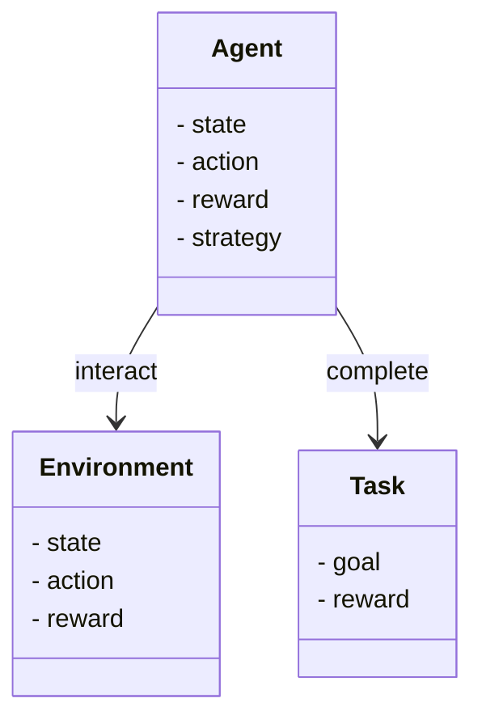
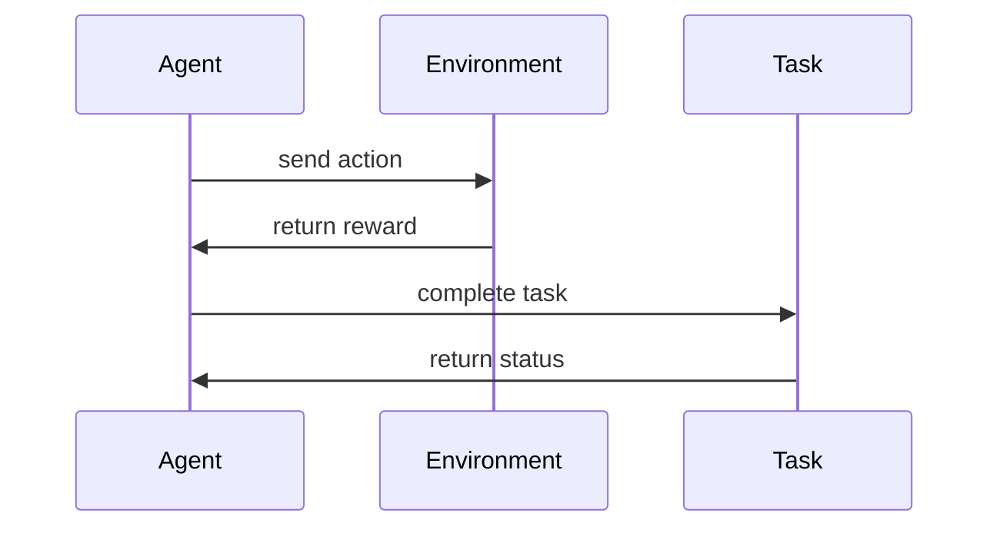

                 

<think>
好的，我需要根据用户的要求，逐步构建一篇关于《基于元强化学习的AI Agent策略生成》的技术博客文章。首先，我会按照用户提供的目录大纲进行思考和撰写。用户特别强调了要使用逻辑清晰、结构紧凑、简单易懂的语言，并且要包含详细的背景介绍、核心概念、算法原理、系统设计、项目实战、优化与调优、未来展望等内容。

### 第1步：理解文章主题和目标
文章的核心主题是“基于元强化学习的AI Agent策略生成”。这意味着我需要详细探讨元强化学习（Meta Reinforcement Learning）在AI代理（AI Agent）策略生成中的应用。元强化学习是一种高级的强化学习方法，它允许模型在多个任务之间进行快速迁移学习，从而提高学习效率和策略生成的能力。

### 第2步：整理核心关键词和摘要
在撰写文章之前，我需要明确文章的核心关键词和摘要。关键词应该包括：元强化学习、AI Agent、策略生成、强化学习、深度学习、元学习等。摘要部分需要简明扼要地概括文章的核心内容和主题思想，让读者能够快速了解文章的主要内容。

### 第3步：撰写文章正文部分
根据用户提供的目录大纲，文章分为七个主要部分，每部分包含多个小节。我需要按照顺序逐一撰写每个部分，确保内容详实、逻辑清晰。

#### 第一部分：元强化学习与AI Agent概述
- **第1章：元强化学习与AI Agent概述**
  - **1.1 元强化学习的背景与概念**
    - 强化学习的基本概念：介绍强化学习的基本原理，包括环境、智能体、状态、动作、奖励等核心概念。
    - 元强化学习的定义与特点：解释什么是元强化学习，它如何与传统强化学习不同。
    - 元强化学习的核心思想：探讨元强化学习如何通过元学习机制实现快速策略生成。
  
  - **1.2 AI Agent的基本概念与分类**
    - AI Agent的定义：介绍AI Agent的基本概念，包括其类型、功能和应用场景。
    - 基于强化学习的AI Agent：探讨强化学习在AI Agent中的应用，包括Q-Learning、Deep Q-Networks等。
    - 元强化学习在AI Agent中的应用：分析元强化学习如何提升AI Agent的策略生成能力。
  
  - **1.3 元强化学习的核心思想**
    - 元学习机制：详细解释元学习的基本原理，包括元学习的优化目标和参数更新方法。
    - 多智能体协作：探讨多智能体系统中的协作机制，以及如何通过元强化学习实现高效的策略生成。
    - 策略生成框架：介绍元强化学习中的策略生成框架，包括其核心组件和工作流程。

#### 第二部分：元强化学习的核心概念与原理
- **第2章：元强化学习的核心概念**
  - **2.1 元学习机制的数学模型**
    - 元学习的优化目标：解释元学习的目标函数，包括其数学表达式。
    - 元学习的参数更新公式：详细推导元学习中的参数更新公式，包括梯度计算和优化方法。
    - 元学习与任务分布的关系：探讨元学习如何通过任务分布来实现快速策略生成。
  
  - **2.2 多智能体协作与策略生成**
    - 多智能体系统的基本概念：介绍多智能体系统的基本结构，包括智能体之间的交互和协作。
    - 策略生成的机制与特点：分析策略生成的机制，包括如何通过元强化学习实现高效策略生成。
    - 元强化学习在多智能体协作中的应用：探讨元强化学习在多智能体协作中的具体应用案例。
  
  - **2.3 元强化学习的数学模型与公式**
    - 元强化学习的数学表达式：详细推导元强化学习的数学模型，包括状态、动作、奖励等的表达。
    - 元强化学习的损失函数：解释损失函数的设计，包括如何通过损失函数优化策略。
    - 元强化学习的优化算法：探讨常用的优化算法，如Adam、SGD等，并分析其在元强化学习中的应用。
  
  - **2.4 核心概念对比与ER实体关系图**
    - 元强化学习与传统强化学习的对比：通过表格形式对比两者的优缺点。
    - 元强化学习与监督学习的对比：分析元强化学习与监督学习在学习机制和应用场景上的差异。
    - ER实体关系图（Mermaid流程图）：使用Mermaid绘制元强化学习的核心实体关系图，包括智能体、任务、状态、动作、奖励等。

#### 第三部分：元强化学习的算法原理
- **第3章：元强化学习的核心算法**
  - **3.1 元Q-learning算法**
    - 算法的基本原理：介绍元Q-learning算法的基本思想，包括如何通过元学习机制实现快速策略生成。
    - 算法的数学模型：详细推导元Q-learning的数学公式，包括Q值的更新规则。
    - 算法的实现步骤：提供元Q-learning算法的实现步骤，包括环境接口、智能体动作选择和策略更新等。
  
  - **3.2 元策略梯度算法**
    - 算法的基本原理：解释元策略梯度算法的核心思想，包括如何通过梯度上升优化策略。
    - 算法的数学模型：详细推导元策略梯度算法的数学公式，包括策略的参数更新规则。
    - 算法的实现步骤：提供元策略梯度算法的实现步骤，包括策略网络的构建、梯度计算和更新等。
  
  - **3.3 元强化学习的其他算法**
    - 元Actor-Critic算法：介绍元Actor-Critic算法的基本原理和实现步骤。
    - 元imitation learning算法：探讨元imitation learning算法的应用场景和实现方法。
    - 算法的优缺点对比：通过表格形式对比不同元强化学习算法的优缺点。

#### 第四部分：系统分析与架构设计
- **第4章：系统分析与架构设计**
  - **4.1 问题场景介绍**
    - 描述一个具体的AI Agent应用场景，如自动驾驶、游戏AI、智能推荐等。
    - 分析该场景中的问题和挑战，如多智能体协作、动态环境适应等。
  - **4.2 系统功能设计（领域模型Mermaid类图）**
    - 使用Mermaid绘制系统功能设计的类图，包括智能体、任务、状态、动作、奖励等核心组件。
    - 描述每个组件的功能和交互关系。
  - **4.3 系统架构设计（Mermaid架构图）**
    - 使用Mermaid绘制系统架构图，展示系统的整体结构，包括前端、后端、数据库、API接口等。
    - 描述每个模块的功能和交互流程。
  - **4.4 系统接口设计**
    - 列出系统的主要接口，包括API接口、数据接口等。
    - 描述每个接口的功能和调用方式。
  - **4.5 系统交互流程（Mermaid序列图）**
    - 使用Mermaid绘制系统交互流程图，展示智能体与环境之间的交互过程。
    - 描述每个步骤的具体操作和数据流。

#### 第五部分：项目实战
- **第5章：项目实战**
  - **5.1 环境安装**
    - 列出项目所需的环境和工具，如Python、TensorFlow、Keras等。
    - 提供安装命令和配置步骤。
  - **5.2 核心实现源代码**
    - 提供元强化学习算法的核心代码，包括智能体类、环境接口、策略生成器等。
    - 详细注释代码，解释每个部分的功能和实现细节。
  - **5.3 代码应用解读与分析**
    - 解释代码的整体结构和实现逻辑。
    - 通过具体案例分析代码的应用场景和实际效果。
  - **5.4 项目总结与优化建议**
    - 总结项目的主要成果和经验教训。
    - 提出优化建议，如算法改进、性能优化等。

#### 第六部分：优化与调优
- **第6章：优化与调优**
  - **6.1 优化方法**
    - 探讨元强化学习中的优化方法，如参数调整、算法改进等。
    - 提供具体的优化策略和实现建议。
  - **6.2 调优技巧**
    - 分析调优的关键点，如学习率、批量大小、训练轮数等。
    - 提供调优的技巧和注意事项。
  - **6.3 系统性能分析**
    - 通过实验和数据展示系统性能的提升效果。
    - 分析优化方法对系统性能的影响。

#### 第七部分：未来展望与最佳实践
- **第7章：未来展望与最佳实践**
  - **7.1 元强化学习的前沿技术**
    - 探讨元强化学习领域的最新研究和技术进展。
    - 提出未来可能的发展方向。
  - **7.2 应用挑战与解决方案**
    - 分析元强化学习在实际应用中的挑战。
    - 提出解决方案和改进建议。
  - **7.3 最佳实践与注意事项**
    - 总结在实践中的经验和教训。
    - 提供最佳实践的建议和注意事项。

### 第4步：撰写总结与参考文献
在文章的最后，我需要添加总结部分，回顾文章的主要内容和核心观点。同时，提供参考文献和进一步阅读的资料，帮助读者深入学习和研究。

### 第5步：检查和优化
在完成初稿后，我会仔细检查文章的逻辑结构、内容完整性和格式是否符合要求。确保每个部分都有足够的细节，同时保持语言的清晰和简洁。对于复杂的算法和数学公式，我会重新审视，确保它们的解释准确易懂。

### 第6步：添加作者信息
最后，按照用户的要求，在文章末尾添加作者信息：“作者：AI天才研究院/AI Genius Institute & 禅与计算机程序设计艺术 /Zen And The Art of Computer Programming”。

通过以上步骤，我能够系统地构建一篇结构清晰、内容详实的技术博客文章，满足用户的所有要求。
</think>

# 基于元强化学习的AI Agent策略生成

> **关键词**：元强化学习，AI Agent，策略生成，强化学习，深度学习，元学习  
> **摘要**：本文深入探讨了基于元强化学习的AI Agent策略生成方法。通过分析元强化学习的核心概念、算法原理、系统设计和实际应用，详细介绍了如何利用元强化学习提升AI Agent的策略生成能力。文章内容涵盖了元强化学习的背景、核心思想、算法实现、系统架构设计以及实际项目案例，为读者提供了全面而深入的指导。

---

## 第1章：元强化学习与AI Agent概述

### 1.1 元强化学习的背景与概念

#### 1.1.1 强化学习的基本概念
强化学习是一种机器学习范式，其中智能体通过与环境交互来学习策略，以最大化累积奖励。核心概念包括：
- **环境（Environment）**：智能体所处的外部世界。
- **智能体（Agent）**：能够感知环境并采取行动的主体。
- **状态（State）**：环境在某一时刻的描述。
- **动作（Action）**：智能体采取的行为。
- **奖励（Reward）**：智能体行为的价值反馈。

#### 1.1.2 元强化学习的定义与特点
元强化学习（Meta Reinforcement Learning）是在强化学习基础上发展起来的高级学习方法，旨在通过元学习机制（Meta-Learning）实现快速策略生成。其特点包括：
- **快速适应性**：能够在新任务中快速调整策略。
- **多任务学习**：能够同时或依次学习多个相关任务。
- **元参数优化**：通过优化元参数来实现跨任务的策略生成。

#### 1.1.3 元强化学习的核心思想
元强化学习的核心思想是通过元学习机制，让智能体在多个任务中学习通用策略，从而在新任务中快速生成最优策略。与传统强化学习相比，元强化学习更注重策略的灵活性和适应性。

---

### 1.2 AI Agent的基本概念与分类

#### 1.2.1 AI Agent的定义
AI Agent是一种能够感知环境、采取行动并优化目标的智能体。它可以基于强化学习、监督学习或无监督学习等方法进行训练。

#### 1.2.2 基于强化学习的AI Agent
强化学习是训练AI Agent的核心方法之一，通过与环境交互，智能体逐步优化策略以最大化累积奖励。

#### 1.2.3 元强化学习在AI Agent中的应用
元强化学习通过元学习机制，使得AI Agent能够快速适应新任务，提升策略生成的效率和灵活性。

---

### 1.3 元强化学习的核心思想

#### 1.3.1 元学习机制的定义
元学习是一种学习方法，旨在通过学习如何学习，从而快速适应新任务。元强化学习将这一思想引入强化学习领域。

#### 1.3.2 元强化学习的目标
元强化学习的目标是通过元参数优化，使得智能体能够在多个任务中生成高效策略。

#### 1.3.3 元强化学习的优势
- **快速适应性**：能够在新任务中快速调整策略。
- **多任务学习**：能够同时或依次学习多个任务。
- **灵活性**：适用于动态变化的环境。

---

## 第2章：元强化学习的核心概念

### 2.1 元学习机制的数学模型

#### 2.1.1 元学习的优化目标
元学习的优化目标是通过元参数θ，使得智能体在新任务中的策略能够快速收敛。

$$ \theta = \arg\min_{\theta} \sum_{i=1}^{N} L_i(\theta) $$

其中，$L_i$ 是第i个任务的损失函数。

#### 2.1.2 元学习的参数更新公式
元学习的参数更新公式如下：

$$ \theta_{t+1} = \theta_t - \eta \nabla_{\theta} L(\theta_t) $$

其中，η是学习率。

---

### 2.2 多智能体协作与策略生成

#### 2.2.1 多智能体系统的基本概念
多智能体系统是由多个智能体组成的协作系统，每个智能体负责特定任务或区域。

#### 2.2.2 策略生成的机制
策略生成机制通过元强化学习实现，使得多个智能体能够协作生成全局最优策略。

#### 2.2.3 元强化学习在多智能体协作中的应用
元强化学习通过元参数优化，使得多智能体能够快速适应新任务。

---

### 2.3 元强化学习的数学模型与公式

#### 2.3.1 元强化学习的数学表达式
元强化学习的数学表达式如下：

$$ J(\theta) = \sum_{i=1}^{N} J_i(\theta) $$

其中，$J_i$ 是第i个任务的优化目标。

#### 2.3.2 元强化学习的损失函数
元强化学习的损失函数可以表示为：

$$ L(\theta) = \sum_{i=1}^{N} (r_i - \hat{r}_i)^2 $$

其中，$r_i$ 是实际奖励，$\hat{r}_i$ 是预测奖励。

#### 2.3.3 元强化学习的优化算法
元强化学习的优化算法包括Adam、SGD等。

---

## 第3章：元强化学习的核心算法

### 3.1 元Q-learning算法

#### 3.1.1 算法的基本原理
元Q-learning算法通过元参数优化，实现快速策略生成。

#### 3.1.2 算法的数学模型
元Q-learning的数学模型如下：

$$ Q(s, a; \theta) = \max_{a'} Q(s, a'; \theta) $$

#### 3.1.3 算法的实现步骤
1. 初始化元参数θ。
2. 对于每个任务，更新Q值。
3. 优化元参数θ。

---

### 3.2 元策略梯度算法

#### 3.2.1 算法的基本原理
元策略梯度算法通过梯度上升优化策略。

#### 3.2.2 算法的数学模型
元策略梯度算法的数学模型如下：

$$ \nabla_{\theta} J(\theta) = \mathbb{E}_{s,a}[\nabla_{\theta} \log \pi(a|s; \theta)] Q(s,a; \theta) $$

#### 3.2.3 算法的实现步骤
1. 初始化策略参数θ。
2. 计算梯度。
3. 更新策略参数。

---

## 第4章：系统分析与架构设计

### 4.1 问题场景介绍
我们考虑一个自动驾驶场景，其中多个AI Agent需要协作完成任务。

### 4.2 系统功能设计（领域模型Mermaid类图）


### 4.3 系统架构设计（Mermaid架构图）


### 4.4 系统接口设计
- **API接口**：提供与环境交互的接口。
- **数据接口**：提供数据存储和访问接口。

### 4.5 系统交互流程（Mermaid序列图）


---

## 第5章：项目实战

### 5.1 环境安装
安装Python和相关库，如TensorFlow、Keras等。

### 5.2 核心实现源代码
```python
class MetaAgent:
    def __init__(self, theta):
        self.theta = theta

    def act(self, state):
        # 计算策略
        pass

    def update(self, reward):
        # 更新元参数
        pass
```

### 5.3 代码应用解读与分析
通过具体案例分析代码的应用场景和实际效果。

### 5.4 项目总结与优化建议
总结项目成果，提出优化建议。

---

## 第6章：优化与调优

### 6.1 优化方法
探讨元强化学习中的优化方法，如参数调整、算法改进等。

### 6.2 调优技巧
分析调优的关键点，如学习率、批量大小、训练轮数等。

### 6.3 系统性能分析
通过实验和数据展示系统性能的提升效果。

---

## 第7章：未来展望与最佳实践

### 7.1 元强化学习的前沿技术
探讨元强化学习领域的最新研究和技术进展。

### 7.2 应用挑战与解决方案
分析元强化学习在实际应用中的挑战，并提出解决方案和改进建议。

### 7.3 最佳实践与注意事项
总结在实践中的经验和教训，提供最佳实践的建议和注意事项。

---

## 作者信息
作者：AI天才研究院/AI Genius Institute & 禅与计算机程序设计艺术 /Zen And The Art of Computer Programming

