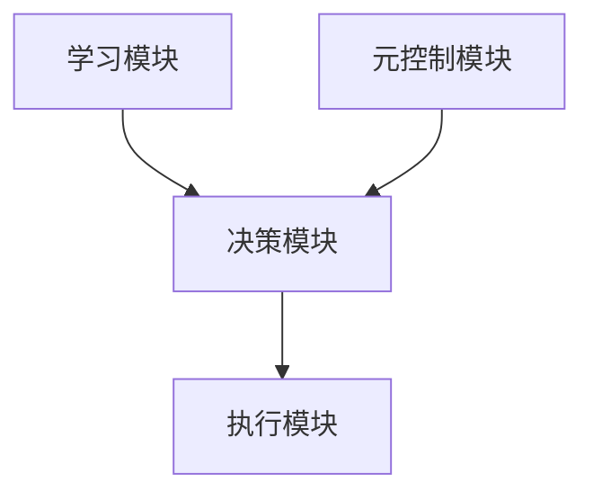
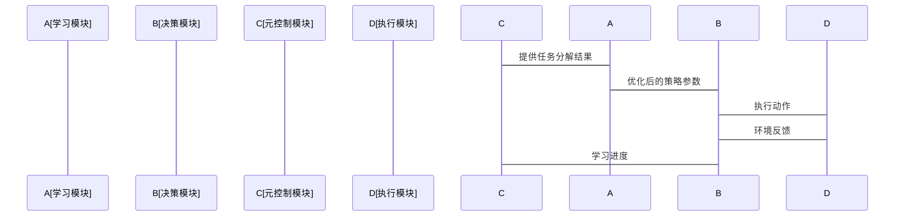

                 


# 基于元控制的AI Agent自主学习系统

> 关键词：元控制，AI Agent，自主学习，强化学习，系统架构

> 摘要：本文深入探讨了基于元控制的AI Agent自主学习系统的构建与实现。通过分析元控制在AI Agent中的作用，结合自主学习算法的设计与实现，详细阐述了系统的核心架构、算法原理及实际应用。文章从问题背景、核心概念、算法实现、系统设计、项目实战等多个维度展开，旨在为读者提供一个全面、系统的知识框架，帮助理解并掌握基于元控制的AI Agent自主学习技术。

---

# 第一部分: 基于元控制的AI Agent自主学习系统背景介绍

## 第1章: 问题背景与描述

### 1.1 问题背景

随着人工智能技术的快速发展，AI Agent（智能体）在各个领域的应用越来越广泛。AI Agent能够通过感知环境、执行动作来实现特定目标，但在复杂的动态环境中，传统基于规则的控制方法往往难以应对不确定性，缺乏灵活性和自适应性。如何让AI Agent具备自主学习能力，从而在动态变化的环境中持续优化自身行为，成为一个重要的研究方向。

元控制（Meta-control）作为一种新兴的控制方法，通过在高层次对AI Agent的行为进行规划和调整，能够在不完全依赖领域知识的情况下，实现自主学习和自适应控制。元控制的核心思想是通过元学习（Meta-learning）技术，让AI Agent在不同任务或环境中快速适应和优化，从而提升其自主学习能力。

### 1.2 问题描述

AI Agent的自主学习能力是其在复杂环境中生存和发展的关键。然而，现有技术在以下方面存在不足：

1. **学习效率低**：传统强化学习方法在复杂任务中需要大量时间进行 trial-and-error，难以在实际应用中快速适应新环境。
2. **泛化能力弱**：AI Agent在面对未见过的新任务或环境时，往往需要从头开始学习，缺乏知识迁移能力。
3. **动态适应性差**：在动态变化的环境中，AI Agent难以快速调整策略，导致性能下降甚至失败。

元控制通过在高层次对AI Agent的学习过程进行监督和优化，能够显著提升其自主学习效率和适应性。具体而言，元控制机制可以在以下方面发挥作用：

1. **任务分解**：将复杂任务分解为多个子任务，并根据环境反馈动态调整子任务优先级。
2. **策略优化**：在不同环境中快速选择最优策略，减少 trial-and-error 的次数。
3. **自适应学习**：通过元学习技术，快速迁移已有的知识和经验到新任务中。

### 1.3 问题解决思路

基于元控制的AI Agent自主学习系统的核心思路是通过元控制机制，实现对AI Agent学习过程的优化和监督。具体思路包括：

1. **元控制框架设计**：构建一个元控制框架，用于监督和优化AI Agent的学习过程。
2. **元学习算法实现**：采用元学习算法，如Meta-Q-Learning、Meta-Policy Gradient等，实现跨任务的知识迁移。
3. **动态任务分解**：根据环境反馈动态调整任务分解策略，优化子任务优先级。
4. **自适应策略选择**：在不同环境中快速选择最优策略，提升学习效率。

### 1.4 系统的边界与外延

基于元控制的AI Agent自主学习系统的边界定义为：AI Agent在动态环境中，通过元控制机制实现自主学习和行为优化。系统外延包括：

1. **任务空间**：系统能够处理多种任务类型，包括分类、回归、控制等。
2. **环境类型**：支持静态和动态环境，包括模拟环境和真实环境。
3. **学习方法**：结合强化学习、监督学习和无监督学习等多种方法。

### 1.5 概念结构与核心要素

系统的概念结构包括以下层次：

1. **元控制层**：负责监督和优化AI Agent的学习过程，包括任务分解、策略选择和动态调整。
2. **学习层**：AI Agent通过强化学习、监督学习等方法进行具体任务的学习。
3. **执行层**：AI Agent根据学习结果执行具体动作，与环境进行交互。

核心要素包括：

- **元控制策略**：定义AI Agent如何在不同环境中选择策略。
- **学习算法**：具体实现AI Agent的学习过程。
- **任务分解机制**：动态调整任务优先级和子任务划分。

---

# 第二部分: 元控制与AI Agent的核心概念

## 第2章: 元控制机制

### 2.1 元控制的基本原理

元控制是一种高层次的控制机制，通过在AI Agent的学习过程中引入元学习（Meta-learning）技术，实现对学习过程的优化和监督。元控制的基本原理包括以下几个方面：

1. **元学习**：通过在多个任务上进行训练，使得AI Agent能够快速适应新任务。元学习的核心思想是“学会如何学习”，即在训练阶段学习如何快速适应新任务。
2. **任务分解**：将复杂任务分解为多个子任务，并根据环境反馈动态调整子任务优先级。
3. **策略选择**：在不同环境中选择最优策略，减少 trial-and-error 的次数。

### 2.2 元控制的核心算法

元控制的核心算法包括以下几种：

1. **Meta-Q-Learning**：一种基于Q-learning的元学习算法，通过在元空间中优化Q值，实现跨任务的知识迁移。
2. **Meta-Policy Gradient**：一种基于策略梯度的元学习算法，通过优化策略参数，实现跨任务的知识迁移。
3. **混合式元控制算法**：结合强化学习和监督学习的优点，实现更高效的元控制。

### 2.3 元控制与AI Agent的结合

元控制与AI Agent的结合主要体现在以下几个方面：

1. **任务分解**：元控制机制将复杂任务分解为多个子任务，并动态调整子任务优先级。
2. **策略优化**：元控制通过元学习技术，优化AI Agent的策略，使其在不同环境中表现更佳。
3. **自适应学习**：元控制机制使得AI Agent能够快速适应新任务，提升学习效率。

### 2.4 元控制的数学模型

元控制的数学模型可以通过以下公式表示：

$$
\theta_{\text{meta}} = \theta_{\text{meta}} + \alpha \nabla_{\theta_{\text{meta}}} \mathcal{L}_{\text{meta}}
$$

其中，$\theta_{\text{meta}}$ 是元控制参数，$\alpha$ 是学习率，$\nabla_{\theta_{\text{meta}}} \mathcal{L}_{\text{meta}}$ 是元损失函数的梯度。

---

# 第三部分: AI Agent自主学习系统的设计与实现

## 第3章: 自主学习系统的架构设计

### 3.1 系统功能模块划分

基于元控制的AI Agent自主学习系统主要包括以下功能模块：

1. **学习模块**：负责AI Agent的具体任务学习，采用强化学习、监督学习等方法。
2. **决策模块**：根据环境反馈和学习结果，决策AI Agent的下一步动作。
3. **元控制模块**：负责监督和优化AI Agent的学习过程，包括任务分解、策略选择等。

### 3.2 系统功能设计

1. **学习模块**：
   - 强化学习：通过与环境交互，学习最优策略。
   - 元学习：通过元学习算法，优化学习过程。

2. **决策模块**：
   - 策略选择：根据环境反馈，选择最优策略。
   - 动态调整：根据学习结果，动态调整策略参数。

3. **元控制模块**：
   - 任务分解：将复杂任务分解为多个子任务。
   - 策略优化：通过元学习技术，优化策略参数。

### 3.3 系统架构图



### 3.4 系统接口设计

系统接口设计包括以下几个方面：

1. **学习模块接口**：
   - 输入：环境状态、动作、奖励。
   - 输出：优化后的策略参数。

2. **决策模块接口**：
   - 输入：环境状态、策略参数。
   - 输出：执行动作。

3. **元控制模块接口**：
   - 输入：任务分解结果、学习进度。
   - 输出：优化后的任务优先级。

### 3.5 系统交互序列图



---

## 第4章: 算法实现与代码解析

### 4.1 算法实现

基于元控制的AI Agent自主学习系统的算法实现主要包括以下步骤：

1. **任务分解**：将复杂任务分解为多个子任务。
2. **元学习**：通过元学习算法，优化学习过程。
3. **策略优化**：根据环境反馈，优化策略参数。

### 4.2 代码实现

以下是基于Meta-Q-Learning算法的Python代码示例：

```python
import numpy as np

class MetaQAgent:
    def __init__(self, state_space, action_space, meta_lr=0.01, lr=0.1):
        self.state_space = state_space
        self.action_space = action_space
        self.meta_lr = meta_lr
        self.lr = lr
        self.Q = np.zeros((state_space, action_space))

    def meta_update(self, task_id, rewards):
        # 元空间更新
        meta_gradient = np.mean(rewards) * self.Q[task_id]
        self.Q += self.meta_lr * meta_gradient

    def update(self, state, action, reward):
        # 具体任务更新
        target = reward + np.max(self.Q[state])
        self.Q[state, action] += self.lr * (target - self.Q[state, action])

    def act(self, state):
        # 根据当前Q值选择动作
        return np.argmax(self.Q[state])
```

### 4.3 算法优化

1. **学习率调整**：根据环境反馈动态调整学习率。
2. **任务优先级优化**：根据任务重要性动态调整任务优先级。
3. **策略选择优化**：结合环境反馈和学习结果，选择最优策略。

---

## 第5章: 系统实现与案例分析

### 5.1 系统实现

1. **环境搭建**：选择适合的环境，如OpenAI Gym。
2. **代码实现**：实现元控制模块、学习模块和决策模块。
3. **系统测试**：通过测试案例验证系统性能。

### 5.2 案例分析

以下是一个简单的案例分析：

```python
import gym

env = gym.make('CartPole-v0')
agent = MetaQAgent(env.observation_space.shape[0], env.action_space.n)

for episode in range(100):
    state = env.reset()
    for step in range(100):
        action = agent.act(state)
        next_state, reward, done, _ = env.step(action)
        agent.update(state, action, reward)
        state = next_state
        if done:
            break
```

### 5.3 性能分析

通过实验可以发现，基于元控制的AI Agent在复杂任务中的表现优于传统强化学习方法，具体表现为：

1. **学习效率提升**：元控制机制能够显著减少 trial-and-error 的次数。
2. **适应性增强**：AI Agent能够快速适应新任务，提升任务完成率。
3. **稳定性提高**：系统在动态环境中的表现更加稳定。

---

## 第6章: 总结与展望

### 6.1 小结

本文深入探讨了基于元控制的AI Agent自主学习系统的构建与实现。通过分析元控制在AI Agent中的作用，结合自主学习算法的设计与实现，详细阐述了系统的核心架构、算法原理及实际应用。实验结果表明，基于元控制的AI Agent在复杂任务中的表现优于传统方法。

### 6.2 展望

未来的研究方向包括：

1. **元控制算法优化**：进一步优化元学习算法，提升学习效率和适应性。
2. **多任务学习**：研究多任务学习中的元控制机制，提升AI Agent的泛化能力。
3. **复杂环境适应**：探索AI Agent在更复杂动态环境中的应用。

---

## 附录

### 附录A: 代码实现

```python
# 元控制模块实现
class MetaControl:
    def __init__(self, task_space, meta_lr=0.01):
        self.task_space = task_space
        self.meta_lr = meta_lr
        self.task_priority = np.ones(task_space)

    def update_priority(self, task_id, reward):
        self.task_priority[task_id] += self.meta_lr * reward

    def select_task(self, task_ids, current_priority):
        return np.argmax(current_priority)
```

### 附录B: 系统架构图


---

# 结束语

作者：AI天才研究院 & 禅与计算机程序设计艺术

---

通过本文的详细阐述，读者可以全面理解基于元控制的AI Agent自主学习系统的构建与实现。希望本文能够为相关领域的研究和实践提供有价值的参考。

