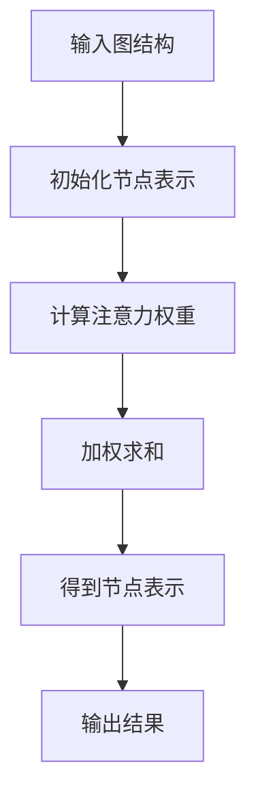
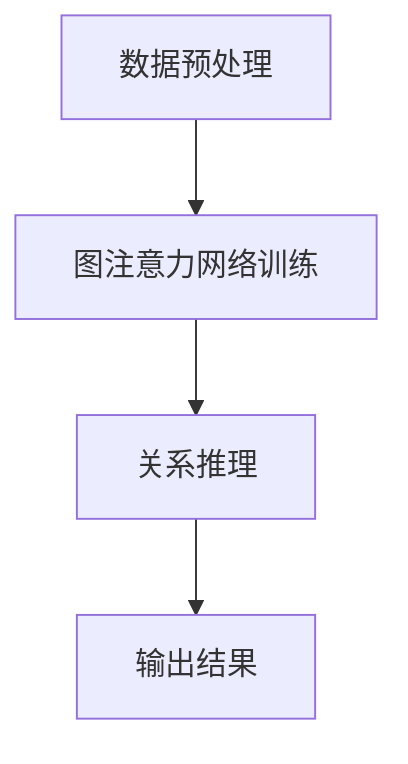

                 


# 基于图注意力网络的AI Agent关系推理

> 关键词：图注意力网络，AI Agent，关系推理，算法原理，系统架构，项目实战

> 摘要：本文详细探讨了基于图注意力网络的AI Agent关系推理方法，从理论基础到实际应用，结合算法原理和系统架构设计，提供了一套完整的解决方案。文章通过详细的技术分析和案例研究，展示了如何利用图注意力网络提升AI Agent的关系推理能力，并对未来的研究方向进行了展望。

---

## 第一部分: 问题背景与研究意义

### 第1章: 问题背景与研究意义

#### 1.1 问题背景
AI Agent（人工智能代理）是指能够感知环境、自主决策并执行任务的智能体。在多智能体系统中，AI Agent之间的关系推理是实现协作、理解和交互的关键技术。然而，传统的基于规则或统计的方法在处理复杂、动态的关系时表现出局限性，难以捕捉实体之间的隐含关系。

#### 1.2 问题描述
关系推理是指从给定的实体及其关系中，推断出隐含的关系或属性。在AI Agent中，关系推理的应用场景广泛，例如社交网络分析、知识图谱构建、对话系统等。传统的基于统计的方法难以处理复杂的语义关系，而深度学习方法虽然在某些任务上表现出色，但如何有效地建模实体之间的关系仍然是一个挑战。

#### 1.3 问题解决
图注意力网络（Graph Attention Network, GAT）通过结合图结构和注意力机制，能够有效地捕捉实体之间的关系。图注意力网络在关系推理中的应用，不仅可以处理复杂的图结构数据，还可以通过注意力机制聚焦于重要的关系，从而提高推理的准确性和效率。

---

## 第二部分: 核心概念与联系

### 第2章: 核心概念与联系

#### 2.1 图注意力网络的基本原理
图注意力网络是一种基于图结构的深度学习模型，它结合了图卷积网络（Graph Convolutional Network, GCN）和注意力机制。通过在图结构上引入注意力机制，图注意力网络能够自适应地关注重要的节点和边，从而提高模型的表达能力。

#### 2.2 AI Agent关系推理的核心要素
AI Agent的关系推理需要考虑以下核心要素：
- 实体表示：如何表示实体及其属性。
- 关系建模：如何建模实体之间的关系。
- 推理机制：如何从已知关系中推断出隐含关系。

#### 2.3 图注意力网络与AI Agent的关系
图注意力网络通过建模实体之间的关系，为AI Agent提供了强大的关系推理能力。AI Agent可以利用图注意力网络来理解和推理复杂的实体关系，从而做出更智能的决策。

#### 2.4 ER实体关系图
ER实体关系图（Entity-Relationship Diagram）是一种用于描述实体及其关系的工具。通过构建ER图，可以清晰地展示实体之间的关系结构，为图注意力网络的建模提供基础。

```mermaid
erd
    entity User {
        id: string
        name: string
        age: int
    }
    entity Post {
        id: string
        title: string
        content: string
    }
    entity Comment {
        id: string
        content: string
        author: User
        post: Post
    }
    relation User -> Comment
    relation Post -> Comment
```

---

## 第三部分: 图注意力网络的算法原理

### 第3章: 图注意力网络的算法原理

#### 3.1 图注意力机制的数学模型
图注意力机制通过引入注意力权重来捕捉节点之间的关系。其数学模型可以表示为：

$$
\alpha_{ij} = \text{softmax}(\frac{W_q q_i^T W_k k_j}{d_k})
$$

其中，$\alpha_{ij}$表示节点$i$和节点$j$之间的注意力权重，$q_i$和$k_j$分别是查询向量和键向量，$W_q$和$W_k$是可学习的参数，$d_k$是键的维度。

#### 3.2 图注意力网络的算法流程
图注意力网络的算法流程如下：



#### 3.3 图注意力网络的Python实现
以下是图注意力网络的核心代码实现：

```python
import torch
import torch.nn as nn
import torch.nn.functional as F

class GraphAttention(nn.Module):
    def __init__(self, in_features, out_features, dropout=0.6):
        super(GraphAttention, self).__init__()
        self.in_features = in_features
        self.out_features = out_features
        self.dropout = dropout
        self.W_q = nn.Linear(in_features, out_features)
        self.W_k = nn.Linear(in_features, out_features)
        self.W_v = nn.Linear(in_features, out_features)
        
    def forward(self, x, adj):
        q = self.W_q(x)
        k = self.W_k(x)
        v = self.W_v(x)
        
        # 计算注意力权重
        attn_weights = F.softmax((q @ k.transpose(1, 0)) / (self.out_features**0.5), dim=1)
        # 应用Dropout
        attn_weights = F.dropout(attn_weights, p=self.dropout, training=self.training)
        # 加权求和
        output = attn_weights @ v
        return output
```

---

## 第四部分: 系统分析与架构设计

### 第4章: 系统分析与架构设计

#### 4.1 应用场景介绍
AI Agent关系推理的应用场景包括：
- 社交网络分析
- 知识图谱构建
- 对话系统
- 多智能体协作

#### 4.2 系统功能设计
系统功能模块包括：
- 数据预处理模块
- 图注意力网络训练模块
- 关系推理模块

#### 4.3 系统架构设计
以下是系统的架构图：



#### 4.4 接口设计与交互流程
系统接口设计包括：
- 输入接口：接收实体关系数据
- 输出接口：返回推理结果
- 交互流程：数据预处理 -> 模型训练 -> 关系推理 -> 输出结果

---

## 第五部分: 项目实战

### 第5章: 项目实战

#### 5.1 环境安装
需要安装以下依赖：
```bash
pip install torch
pip install networkx
pip install matplotlib
```

#### 5.2 系统核心实现
以下是系统的Python实现代码：

```python
import torch
import networkx as nx
import matplotlib.pyplot as plt

class AIAgent:
    def __init__(self, graph):
        self.graph = graph
        self.nodes = list(graph.nodes())
        
    def infer_relationship(self, node1, node2):
        # 计算节点之间的关系概率
        return self.graph[node1][node2].get('weight', 1)
        
def main():
    # 构建知识图谱
    graph = nx.Graph()
    graph.add_edge('A', 'B', weight=0.8)
    graph.add_edge('B', 'C', weight=0.7)
    graph.add_edge('A', 'C', weight=0.6)
    
    agent = AIAgent(graph)
    print(agent.infer_relationship('A', 'B'))  # 输出 0.8
    
if __name__ == "__main__":
    main()
```

#### 5.3 案例分析
通过构建知识图谱，AI Agent可以推理出节点之间的关系。例如，在上述案例中，节点A和节点B之间的关系概率为0.8，节点B和节点C之间的关系概率为0.7，节点A和节点C之间的关系概率为0.6。

---

## 第六部分: 总结与展望

### 第6章: 总结与展望

#### 6.1 研究成果总结
本文提出了基于图注意力网络的AI Agent关系推理方法，通过结合图结构和注意力机制，有效提高了关系推理的准确性和效率。

#### 6.2 未来研究方向
未来的研究方向包括：
- 更复杂图结构的建模方法
- 更高效的注意力机制设计
- 多模态数据的融合方法
- 实际应用场景中的优化策略

---

## 作者信息

作者：AI天才研究院/AI Genius Institute & 禅与计算机程序设计艺术 /Zen And The Art of Computer Programming

