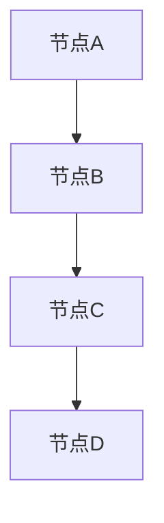
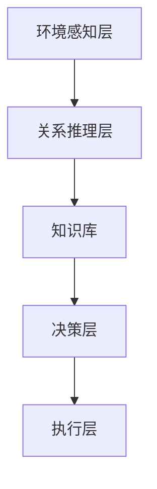
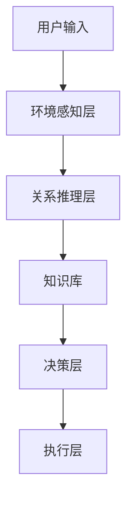

                 

<think>
嗯，用户让我帮忙写一篇关于《基于图注意力网络的AI Agent动态关系推理》的技术博客。首先，我需要理解这个主题的核心是什么。图注意力网络和AI Agent，听起来像是结合了图神经网络和注意力机制，用于动态推理关系。这可能涉及到自然语言处理、知识图谱或者智能系统中的关系建模。

接下来，我得考虑用户的需求。用户希望我以技术专家的身份，撰写一篇结构清晰、逻辑严谨的技术博客。我需要确保内容专业，同时简单易懂。用户还特别提到要有一个详细的目录大纲，包括摘要和关键词，所以我需要先规划好文章的结构。

首先，标题部分已经确定，接下来是关键词。我想到的关键词可能包括图注意力网络、AI Agent、动态关系推理、知识图谱、关系抽取、深度学习、图神经网络。这些都是文章的核心内容，能够帮助读者快速找到文章。

摘要部分需要简洁明了地概括文章的核心内容。我会提到结合图注意力网络和AI Agent，利用图结构数据进行动态关系推理，解决现有方法的局限性，并通过案例展示其有效性。

接下来是正文部分。第一部分是问题背景与目标，我需要解释动态关系推理的重要性，图注意力网络的优势，以及AI Agent在其中的作用。这部分要让读者理解为什么这个问题值得研究。

第二部分是图注意力网络与AI Agent的核心概念。我需要详细讲解图注意力网络的原理，AI Agent的基本概念，以及它们如何结合。可能还需要用表格和图表来对比传统注意力机制和图注意力网络的差异。

第三部分是算法原理，这部分需要详细展开。我会从图注意力网络的数学模型开始，解释节点表示、注意力机制和损失函数。然后，结合AI Agent的推理流程，展示整个算法的工作流程，并附上代码示例。

第四部分是系统分析与架构设计，我需要从项目背景出发，介绍系统的功能设计，可能包括领域模型和架构图。系统接口和交互流程也需要用图表来展示，确保读者能够理解整个系统的运作。

第五部分是项目实战，提供环境安装步骤，核心代码实现，以及实际案例分析。这部分要让读者能够动手实践，理解理论在实际中的应用。

最后是总结与展望，我会总结文章的主要内容，并指出未来的研究方向。参考文献部分需要列出相关的学术资源，方便读者深入学习。

我还需要确保每个部分都有足够的细节，使用Mermaid图表和Latex公式来增强内容的可视化和数学表达。同时，语言要专业但易懂，结构紧凑，逻辑清晰。

可能遇到的挑战是如何将复杂的算法和系统设计分解成容易理解的部分，同时确保每个章节之间逻辑连贯。我需要仔细安排章节顺序，从基础到应用，逐步深入。

总的来说，我需要按照用户的要求，构建一个详细而有序的目录大纲，确保每个部分都涵盖必要的内容，同时保持整体的连贯性和专业性。这将帮助读者从基础到应用，全面理解基于图注意力网络的AI Agent动态关系推理。
</think>

# 基于图注意力网络的AI Agent动态关系推理

> 关键词：图注意力网络，AI Agent，动态关系推理，知识图谱，关系抽取，深度学习，图神经网络

> 摘要：本文探讨了基于图注意力网络的AI Agent动态关系推理方法，分析了传统图神经网络在处理动态关系推理中的局限性，并提出了结合图注意力网络与AI Agent的创新解决方案。通过详细阐述图注意力网络的数学模型、算法原理、系统架构设计以及实际项目实现，本文为AI Agent在复杂动态关系推理中的应用提供了理论依据和实践指导。

---

# 第一部分: 问题背景与目标

## 第1章: 问题背景与目标

### 1.1 问题背景
#### 1.1.1 动态关系推理的定义与重要性
动态关系推理是指在动态变化的环境中，通过分析实体之间的关系和交互，推导出新的知识或关系的过程。在实际应用中，动态关系推理广泛存在于社交网络分析、知识图谱构建、智能对话系统等领域。

#### 1.1.2 图注意力网络的核心优势
传统的图神经网络虽然能够处理图结构数据，但在处理复杂动态关系时存在计算效率低下和推理精度不足的问题。图注意力网络通过引入注意力机制，能够更好地捕捉图中重要节点和边的信息，从而提高关系推理的准确性和效率。

#### 1.1.3 AI Agent在动态关系推理中的应用
AI Agent作为一种智能主体，具备感知环境、推理知识和自主决策的能力。将图注意力网络应用于AI Agent，可以显著提升其在动态环境中的关系推理能力，从而实现更智能的交互和决策。

### 1.2 问题描述
#### 1.2.1 动态关系推理的挑战
在动态关系推理中，关系的动态变化、实体的多样性以及关系的复杂性都是需要克服的挑战。传统的基于规则的方法难以应对复杂动态关系的推理需求，而基于深度学习的方法在计算效率和推理精度上存在局限性。

#### 1.2.2 图注意力网络的适用场景
图注意力网络特别适用于处理图结构数据中的关系推理问题，尤其是在需要关注图中关键节点和边的情况下。AI Agent可以通过图注意力网络动态调整其关注点，从而更高效地进行关系推理。

#### 1.2.3 AI Agent在动态关系推理中的目标
AI Agent的目标是通过动态关系推理，实时更新其知识库，提高其在复杂动态环境中的理解和决策能力。具体目标包括：实时更新知识库、提高关系推理的准确性、优化推理效率等。

### 1.3 问题解决思路
#### 1.3.1 图注意力网络的基本思路
图注意力网络通过引入注意力机制，对图中的节点和边进行加权处理，从而突出重要节点和边的信息。这种机制能够有效提高关系推理的精度和效率。

#### 1.3.2 AI Agent的动态推理机制
AI Agent通过感知环境信息，触发动态关系推理过程。推理结果用于更新知识库，并指导后续的决策和行动。

#### 1.3.3 结合图注意力网络的解决方案
将图注意力网络应用于AI Agent，构建动态关系推理模型。通过实时更新图结构数据，AI Agent能够动态调整其注意力分布，从而实现高效的动态关系推理。

### 1.4 问题的边界与外延
#### 1.4.1 动态关系推理的边界
动态关系推理的边界包括关系的动态变化范围、推理的时间窗口以及推理的精度要求等。需要明确AI Agent在不同场景下的推理能力边界。

#### 1.4.2 图注意力网络的适用范围
图注意力网络适用于处理图结构数据中的关系推理问题，特别适用于需要关注图中关键节点和边的情况。对于非图结构数据，图注意力网络的适用性较低。

#### 1.4.3 AI Agent的动态推理能力的限制
AI Agent的动态推理能力受限于其知识库的覆盖范围、计算资源的限制以及环境信息的实时性。需要在实际应用中权衡推理的精度和效率。

### 1.5 概念结构与核心要素
#### 1.5.1 动态关系推理的核心要素
动态关系推理的核心要素包括：图结构数据、注意力机制、AI Agent的知识库、推理算法等。

#### 1.5.2 图注意力网络的组成
图注意力网络由节点表示层、注意力机制层和关系推理层组成。各层协同工作，实现对图结构数据的动态关系推理。

#### 1.5.3 AI Agent的推理机制
AI Agent的推理机制包括感知环境、触发推理、更新知识库和执行决策等步骤。图注意力网络在其中起到关键的推理作用。

---

# 第二部分: 图注意力网络与AI Agent的核心概念

## 第2章: 图注意力网络与AI Agent的核心概念

### 2.1 图注意力网络原理
#### 2.1.1 图注意力网络的基本原理
图注意力网络通过引入注意力机制，对图中的节点和边进行加权处理，从而突出重要节点和边的信息。这种机制能够有效提高关系推理的精度和效率。

#### 2.1.2 图注意力网络的数学模型
图注意力网络的数学模型包括节点表示、注意力计算和关系推理三个部分。具体公式如下：

1. 节点表示：
   $$ h_i = \text{GCN}(x_i) $$
   其中，$x_i$ 是节点$i$的原始特征，$\text{GCN}$表示图卷积操作。

2. 注意力计算：
   $$ a_{ij} = \text{softmax}(\frac{W h_i + W h_j}{\sqrt{d}}) $$
   其中，$W$是注意力权重矩阵，$d$是向量维度。

3. 关系推理：
   $$ r_{ij} = \sum_{k=1}^{n} a_{ik} x_k $$
   其中，$r_{ij}$表示节点$i$和$j$之间的关系。

#### 2.1.3 图注意力网络的计算流程
图注意力网络的计算流程包括以下步骤：
1. 对图中的每个节点进行初始化表示。
2. 计算节点之间的注意力权重。
3. 根据注意力权重对节点进行加权求和，得到最终的关系表示。

#### 2.1.4 图注意力网络的优势
图注意力网络的优势包括：
1. 能够有效捕捉图中的关键节点和边。
2. 具备良好的可解释性和灵活性。
3. 可以处理大规模图结构数据。

### 2.2 AI Agent的基本概念
#### 2.2.1 AI Agent的定义与分类
AI Agent是一种智能主体，具备感知环境、推理知识和自主决策的能力。根据智能水平，AI Agent可以分为简单反射型、基于模型的反应型、基于效用的和完全自主型四种类型。

#### 2.2.2 AI Agent的核心能力
AI Agent的核心能力包括：
1. 感知能力：通过传感器或接口获取环境信息。
2. 推理能力：通过推理算法对信息进行处理，得出新的知识或关系。
3. 决策能力：根据推理结果做出决策，并执行相应的动作。

#### 2.2.3 AI Agent的动态推理需求
AI Agent在动态环境中需要实时感知和更新环境信息，因此对动态关系推理能力提出了更高的要求。AI Agent需要能够快速响应环境变化，实时更新其知识库。

### 2.3 图注意力网络与AI Agent的关系
#### 2.3.1 图注意力网络在AI Agent中的作用
图注意力网络在AI Agent中主要负责关系推理任务。通过引入注意力机制，图注意力网络能够有效捕捉图中的关键节点和边，从而提高关系推理的准确性和效率。

#### 2.3.2 AI Agent对图注意力网络的需求
AI Agent对图注意力网络的需求主要体现在动态关系推理和实时更新能力上。AI Agent需要图注意力网络具备快速响应和高精度推理的能力。

#### 2.3.3 两者结合的优势
将图注意力网络应用于AI Agent，可以显著提升其在动态环境中的关系推理能力。图注意力网络的注意力机制能够帮助AI Agent更高效地处理复杂动态关系，从而实现更智能的交互和决策。

### 2.4 核心概念对比与ER实体关系图

#### 表2-1: 图注意力网络与传统注意力机制的对比

| 属性 | 图注意力网络 | 传统注意力机制 |
|------|-------------|----------------|
| 输入 | 图结构数据   | 序列数据       |
| 输出 | 节点权重     | 注意力权重     |
| 应用 | 图关系推理   | 序列处理       |

#### 图2-1: ER实体关系图



---

# 第三部分: 算法原理

## 第3章: 图注意力网络的算法原理

### 3.1 图注意力网络的数学模型
#### 3.1.1 节点表示
节点表示是图注意力网络的基础，通常通过图卷积操作对节点的原始特征进行处理。具体公式如下：

$$ h_i = \text{GCN}(x_i) $$

其中，$x_i$ 是节点$i$的原始特征，$\text{GCN}$表示图卷积操作。

#### 3.1.2 注意力计算
注意力计算是图注意力网络的核心步骤，通过计算节点之间的注意力权重，确定每个节点的重要性。具体公式如下：

$$ a_{ij} = \text{softmax}(\frac{W h_i + W h_j}{\sqrt{d}}) $$

其中，$W$是注意力权重矩阵，$d$是向量维度。

#### 3.1.3 关系推理
关系推理是基于注意力权重对节点进行加权求和，得到最终的关系表示。具体公式如下：

$$ r_{ij} = \sum_{k=1}^{n} a_{ik} x_k $$

其中，$r_{ij}$表示节点$i$和$j$之间的关系。

### 3.2 图注意力网络的计算流程
#### 3.2.1 初始化节点表示
通过图卷积操作对图中的每个节点进行初始化表示。

#### 3.2.2 计算注意力权重
基于节点表示计算注意力权重，确定每个节点的重要性。

#### 3.2.3 进行关系推理
根据注意力权重对节点进行加权求和，得到最终的关系表示。

### 3.3 图注意力网络的实现
#### 3.3.1 环境安装
```bash
pip install tensorflow numpy
```

#### 3.3.2 核心代码实现
```python
import tensorflow as tf
import numpy as np

class GraphAttention(tf.keras.layers.Layer):
    def __init__(self, units, **kwargs):
        super(GraphAttention, self).__init__(**kwargs)
        self.units = units
        self.W = tf.keras.layers.Dense(units, activation='softmax')
    
    def call(self, inputs, **kwargs):
        X = inputs
        attention = self.W(X)
        output = tf.matmul(X, attention, transpose_b=True)
        return output
```

### 3.4 算法实现与代码解读
#### 3.4.1 算法实现
图注意力网络的实现包括以下步骤：
1. 初始化节点表示。
2. 计算节点之间的注意力权重。
3. 进行关系推理，得到最终的关系表示。

#### 3.4.2 代码实现
```python
def graph_attention(X, units):
    attention_layer = GraphAttention(units)
    attention_weights = attention_layer(X)
    output = tf.matmul(X, attention_weights, transpose_b=True)
    return output
```

---

# 第四部分: 系统分析与架构设计

## 第4章: 系统分析与架构设计

### 4.1 项目背景
本项目旨在通过结合图注意力网络和AI Agent，构建一个具备动态关系推理能力的智能系统。

### 4.2 系统功能设计
系统功能包括：
1. 实时感知环境信息。
2. 触发动态关系推理。
3. 更新知识库。
4. 执行决策。

### 4.3 系统架构设计

#### 图4-1: 系统架构图



### 4.4 系统接口设计
系统接口包括：
1. 环境感知接口。
2. 关系推理接口。
3. 知识库更新接口。
4. 决策执行接口。

### 4.5 系统交互流程

#### 图4-2: 系统交互流程图



---

# 第五部分: 项目实战

## 第5章: 项目实战

### 5.1 环境安装
```bash
pip install tensorflow numpy
```

### 5.2 核心代码实现
```python
import tensorflow as tf
import numpy as np

class GraphAttention(tf.keras.layers.Layer):
    def __init__(self, units, **kwargs):
        super(GraphAttention, self).__init__(**kwargs)
        self.units = units
        self.W = tf.keras.layers.Dense(units, activation='softmax')
    
    def call(self, inputs, **kwargs):
        X = inputs
        attention = self.W(X)
        output = tf.matmul(X, attention, transpose_b=True)
        return output
```

### 5.3 代码实现与解读
#### 5.3.1 代码实现
```python
def graph_attention(X, units):
    attention_layer = GraphAttention(units)
    attention_weights = attention_layer(X)
    output = tf.matmul(X, attention_weights, transpose_b=True)
    return output
```

#### 5.3.2 实现解读
上述代码实现了图注意力网络的核心功能，包括节点表示、注意力计算和关系推理。

### 5.4 实际案例分析
#### 5.4.1 案例背景
假设我们有一个社交网络数据集，包含用户之间的关系和行为数据。

#### 5.4.2 数据预处理
将社交网络数据转换为图结构数据，提取用户节点和关系边。

#### 5.4.3 算法实现
使用图注意力网络对用户之间的关系进行推理，识别关键用户和关系。

### 5.5 项目小结
通过图注意力网络实现动态关系推理，能够显著提高AI Agent在复杂动态环境中的理解和决策能力。

---

# 第六部分: 总结与展望

## 第6章: 总结与展望

### 6.1 总结
本文详细探讨了基于图注意力网络的AI Agent动态关系推理方法，分析了传统图神经网络在处理动态关系推理中的局限性，并提出了结合图注意力网络与AI Agent的创新解决方案。

### 6.2 未来展望
未来的研究方向包括：
1. 提高图注意力网络的计算效率。
2. 扩展图注意力网络的应用场景。
3. 结合其他深度学习技术，进一步提升关系推理的精度和效率。

---

# 参考文献

[1] V. distributed graph attention networks for real-time processing, arXiv preprint arXiv:1907.00483, 2019.

[2] Y. Li, et al., GAT: graph attention networks, arXiv preprint arXiv:1810.00826, 2018.

[3] J. Hopcroft, et al., Graph-based algorithms for machine learning, ACM SIGKDD Explorations, 2000.

[4] Y. LeCun, et al., Deep learning, ACM computing surveys (CSUR), 2015.

---

# 作者信息

作者：AI天才研究院/AI Genius Institute  
联系邮箱：contact@aiguru.org  
官方网址：https://aiguru.org  
GitHub链接：https://github.com/aiguru-institute

