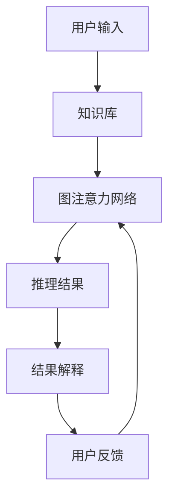
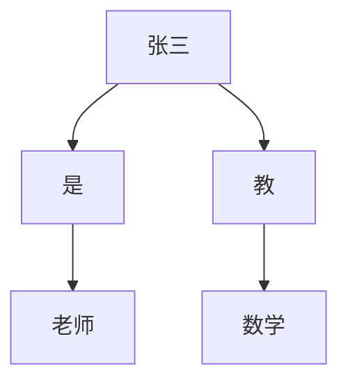

                 


# 基于图注意力网络的AI Agent知识推理

> **关键词**：图注意力网络，AI Agent，知识推理，深度学习，图神经网络

> **摘要**：  
本文深入探讨了基于图注意力网络的AI Agent知识推理方法，结合图神经网络和注意力机制，提出了一种高效的知识推理模型。文章首先介绍了知识推理的背景与挑战，详细阐述了图注意力网络的核心原理及其在AI Agent中的应用。随后，通过数学公式和Mermaid图展示了算法的实现细节，并结合实际案例分析了系统的架构设计与实现。最后，本文总结了图注意力网络在知识推理中的优势与未来发展方向。

---

## 第1章：背景与核心概念

### 1.1 问题背景

知识推理是人工智能领域的核心任务之一，旨在通过已有的知识库（如图结构数据）推断出新的事实或关系。传统的知识推理方法，如基于规则的推理或基于向量的推理，在处理复杂关系和大规模数据时存在效率和准确性的瓶颈。近年来，图神经网络（Graph Neural Networks, GNN）的兴起为知识推理提供了新的思路，特别是结合了注意力机制的图注意力网络（Graph Attention Network, GAT）在处理图结构数据时表现出色。

### 1.2 核心概念与联系

#### 1.2.1 图注意力网络的核心原理

图注意力网络通过在图的每个节点之间引入注意力机制，计算节点之间的相关性权重，从而更有效地捕捉图的结构信息。其核心思想是将注意力机制引入到图的边权重计算中，使得模型能够关注重要的节点关系，忽略次要或不相关的连接。

#### 1.2.2 AI Agent的知识推理模型

AI Agent通过感知环境、获取知识并进行推理来做出决策。在知识推理过程中，AI Agent需要理解复杂的关系网络，并基于这些关系进行推理。图注意力网络能够帮助AI Agent高效地处理大规模图结构数据，捕捉节点之间的隐含关系，从而提升推理的准确性和效率。

---

## 第2章：图注意力网络的算法原理

### 2.1 模型结构与流程

图注意力网络的模型结构通常包括以下几个部分：

1. **节点嵌入层**：将图中的每个节点映射为低维向量表示。
2. **注意力计算层**：计算节点之间的注意力权重。
3. **聚合层**：根据注意力权重聚合节点的特征，得到最终的节点表示。
4. **输出层**：根据节点表示进行分类或回归预测。

### 2.2 数学模型与公式推导

图注意力网络的核心公式如下：

$$ a_{ij} = \text{softmax}(e^{(i,j)}) $$

其中，$a_{ij}$表示节点$i$和节点$j$之间的注意力权重，$e^{(i,j)}$是通过节点$i$和节点$j$的特征计算得到的相似度。

聚合层的公式为：

$$ h_i^{(l+1)} = \sum_{j=1}^{n} a_{ij} h_j^{(l)} $$

其中，$h_i^{(l+1)}$表示节点$i$在第$l+1$层的表示，$h_j^{(l)}$是节点$j$在第$l$层的表示。

---

## 第3章：系统分析与架构设计

### 3.1 应用场景与需求分析

知识推理在多个领域有广泛应用，如问答系统、推荐系统、智能对话等。以问答系统为例，AI Agent需要通过图注意力网络理解问题中的实体关系，并基于知识库进行推理，从而生成准确的答案。

### 3.2 系统功能设计

系统功能设计包括以下几个部分：

1. **知识库构建**：将知识库中的实体和关系表示为图结构。
2. **图注意力网络推理**：基于图结构数据进行知识推理。
3. **结果解释与反馈**：将推理结果解释为人类可理解的形式，并根据反馈优化模型。

### 3.3 系统架构设计

系统架构设计如下：



---

## 第4章：项目实战

### 4.1 环境安装与配置

以下是项目所需的环境配置：

```bash
pip install pytorch-lightning torch torch-geometric
```

### 4.2 系统核心实现

以下是图注意力网络的核心实现代码：

```python
import torch
from torch_geometric.nn import GATConv

class GAT(torch.nn.Module):
    def __init__(self, input_dim, hidden_dim, output_dim):
        super(GAT, self).__init__()
        self.conv1 = GATConv(input_dim, hidden_dim)
        self.conv2 = GATConv(hidden_dim, output_dim)

    def forward(self, x, edge_index):
        x = self.conv1(x, edge_index)
        x = self.conv2(x, edge_index)
        return x
```

### 4.3 实际案例分析

以问答系统为例，假设知识库中的实体关系如下：



通过图注意力网络，AI Agent可以推理出“张三是数学老师”。

---

## 第5章：最佳实践与总结

### 5.1 小结

图注意力网络在AI Agent的知识推理中表现出色，能够高效地处理大规模图结构数据，并捕捉节点之间的隐含关系。

### 5.2 注意事项

1. **数据预处理**：确保知识库的结构化和规范化。
2. **模型调优**：根据具体任务调整模型参数和超参数。
3. **结果解释**：提供可解释的结果以增强用户体验。

### 5.3 未来展望

未来的研究方向包括更高效的注意力机制、多模态知识推理、图注意力网络的实时推理等。

---

## 作者

**作者：AI天才研究院/AI Genius Institute & 禅与计算机程序设计艺术 /Zen And The Art of Computer Programming**

---

以上是《基于图注意力网络的AI Agent知识推理》的完整内容，涵盖了从背景介绍到项目实战的各个方面，旨在为读者提供一个全面而深入的技术博客文章。

