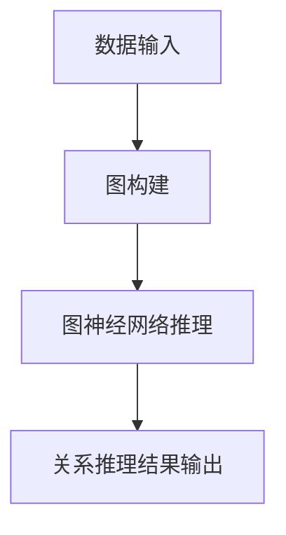
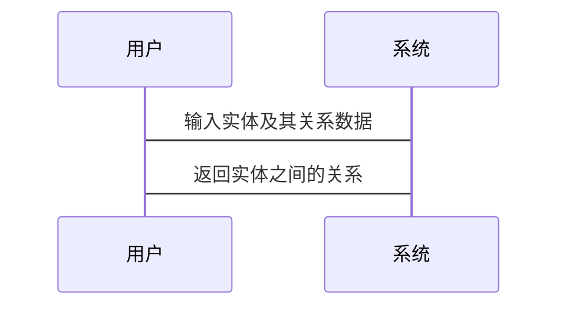

                 

<think>
好的，我现在需要帮用户设计一个详细的博客文章目录，主题是《基于图神经网络的AI Agent关系推理》。用户希望内容逻辑清晰，结构紧凑，语言专业，适合技术博客。文章需要包含背景介绍、核心概念、算法原理、系统架构、项目实战等多个部分，每部分都要详细展开。

首先，我会从背景介绍开始。这部分需要涵盖问题背景、问题描述、解决方案以及边界条件。接着是核心概念，包括图神经网络和AI Agent的关系推理，对比分析和数学模型。然后是算法原理，详细讲解图神经网络的工作原理，包括图卷积、注意力机制和图嵌入，并给出数学公式。系统架构部分需要设计系统功能、架构图、接口和交互流程。项目实战部分则涉及环境安装、代码实现和案例分析。最后是总结、最佳实践和拓展阅读。

在写作过程中，我需要确保每个部分都有足够的细节，并使用Mermaid图和代码示例来增强可读性。数学公式要用LaTeX，确保清晰准确。同时，保持整体结构的连贯性和逻辑性，帮助读者一步步深入理解主题。

现在，我开始按照这个结构来组织内容，确保每个章节都有三级子目录，覆盖理论和实践。完成后，我会检查目录的完整性和逻辑性，确保没有遗漏重要部分，同时保持语言的专业和易懂。
</think>

# 基于图神经网络的AI Agent关系推理

> 关键词：图神经网络，AI Agent，关系推理，图结构，节点嵌入，边权重，数学模型

> 摘要：本文详细探讨了基于图神经网络的AI Agent关系推理方法。从问题背景、核心概念到算法原理、系统架构，再到项目实战，系统地分析了图神经网络在关系推理中的应用。通过数学模型、代码实现和案例分析，深入解析了AI Agent如何利用图结构数据进行高效的关系推理。

---

## 第一章: 背景介绍

### 1.1 问题背景
#### 1.1.1 当前AI Agent的发展现状
AI Agent（智能体）在近年来取得了显著进展，特别是在自然语言处理、计算机视觉和机器人控制等领域。AI Agent需要能够理解和推理复杂环境中的关系，以便做出更智能的决策。

#### 1.1.2 图神经网络在关系推理中的作用
传统的深度学习方法在处理关系推理时表现有限，尤其是当数据具有复杂的结构化关系时。图神经网络（Graph Neural Networks, GNNs）通过建模图结构数据，能够更好地捕捉节点之间的关系，为AI Agent提供了新的解决方案。

#### 1.1.3 关系推理在AI Agent中的重要性
关系推理是AI Agent理解复杂场景的核心能力。通过推理实体之间的关系，AI Agent能够更好地进行决策、规划和交互。

### 1.2 问题描述
#### 1.2.1 AI Agent关系推理的核心问题
AI Agent需要从图结构数据中学习实体之间的关系，并能够基于这些关系进行推理和预测。

#### 1.2.2 图结构数据在关系推理中的应用
图结构数据能够自然地表示实体及其关系，为关系推理提供了丰富的语义信息。

#### 1.2.3 当前技术的局限性与挑战
传统的关系推理方法难以处理复杂的图结构数据，且在大规模数据上的计算效率较低。

### 1.3 问题解决方法
#### 1.3.1 图神经网络的基本原理
图神经网络通过在图结构上进行消息传递，能够有效地捕捉节点之间的关系。

#### 1.3.2 基于图神经网络的关系推理框架
构建一个基于图神经网络的关系推理框架，包括图的构建、节点嵌入、关系推理等步骤。

#### 1.3.3 图神经网络在AI Agent中的具体应用
将图神经网络应用于AI Agent的关系推理任务，如知识图谱推理、社交网络分析等。

### 1.4 边界与外延
#### 1.4.1 图神经网络的适用场景
适用于处理具有复杂关系的结构化数据，如知识图谱、社交网络等。

#### 1.4.2 关系推理的边界条件
需要明确图结构数据的质量、规模和复杂度。

#### 1.4.3 与其他技术的结合与区别
图神经网络与传统神经网络的区别在于其对图结构数据的建模能力，与其他技术（如随机森林、支持向量机）相比，具有更强的表达能力。

### 1.5 核心概念与组成
#### 1.5.1 图结构数据的定义
图结构数据由节点和边组成，节点表示实体，边表示实体之间的关系。

#### 1.5.2 节点与边的关系
节点之间的关系通过边的权重和类型来表示。

#### 1.5.3 图神经网络的组成部分
图神经网络包括图卷积层、注意力机制、节点嵌入等组成部分。

---

## 第二章: 核心概念与联系

### 2.1 图神经网络的基本原理
#### 2.1.1 图的表示与建模
图可以通过邻接矩阵、边列表等方式表示，图神经网络通过这些表示方式建模图结构。

#### 2.1.2 图神经网络的传播机制
通过消息传递机制，节点之间的信息通过边传播，最终生成节点的表示。

#### 2.1.3 图嵌入与节点表示
图嵌入是将图结构数据转换为低维向量表示的过程，节点表示是图嵌入的重要组成部分。

### 2.2 AI Agent的关系推理
#### 2.2.1 关系推理的定义与目标
关系推理是通过图结构数据推断实体之间的关系，目标是准确地识别和预测这些关系。

#### 2.2.2 基于图结构的关系推理方法
通过图神经网络对图结构数据进行建模，提取节点之间的关系特征，进行关系推理。

#### 2.2.3 图神经网络在关系推理中的优势
图神经网络能够有效地捕捉图结构中的局部和全局特征，适用于复杂关系的推理。

### 2.3 核心概念对比与联系
#### 2.3.1 图神经网络与传统神经网络的对比
图神经网络能够处理图结构数据，而传统神经网络难以处理结构化数据。

#### 2.3.2 关系推理与其他推理方法的对比
关系推理关注实体之间的关系，其他推理方法可能关注分类、回归等任务。

#### 2.3.3 图结构与关系推理的内在联系
图结构提供了实体之间的关系信息，关系推理通过图结构数据进行推理。

---

## 第三章: 算法原理讲解

### 3.1 图神经网络的数学模型
#### 3.1.1 图的表示
图可以用邻接矩阵 \( A \) 和节点特征矩阵 \( X \) 表示。邻接矩阵 \( A \) 是一个 \( n \times n \) 的矩阵，其中 \( A_{i,j} = 1 \) 表示节点 \( i \) 和节点 \( j \) 之间有边连接。

#### 3.1.2 图卷积操作
图卷积操作可以表示为：
$$
H^{(l+1)} = \text{Conv}(H^{(l)}, A)
$$
其中 \( H^{(l)} \) 是第 \( l \) 层的节点表示，\( \text{Conv} \) 是卷积操作。

#### 3.1.3 图注意力机制
图注意力机制通过计算节点之间的注意力权重，进行信息聚合：
$$
\alpha_{i,j} = \frac{\exp(\text{score}(x_i, x_j))}{\sum_{k} \exp(\text{score}(x_i, x_k))}
$$
其中 \( \alpha_{i,j} \) 是节点 \( i \) 和 \( j \) 之间的注意力权重。

### 3.2 关系推理的实现步骤
#### 3.2.1 构建图结构数据
将实体及其关系表示为图结构数据。

#### 3.2.2 图嵌入生成
使用图神经网络生成节点嵌入。

#### 3.2.3 关系推理
基于节点嵌入进行关系推理，输出实体之间的关系。

---

## 第四章: 系统分析与架构设计

### 4.1 系统功能设计
#### 4.1.1 系统模块划分
系统包括数据输入、图构建、图神经网络推理和关系推理结果输出四个模块。

#### 4.1.2 系统功能流程
1. 数据输入：读取实体及其关系数据。
2. 图构建：将实体及其关系转换为图结构数据。
3. 图神经网络推理：生成节点嵌入，进行关系推理。
4. 结果输出：输出实体之间的关系。

### 4.2 系统架构设计
#### 4.2.1 系统架构图


#### 4.2.2 接口设计
系统提供以下接口：
- 输入接口：接收实体及其关系数据。
- 输出接口：输出实体之间的关系。

### 4.3 交互序列图


---

## 第五章: 项目实战

### 5.1 环境安装
需要安装以下库：
- TensorFlow 或 PyTorch
- NetworkX
- Mermaid

### 5.2 系统核心实现源代码
#### 5.2.1 图构建
```python
import networkx as nx

G = nx.Graph()
G.add_nodes_from([1, 2, 3])
G.add_edges_from([(1, 2), (2, 3)])
```

#### 5.2.2 图神经网络实现
```python
import tensorflow as tf

def graph_conv_layer(input, adjacency_matrix):
    return tf.matmul(input, adjacency_matrix)
```

### 5.3 代码应用解读与分析
#### 5.3.1 图构建部分
代码使用NetworkX库构建图结构数据，包括节点和边的添加。

#### 5.3.2 图神经网络实现部分
代码实现了一个简单的图卷积层，通过矩阵乘法进行信息传播。

### 5.4 实际案例分析
#### 5.4.1 案例介绍
以社交网络中的朋友关系为例，构建图结构数据。

#### 5.4.2 案例分析
通过图神经网络推理朋友之间的关系强度。

### 5.5 项目小结
本项目通过图神经网络实现了AI Agent的关系推理，验证了图神经网络在关系推理中的有效性。

---

## 第六章: 总结

### 6.1 最佳实践 Tips
- 在处理大规模图数据时，建议使用高效的图神经网络框架。
- 在实际应用中，需要根据具体任务调整模型参数。

### 6.2 小结
本文详细探讨了基于图神经网络的AI Agent关系推理方法，从理论到实践，系统地分析了图神经网络在关系推理中的应用。

### 6.3 注意事项
- 注意图数据的质量和规模对模型性能的影响。
- 在实际应用中，需要考虑模型的可解释性和计算效率。

### 6.4 拓展阅读
建议阅读相关领域的最新论文和书籍，深入理解图神经网络的最新进展。

---

作者：AI天才研究院/AI Genius Institute & 禅与计算机程序设计艺术 /Zen And The Art of Computer Programming

