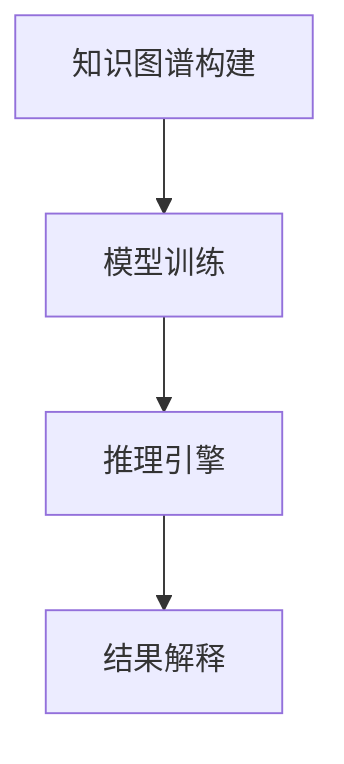
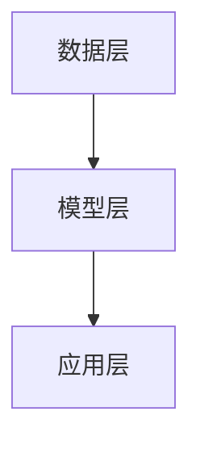
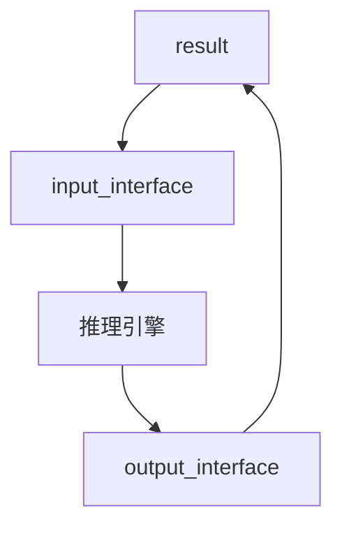

                 


# 基于图神经网络的AI Agent知识推理

> 关键词：图神经网络、知识图谱、AI Agent、知识推理、深度学习

> 摘要：本文探讨了基于图神经网络的AI Agent知识推理技术，分析了图神经网络在知识图谱中的应用及其对AI Agent推理能力的提升。通过详细讲解图神经网络的原理、算法及系统设计，结合实际案例，展示了如何利用图神经网络实现高效的AI Agent知识推理。

---

# 第一部分: 基于图神经网络的AI Agent知识推理背景介绍

## 第1章: AI Agent与知识推理概述

### 1.1 AI Agent的基本概念
#### 1.1.1 AI Agent的定义与分类
AI Agent（人工智能代理）是指能够感知环境、自主决策并执行任务的智能实体。根据智能水平，AI Agent可以分为简单反射型、基于模型型、实用推理型和目标驱动型。AI Agent的核心能力在于理解环境、处理复杂任务和与人类交互。

#### 1.1.2 知识推理在AI Agent中的作用
知识推理是AI Agent实现智能决策的关键技术，通过推理引擎，AI Agent能够从已有知识中推导出新的结论，从而做出更合理的决策。知识推理帮助AI Agent具备理解、关联和推导能力，使其在复杂场景中表现更出色。

#### 1.1.3 图神经网络与知识推理的结合
传统知识推理方法（如规则推理、逻辑推理）存在推理效率低、难以处理大规模知识图谱的问题。图神经网络通过图结构数据的建模和学习，能够高效处理复杂的知识关联关系，为AI Agent的知识推理提供更强大的能力。

---

## 第2章: 图神经网络的核心概念

### 2.1 图结构数据的表示
图结构数据由节点（实体）和边（关系）组成，能够自然表示知识图谱中的实体间关系。例如，知识图谱中的“人-地点-时间”关系可以用图结构清晰表示。

### 2.2 图神经网络的基本原理
图神经网络通过在图结构数据上进行特征提取和传播，捕捉节点之间的关联关系。其核心思想是通过聚合邻居节点的信息，逐步更新当前节点的表示，最终得到全局的图表示。

### 2.3 图神经网络的优势与挑战
图神经网络的优势在于能够处理复杂的非线性关系，适合大规模图数据的处理。其挑战包括图的稀疏性、异构性以及大规模图数据的计算效率问题。

---

# 第二部分: 图神经网络与知识图谱的核心概念与联系

## 第3章: 图神经网络的原理与算法

### 3.1 图神经网络的基本原理
图神经网络通过在图上进行信息传播和特征聚合，学习节点的表示。例如，图卷积网络（GCN）通过聚合邻居节点的信息，逐步更新节点表示。

### 3.2 图神经网络与知识图谱的关系
知识图谱是一种图结构数据，节点表示实体，边表示实体间的关系。图神经网络可以有效处理知识图谱的结构信息，提升知识推理的效率和准确性。

---

# 第三部分: 系统分析与架构设计方案

## 第4章: 系统分析与架构设计

### 4.1 项目背景与目标
本项目旨在通过图神经网络实现AI Agent的知识推理，提升AI Agent在复杂场景中的决策能力。项目目标包括知识图谱构建、图神经网络模型设计以及推理算法实现。

### 4.2 系统功能设计
系统功能模块包括知识图谱构建、模型训练、推理引擎和结果解释。功能流程图如下：



### 4.3 系统架构设计
系统架构采用分层设计，包括数据层、模型层和应用层。架构图如下：



### 4.4 系统接口设计
系统接口包括知识图谱输入接口、推理结果输出接口和用户交互接口。交互流程图如下：



---

# 第四部分: 项目实战

## 第5章: 项目实战

### 5.1 环境安装
安装必要的Python库，如PyTorch、NetworkX、Scikit-learn等。

### 5.2 核心代码实现
以下是基于GCN的知识推理代码示例：

```python
import torch
from torch import nn
from torch.nn import init

class GCN(nn.Module):
    def __init__(self, input_dim, hidden_dim, output_dim):
        super(GCN, self).__init__()
        self.W = nn.Parameter(torch.randn(input_dim, hidden_dim))
        self.U = nn.Parameter(torch.randn(hidden_dim, output_dim))
        self.relu = nn.ReLU()

    def forward(self, A, X):
        X = torch.mm(X, self.W)
        X = torch.mm(A, X)
        X = self.relu(X)
        X = torch.mm(X, self.U)
        return X

# 示例数据
A = torch.randn(5,5)  # 邻接矩阵
X = torch.randn(5, input_dim)  # 输入特征矩阵

model = GCN(input_dim, hidden_dim, output_dim)
output = model(A, X)
print(output)
```

### 5.3 实际案例分析
以医疗领域为例，构建疾病-症状-药物的知识图谱，通过图神经网络推理出潜在的药物治疗方案。

---

# 第五部分: 最佳实践

## 第6章: 最佳实践

### 6.1 小结
本文详细介绍了基于图神经网络的AI Agent知识推理技术，从理论到实践，展示了其在复杂场景中的应用潜力。

### 6.2 注意事项
在实际应用中，需注意数据质量、模型训练效率以及推理结果的可解释性问题。

### 6.3 拓展阅读
推荐阅读相关领域的最新论文，如《Graph Neural Networks: A Review of Methods, Applications, and Open Challenges》。

---

作者：AI天才研究院/AI Genius Institute & 禅与计算机程序设计艺术 /Zen And The Art of Computer Programming

