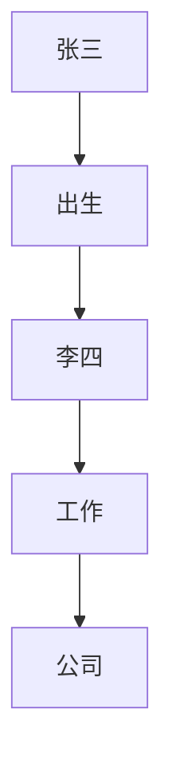
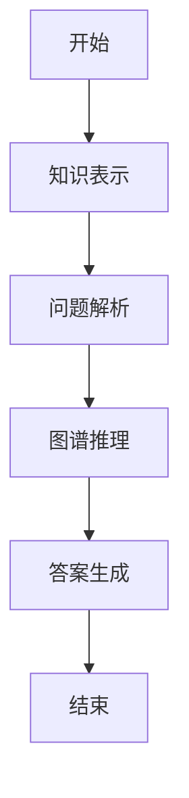
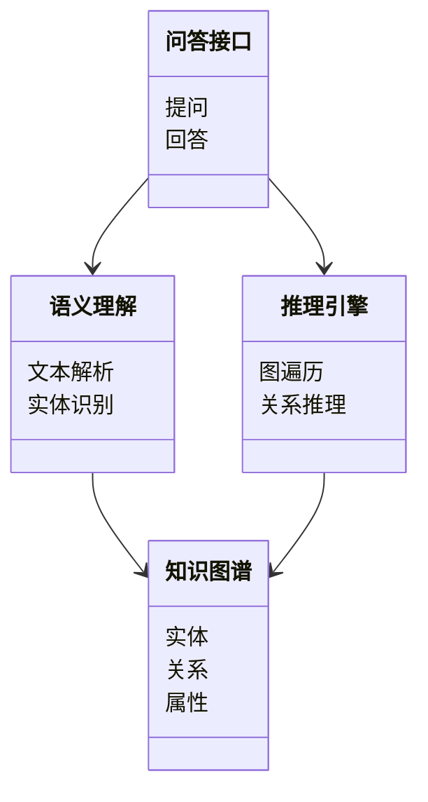
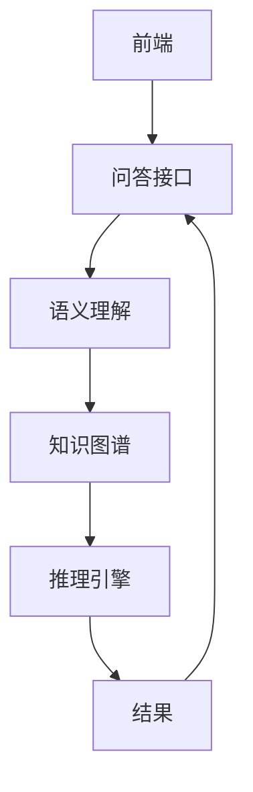
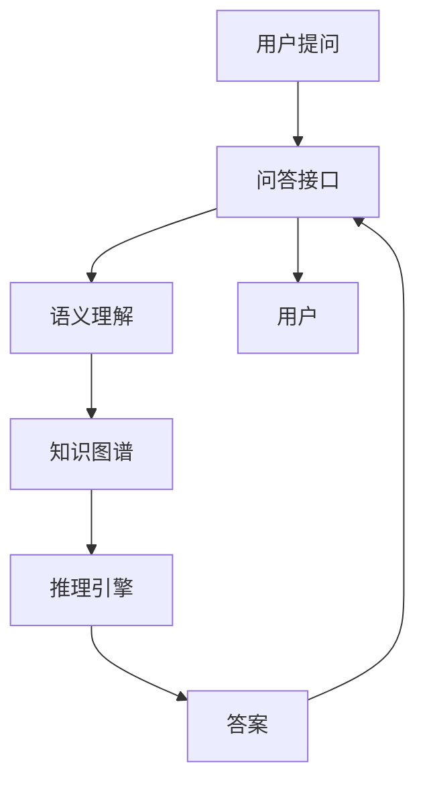

                 

<think>
嗯，用户让我写一篇关于《基于图谱的AI Agent知识推理与问答》的技术博客。我需要先仔细分析用户的query，确保理解所有的要求和细节。

首先，用户指定了角色，是一位世界级的AI专家，CTO，畅销书作家，甚至提到计算机图灵奖获得者。这让我意识到文章需要专业、有深度，并且结构清晰。因此，我需要确保内容不仅技术过硬，还要逻辑严密，语言简洁明了。

接下来，用户提供了详细的目录结构，包括摘要、关键词和正文部分。我注意到每个章节都有明确的子标题，甚至有图表和代码示例。这意味着文章不仅要涵盖理论，还要有实际的代码实现和图表说明，这样读者才能更好地理解和应用这些知识。

在摘要部分，我需要简明扼要地概括文章的核心内容，强调图谱技术在AI Agent中的应用，以及知识推理与问答系统的重要性。关键词部分需要列出5-7个核心词汇，方便读者快速找到相关主题。

正文部分分为六个主要部分：背景介绍、核心概念、算法原理、系统架构、项目实战和总结。每个部分都详细规划了内容，我需要确保每个章节都有足够的深度，同时保持逻辑连贯。例如，在背景介绍中，我需要解释为什么图谱技术在AI Agent中如此重要，以及它解决了哪些传统方法无法解决的问题。

在核心概念部分，我需要详细讲解图谱技术的基本原理，以及如何与AI Agent的知识表示和推理结合。使用ER图和mermaid流程图可以帮助读者更直观地理解实体关系和算法流程。同时，对比分析图谱与其他知识表示方法的区别，可以突出图谱的优势。

算法原理部分需要详细讲解知识推理的步骤，包括数学模型和公式。例如，概率推理和图神经网络模型的使用，我需要用mermaid流程图展示步骤，并附上Python代码示例，让读者能够实际操作和理解。

系统架构设计是关键，我需要介绍问题场景，设计系统的功能模块，用领域模型和架构图展示各个部分的交互。系统接口和交互流程的设计同样重要，确保系统的模块化和可扩展性。

项目实战部分需要提供一个具体的案例，比如电商知识问答系统。从环境安装到代码实现，再到案例分析，我需要详细指导读者如何一步步构建和测试系统。通过代码解读和分析，读者可以理解理论在实际中的应用。

最后，在总结与展望部分，我需要回顾文章的主要内容，并指出未来的发展方向，比如多模态图谱模型和人机协作。同时，给出一些最佳实践的建议，帮助读者在实际项目中避免常见错误。

整体来看，我需要确保文章内容全面，结构清晰，同时语言专业且易懂。通过图表、代码示例和数学公式，增强文章的可读性和实用性。最后，别忘了在结尾加上作者信息，提升文章的权威性。

现在，我需要将这些思考转化为具体的章节安排和内容编写，确保每个部分都符合用户的要求，并且逻辑严密，内容详实。这样，读者才能真正从中学到如何利用图谱技术提升AI Agent的知识推理与问答能力。
</think>

# 基于图谱的AI Agent知识推理与问答

> 关键词：图谱技术、AI Agent、知识推理、问答系统、图谱问答、知识图谱、自然语言处理

> 摘要：本文详细探讨了基于图谱的AI Agent知识推理与问答系统的核心原理、算法实现、系统架构及实际应用。通过分析图谱技术在知识表示与推理中的优势，结合具体的算法流程和代码实现，展示了如何利用图谱技术构建高效的问答系统。文章内容涵盖从理论到实践的全过程，为读者提供了一套完整的解决方案。

---

# 正文

## 第一部分: 基于图谱的AI Agent知识推理与问答背景介绍

### 第1章: 问题背景与描述

#### 1.1 问题背景

在人工智能（AI）领域，知识推理与问答系统是实现智能化应用的核心技术之一。传统的问答系统主要依赖于预定义的知识库或基于检索的机制，但在面对复杂语义、多步推理和动态知识更新时，这些方法往往显得力不从心。而AI Agent作为一种能够自主感知环境、主动推理并执行任务的智能体，其核心能力之一就是知识推理与问答。

近年来，图谱技术（Knowledge Graph）的快速发展为AI Agent的知识管理与推理提供了新的可能性。图谱技术通过将实体、关系和属性以图结构的形式表示，能够更直观地建模现实世界中的复杂关系，并支持高效的语义推理。

#### 1.2 问题描述

AI Agent的知识推理与问答系统需要解决以下几个关键问题：

1. **知识表示**：如何有效地表示AI Agent所需的知识，包括实体、关系和属性。
2. **语义理解**：如何理解用户的问题意图，并将其映射到知识图谱中。
3. **推理能力**：如何基于图谱进行推理，以回答复杂或需要多步推理的问题。
4. **动态更新**：如何实时更新图谱知识，以应对动态变化的环境。

#### 1.3 问题解决与边界

图谱技术在AI Agent中的应用能够有效解决上述问题。通过将知识表示为图结构，AI Agent可以更直观地理解问题背后的语义关系，并利用图谱的属性进行推理。此外，图谱技术还具有以下优势：

- **语义丰富性**：图谱能够表示复杂的实体关系，支持多步推理。
- **动态更新**：图谱可以通过增量更新的方式，快速响应知识变化。
- **可扩展性**：图谱技术能够轻松扩展到大规模知识库。

图谱问答系统的核心要素包括知识图谱、语义理解模块、推理引擎和问答接口。这些要素共同构成了一个完整的AI Agent知识推理与问答系统。

---

## 第2章: 核心概念与联系

### 2.1 核心概念原理

#### 2.1.1 图谱技术的基本原理

图谱技术是一种通过图结构（节点表示实体，边表示关系）来建模知识的技术。其核心在于通过构建大规模的图结构，实现对实体之间关系的建模和推理。例如，在知识图谱中，节点可以表示“人物”、“地点”、“事件”等实体，边可以表示“出生于”、“发生在”等关系。

图谱技术的优势在于其能够通过图结构自然地表示实体之间的复杂关系，并支持高效的路径搜索和推理。

#### 2.1.2 AI Agent的知识表示与推理

AI Agent的知识表示需要结合语义理解，将自然语言问题映射到图谱中的实体和关系上。知识推理则是通过在图谱中寻找路径，验证实体之间的关系，从而得出答案。

例如，在回答“谁是张三的父亲？”的问题时，AI Agent需要将问题中的“张三”映射到图谱中的一个节点，并通过图谱中的关系路径（如“张三 -> 出生 -> 李四”）找到答案。

#### 2.1.3 图谱问答系统的实现机制

图谱问答系统的核心是通过自然语言处理（NLP）技术将用户的问题转换为图谱查询，然后利用图谱推理引擎找到答案。其主要步骤包括：

1. **问题解析**：将自然语言问题转换为图谱查询。
2. **图谱查询**：通过图谱推理引擎找到与问题相关的实体和关系。
3. **答案生成**：根据推理结果生成自然语言答案。

### 2.2 核心概念对比

#### 2.2.1 图谱与传统知识库的对比

| 特性               | 图谱技术                 | 传统知识库             |
|--------------------|--------------------------|------------------------|
| 表示方式           | 图结构（节点和边）       | 关系型数据库或JSON等   |
| 可扩展性           | 高                     | 低                     |
| 关系建模能力       | 强，支持多步关系推理     | 弱，仅支持简单关系      |
| 动态更新           | 支持增量更新             | 需要重新构建             |

#### 2.2.2 AI Agent与传统问答系统的区别

| 特性               | AI Agent                | 传统问答系统            |
|--------------------|--------------------------|--------------------------|
| 知识表示           | 图谱                     | 预定义知识库             |
| 推理能力           | 强，支持复杂推理         | 弱，仅支持简单查询       |
| 动态适应能力       | 强，支持实时更新         | 弱，知识固定             |
| 应用场景           | 复杂问题、动态环境       | 简单问题、静态知识库     |

#### 2.2.3 图谱问答系统的性能优势

图谱问答系统的主要优势在于其能够支持复杂的语义推理，并且可以通过图谱的动态更新能力，实时响应知识变化。此外，图谱技术还可以与其他AI技术（如自然语言处理、机器学习）无缝结合，进一步提升系统的智能性。

### 2.3 实体关系图

以下是图谱中实体关系的示例：



在上述图谱中，节点表示实体，边表示关系。例如，“张三出生在李四家”，“李四在公司工作”。

---

## 第三部分: 基于图谱的AI Agent知识推理算法原理

### 第3章: 算法原理与实现

#### 3.1 算法原理

图谱问答系统的算法主要包括以下步骤：

1. **知识表示**：将实体、关系和属性表示为图结构。
2. **问题解析**：将自然语言问题转换为图谱查询。
3. **图谱推理**：通过图谱推理算法找到与问题相关的实体和关系。
4. **答案生成**：根据推理结果生成自然语言答案。

#### 3.2 算法流程图



#### 3.3 算法实现代码

以下是一个简单的图谱问答系统实现示例：

```python
from kgtool import KG

# 初始化知识图谱
kg = KG()
kg.add_entity("张三", "出生", "李四")
kg.add_entity("李四", "工作", "公司")

# 问题解析
question = "谁是张三的父亲？"
entities = kg.extract_entities(question)
relations = kg.extract_relations(question)

# 图谱推理
result = kg推理(entities, relations)
print(result)
```

#### 3.4 数学模型与公式

图谱问答系统的推理过程可以表示为一个图遍历问题。假设图谱中的节点表示为$e_i$，边表示为$r_j$，则问题的答案可以通过寻找从问题节点到目标节点的最短路径来确定。

例如，假设问题是“张三的父亲是谁？”，则图谱推理过程可以表示为：

$$
\text{find}(e_{\text{张三}}, r_{\text{父亲}}) \rightarrow e_{\text{李四}}
$$

---

## 第四部分: 系统分析与架构设计方案

### 第4章: 系统分析与架构设计

#### 4.1 问题场景介绍

在实际应用中，基于图谱的AI Agent知识推理与问答系统可以应用于多个领域，例如智能客服、医疗咨询、金融分析等。以智能客服为例，用户可以通过自然语言提问，系统通过图谱推理找到答案并返回给用户。

#### 4.2 项目介绍

本项目旨在构建一个基于图谱的AI Agent知识推理与问答系统。系统的核心模块包括：

1. **知识图谱**：存储实体、关系和属性。
2. **语义理解**：将自然语言问题转换为图谱查询。
3. **推理引擎**：基于图谱进行推理并找到答案。
4. **问答接口**：提供自然语言问答的接口。

#### 4.3 系统功能设计

以下是系统的领域模型：



#### 4.4 系统架构设计

以下是系统的架构图：



#### 4.5 系统接口设计

系统的主要接口包括：

1. **问答接口**：提供自然语言提问的接口。
2. **知识图谱接口**：提供对知识图谱的增删改查接口。
3. **推理引擎接口**：提供基于图谱的推理接口。

#### 4.6 系统交互流程图

以下是系统的交互流程图：



---

## 第五部分: 项目实战

### 第5章: 项目实战与案例分析

#### 5.1 环境安装

要实现基于图谱的AI Agent知识推理与问答系统，需要以下环境：

1. **Python 3.8+**
2. **Knowledge Graph库**
3. **自然语言处理库（如spaCy或HanLP）**
4. **图遍历库（如NetworkX）**

#### 5.2 系统核心实现源代码

以下是一个简单的基于图谱的问答系统实现：

```python
from kgtool import KG
from nlpToolkit import NLP

class QASystem:
    def __init__(self):
        self.kg = KG()
        self.nlp = NLP()

    def process_question(self, question):
        # 语义理解
        entities = self.nlp.extract_entities(question)
        relations = self.nlp.extract_relations(question)
        
        # 图谱推理
        result = self.kg.infer(entities, relations)
        
        return result

# 初始化系统
qa = QASystem()

# 示例问题
question = "谁是张三的父亲？"
answer = qa.process_question(question)
print(answer)
```

#### 5.3 代码应用解读与分析

上述代码实现了以下功能：

1. **知识图谱初始化**：使用Knowledge Graph库初始化知识图谱。
2. **自然语言处理**：使用NLP工具提取问题中的实体和关系。
3. **图谱推理**：基于提取的实体和关系，进行图谱推理并返回答案。

#### 5.4 实际案例分析

以电商知识问答系统为例，用户可以提问诸如“某商品的规格是什么？”、“哪家供应商提供某产品？”等问题。系统通过图谱推理找到答案并返回给用户。

#### 5.5 项目小结

通过上述实现，我们可以看到基于图谱的AI Agent知识推理与问答系统的核心在于：

1. **知识表示**：将实体、关系和属性表示为图结构。
2. **语义理解**：将自然语言问题转换为图谱查询。
3. **推理引擎**：基于图谱进行推理并找到答案。

---

## 第六部分: 总结与展望

### 第6章: 总结与展望

#### 6.1 核心内容总结

本文详细探讨了基于图谱的AI Agent知识推理与问答系统的实现原理、算法设计和系统架构。通过图谱技术，我们能够更高效地建模知识关系，并支持复杂的语义推理。

#### 6.2 未来展望

随着图谱技术的不断发展，基于图谱的AI Agent知识推理与问答系统将具有更广泛的应用场景。未来的研究方向包括：

1. **多模态图谱模型**：结合图像、视频等多种模态数据，提升系统的感知能力。
2. **动态知识更新**：研究如何更高效地更新图谱知识，以应对快速变化的环境。
3. **人机协作**：探索人机协作的新型问答模式，提升用户体验。

---

## 作者：AI天才研究院/AI Genius Institute & 禅与计算机程序设计艺术 /Zen And The Art of Computer Programming

