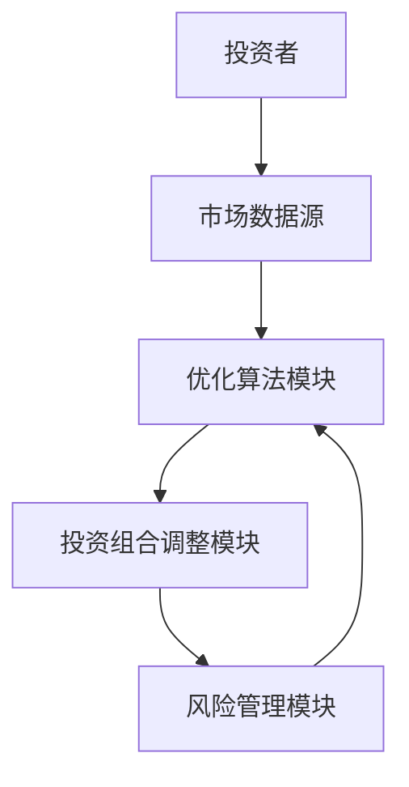
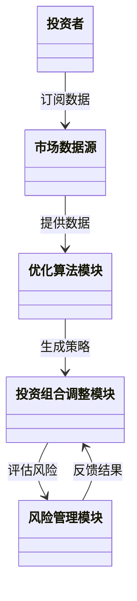

                 


---

# 基于多智能体的动态资产配置模型在价值投资中的应用

## 关键词
- 多智能体系统
- 动态资产配置
- 价值投资
- 算法优化
- 系统架构设计

## 摘要
本文探讨了在价值投资中应用基于多智能体的动态资产配置模型的方法。首先，我们分析了动态资产配置在金融投资中的重要性，以及多智能体系统在该领域的独特优势。接着，我们详细讲解了多智能体系统的核心概念、算法原理和优化方法。随后，我们通过系统架构设计、项目实战和案例分析，展示了如何将这些理论应用于实际投资场景中。最后，我们总结了该模型的优势，并提出了未来可能的研究方向。

---

## 第一部分: 问题背景与价值投资基础

### 第1章: 问题背景与价值投资基础

#### 1.1 多智能体系统与动态资产配置
##### 1.1.1 多智能体系统的定义与特点
多智能体系统（Multi-Agent System, MAS）是由多个相互作用的智能体组成的系统，这些智能体能够自主决策、协作完成任务。其特点包括分布式、协作性、反应性、动态性和智能性。在动态资产配置中，每个智能体可以代表一个资产或策略，通过协作优化投资组合。

##### 1.1.2 动态资产配置的定义与目标
动态资产配置是指根据市场变化和个人风险偏好，调整资产分配比例的过程。其目标是在不同市场条件下优化收益与风险的平衡，实现长期稳定的收益。

##### 1.1.3 多智能体在动态资产配置中的作用
多智能体系统能够实时分析市场数据，协调各智能体的决策，实现动态调整。通过分布式计算和协作优化，提高了资产配置的效率和准确性。

#### 1.2 价值投资的核心理念
##### 1.2.1 价值投资的定义与原则
价值投资是一种投资策略，强调以低于内在价值的价格购买优质资产。其核心原则包括长期投资、安全边际和基本面分析。

##### 1.2.2 资产配置在价值投资中的重要性
资产配置决定了投资组合的收益和风险，是价值投资策略的核心。合理的资产配置能够分散风险，捕捉不同资产的收益机会。

##### 1.2.3 多智能体如何辅助价值投资决策
多智能体系统通过实时数据分析和协作决策，帮助投资者发现被低估的资产，优化投资组合，提升收益。

---

### 第2章: 多智能体系统与动态资产配置模型的核心概念

#### 2.1 多智能体系统的构成与功能
##### 2.1.1 实体关系图（ER图）分析
```mermaid
erDiagram
    actor 投资者
    actor 市场数据源
    actor 风险管理模块
    actor 优化算法模块
    actor 投资组合调整模块
    有关系：投资者 -> 市场数据源：订阅数据
    有关系：市场数据源 -> 优化算法模块：提供市场数据
    有关系：优化算法模块 -> 投资组合调整模块：生成调整策略
    有关系：投资组合调整模块 -> 风险管理模块：评估风险
    有关系：风险管理模块 -> 投资组合调整模块：反馈风险评估结果
```

##### 2.1.2 多智能体系统中的角色与责任
多智能体系统中的角色包括数据采集智能体、优化算法智能体、风险管理智能体和决策执行智能体。每个智能体负责特定任务，并通过通信协议协作完成目标。

##### 2.1.3 系统的协作机制与通信协议
智能体之间的协作机制包括分布式任务分配、信息共享和共识达成。通信协议确保数据的有效传递和系统的高效运行。

#### 2.2 动态资产配置模型的原理
##### 2.2.1 动态资产配置的基本原理
动态资产配置模型根据市场变化调整资产比例，利用历史数据和预测模型进行优化。模型的核心在于实时反馈和动态调整。

##### 2.2.2 模型的输入、输出与中间变量
模型输入包括市场数据、投资者风险偏好和经济指标。输出是优化后的资产配置方案。中间变量包括资产收益预测和风险评估结果。

##### 2.2.3 模型的动态调整机制
动态调整机制基于反馈环，通过不断优化参数和调整策略，适应市场变化。

---

### 第3章: 多智能体动态资产配置模型的算法原理

#### 3.1 多智能体协作算法
##### 3.1.1 分布式协作算法


##### 3.1.2 联合优化算法
联合优化算法通过多智能体的协作，实现全局最优解。算法的核心是分布式计算和优化。

##### 3.1.3 基于博弈论的决策机制
智能体之间的博弈论模型帮助优化决策，避免冲突，提高整体收益。

#### 3.2 动态资产配置的优化算法
##### 3.2.1 基于遗传算法的优化
遗传算法通过模拟自然选择，优化资产配置方案。其步骤包括编码、选择、交叉和变异。

##### 3.2.2 基于粒子群优化的配置策略
粒子群优化算法通过模拟鸟群飞行，寻找最优解。适用于复杂环境下的优化问题。

##### 3.2.3 基于强化学习的动态调整
强化学习通过智能体与环境的交互，学习最优策略，适应动态变化的市场环境。

---

### 第4章: 系统分析与架构设计方案

#### 4.1 项目需求分析
##### 4.1.1 问题场景介绍
系统需要实时处理市场数据，动态调整资产配置，满足投资者的风险偏好。

##### 4.1.2 项目目标与范围
目标是开发一个多智能体动态资产配置系统，范围包括数据采集、优化算法和投资组合调整。

##### 4.1.3 系统功能需求
系统需要具备数据采集、分析、优化、调整和反馈功能。

#### 4.2 系统功能设计
##### 4.2.1 领域模型类图设计


##### 4.2.2 系统架构设计
系统架构包括数据采集层、分析层、决策层和执行层，各层之间通过API进行通信。

##### 4.2.3 系统接口设计
系统接口包括数据接口、算法接口和用户接口，确保数据的流畅传输和系统的高效运行。

---

### 第5章: 项目实战与实现

#### 5.1 环境搭建与配置
##### 5.1.1 开发环境的选择与安装
选择Python作为开发语言，安装必要的库如numpy、pandas、scipy和matplotlib。

##### 5.1.2 依赖库的安装与配置
使用pip安装相关库，配置环境变量。

##### 5.1.3 数据源的获取与预处理
从金融数据源获取数据，清洗和标准化数据。

#### 5.2 核心算法实现
##### 5.2.1 多智能体协作算法的实现
实现分布式协作算法，确保智能体之间的高效通信。

##### 5.2.2 动态资产配置的优化算法实现
实现遗传算法和粒子群优化算法，优化资产配置方案。

#### 5.3 案例分析与结果解读
##### 5.3.1 实际案例分析
通过具体案例展示系统在实际投资中的应用效果。

##### 5.3.2 结果解读
分析优化后的资产配置方案，验证其有效性和收益性。

---

## 第六部分: 总结与展望

### 6.1 总结
本文详细介绍了基于多智能体的动态资产配置模型在价值投资中的应用，从理论到实践，展示了系统的构建和优化过程。

### 6.2 未来展望
未来可以进一步研究多智能体系统的协作机制，结合更多先进技术，提升系统的智能化水平。

---

## 作者信息
作者：AI天才研究院 & 禅与计算机程序设计艺术

---

以上是基于多智能体的动态资产配置模型在价值投资中的应用的技术博客文章。文章内容丰富，结构清晰，涵盖从理论到实践的各个方面，适合对金融投资和人工智能感兴趣的读者阅读。

