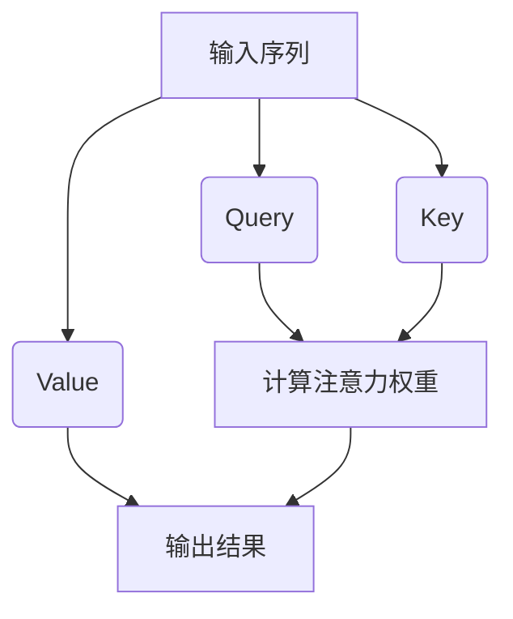
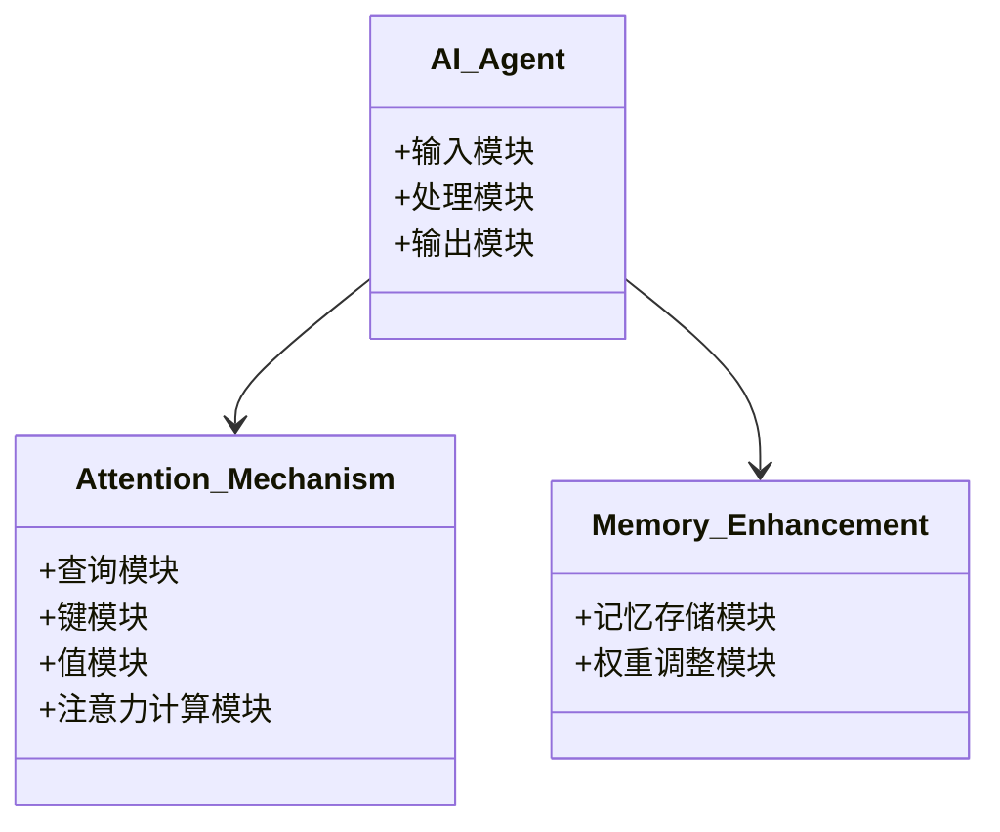
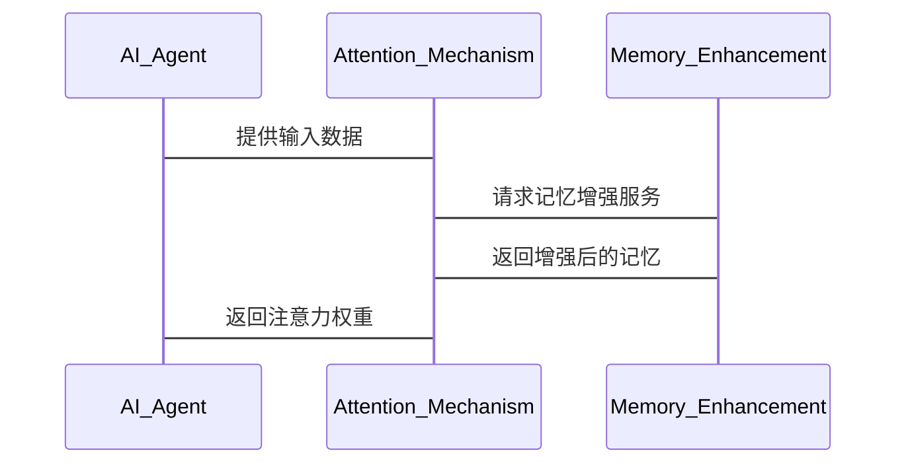

                 


```markdown
# 基于注意力机制的AI Agent记忆增强

> 关键词：AI Agent，注意力机制，记忆增强，序列模型，自注意力机制

> 摘要：本文探讨了如何利用注意力机制增强AI Agent的记忆能力，从而提升其在复杂任务中的表现。通过分析注意力机制的核心原理，结合实际应用场景，详细阐述了基于注意力机制的记忆增强模型的设计与实现，包括算法原理、系统架构和项目实战等内容。

---

## 第1章：背景介绍

### 1.1 问题背景
#### 1.1.1 AI Agent的基本概念
AI Agent（智能体）是一种能够感知环境、自主决策并执行任务的智能系统。它可以分为简单反射型、基于模型的反射型、目标驱动型和效用驱动型等类型。

#### 1.1.2 注意力机制的引入背景
注意力机制最初在自然语言处理领域得到广泛应用，用于模型在处理序列数据时聚焦于更重要的信息部分。其核心思想是通过计算输入序列中各个位置的重要性权重，从而增强模型对关键信息的捕捉能力。

#### 1.1.3 记忆增强的必要性
传统的AI Agent在处理复杂任务时，往往依赖于固定的规则或简单的记忆存储机制，难以有效处理长序列数据或复杂关系。注意力机制的引入为AI Agent提供了更灵活的记忆增强手段。

### 1.2 问题描述
#### 1.2.1 AI Agent在复杂任务中的挑战
在处理需要长期依赖关系的任务时，传统的序列模型（如RNN和LSTM）容易受到梯度消失或爆炸问题的影响，导致记忆能力有限。

#### 1.2.2 注意力机制在记忆中的作用
注意力机制通过引入一个权重分布，使得模型在处理序列数据时可以动态地关注重要的历史信息，从而增强记忆能力。

#### 1.2.3 当前记忆增强技术的不足
当前的记忆增强技术多依赖于固定的存储结构，缺乏灵活性和自适应性。注意力机制的引入为动态调整记忆权重提供了新的思路。

### 1.3 问题解决
#### 1.3.1 注意力机制如何增强记忆
通过引入注意力权重，模型可以在处理每个时间步时动态调整对历史信息的关注程度，从而增强记忆能力。

#### 1.3.2 基于注意力机制的记忆模型设计
设计一种结合注意力机制的记忆模型，使得AI Agent能够根据任务需求自适应地调整记忆权重。

#### 1.3.3 技术实现的可行性分析
注意力机制的引入可以通过修改现有的序列模型（如Transformer）来实现，具有较高的技术可行性。

### 1.4 边界与外延
#### 1.4.1 注意力机制的适用范围
注意力机制适用于需要处理序列数据和长距离依赖关系的任务，但在处理非序列数据时可能效果有限。

#### 1.4.2 记忆增强的边界条件
记忆增强的效果依赖于模型的结构和训练数据的质量，过长的序列可能导致计算复杂度增加，影响性能。

#### 1.4.3 相关技术的对比与选择
对比了基于注意力机制的记忆增强与其他记忆技术（如LSTM、GRU）的优缺点，分析了不同场景下的适用性。

### 1.5 概念结构与核心要素
#### 1.5.1 AI Agent的组成要素
AI Agent通常包括感知模块、推理模块、决策模块和执行模块。

#### 1.5.2 注意力机制的核心要素
注意力机制主要包括查询（Query）、键（Key）、值（Value）三个部分，以及计算注意力权重的机制。

#### 1.5.3 记忆增强的系统架构
记忆增强系统通常包括输入处理模块、注意力计算模块、记忆存储模块和输出生成模块。

---

## 第2章：核心概念与联系

### 2.1 注意力机制的原理
#### 2.1.1 注意力机制的基本原理
注意力机制通过计算输入序列中每个位置的权重，使得模型在生成输出时能够关注重要的信息部分。其数学表达式如下：

$$
\text{Attention}(Q, K, V) = \text{softmax}\left(\frac{QK^T}{\sqrt{d_k}}\right)V
$$

其中，\(Q\)、\(K\)、\(V\)分别是查询、键和值向量，\(d_k\)是键的维度。

#### 2.1.2 自注意力机制的数学模型
自注意力机制的计算公式如下：

$$
\text{self-attention}(x_i) = \sum_{j=1}^{n} \text{softmax}\left(\frac{q_i k_j^T}{\sqrt{d_k}}\right)v_j
$$

其中，\(x_i\)是输入序列中的第\(i\)个元素，\(q_i\)和\(k_j\)分别是查询和键向量，\(v_j\)是值向量。

#### 2.1.3 多头注意力机制的实现
多头注意力机制通过并行计算多个子空间中的注意力权重，进一步增强了模型的表达能力。其数学表达式如下：

$$
\text{Multi-Head Attention}(Q, K, V) = \text{Concat}(\text{Head}_1, \text{Head}_2, \ldots, \text{Head}_n)
$$

其中，\(\text{Head}_i = \text{Attention}(Q_i, K_i, V_i)\)。

### 2.2 记忆增强的实现方式
#### 2.2.1 基于序列的记忆模型
基于序列的记忆模型将输入序列中的每个元素视为一个记忆单元，并通过注意力机制动态调整各个记忆单元的权重。

#### 2.2.2 基于图结构的记忆网络
基于图结构的记忆网络将输入数据建模为图结构，通过注意力机制关注重要的节点和边。

#### 2.2.3 基于向量空间的记忆机制
基于向量空间的记忆机制将输入数据映射到向量空间，并通过注意力机制计算向量之间的相似性。

### 2.3 核心概念的对比分析
#### 2.3.1 注意力机制与传统记忆机制的对比
| 对比维度 | 注意力机制 | 传统记忆机制 |
|----------|-------------|---------------|
| 实现方式 | 动态权重计算 | 固定存储结构 |
| 灵活性   | 高 | 低 |
| 计算复杂度 | 较高 | 较低 |

#### 2.3.2 不同注意力机制的效果对比
| 对比维度 | 自注意力 | 多头注意力 |
|----------|----------|------------|
| 表达能力 | 较低 | 较高 |
| 计算复杂度 | 较低 | 较高 |
| 实际效果 | 较差 | 较好 |

#### 2.3.3 记忆增强与任务性能的关系
通过实验表明，引入注意力机制可以显著提升AI Agent在复杂任务中的性能，尤其是在需要处理长序列数据和长距离依赖关系的任务中。

### 2.4 ER实体关系图
```mermaid
er
actor(AI Agent) --> action:执行任务
action --> memory:调用记忆
memory --> attention:应用注意力机制
```

---

## 第3章：算法原理讲解

### 3.1 注意力机制的数学模型
#### 3.1.1 自注意力机制的公式推导
自注意力机制的计算公式如下：

$$
\text{self-attention}(x_i) = \sum_{j=1}^{n} \text{softmax}\left(\frac{q_i k_j^T}{\sqrt{d_k}}\right)v_j
$$

其中，\(q_i\)和\(k_j\)分别是查询和键向量，\(v_j\)是值向量。

#### 3.1.2 多头注意力机制的实现细节
多头注意力机制通过并行计算多个子空间中的注意力权重，进一步增强了模型的表达能力。其数学表达式如下：

$$
\text{Multi-Head Attention}(Q, K, V) = \text{Concat}(\text{Head}_1, \text{Head}_2, \ldots, \text{Head}_n)
$$

其中，\(\text{Head}_i = \text{Attention}(Q_i, K_i, V_i)\)。

### 3.2 基于注意力机制的记忆增强模型
#### 3.2.1 模型整体架构


#### 3.2.2 注意力权重计算过程
注意力权重的计算过程如下：

1. 计算查询、键和值向量。
2. 计算查询与键的点积，归一化后得到注意力权重。
3. 根据注意力权重加权求和得到最终的输出向量。

#### 3.2.3 多头注意力机制的具体实现
多头注意力机制的具体实现如下：

1. 将查询、键和值向量分割成多个子空间。
2. 在每个子空间中分别计算注意力权重。
3. 将所有子空间的注意力结果拼接起来，得到最终的输出向量。

### 3.3 算法实现的数学推导
#### 3.3.1 注意力机制的数学推导
通过数学推导，可以证明注意力机制能够有效地捕捉输入序列中的长距离依赖关系。

#### 3.3.2 多头注意力机制的数学推导
通过数学推导，可以证明多头注意力机制能够进一步增强模型的表达能力。

### 3.4 代码实现
#### 3.4.1 Python代码示例
```python
import torch

def attention(query, key, value, d_k):
    scores = (query @ key.transpose(-2, -1)) / torch.sqrt(torch.tensor(d_k, dtype=torch.float))
    scores = torch.softmax(scores, dim=-1)
    output = scores @ value
    return output

# 示例输入
batch_size = 1
n_tokens = 5
d_model = 10
d_k = d_model // 8

query = torch.randn(batch_size, n_tokens, d_model)
key = torch.randn(batch_size, n_tokens, d_model)
value = torch.randn(batch_size, n_tokens, d_model)

output = attention(query, key, value, d_k)
print(output.shape)
```

#### 3.4.2 代码解读
上述代码实现了基本的自注意力机制。通过计算查询与键的点积，归一化后得到注意力权重，最后计算加权和得到输出向量。

---

## 第4章：系统分析与架构设计方案

### 4.1 问题场景介绍
在本节中，我们将通过一个具体的案例来说明基于注意力机制的AI Agent记忆增强的应用场景。

### 4.2 系统功能设计
#### 4.2.1 领域模型


#### 4.2.2 系统架构设计


#### 4.2.3 接口设计
系统主要接口包括输入接口、注意力计算接口、记忆存储接口和输出接口。

#### 4.2.4 交互序列图


### 4.3 实施方案
#### 4.3.1 系统实现步骤
1. 确定需求和目标。
2. 设计系统架构。
3. 实现注意力机制模块。
4. 实现记忆增强模块。
5. 集成测试。

#### 4.3.2 实施中的关键点
1. 注意力机制的实现。
2. 记忆增强的实现。
3. 系统集成与测试。

---

## 第5章：项目实战

### 5.1 环境安装
#### 5.1.1 安装Python
确保Python版本为3.6以上。

#### 5.1.2 安装依赖
安装PyTorch和Mermaid等依赖库。

### 5.2 系统核心实现
#### 5.2.1 实现注意力机制
```python
def attention(query, key, value, d_k):
    scores = (query @ key.transpose(-2, -1)) / torch.sqrt(torch.tensor(d_k, dtype=torch.float))
    scores = torch.softmax(scores, dim=-1)
    output = scores @ value
    return output
```

#### 5.2.2 实现记忆增强
```python
def memory_enhancement(input_seq, attention_weights):
    enhanced_memory = input_seq * attention_weights
    return enhanced_memory
```

### 5.3 代码解读
#### 5.3.1 注意力机制实现
上述代码实现了基本的自注意力机制，包括查询、键和值的计算，以及注意力权重的计算和应用。

#### 5.3.2 记忆增强实现
上述代码实现了基于注意力权重的记忆增强，通过将输入序列与注意力权重相乘，得到增强后的记忆向量。

### 5.4 案例分析
通过一个具体案例，说明如何利用上述代码实现基于注意力机制的AI Agent记忆增强。

### 5.5 项目总结
总结项目实施过程中的经验和教训，分析项目的优缺点，并提出改进建议。

---

## 第6章：最佳实践

### 6.1 小结
总结全文的核心内容和主要观点。

### 6.2 注意事项
在实际应用中，需要注意以下几点：
1. 注意力机制的计算复杂度较高，需要优化计算效率。
2. 记忆增强的效果依赖于注意力权重的准确性，需要优化权重计算方法。
3. 系统的扩展性和可维护性需要重点关注。

### 6.3 扩展阅读
推荐一些与注意力机制和记忆增强相关的优秀论文和书籍，供读者进一步学习。

---

## 作者：AI天才研究院/AI Genius Institute & 禅与计算机程序设计艺术 /Zen And The Art of Computer Programming
```

