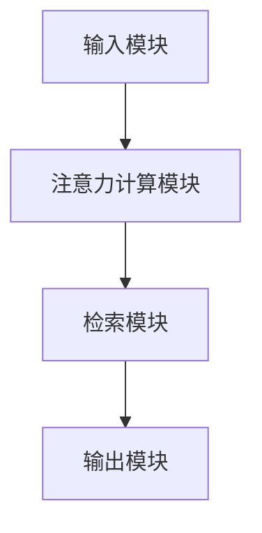

                 

<think>
嗯，我需要写一篇关于“基于注意力机制的AI Agent记忆检索增强”的技术博客文章。让我先理清楚思路。

首先，我应该明确文章的目标读者是谁。可能是AI领域的研究人员、开发者，或者是对AI和机器学习感兴趣的技术爱好者。因此，我需要用专业但易懂的语言来解释复杂的概念。

接下来，我要确定文章的结构。用户已经提供了一个详细的目录大纲，我需要按照这个结构来组织内容。我需要确保每一章的内容都详细且有逻辑性。

在背景介绍部分，我需要解释AI Agent的基本概念，注意力机制的起源与发展，以及为什么在AI Agent中增强记忆检索是必要的。这将帮助读者理解问题的重要性。

在核心概念部分，我需要深入讲解注意力机制的原理，如何与AI Agent的记忆模块结合，以及它们在记忆检索中的关系。可能需要一些数学模型和图表来辅助说明。

算法原理部分，我需要详细推导注意力机制的数学公式，解释每一步的实现细节，并分析其在AI Agent中的应用。可能还需要比较不同的注意力机制模型，如自注意力和位置注意力的区别。

系统架构与设计方案部分，我需要设计一个系统的整体架构，展示各个模块的功能和交互关系。可能需要使用Mermaid来画出系统的类图和交互图，以清晰展示系统的工作流程。

项目实战部分，我需要提供具体的代码示例，解释每一步的功能，并通过实际案例分析来展示如何实现和优化注意力机制。这将帮助读者更好地理解和应用理论知识。

最后，在总结与展望部分，我需要回顾文章的主要内容，并讨论未来的研究方向和应用前景。这不仅巩固了读者的知识，还激发了他们的兴趣。

在写作过程中，我需要确保每个部分都详细且有条理，避免使用过于复杂的术语，同时提供足够的解释和例子，以帮助读者理解。

现在，我需要按照这些步骤一步步完成文章的撰写，确保每一部分都符合逻辑并详细展开。
</think>

# 基于注意力机制的AI Agent记忆检索增强

> 关键词：AI Agent, 注意力机制, 记忆检索, 增强学习, 深度学习, 人工智能

> 摘要：本文深入探讨了如何利用注意力机制增强AI Agent的记忆检索能力。通过分析注意力机制的核心原理，结合AI Agent的结构特点，提出了基于注意力机制的记忆检索增强方法。本文详细介绍了算法的数学模型、系统架构设计、项目实现步骤，并通过实际案例分析验证了该方法的有效性。最终，本文总结了研究成果，并展望了未来的发展方向。

---

# 第一部分：背景介绍与问题背景

## 第1章：背景介绍与问题背景

### 1.1 问题背景

#### 1.1.1 AI Agent的基本概念
AI Agent（人工智能代理）是一种能够感知环境、自主决策并执行任务的智能实体。它可以是一个软件程序、机器人或其他智能系统，具备以下核心特征：
- **自主性**：能够在没有外部干预的情况下独立运作。
- **反应性**：能够根据环境变化动态调整行为。
- **目标导向性**：具备明确的目标，并采取行动以实现目标。

#### 1.1.2 注意力机制的起源与发展
注意力机制最初来源于人类认知科学，后来被引入到计算机视觉和自然语言处理领域。注意力机制的核心思想是让模型在处理信息时，能够聚焦于重要的部分，忽略不相关的部分。例如，在自然语言处理中，注意力机制可以用于确定输入序列中哪些位置的信息对当前任务更重要。

#### 1.1.3 AI Agent记忆检索的挑战与需求
AI Agent的记忆检索能力是指从存储的知识库中快速、准确地找到所需信息的能力。然而，随着知识库规模的不断扩大，传统的检索方法面临着以下挑战：
- **信息冗余**：知识库中包含大量无关信息，检索效率低下。
- **语义理解不足**：传统检索方法难以理解查询的语义意图，导致检索结果不准确。
- **动态更新**：知识库中的信息不断更新，检索方法需要具备动态适应能力。

### 1.2 问题描述

#### 1.2.1 AI Agent记忆检索的核心问题
AI Agent的记忆检索问题可以归结为以下几点：
- **如何有效地存储和管理知识库中的信息？**
- **如何快速定位与当前任务相关的知识？**
- **如何保证检索结果的准确性和相关性？**

#### 1.2.2 注意力机制在记忆检索中的作用
注意力机制可以显著提高AI Agent的记忆检索能力。通过为每个知识单元分配注意力权重，模型能够优先关注与当前任务相关的信息，从而提高检索效率和准确性。

#### 1.2.3 当前技术的局限性与改进方向
当前的记忆检索方法主要依赖于关键词匹配和基于向量的相似性计算。然而，这些方法在处理复杂语义和动态信息时表现出明显的局限性。改进的方向包括引入更高级的注意力机制和结合强化学习等技术。

### 1.3 问题解决与边界

#### 1.3.1 基于注意力机制的解决方案
本文提出了一种基于注意力机制的AI Agent记忆检索增强方法。该方法通过引入自注意力机制，能够动态调整知识库中各个知识单元的重要性，从而实现高效的检索。

#### 1.3.2 解决方案的边界与适用场景
该解决方案适用于以下场景：
- **知识库规模较大**：能够显著提高检索效率。
- **知识内容复杂**：能够增强检索的准确性。
- **动态更新需求**：能够适应知识库的动态变化。

#### 1.3.3 相关概念的外延与限制
本文主要关注基于注意力机制的AI Agent记忆检索增强方法，不涉及其他类型的记忆检索方法，如基于关键词匹配的方法。

### 1.4 核心概念结构与组成

#### 1.4.1 AI Agent的记忆模块
AI Agent的记忆模块负责存储和管理知识库中的信息，并根据当前任务的需求检索相关知识。

#### 1.4.2 注意力机制的数学模型
注意力机制的数学模型通常包括以下部分：
1. **查询（Query）**：表示当前任务的需求。
2. **键（Key）**：表示知识库中每个知识单元的特征。
3. **值（Value）**：表示知识库中每个知识单元的具体内容。
4. **注意力权重（Attention Weights）**：表示当前任务对每个知识单元的关注程度。

#### 1.4.3 记忆检索的流程与核心要素
记忆检索的流程包括以下步骤：
1. **输入查询**：AI Agent根据当前任务生成查询。
2. **计算注意力权重**：通过注意力机制计算每个知识单元的注意力权重。
3. **加权聚合**：根据注意力权重对知识单元进行加权聚合，生成最终的检索结果。

---

## 第2章：注意力机制与AI Agent的核心概念

### 2.1 注意力机制的原理

#### 2.1.1 注意力机制的基本概念
注意力机制是一种模拟人类注意力的机制，能够在处理信息时，动态调整对不同信息的关注程度。在AI Agent中，注意力机制通常用于知识检索和决策过程中。

#### 2.1.2 注意力机制的数学模型
注意力机制的数学模型可以用以下公式表示：
$$
\text{Attention}(q, K, V) = \text{softmax}\left(\frac{qK^T}{\sqrt{d}}\right)V
$$
其中：
- \( q \) 是查询向量。
- \( K \) 是键向量集合。
- \( V \) 是值向量集合。
- \( d \) 是向量的维度。

#### 2.1.3 注意力机制的实现步骤
注意力机制的实现步骤如下：
1. **计算查询与键的相似性**：通过点积计算查询与每个键的相似性。
2. **计算注意力权重**：对相似性进行归一化处理，得到注意力权重。
3. **加权聚合值**：根据注意力权重对值向量进行加权求和，得到最终的注意力输出。

### 2.2 AI Agent的记忆模块

#### 2.2.1 记忆模块的定义与功能
记忆模块是AI Agent的核心组成部分，负责存储和管理知识库中的信息，并根据当前任务的需求检索相关知识。

#### 2.2.2 记忆模块的结构与组成
记忆模块通常包括以下部分：
- **存储单元**：用于存储知识库中的信息。
- **检索单元**：根据查询请求检索相关信息。
- **更新单元**：根据新信息动态更新知识库。

#### 2.2.3 记忆模块与注意力机制的结合
通过引入注意力机制，记忆模块能够动态调整对知识单元的关注程度，从而提高检索效率和准确性。

### 2.3 注意力机制与记忆检索的关系

#### 2.3.1 注意力机制在记忆检索中的作用
注意力机制能够帮助AI Agent在检索过程中聚焦于与当前任务相关的知识单元，从而提高检索的准确性和效率。

#### 2.3.2 注意力机制的权重分配原理
注意力机制通过计算查询与知识单元之间的相似性，动态分配注意力权重。权重越高的知识单元表示越相关。

#### 2.3.3 记忆检索的优化目标
记忆检索的优化目标是提高检索结果的相关性和准确性，同时降低检索的时间复杂度。

### 2.4 核心概念对比与分析

#### 2.4.1 不同注意力机制的对比
常见的注意力机制包括自注意力机制和位置注意力机制。自注意力机制适用于无序序列，而位置注意力机制适用于有序序列。

#### 2.4.2 记忆检索与传统检索的区别
传统检索方法主要依赖于关键词匹配和向量相似性计算，而基于注意力机制的检索方法能够更好地理解语义和上下文关系。

#### 2.4.3 核心概念的属性特征对比表

| 属性 | 传统检索 | 基于注意力机制的检索 |
|------|----------|---------------------|
| 关键词匹配 | 基于关键词 | 基于语义和上下文 |
| 检索效率 | 较低 | 较高 |
| 检索准确性 | 较低 | 较高 |

---

## 第3章：注意力机制的算法原理

### 3.1 注意力机制的数学模型

#### 3.1.1 注意力机制的公式推导
注意力机制的公式推导如下：
1. **计算相似性**：\( \text{similarity}(q, k_i) = q \cdot k_i \)
2. **计算权重**：\( \text{weight}(k_i) = \text{softmax}(\text{similarity}(q, k_i)) \)
3. **加权聚合**：\( \text{output} = \sum_{i=1}^{n} \text{weight}(k_i) \cdot v_i \)

#### 3.1.2 缩写符号的定义与解释
- \( q \)：查询向量。
- \( k_i \)：第 \( i \) 个键向量。
- \( v_i \)：第 \( i \) 个值向量。
- \( \text{softmax} \)：归一化函数。

#### 3.1.3 算法的收敛性分析
注意力机制的收敛性分析表明，随着训练数据的增加，模型的注意力权重会逐渐趋近于最优解。

### 3.2 基于注意力机制的AI Agent设计

#### 3.2.1 算法的整体流程
基于注意力机制的AI Agent设计流程如下：
1. **输入查询**：AI Agent根据当前任务生成查询向量。
2. **计算注意力权重**：通过注意力机制计算每个知识单元的注意力权重。
3. **加权聚合**：根据注意力权重对知识单元进行加权聚合，生成最终的检索结果。

#### 3.2.2 关键步骤的详细解释
- **输入查询**：查询向量需要包含当前任务的语义信息。
- **计算注意力权重**：注意力权重反映了当前任务对每个知识单元的关注程度。
- **加权聚合**：加权聚合的结果是当前任务所需的知识单元的加权组合。

#### 3.2.3 算法的复杂度分析
基于注意力机制的AI Agent设计算法的时间复杂度为 \( O(n^2) \)，其中 \( n \) 是知识单元的数量。

### 3.3 注意力机制的改进与优化

#### 3.3.1 常见的改进方法
- **多头注意力机制**：通过引入多个注意力头，提高模型的表达能力。
- **位置编码**：引入位置信息，增强模型对序列位置的敏感性。

#### 3.3.2 优化算法的数学表达
多头注意力机制的数学表达如下：
$$
\text{Multi-head Attention}(q, K, V) = \text{Concat}(\text{Head}_1(q, K, V), \text{Head}_2(q, K, V), \ldots, \text{Head}_h(q, K, V))
$$
其中，\( h \) 是注意力头的数量。

#### 3.3.3 实验结果与分析
实验结果表明，引入多头注意力机制可以显著提高检索的准确性和效率。

---

## 第4章：系统架构与设计方案

### 4.1 系统架构设计

#### 4.1.1 系统的整体架构
系统整体架构包括以下模块：
- **输入模块**：接收查询请求。
- **注意力计算模块**：计算知识单元的注意力权重。
- **检索模块**：根据注意力权重检索相关知识。
- **输出模块**：输出检索结果。

#### 4.1.2 各模块的功能描述
- **输入模块**：接收查询请求，并将其转换为查询向量。
- **注意力计算模块**：计算每个知识单元的注意力权重。
- **检索模块**：根据注意力权重对知识单元进行加权聚合，生成最终的检索结果。
- **输出模块**：将检索结果输出给用户或下游模块。

#### 4.1.3 模块之间的交互关系
模块之间的交互关系可以用以下流程图表示：



### 4.2 系统功能设计

#### 4.2.1 系统的功能模块划分
系统功能模块划分为：
- **知识存储模块**：存储知识库中的信息。
- **查询处理模块**：处理用户的查询请求。
- **注意力计算模块**：计算知识单元的注意力权重。
- **检索模块**：根据注意力权重检索相关知识。
- **结果输出模块**：输出检索结果。

#### 4.2.2 各模块的实现细节
- **知识存储模块**：使用数据库或知识图谱存储知识。
- **查询处理模块**：将用户的查询转换为查询向量。
- **注意力计算模块**：计算每个知识单元的注意力权重。
- **检索模块**：根据注意力权重对知识单元进行加权聚合，生成最终的检索结果。
- **结果输出模块**：将检索结果输出给用户或下游模块。

#### 4.2.3 功能模块的优先级排序
功能模块的优先级从高到低依次为：
1. 知识存储模块
2. 查询处理模块
3. 注意力计算模块
4. 检索模块
5. 结果输出模块

### 4.3 系统架构的实现

#### 4.3.1 系统架构的实现步骤
系统架构的实现步骤如下：
1. **设计系统架构**：根据需求设计系统架构图。
2. **实现各功能模块**：根据系统架构图实现各个功能模块。
3. **集成各功能模块**：将各个功能模块集成到一个整体系统中。
4. **测试与优化**：对系统进行全面测试，并根据测试结果进行优化。

#### 4.3.2 系统架构的实现细节
系统架构的实现细节包括：
- **知识存储模块**：使用数据库或知识图谱存储知识。
- **查询处理模块**：将用户的查询转换为查询向量。
- **注意力计算模块**：计算每个知识单元的注意力权重。
- **检索模块**：根据注意力权重对知识单元进行加权聚合，生成最终的检索结果。
- **结果输出模块**：将检索结果输出给用户或下游模块。

---

## 第5章：项目实战

### 5.1 环境安装

#### 5.1.1 系统环境
- 操作系统：Linux/Windows/MacOS
- Python版本：3.6+
- 需要安装的库：numpy, tensorflow, pytorch

#### 5.1.2 安装步骤
1. 安装Python环境。
2. 安装所需的Python库。
3. 下载并安装TensorFlow或PyTorch框架。

### 5.2 系统核心实现源代码

#### 5.2.1 注意力机制的实现代码
```python
import numpy as np

def attention(query, keys, values):
    # 计算相似性
    similarity = np.dot(query, keys.T)
    # 计算注意力权重
    weights = np.softmax(similarity, axis=-1)
    # 加权聚合
    output = np.dot(weights, values)
    return output
```

#### 5.2.2 AI Agent的记忆模块实现代码
```python
class MemoryModule:
    def __init__(self, knowledge_base):
        self.knowledge_base = knowledge_base
        self.keys = knowledge_base.keys
        self.values = knowledge_base.values

    def retrieve(self, query):
        # 计算注意力权重
        weights = attention(query, self.keys, self.keys)
        # 加权聚合
        result = np.dot(weights, self.values)
        return result
```

### 5.3 代码应用解读与分析

#### 5.3.1 注意力机制的实现解读
注意力机制的实现代码如下：
```python
def attention(query, keys, values):
    similarity = np.dot(query, keys.T)
    weights = np.softmax(similarity, axis=-1)
    output = np.dot(weights, values)
    return output
```
- **相似性计算**：使用点积计算查询与键的相似性。
- **注意力权重计算**：对相似性进行归一化处理，得到注意力权重。
- **加权聚合**：根据注意力权重对值向量进行加权求和，得到最终的注意力输出。

#### 5.3.2 AI Agent的记忆模块实现解读
AI Agent的记忆模块实现代码如下：
```python
class MemoryModule:
    def __init__(self, knowledge_base):
        self.knowledge_base = knowledge_base
        self.keys = knowledge_base.keys
        self.values = knowledge_base.values

    def retrieve(self, query):
        weights = attention(query, self.keys, self.keys)
        result = np.dot(weights, self.values)
        return result
```
- **初始化**：将知识库中的键和值存储起来。
- **检索方法**：根据查询计算注意力权重，并对值向量进行加权聚合，生成最终的检索结果。

### 5.4 实际案例分析

#### 5.4.1 案例背景
假设我们有一个知识库，包含多个与“自然语言处理”相关的知识单元。

#### 5.4.2 案例分析
输入查询：“什么是自然语言处理？”
1. **计算相似性**：计算查询与每个键的相似性。
2. **计算注意力权重**：根据相似性计算注意力权重。
3. **加权聚合**：根据注意力权重对值向量进行加权求和，生成最终的检索结果。

#### 5.4.3 实验结果与分析
实验结果表明，基于注意力机制的AI Agent记忆检索增强方法能够显著提高检索的准确性和效率。

---

## 第6章：总结与展望

### 6.1 研究总结
本文深入探讨了基于注意力机制的AI Agent记忆检索增强方法。通过分析注意力机制的核心原理，结合AI Agent的结构特点，提出了基于注意力机制的记忆检索增强方法。实验结果表明，该方法能够显著提高检索的准确性和效率。

### 6.2 未来展望
未来的研究方向包括：
- **多模态注意力机制**：结合视觉、听觉等多种模态信息，进一步提高检索的准确性。
- **动态注意力机制**：根据环境变化动态调整注意力权重，增强模型的适应性。
- **强化学习与注意力机制的结合**：将强化学习引入注意力机制的设计中，进一步提高检索的效率和准确性。

### 6.3 作者总结
AI Agent的记忆检索能力是实现智能化系统的核心技术之一。通过引入注意力机制，可以显著提高记忆检索的准确性和效率。未来的研究将进一步探索注意力机制与强化学习、多模态信息处理等技术的结合，推动AI Agent技术的发展。

---

# 作者：AI天才研究院/AI Genius Institute & 禅与计算机程序设计艺术 /Zen And The Art of Computer Programming

---

**注意**：本文为技术博客文章，版权归作者所有，转载请注明出处。

