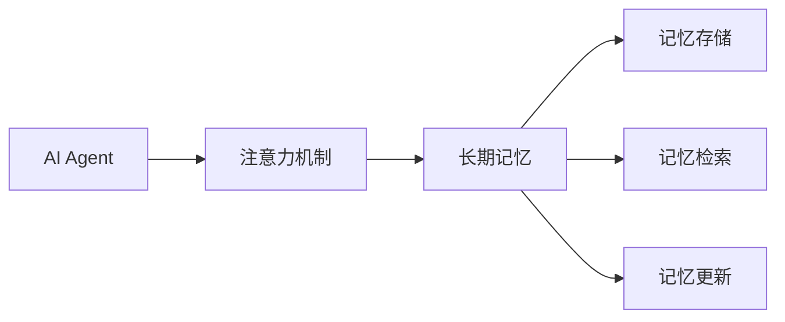
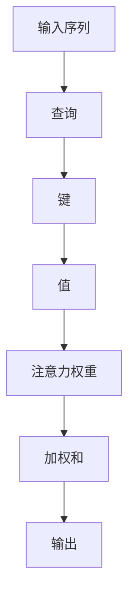
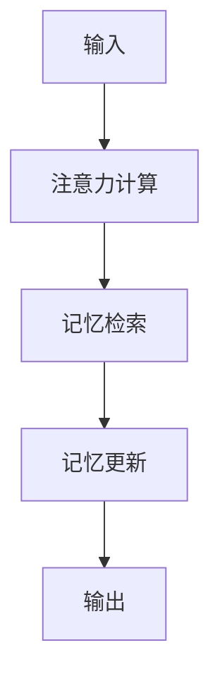

                 


# 基于注意力机制的AI Agent长期记忆管理

> 关键词：AI Agent，注意力机制，长期记忆，记忆管理，深度学习

> 摘要：本文探讨了在AI Agent中应用注意力机制进行长期记忆管理的关键技术。通过分析注意力机制的基本原理，结合长期记忆管理的需求，提出了基于注意力机制的记忆管理方法，并详细阐述了其实现方案。

---

## 第一部分: 背景介绍

### 第1章: 问题背景与描述

#### 1.1 问题背景
在AI Agent的设计中，长期记忆管理是一个核心挑战。Agent需要处理复杂任务，需要存储和检索大量信息。传统的记忆管理方法存在信息检索效率低、存储空间占用大、难以动态更新等问题。

#### 1.2 问题描述
AI Agent的长期记忆管理需要解决以下问题：
- 如何高效存储和检索信息？
- 如何处理信息的时间依赖性？
- 如何动态更新记忆内容？

#### 1.3 问题解决思路
注意力机制在自然语言处理中表现出色，可以借鉴到记忆管理中。通过关注重要的记忆片段，提高信息检索效率和准确性。

---

## 第2章: 核心概念与联系

### 2.1 注意力机制的原理
注意力机制通过计算输入序列中各个位置的重要性权重，选择性关注关键信息。在长期记忆管理中，注意力机制用于确定哪些记忆片段对当前任务更重要。

### 2.2 长期记忆管理的核心要素
长期记忆管理需要考虑记忆存储、检索和更新。通过注意力机制，可以动态调整记忆的权重，优化记忆管理的效率。

### 2.3 核心概念属性对比
| 概念 | 描述 |
|------|------|
| 注意力机制 | 基于输入序列的权重计算，选择性关注重要信息 |
| 长期记忆管理 | 管理和检索长期记忆片段 |

---

## 第3章: 实体关系与架构

### 3.1 实体关系图


### 3.2 注意力机制流程图


---

## 第4章: 算法原理

### 4.1 注意力机制的数学模型
注意力机制的核心公式：
$$
\text{Attention}(Q, K, V) = \text{softmax}\left(\frac{QK^T}{\sqrt{d_k}}\right)V
$$
其中，$Q$ 是查询，$K$ 是键，$V$ 是值，$d_k$ 是键的维度。

### 4.2 基于注意力机制的记忆管理实现
```python
def attention(Q, K, V):
    dk = K.shape[-1]
    scores = (Q @ K.T) / np.sqrt(dk)
    weights = softmax(scores)
    output = weights @ V
    return output

def softmax(x):
    return np.exp(x) / np.sum(np.exp(x), axis=1, keepdims=True)
```

---

## 第5章: 系统分析与架构设计

### 5.1 系统功能设计
系统需要实现记忆存储、检索和更新功能。通过注意力机制，优化记忆管理的效率。

### 5.2 系统架构图


---

## 第6章: 项目实战

### 6.1 环境安装
安装Python和相关库，如numpy和tensorflow。

### 6.2 核心代码实现
```python
class MemoryManager:
    def __init__(self, max_size):
        self.max_size = max_size
        self.memories = []
    
    def store(self, memory):
        if len(self.memories) < self.max_size:
            self.memories.append(memory)
    
    def retrieve(self, query):
        # 使用注意力机制计算权重
        Q = query
        K = [m['key'] for m in self.memories]
        V = [m['value'] for m in self.memories]
        
        # 计算注意力权重
        scores = (Q @ np.array(K).T) / np.sqrt(len(K[0]))
        weights = softmax(scores)
        
        # 加权和
        output = weights @ np.array(V)
        return output
```

---

## 第7章: 最佳实践

### 7.1 总结
注意力机制在AI Agent的长期记忆管理中具有重要应用价值，可以显著提高信息处理效率。

### 7.2 注意事项
- 注意力机制的计算复杂度较高，需优化实现。
- 需根据具体任务调整注意力机制的参数。

### 7.3 拓展阅读
建议进一步研究多模态注意力机制和强化学习中的记忆管理。

---

## 作者

作者：AI天才研究院/AI Genius Institute & 禅与计算机程序设计艺术 /Zen And The Art of Computer Programming

---

