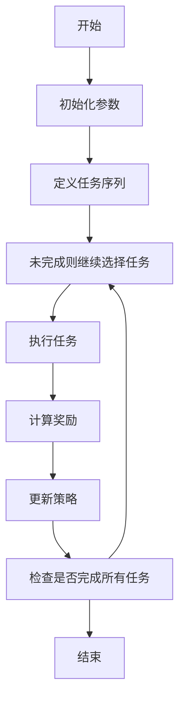
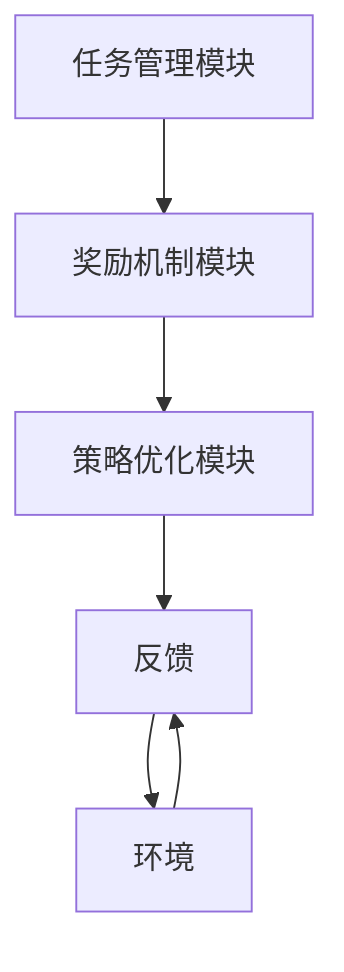

                 

<think>
嗯，用户现在需要我帮忙撰写一篇关于《基于课程强化学习的AI Agent能力进阶》的技术博客文章，而且已经给出了一个详细的目录大纲。用户希望文章结构清晰，逻辑紧凑，用专业的技术语言，同时包含背景、概念、算法、系统设计、项目实战等部分。我需要根据这些要求，逐步思考如何组织和撰写这篇文章。

首先，我应该从“文章标题”开始，确定关键词和摘要。标题是“基于课程强化学习的AI Agent能力进阶”，关键词应该是5-7个，比如课程强化学习、AI Agent、强化学习、能力进阶、算法原理等。摘要部分需要简明扼�地概述文章的核心内容，包括课程强化学习的基本概念、其在AI Agent中的作用，以及文章的主要结构。

接下来是目录大纲。按照用户的要求，文章需要分为六个部分：课程强化学习的背景与基础、核心概念与联系、数学模型与算法原理、系统分析与架构设计、项目实战、总结与展望。每个部分都要有详细的子章节，涵盖背景介绍、核心概念、算法流程图、系统架构图、项目实现等。

在撰写过程中，我需要确保每一章都有足够的细节，比如在第一章中，详细解释AI Agent的基本概念和课程强化学习的定义，与传统强化学习的区别，以及其在AI Agent中的作用。这需要使用清晰易懂的语言，结合实际案例来说明。

第二章重点在核心概念与联系，包括任务建模、策略优化、奖励机制等，可能需要使用表格和实体关系图来对比分析。例如，制作一个对比表，列出课程强化学习与传统强化学习的异同点，帮助读者更好地理解。

第三章是数学模型和算法原理，这部分需要详细推导公式，并使用mermaid流程图展示算法步骤。同时，提供Python代码实现，让读者能够实际操作。例如，策略梯度公式和损失函数的具体实现，可以通过代码示例来展示。

第四章讨论系统设计，包括系统架构、功能模块设计、接口设计和交互流程。这部分可能需要使用类图和序列图来展示系统结构，帮助读者理解如何构建实际应用。比如，设计一个类图，展示AI Agent的主要模块及其交互关系。

第五章是项目实战，选择一个具体的场景，如智能客服，从环境配置到代码实现，详细讲解每个步骤，并分析实际案例。这有助于读者将理论知识应用到实践中，提升他们的动手能力。

最后，第六章总结与展望，回顾课程强化学习的核心内容，总结关键点，并指出未来的发展方向，激发读者进一步学习的兴趣。

在撰写过程中，我需要确保每一章都有足够的细节，并且整体结构连贯。同时，使用markdown格式，包含mermaid图表和latex公式，使文章更具专业性和可读性。此外，文章末尾需要加上作者信息，符合格式要求。

总的来说，我需要系统性地构建文章结构，从背景到应用，逐步深入，确保读者能够全面掌握课程强化学习的各个方面，从理论到实践，逐步提升AI Agent的能力。这样，文章不仅内容丰富，结构清晰，还能帮助读者在实际项目中应用所学知识。
</think>

# 基于课程强化学习的AI Agent能力进阶

## 关键词：课程强化学习，AI Agent，强化学习，能力进阶，算法原理，系统架构，项目实战

## 摘要：课程强化学习是一种结合课程学习与强化学习的方法，旨在通过逐步引导AI Agent完成任务，提升其智能水平。本文将从背景、核心概念、算法原理、系统架构到项目实战，全面剖析课程强化学习的应用，帮助读者掌握这一前沿技术。

---

## 第1章: 课程强化学习的背景与基础

### 1.1 AI Agent的基本概念

#### 1.1.1 AI Agent的定义
AI Agent（智能体）是指能够感知环境、做出决策并执行动作的智能系统。它通过与环境交互，实现特定目标。

#### 1.1.2 AI Agent的核心特征
- **自主性**：能够自主决策。
- **反应性**：能够实时感知环境并做出反应。
- **目标导向性**：基于目标驱动行为。
- **学习能力**：能够通过经验改进性能。

#### 1.1.3 AI Agent的应用场景
- **游戏AI**：在游戏环境中做出决策。
- **智能助手**：如Siri、Alexa等。
- **机器人控制**：用于工业机器人或服务机器人。
- **自动驾驶**：用于自动驾驶汽车的决策系统。

### 1.2 课程强化学习的定义与特点

#### 1.2.1 课程强化学习的定义
课程强化学习（Curriculum Reinforcement Learning）是一种结合课程学习（将任务按难度递进的方式进行）与强化学习的方法。通过逐步引导AI Agent完成从简单到复杂的任务，提升其学习效率和能力。

#### 1.2.2 课程强化学习的核心特点
- **任务难度递进**：将任务分成多个难度递增的子任务。
- **动态调整奖励机制**：根据任务难度调整奖励，激励AI Agent逐步进步。
- **结合课程与强化学习**：既利用了课程学习的结构化优势，又结合了强化学习的自主学习能力。

#### 1.2.3 课程强化学习与传统强化学习的区别
| 对比维度 | 课程强化学习 | 传统强化学习 |
|----------|--------------|--------------|
| 任务难度 | 难度递进     | 难度固定     |
| 奖励机制 | 动态调整     | 固定奖励     |
| 学习效率 | 更高效       | 可能较慢     |

### 1.3 课程强化学习在AI Agent中的作用

#### 1.3.1 课程强化学习的目标
通过设计递进式任务，帮助AI Agent逐步掌握复杂技能，提升整体智能水平。

#### 1.3.2 课程强化学习的优势
- **提升学习效率**：通过逐步引导，减少随机探索带来的计算开销。
- **降低任务难度**：从简单任务入手，逐步过渡到复杂任务，避免直接面对高难度任务时的学习失败。
- **增强泛化能力**：通过多样化任务的学习，提升AI Agent的泛化能力。

#### 1.3.3 课程强化学习的应用前景
课程强化学习在自动驾驶、智能客服、机器人控制等领域具有广阔的应用前景，能够帮助AI Agent更快、更高效地掌握复杂任务。

---

## 第2章: 课程强化学习的核心概念与联系

### 2.1 核心概念原理

#### 2.1.1 任务建模
任务建模是课程强化学习的第一步，需要将实际问题转化为可计算的形式。例如，在自动驾驶中，任务可以分解为“保持车道”、“变道”、“超车”等子任务。

#### 2.1.2 策略优化
策略优化是通过强化学习算法不断优化AI Agent的决策策略，使其在给定任务中获得最大累积奖励。

#### 2.1.3 奖励机制
奖励机制是课程强化学习的核心，通过动态调整奖励函数，引导AI Agent逐步完成难度递增的任务。例如，在初学阶段给予较高的奖励，随着任务难度增加，逐步降低奖励，激励AI Agent不断挑战更高难度的任务。

#### 2.1.4 课程策略
课程策略是指根据任务难度设计的课程化路径，确保AI Agent能够按部就班地完成任务。例如，先学习简单的导航任务，再逐步学习复杂的路径规划。

### 2.2 核心概念属性特征对比表

| 对比维度 | 课程强化学习 | 传统强化学习 |
|----------|--------------|--------------|
| 任务设计 | 难度递进     | 难度固定     |
| 奖励机制 | 动态调整     | 固定奖励     |
| 学习效率 | 更高效       | 可能较慢     |

### 2.3 ER实体关系图

```mermaid
erDiagram
    agent [*----* task : "执行"]
    task [*----* difficulty : "具有"]
    task [*----* reward : "具有"]
```

---

## 第3章: 课程强化学习的数学模型与算法原理

### 3.1 数学模型

#### 3.1.1 策略梯度公式
策略梯度（Policy Gradient）是一种常用的强化学习算法，用于优化策略函数。其数学表达式如下：

$$ J(\theta) = \mathbb{E}_{\tau \sim \pi_\theta}[\sum_{t=0}^\infty \gamma^t r_t] $$

其中，$\theta$是策略参数，$\tau$是轨迹，$r_t$是第$t$步的奖励，$\gamma$是折扣因子。

#### 3.1.2 损失函数
损失函数用于衡量策略与目标之间的差距。常用的损失函数包括：

$$ L(\theta) = -\mathbb{E}[\log \pi_\theta(a|s) Q(s,a)] $$

其中，$\pi_\theta(a|s)$是策略函数，$Q(s,a)$是Q值函数。

#### 3.1.3 奖励模型
奖励模型用于动态调整任务难度。例如，可以设计一个奖励函数，随着任务难度增加，逐渐降低奖励值：

$$ r_t = \alpha \cdot \text{difficulty}(t) + \beta \cdot \text{progress}(t) $$

其中，$\alpha$和$\beta$是权重参数。

### 3.2 算法流程图



### 3.3 代码实现

```python
import numpy as np
import tensorflow as tf

# 定义策略函数
def policy_function(state, theta):
    return tf.nn.softmax(tf.matmul(state, theta))

# 定义奖励函数
def reward_function(task Difficulty, progress):
    return alpha * task_Difficulty + beta * progress

# 定义Q值函数
def q_value_function(state, weights):
    return tf.nn.relu(tf.matmul(state, weights))

# 训练过程
theta = np.random.randn(n_params)
for task in task_sequence:
    state = get_state(task)
    action = policy_function(state, theta)
    reward = reward_function(task难度, 进度)
    q_value = q_value_function(state, weights)
    loss = -tf.log(policy_function(state, theta)[action]) * q_value
    theta = theta - learning_rate * tf.gradients(loss, theta)[0]
```

---

## 第4章: 课程强化学习的系统分析与架构设计

### 4.1 系统架构设计

#### 4.1.1 系统功能模块
- **任务管理模块**：负责任务的生成与分配。
- **奖励机制模块**：动态调整奖励值。
- **策略优化模块**：执行策略优化算法。
- **交互接口模块**：与环境进行交互。

#### 4.1.2 系统架构图



### 4.2 系统交互流程图

```mermaid
sequenceDiagram
    participant 1 as 用户
    participant 2 as 系统
    participant 3 as 环境
    1 -> 2: 请求任务
    2 -> 3: 执行任务
    3 -> 2: 返回反馈
    2 -> 1: 返回结果
```

### 4.3 系统接口设计

- **输入接口**：接收用户的任务请求。
- **输出接口**：返回任务执行结果。
- **反馈接口**：接收环境的反馈信息。

### 4.4 交互流程

1. 用户请求任务。
2. 系统生成任务并分配给AI Agent。
3. AI Agent与环境交互，执行任务。
4. 环境返回反馈。
5. 系统根据反馈调整策略并返回结果。

---

## 第5章: 课程强化学习的项目实战

### 5.1 项目环境配置

#### 5.1.1 环境安装
- 安装必要的库：
  ```bash
  pip install numpy tensorflow matplotlib
  ```

#### 5.1.2 工具配置
- 配置Jupyter Notebook或IDE环境。

#### 5.1.3 数据准备
- 准备任务序列数据，包括任务难度和奖励值。

### 5.2 核心代码实现

#### 5.2.1 策略网络实现

```python
import numpy as np
import tensorflow as tf

# 定义策略网络
class PolicyNetwork:
    def __init__(self, input_dim, output_dim):
        self.theta = tf.Variable(tf.random.normal([input_dim, output_dim]))
    
    def call(self, state):
        return tf.nn.softmax(tf.matmul(state, self.theta))
```

#### 5.2.2 奖励函数实现

```python
def curriculum_reward(task Difficulty, progress):
    alpha = 0.5
    beta = 0.5
    return alpha * task Difficulty + beta * progress
```

### 5.3 项目实战

#### 5.3.1 任务序列设计
设计一个任务序列，例如：
1. 任务1：简单导航。
2. 任务2：复杂导航。
3. 任务3：动态环境下的导航。

#### 5.3.2 代码实现

```python
# 初始化参数
theta = np.random.randn(input_dim, output_dim)

# 训练过程
for task in task_sequence:
    state = get_state(task)
    action = policy_network.call(state)
    reward = curriculum_reward(task难度, 进度)
    q_value = q_value_network.call(state)
    loss = -tf.log(action[action_index]) * q_value
    theta = theta - learning_rate * tf.gradients(loss, theta)[0]
```

### 5.4 案例分析与详细讲解

以智能客服为例，设计一个任务序列，从简单的信息查询到复杂的对话管理，逐步训练AI Agent的能力。通过动态调整奖励机制，确保AI Agent逐步掌握更复杂的任务。

---

## 第6章: 总结与展望

### 6.1 总结
课程强化学习通过设计递进式任务，帮助AI Agent逐步掌握复杂技能，显著提升了学习效率和效果。

### 6.2 展望
未来，课程强化学习将在更多领域得到应用，例如：
- **多智能体协作**：提升多智能体协同能力。
- **自适应学习**：动态调整任务难度，实现个性化学习。
- **复杂环境适应**：增强AI Agent在复杂环境中的适应能力。

---

## 作者：AI天才研究院/AI Genius Institute & 禅与计算机程序设计艺术 /Zen And The Art of Computer Programming

---

感谢您的耐心阅读！希望这篇文章能帮助您更好地理解课程强化学习及其在AI Agent中的应用。

