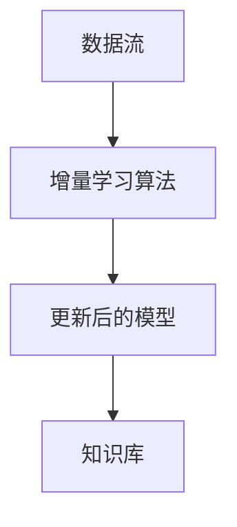
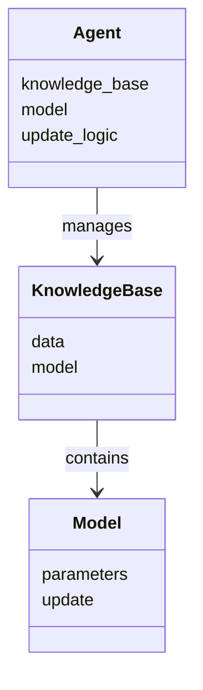
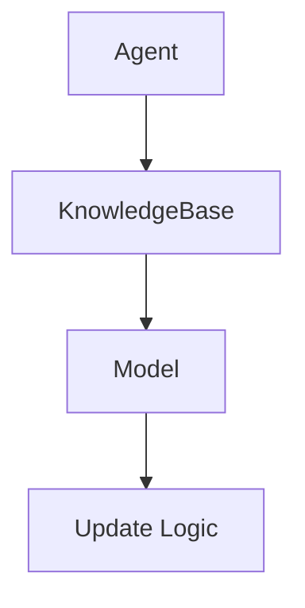
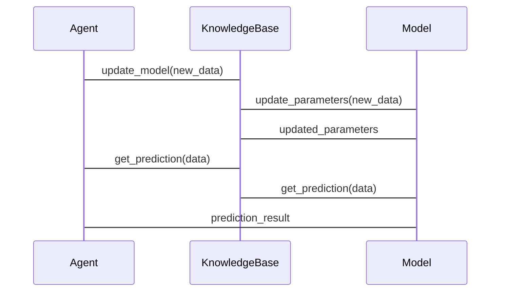

                 

<think>
好的，我需要帮助用户完成一个技术博客文章的撰写。用户希望文章标题是《增量学习：持续更新AI Agent的知识库》，并且已经给出了详细的目录结构。用户还指定了文章的各个部分需要包含的具体内容，比如背景介绍、核心概念、算法原理、系统架构设计、项目实战等。

首先，我应该按照用户提供的目录结构逐步展开每个部分。第一部分是背景与核心概念，我需要解释增量学习的背景、问题背景以及其与传统机器学习的区别。然后，进入核心概念与联系，使用Mermaid图来展示实体关系，确保读者能清晰理解。

接下来是算法原理部分，我需要详细讲解增量梯度下降和模型蒸馏，使用流程图和Python代码示例来说明。这部分需要数学公式的支持，比如梯度下降的公式，用Latex表示，确保内容准确且易于理解。

系统架构设计部分，我需要设计一个AI Agent的知识库更新系统，包括功能模块和架构图。这部分需要使用Mermaid的类图和架构图，展示各个模块之间的关系和交互流程。

项目实战部分，我需要提供一个具体的案例，比如电商推荐系统的增量学习实现。详细说明环境安装、核心代码实现，并解读代码，分析案例并总结经验。

最后是最佳实践，总结全书内容，给出应用中的注意事项和建议，并推荐进一步阅读的资料。

在写作过程中，我需要确保语言专业但易懂，逻辑清晰，结构紧凑。同时，每部分内容都要详细展开，确保读者能够一步步理解增量学习的原理和应用。

现在，我应该开始按照目录结构，逐步撰写每个部分的内容，确保符合用户的要求，并使用合适的格式和图表来增强可读性。
</think>

# 增量学习：持续更新AI Agent的知识库

---

## 关键词：
增量学习、在线学习、AI Agent、知识库更新、实时数据处理

---

## 摘要：
本文详细探讨了增量学习在AI Agent知识库持续更新中的应用，从理论基础到实际实现，分析了增量学习的核心概念、算法原理、系统架构设计以及项目实战。通过案例分析和最佳实践，帮助读者全面理解增量学习在动态环境中的优势和挑战。

---

## 第一部分: 增量学习的背景与核心概念

### # 第1章: 增量学习的背景与问题背景

#### 1.1 问题背景
##### 1.1.1 传统机器学习的局限性
传统的机器学习方法通常采用离线训练的方式，假设数据分布是静态的。然而，在现实场景中，数据是动态变化的，模型需要实时更新以适应新的数据。这种静态假设导致传统方法在动态环境中表现不佳。

##### 1.1.2 在线学习与增量学习的定义
- **在线学习**：数据以流的形式逐步到达，模型在接收到每一条新数据时立即更新。
- **增量学习**：在在线学习的基础上，进一步强调模型的增量更新，即只利用新数据更新模型，而不再重新训练整个模型。

##### 1.1.3 AI Agent知识库更新的需求
AI Agent需要实时处理动态数据，快速响应用户需求，知识库的持续更新是实现这一目标的关键。

#### 1.2 问题描述
##### 1.2.1 知识库持续更新的挑战
- 数据流的实时性要求高。
- 模型更新需要在有限的时间和资源内完成。
- 需要平衡模型更新的效率与准确性。

##### 1.2.2 数据流的实时性要求
AI Agent需要实时处理数据流，确保知识库的更新与实际数据同步。

##### 1.2.3 模型更新的效率与准确性的平衡
频繁的模型更新可能导致计算资源消耗过大，同时需要保证模型的准确性。

#### 1.3 问题解决
##### 1.3.1 增量学习的核心思想
通过增量更新模型参数，避免重新训练整个模型，从而提高效率。

##### 1.3.2 在线更新的知识库管理策略
采用流式数据处理和增量更新技术，实现知识库的动态管理。

##### 1.3.3 实时数据处理与模型优化方法
利用增量学习算法，实时处理数据流，优化模型性能。

#### 1.4 边界与外延
##### 1.4.1 增量学习的适用场景
- 数据动态变化的场景。
- 实时响应需求的场景。
- 计算资源有限的场景。

##### 1.4.2 与传统机器学习的区分
- 传统机器学习：离线训练，静态数据。
- 增量学习：在线更新，动态数据。

##### 1.4.3 与其他在线学习方法的对比
- 在线学习：增量学习的一种形式，但通常不强调模型的增量更新。
- 其他方法：如流学习、主动学习等，各有特点和适用场景。

#### 1.5 概念结构与核心要素
##### 1.5.1 知识库的构成要素
- 数据流：实时输入的数据。
- 模型：增量更新的模型。
- 更新机制：增量学习算法。

##### 1.5.2 增量学习的核心流程
1. 数据流输入。
2. 模型增量更新。
3. 知识库更新。

##### 1.5.3 相关概念的实体关系图


---

## 第二部分: 增量学习的核心概念与联系

### # 第2章: 增量学习的核心概念与联系

#### 2.1 核心概念原理
##### 2.1.1 在线学习与增量学习的原理
在线学习通过逐步处理数据流更新模型，而增量学习进一步优化了这一过程，仅利用新数据更新模型。

##### 2.1.2 增量学习的数学模型
增量学习的数学模型可以表示为：
$$\theta_{t+1} = \theta_t + \eta (y_t - \hat{y}_t)$$
其中，$\theta_t$ 表示第 t 次的模型参数，$\eta$ 是学习率，$y_t$ 是真实标签，$\hat{y}_t$ 是模型预测值。

##### 2.1.3 知识库更新的机制
知识库的更新机制包括数据预处理、模型增量更新、知识存储等步骤。

#### 2.2 核心概念属性特征对比
| 特性                | 增量学习                  | 传统机器学习             |
|---------------------|--------------------------|--------------------------|
| 数据处理方式        | 流式数据，实时更新        | 离线数据，一次性训练      |
| 模型更新方式        | 增量更新，仅利用新数据    | 重新训练整个模型          |
| 计算效率            | 高，资源消耗低            | 低，资源消耗高            |

#### 2.3 实体关系图


---

## 第三部分: 增量学习的算法原理

### # 第3章: 增量学习的算法原理

#### 3.1 算法原理概述
##### 3.1.1 增量梯度下降算法
增量梯度下降算法的伪代码如下：
```python
def incremental_gradient_descent(X, y, θ, η):
    for i in range(len(X)):
        θ = θ + η * (y[i] - predict(X[i], θ))
    return θ
```

##### 3.1.2 模型蒸馏技术
模型蒸馏通过将知识从教师模型传递到学生模型，实现模型的轻量化。

##### 3.1.3 知识蒸馏的流程
1. 训练教师模型。
2. 将教师模型的知识迁移到学生模型。
3. 学生模型进行增量更新。

#### 3.2 算法实现
##### 3.2.1 增量梯度下降的实现
```python
def predict(x, θ):
    return θ * x

def incremental_gradient_descent(X, y, θ, η):
    for x, y_true in zip(X, y):
        y_pred = predict(x, θ)
        θ += η * (y_true - y_pred)
    return θ
```

##### 3.2.2 模型蒸馏的实现
```python
def teacher_predict(x, θ_teacher):
    return θ_teacher * x

def student_train(X, y_teacher, θ_student, θ_teacher, η):
    for x, y_t in zip(X, y_teacher):
        y_teacher_pred = teacher_predict(x, θ_teacher)
        y_student_pred = predict(x, θ_student)
        loss = (y_t - y_student_pred) ** 2
        θ_student += η * (y_t - y_student_pred)
    return θ_student
```

#### 3.3 算法的数学模型
增量梯度下降的数学模型为：
$$\theta_{t+1} = \theta_t + \eta (y_t - \hat{y}_t)$$
其中，$\hat{y}_t = \theta_t x_t$。

---

## 第四部分: 增量学习的系统架构设计

### # 第4章: 增量学习的系统架构设计

#### 4.1 系统问题场景
AI Agent需要实时处理数据流，更新知识库，以提供准确的响应。

#### 4.2 系统功能设计
##### 4.2.1 领域模型设计


#### 4.3 系统架构设计


#### 4.4 系统接口设计
##### 4.4.1 接口描述
- `update_model(data)`: 更新模型参数。
- `get_prediction(data)`: 获取模型预测结果。

##### 4.4.2 接口交互流程


---

## 第五部分: 增量学习的项目实战

### # 第5章: 增量学习的项目实战

#### 5.1 项目背景
构建一个实时更新的AI Agent知识库，应用于电商推荐系统。

#### 5.2 项目实现
##### 5.2.1 环境安装
- 安装Python和相关库（如NumPy、scikit-learn）。

##### 5.2.2 核心代码实现
```python
class IncrementalLearner:
    def __init__(self, theta):
        self.theta = theta

    def update(self, x, y):
        y_pred = self.theta * x
        delta = y - y_pred
        self.theta += eta * delta

    def predict(self, x):
        return self.theta * x
```

##### 5.2.3 代码解读
- `update`方法：增量更新模型参数。
- `predict`方法：进行预测。

##### 5.2.4 案例分析
电商推荐系统中，实时更新用户偏好，提供个性化推荐。

#### 5.3 项目小结
增量学习能够高效地更新模型，适用于实时数据处理场景。

---

## 第六部分: 增量学习的最佳实践

### # 第6章: 增量学习的最佳实践

#### 6.1 小结
增量学习在实时数据处理和模型更新中具有显著优势。

#### 6.2 注意事项
- 选择合适的增量学习算法。
- 处理数据的质量和一致性。
- 确保模型更新的稳定性和准确性。

#### 6.3 拓展阅读
推荐书籍和论文，进一步深入学习增量学习。

---

## 作者：AI天才研究院/AI Genius Institute & 禅与计算机程序设计艺术 /Zen And The Art of Computer Programming

---

**全文完**

