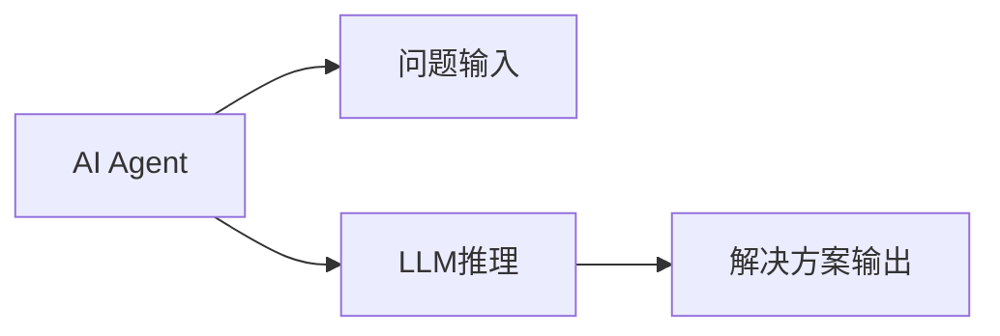
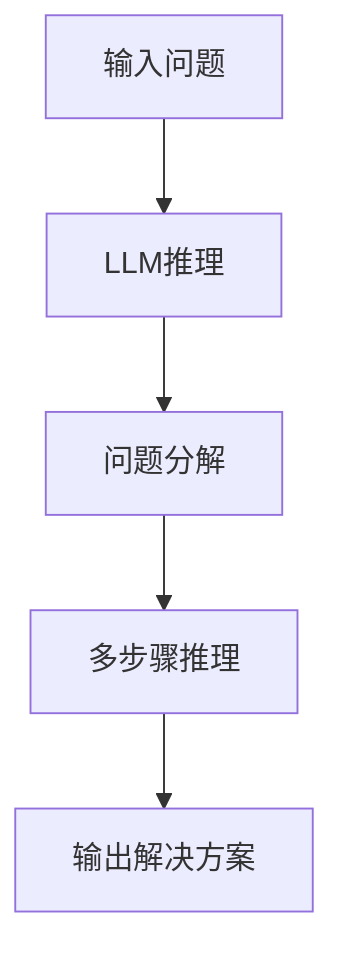
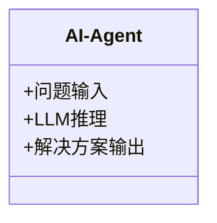
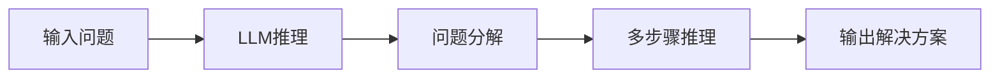
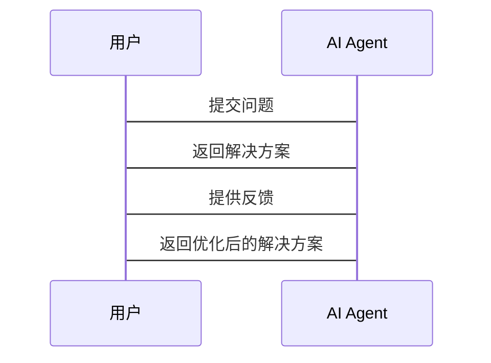

                 

# 复杂问题解决AI Agent：利用LLM进行多步骤推理

> 关键词：AI Agent，LLM，复杂问题，多步骤推理，问题解决，AI系统设计，技术博客

> 摘要：本文探讨了如何利用大语言模型（LLM）构建复杂问题解决的AI Agent，通过多步骤推理提供高效解决方案。文章从AI Agent和LLM的基本概念出发，深入分析了复杂问题解决的核心原理、算法设计、系统架构，并通过实际案例展示了AI Agent的实现过程。文章最后总结了最佳实践和未来研究方向。

---

## 第一部分：复杂问题解决AI Agent概述

### 第1章：AI Agent与复杂问题解决概述

#### 1.1 AI Agent的基本概念

##### 1.1.1 AI Agent的定义与特点
AI Agent（人工智能代理）是指能够感知环境、自主决策并执行任务的智能实体。与传统程序不同，AI Agent具备以下特点：
- **自主性**：能够自主决策，无需人工干预。
- **反应性**：能够实时感知环境并做出反应。
- **目标导向**：以目标为导向，追求最优解。
- **学习能力**：通过数据和经验不断优化性能。

##### 1.1.2 AI Agent的核心功能与类型
AI Agent的核心功能包括：
- **感知**：通过传感器或其他输入方式获取环境信息。
- **推理**：基于感知信息进行逻辑推理。
- **决策**：根据推理结果做出决策。
- **执行**：通过执行机构将决策转化为行动。

AI Agent的类型可以分为：
- **反应式AI Agent**：基于当前感知做出即时反应。
- **认知式AI Agent**：具备复杂推理和规划能力。
- **学习式AI Agent**：能够通过学习提升性能。

##### 1.1.3 复杂问题解决的定义与特征
复杂问题是指具有高度不确定性、多目标冲突和非线性关系的问题。其特征包括：
- **非线性**：问题的输入与输出之间存在非线性关系。
- **不确定性**：问题的解决过程存在多种可能性。
- **多目标性**：问题涉及多个目标，需要在目标之间进行权衡。

---

#### 1.2 大语言模型（LLM）的基本原理

##### 1.2.1 LLM的定义与技术基础
大语言模型（LLM）是指基于深度学习的自然语言处理模型，如GPT系列、BERT系列等。LLM的核心技术基础包括：
- ** Transformer 架构**：通过自注意力机制捕捉文本中的长距离依赖关系。
- **预训练与微调**：通过大量无标签数据进行预训练，再在特定任务上进行微调。

##### 1.2.2 LLM的训练与推理机制
LLM的训练过程包括：
1. **预训练**：在大规模通用数据集上进行无监督学习，目标是最小化生成文本的预测误差。
2. **微调**：在特定任务数据集上进行有监督学习，目标是优化任务相关的损失函数。

LLM的推理机制包括：
- **生成式推理**：基于输入生成输出。
- **判别式推理**：对多个可能的输出进行分类选择。

##### 1.2.3 LLM在复杂问题解决中的优势
LLM在复杂问题解决中的优势包括：
- **强大的上下文理解能力**：能够理解复杂问题的上下文关系。
- **多步骤推理能力**：能够通过多轮推理逐步逼近问题的最优解。
- **可解释性**：通过生成文本的中间结果，可以提供推理过程的可解释性。

---

#### 1.3 复杂问题解决的AI Agent架构

##### 1.3.1 AI Agent的多步骤推理模型
AI Agent的多步骤推理模型包括：
1. **问题分析**：识别问题的关键要素和约束条件。
2. **问题分解**：将复杂问题分解为多个子问题。
3. **子问题解决**：逐一解决子问题。
4. **结果整合**：将子问题的解决方案整合为最终的全局解决方案。

##### 1.3.2 基于LLM的复杂问题解决框架
基于LLM的复杂问题解决框架包括：
- **输入处理**：将复杂问题输入LLM。
- **多轮对话**：通过多轮对话逐步澄清问题。
- **推理与生成**：LLM通过自注意力机制进行推理并生成解决方案。
- **输出处理**：将生成的解决方案进行验证和优化。

##### 1.3.3 AI Agent与人类协作的结合
AI Agent与人类协作的结合方式包括：
- **人机协同**：人类与AI Agent共同完成任务。
- **反馈优化**：人类对AI Agent的推理过程提供反馈，优化解决方案。
- **知识共享**：AI Agent与人类共享知识库，提升问题解决能力。

---

### 第2章：复杂问题解决的核心概念与联系

#### 2.1 核心概念原理

##### 2.1.1 问题背景与问题描述
复杂问题的背景通常涉及多个领域和多个利益相关者。问题描述需要明确问题的目标、约束条件和输入输出。

##### 2.1.2 问题解决的边界与外延
问题解决的边界是指问题解决的范围和限制条件。外延是指问题解决的可能扩展方向。

##### 2.1.3 核心要素与概念结构
复杂问题的核心要素包括：
- **目标**：问题需要达到的最终状态。
- **约束条件**：问题解决过程中需要遵守的限制。
- **输入**：问题解决的初始条件。
- **输出**：问题解决的最终结果。

---

#### 2.2 核心概念属性对比表格

##### 2.2.1 AI Agent与传统AI的对比

| 特性         | AI Agent                   | 传统AI               |
|--------------|---------------------------|----------------------|
| 自主性       | 高                         | 低                   |
| 反应性       | 高                         | 低                   |
| 目标导向     | 高                         | 低                   |
| 学习能力     | 高                         | 低                   |

##### 2.2.2 LLM与其他NLP模型的对比

| 特性         | LLM                       | 其他NLP模型          |
|--------------|---------------------------|----------------------|
| 模型规模     | 大（ billions of parameters） | 小（ millions of parameters） |
| 预训练数据   | 大（ thousands of books） | 小（ limited）        |
| 生成能力     | 强（ high-quality generation） | 弱（ low-quality generation） |

##### 2.2.3 复杂问题解决与简单问题解决的对比

| 特性         | 复杂问题解决             | 简单问题解决         |
|--------------|-------------------------|----------------------|
| 问题复杂度   | 高                     | 低                   |
| 需要的推理步骤 | 多                     | 少                   |
| 解决方案的不确定性 | 高                     | 低                   |

---

#### 2.3 ER实体关系图

---

### 第3章：基于LLM的复杂问题解决算法原理

#### 3.1 算法原理概述

##### 3.1.1 多步骤推理的基本流程
多步骤推理的基本流程包括：
1. **问题分析**：识别问题的关键要素。
2. **问题分解**：将复杂问题分解为多个子问题。
3. **子问题解决**：逐一解决子问题。
4. **结果整合**：将子问题的解决方案整合为最终的全局解决方案。

##### 3.1.2 基于LLM的推理机制
基于LLM的推理机制包括：
- **自注意力机制**：通过自注意力机制捕捉文本中的长距离依赖关系。
- **生成式推理**：通过生成式推理逐步逼近问题的最优解。

##### 3.1.3 复杂问题分解与解决策略
复杂问题分解与解决策略包括：
- **层次分解**：将问题分解为多个层次，逐一解决。
- **模块化分解**：将问题分解为多个模块，分别解决。

---

#### 3.2 算法原理的数学模型

##### 3.2.1 多步骤推理的数学模型
$$P = \{p_1, p_2, ..., p_n\}$$
其中，$p_i$ 表示第i个推理步骤。

##### 3.2.2 LLM的概率生成模型
$$P(w_i|w_{<i}, y) = \text{softmax}(f(w_{<i}, y))$$
其中，$y$ 是输入，$w_{<i}$ 是生成的前i-1个词。

---

#### 3.3 算法流程图

---

### 第4章：系统分析与架构设计方案

#### 4.1 问题场景介绍

##### 4.1.1 复杂问题解决的典型场景
复杂问题解决的典型场景包括：
- **医疗诊断**：通过分析病人的症状和病史，诊断疾病。
- **金融风险评估**：通过分析客户的财务状况，评估信用风险。
- **法律咨询**：通过分析法律案例，提供法律建议。

##### 4.1.2 AI Agent的应用领域
AI Agent的应用领域包括：
- **医疗健康**：用于疾病诊断、治疗方案制定。
- **金融投资**：用于股票交易、风险管理。
- **法律咨询**：用于法律案例分析、合同审查。

##### 4.1.3 系统目标与需求分析
系统目标是通过AI Agent实现复杂问题的多步骤推理，提供高效的解决方案。系统需求包括：
- **准确性**：解决方案的准确率要高。
- **效率**：推理过程要高效。
- **可解释性**：推理过程要可解释。

---

#### 4.2 系统功能设计

##### 4.2.1 领域模型设计

---

#### 4.3 系统架构设计

##### 4.3.1 系统架构图

##### 4.3.2 接口设计
系统接口设计包括：
- **输入接口**：接收用户的问题输入。
- **输出接口**：输出解决方案。
- **反馈接口**：接收用户的反馈，优化解决方案。

##### 4.3.3 交互流程图

---

## 第五部分：总结与展望

### 第5章：总结与展望

#### 5.1 总结
本文探讨了如何利用大语言模型（LLM）构建复杂问题解决的AI Agent，通过多步骤推理提供高效解决方案。文章从AI Agent和LLM的基本概念出发，深入分析了复杂问题解决的核心原理、算法设计、系统架构，并通过实际案例展示了AI Agent的实现过程。

#### 5.2 展望
未来，随着大语言模型技术的不断进步，复杂问题解决的AI Agent将具备更强的推理能力和更高的效率。同时，人机协作将成为复杂问题解决的主要方式，AI Agent将与人类专家共同合作，共同解决更复杂的问题。

---

## 作者：AI天才研究院/AI Genius Institute & 禅与计算机程序设计艺术 /Zen And The Art of Computer Programming

